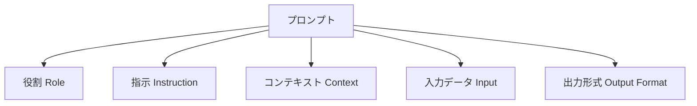
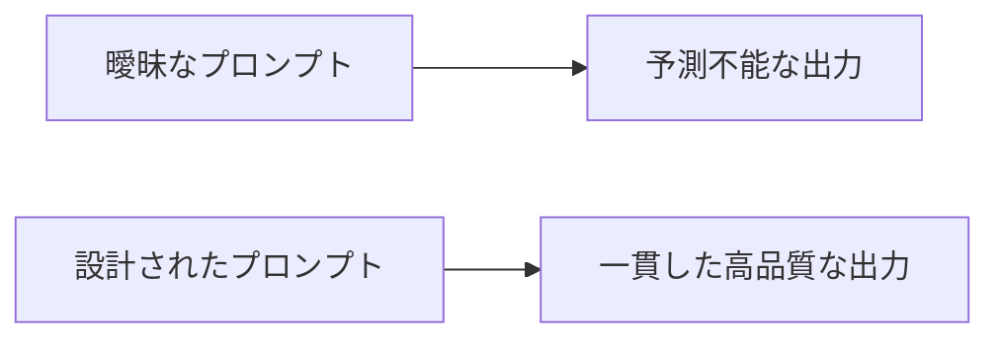

## 概要

プロンプトとは、AIモデルに対して入力するテキストのことです。このレッスンでは、プロンプトの基本概念と、なぜプロンプトの品質がAIの出力品質を左右するのかを学びます。エンジニアとして生成AIを扱う上で最も根本的な知識を身に付けます。

## 本文

### プロンプトとは

プロンプト（Prompt）は「促す」「引き出す」を意味する英語です。生成AIの文脈では、**モデルへの入力テキスト**を指します。

```
ユーザー入力（プロンプト）
        ↓
   LLM（大規模言語モデル）
        ↓
    生成された出力
```

LLMは統計的に「次に来る最もありそうなトークン」を予測し続けることで文章を生成します。つまり、入力（プロンプト）が変わると出力も劇的に変わります。

### プロンプトの構成要素

一般的なプロンプトは以下の要素を含みます（すべて必須ではありません）：



**例：悪いプロンプト**
```
コードを直して
```

**例：良いプロンプト**
```
あなたはPythonのシニアエンジニアです。
以下のコードにはバグがあります。原因を特定し、修正したコードと
修正理由をMarkdown形式で返してください。

```python
def divide(a, b):
    return a / b

print(divide(10, 0))
```
```

### なぜプロンプトエンジニアリングが重要か

同じモデルに対して、プロンプトを変えるだけで：
- 出力の品質が10倍以上変わる
- 処理コスト（トークン数）を削減できる
- 一貫した形式の出力を得られる
- セキュリティリスクを低減できる



### プロンプトとモデルの関係

```
入力コンテキストウィンドウ
┌────────────────────────────────┐
│ System Prompt                  │
│ ─────────────────────────────  │
│ Human: [あなたのプロンプト]     │
│ ─────────────────────────────  │
│ Assistant: [生成される出力]     │
└────────────────────────────────┘
```

モデルは「コンテキストウィンドウ」と呼ばれる入力長の上限内でしかテキストを扱えません。Claude 3.5 Sonnetは20万トークン（約15万語）のコンテキストウィンドウを持ちます。

## ハンズオン

Claude APIを使って、同じ質問を異なるプロンプトで送り、出力の違いを確認してみましょう。

### ステップ1：環境準備

```bash
pip install anthropic
export ANTHROPIC_API_KEY="your-api-key"
```

### ステップ2：シンプルなプロンプト比較スクリプト

```python
import anthropic

client = anthropic.Anthropic()

def ask(prompt: str) -> str:
    message = client.messages.create(
        model="claude-opus-4-5",
        max_tokens=1024,
        messages=[
            {"role": "user", "content": prompt}
        ]
    )
    return message.content[0].text

# バージョン1：曖昧なプロンプト
v1 = ask("Pythonでリストを並べ替える方法は？")

# バージョン2：構造化されたプロンプト
v2 = ask("""
Pythonでリストを並べ替える方法を教えてください。

以下の形式で回答してください：
1. 基本的な方法（1〜2行のコード例付き）
2. 逆順にする方法
3. カスタムキーでの並べ替え方法

対象者：Pythonを学び始めて3ヶ月のエンジニア
""")

print("=== バージョン1 ===")
print(v1)
print("\n=== バージョン2 ===")
print(v2)
```

### ステップ3：結果の観察ポイント

実行後、以下を比較してください：
- 出力の長さと詳細さ
- コード例の有無と品質
- 対象読者への適切さ
- 実務で使える情報量

### 完成コード

```python
import anthropic
from typing import Literal

client = anthropic.Anthropic()

def compare_prompts(
    simple: str,
    structured: str,
    model: str = "claude-opus-4-5"
) -> dict[str, str]:
    """2つのプロンプトを比較して結果を返す"""
    results = {}

    for label, prompt in [("simple", simple), ("structured", structured)]:
        message = client.messages.create(
            model=model,
            max_tokens=1024,
            messages=[{"role": "user", "content": prompt}]
        )
        results[label] = message.content[0].text

    return results

if __name__ == "__main__":
    results = compare_prompts(
        simple="Pythonでリストを並べ替えるには？",
        structured="""
Pythonでリストを並べ替える方法を教えてください。

形式：
1. 基本的な方法（コード例付き）
2. 逆順にする方法
3. カスタムキーでの並べ替え

対象：Python初心者
        """
    )

    for label, text in results.items():
        print(f"\n{'='*20} {label} {'='*20}")
        print(text)
```

## クイズ

<!-- QUIZ:START -->
**Q1. プロンプトとは何ですか？**

- A) AIモデルのソースコード
- B) AIモデルへの入力テキスト
- C) AIモデルの学習データ
- D) AIモデルのパラメータ設定

**正解: B**
**解説:** プロンプトはLLMに対して入力するテキストです。モデルのコードやパラメータとは異なり、ユーザーが自由に変更できる入力部分を指します。

**Q2. プロンプトの品質が出力に与える影響として最も適切な説明はどれですか？**

- A) プロンプトを変えても出力はほとんど変わらない
- B) プロンプトを変えると出力の長さだけが変わる
- C) プロンプトの品質が出力の品質・一貫性・コストに大きく影響する
- D) プロンプトはモデルの種類を変えるためのものである

**正解: C**
**解説:** 同じモデルでも、プロンプトの設計次第で出力品質・一貫性・トークンコストが大きく変わります。これがプロンプトエンジニアリングが重要な理由です。

**Q3. コンテキストウィンドウとは何ですか？**

- A) ブラウザのウィンドウサイズ
- B) AIが一度に処理できる入出力テキストの最大長
- C) APIのレートリミット
- D) モデルの学習データのサイズ

**正解: B**
**解説:** コンテキストウィンドウはLLMが一度に扱える入出力の最大トークン数です。この上限を超えるとエラーになるか、古いコンテキストが切り捨てられます。

**Q4. 良いプロンプトに含まれる要素として適切でないものはどれですか？**

- A) 明確な指示（Instruction）
- B) モデルの重みパラメータ
- C) 出力形式の指定（Output Format）
- D) 役割の指定（Role）

**正解: B**
**解説:** モデルの重みパラメータはプロンプトで制御できるものではなく、モデル自体に固定されています。良いプロンプトには役割・指示・コンテキスト・出力形式などを含めます。
<!-- QUIZ:END -->

## まとめ

- プロンプトとはLLMへの入力テキストであり、出力品質を大きく左右する
- 良いプロンプトは役割・指示・コンテキスト・出力形式などの要素で構成される
- 同じモデルでもプロンプトの設計次第で出力が劇的に変わる
- コンテキストウィンドウという入力長の上限を意識する必要がある

## 次のレッスン

次のレッスンでは、プロンプトの基本構造（役割・指示・コンテキスト・出力形式）を詳しく学び、実際に効果的なプロンプトを設計する方法を習得します。
