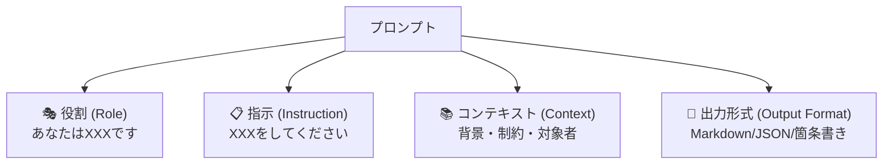

## 概要

効果的なプロンプトには4つの基本要素（役割・指示・コンテキスト・出力形式）があります。このレッスンでは各要素の役割と書き方を学び、実務で即使えるプロンプトテンプレートを作成します。

## 本文

### プロンプトの4要素



### 1. 役割（Role）

モデルに特定の専門家としての振る舞いを指示します。

```
# 効果ない例
コードをレビューしてください。

# 効果がある例
あなたはGoとKubernetesの専門家で、セキュリティを重視するシニアエンジニアです。
```

役割を与えることで：
- 専門的な語彙・観点が加わる
- 回答の深さと正確さが向上する
- 想定外の的外れな回答を減らせる

### 2. 指示（Instruction）

何をしてほしいかを明確に伝えます。動詞から始め、具体的に書きます。

| 曖昧な指示 | 明確な指示 |
|-----------|-----------|
| コードを改善して | このPythonコードのパフォーマンスを改善し、変更箇所にコメントを追加して |
| 要約して | 以下の文章を3つの箇条書きで要約して |
| 翻訳して | 以下を英語に翻訳して。技術文書として自然な表現を使って |

### 3. コンテキスト（Context）

背景情報・制約・対象読者などを提供します。

```
コンテキストとして含めるべき情報：
- 対象読者（初心者向け、エンジニア向け、など）
- 利用目的（社内ドキュメント、ブログ記事、など）
- 制約条件（文字数、言語、使用禁止ワードなど）
- 関連する背景情報
```

### 4. 出力形式（Output Format）

どの形式で出力してほしいかを明示します。

```
# Markdown形式
## 見出し
- 箇条書き

# JSON形式
{"key": "value"}

# 表形式
| 列1 | 列2 |

# 番号付きリスト
1. 手順1
2. 手順2
```

### 4要素を組み合わせたテンプレート

```
[役割]
あなたは{専門家の種類}です。

[コンテキスト]
{背景情報・対象・制約}

[指示]
{具体的な動詞から始まる指示}

[出力形式]
以下の形式で回答してください：
{形式の指定}
```

### 実務での使用例

**コードレビュープロンプト：**

```
あなたはセキュリティを専門とするPythonシニアエンジニアです。

以下のコードは本番環境で使用予定のAPIエンドポイントです。
チームは5名のエンジニアで構成され、コードスタイルはPEP8に準拠しています。

下記コードをレビューし、以下の観点で問題点を指摘してください：
1. セキュリティリスク
2. パフォーマンスの問題
3. エラーハンドリングの漏れ

## 出力形式
各問題について以下の形式で記載：
- **問題**: 問題の説明
- **深刻度**: 高/中/低
- **修正方法**: 具体的な修正コード
```

## ハンズオン

汎用的に使えるプロンプトビルダーを作成します。

### ステップ1：プロンプトビルダークラスの作成

```python
class PromptBuilder:
    """4要素プロンプトビルダー"""

    def __init__(self):
        self.role = ""
        self.context = ""
        self.instruction = ""
        self.output_format = ""

    def set_role(self, role: str) -> "PromptBuilder":
        self.role = role
        return self

    def set_context(self, context: str) -> "PromptBuilder":
        self.context = context
        return self

    def set_instruction(self, instruction: str) -> "PromptBuilder":
        self.instruction = instruction
        return self

    def set_output_format(self, fmt: str) -> "PromptBuilder":
        self.output_format = fmt
        return self

    def build(self) -> str:
        parts = []
        if self.role:
            parts.append(f"# 役割\n{self.role}")
        if self.context:
            parts.append(f"# コンテキスト\n{self.context}")
        if self.instruction:
            parts.append(f"# 指示\n{self.instruction}")
        if self.output_format:
            parts.append(f"# 出力形式\n{self.output_format}")
        return "\n\n".join(parts)
```

### ステップ2：実際のプロンプトを構築

```python
import anthropic

client = anthropic.Anthropic()

prompt = (
    PromptBuilder()
    .set_role("あなたはTypeScriptとReactの専門家です。")
    .set_context(
        "対象者：React初心者のフロントエンドエンジニア\n"
        "目的：社内勉強会用の資料作成"
    )
    .set_instruction(
        "useEffectフックの使い方と注意点を説明してください。"
    )
    .set_output_format(
        "## 説明\n（2〜3段落）\n\n## コード例\n（動作するコードを2つ）\n\n"
        "## よくある間違い\n（箇条書き3つ）"
    )
    .build()
)

print("生成されたプロンプト：")
print(prompt)
print("\n" + "="*50 + "\n")

message = client.messages.create(
    model="claude-opus-4-5",
    max_tokens=2048,
    messages=[{"role": "user", "content": prompt}]
)
print(message.content[0].text)
```

### 完成コード

```python
import anthropic
from dataclasses import dataclass, field
from typing import Optional


@dataclass
class PromptBuilder:
    """4要素プロンプトビルダー（メソッドチェーン対応）"""
    role: str = ""
    context: str = ""
    instruction: str = ""
    output_format: str = ""

    def set_role(self, role: str) -> "PromptBuilder":
        self.role = role
        return self

    def set_context(self, context: str) -> "PromptBuilder":
        self.context = context
        return self

    def set_instruction(self, instruction: str) -> "PromptBuilder":
        self.instruction = instruction
        return self

    def set_output_format(self, fmt: str) -> "PromptBuilder":
        self.output_format = fmt
        return self

    def build(self) -> str:
        sections = {
            "役割": self.role,
            "コンテキスト": self.context,
            "指示": self.instruction,
            "出力形式": self.output_format,
        }
        parts = [
            f"# {name}\n{content}"
            for name, content in sections.items()
            if content
        ]
        return "\n\n".join(parts)


def run_prompt(prompt: str, model: str = "claude-opus-4-5") -> str:
    client = anthropic.Anthropic()
    message = client.messages.create(
        model=model,
        max_tokens=2048,
        messages=[{"role": "user", "content": prompt}]
    )
    return message.content[0].text


if __name__ == "__main__":
    prompt = (
        PromptBuilder()
        .set_role("あなたはTypeScriptとReactの専門家です。")
        .set_context("対象者：React初心者\n目的：社内勉強会用資料")
        .set_instruction("useEffectフックの使い方と注意点を説明してください。")
        .set_output_format(
            "## 説明\n（2〜3段落）\n\n## コード例\n（2つ）\n\n## よくある間違い\n（3つ）"
        )
        .build()
    )

    print(run_prompt(prompt))
```

## クイズ

<!-- QUIZ:START -->
**Q1. プロンプトの「役割（Role）」要素の主な目的は何ですか？**

- A) モデルの処理速度を上げる
- B) モデルに専門家として振る舞わせ、適切な観点・語彙で回答させる
- C) 出力のトークン数を減らす
- D) APIコストを削減する

**正解: B**
**解説:** 役割を指定することで、モデルは指定された専門家の観点や語彙で回答を生成します。これにより回答の深さと適切さが向上します。

**Q2. 「出力形式（Output Format）」を指定する最大のメリットはどれですか？**

- A) モデルの精度が上がる
- B) 一貫した形式の出力を得られ、プログラムで処理しやすくなる
- C) 処理時間が短縮される
- D) セキュリティが向上する

**正解: B**
**解説:** 出力形式を指定すると、JSON・Markdown・表形式など一貫した形式で出力されます。これにより後続のプログラム処理が容易になります。

**Q3. コンテキスト（Context）に含めるべき情報として最も適切でないものはどれですか？**

- A) 対象読者の技術レベル
- B) モデルの学習方法
- C) 利用目的（社内ドキュメントなど）
- D) 制約条件（文字数制限など）

**正解: B**
**解説:** モデルの学習方法はプロンプトで制御できるものではありません。コンテキストには対象読者・目的・制約など、タスクの背景情報を含めます。
<!-- QUIZ:END -->

## まとめ

- プロンプトの4要素：役割・指示・コンテキスト・出力形式
- 役割で専門家の観点を与え、指示で何をするかを明確にする
- コンテキストで背景・制約を伝え、出力形式で期待する形を指定する
- PromptBuilderパターンを使うとプロンプトを再利用・管理しやすい

## 次のレッスン

次のレッスンでは、事前の例示なしにAIに回答させる「Zero-shotプロンプティング」のテクニックと、その有効な活用場面を学びます。
