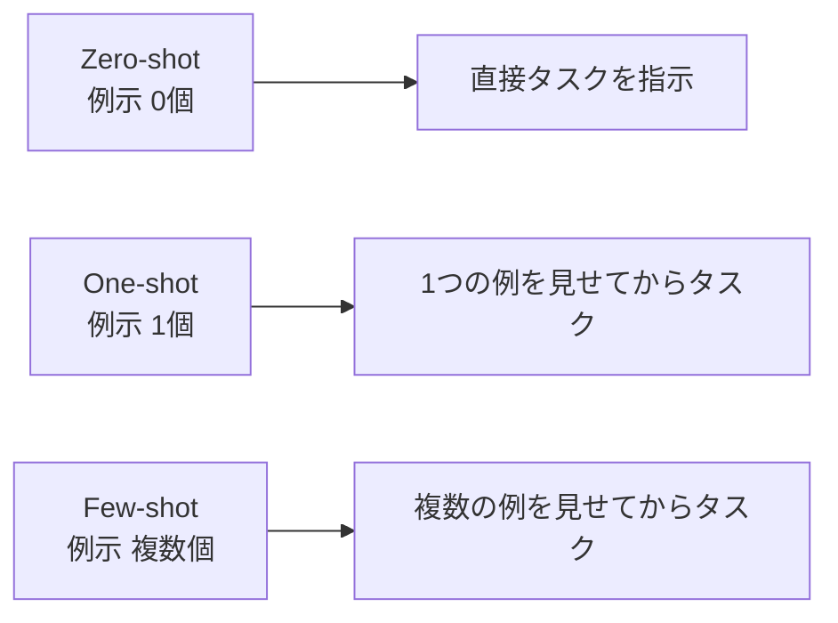
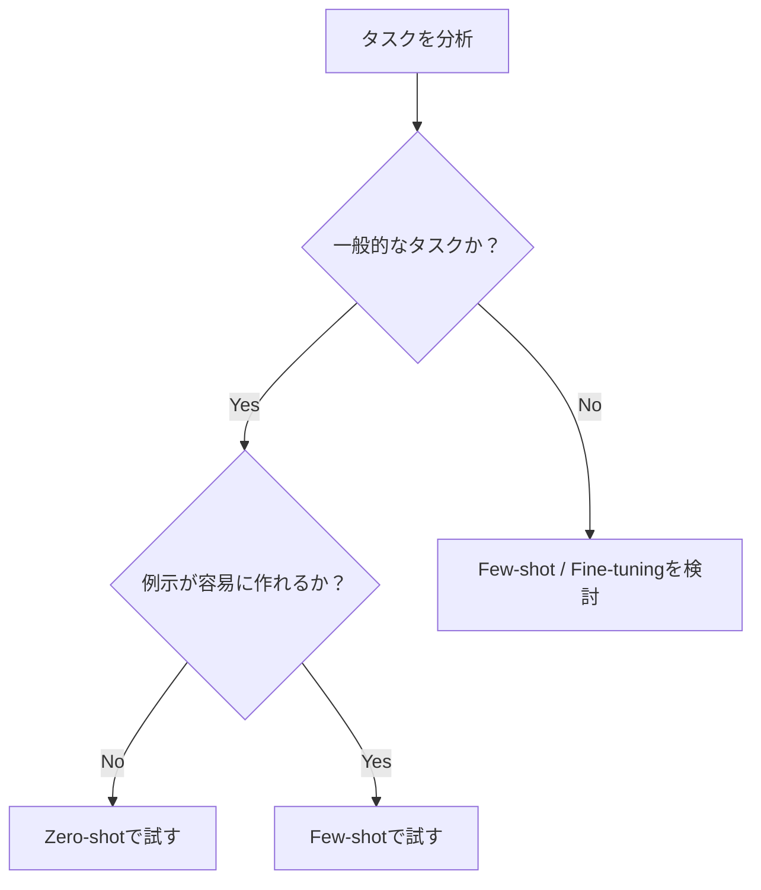

## 概要

Zero-shotプロンプティングとは、例示を一切与えずにAIに直接タスクを指示する手法です。現代の大規模言語モデルはZero-shotで高い性能を発揮できます。このレッスンでは、Zero-shotが有効な場面と、より良い結果を引き出す書き方を学びます。

## 本文

### Zero-shotとは

「Zero-shot」の「shot」は「例示の数」を意味します。



### Zero-shotが有効な場面

1. **汎用タスク**：翻訳、要約、分類など、モデルが十分に学習済みのタスク
2. **プロトタイピング**：素早く動作確認したいとき
3. **一般的な知識の質問**：専門知識が不要な場合
4. **シンプルな変換**：フォーマット変換、データ整形など

### Zero-shotプロンプトの書き方

#### パターン1：直接指示型

```
以下のJSONをMarkdownの表に変換してください。

[
  {"name": "Alice", "age": 30, "role": "Engineer"},
  {"name": "Bob", "age": 25, "role": "Designer"}
]
```

#### パターン2：ステップ指示型

```
以下のテキストを分析し、3つのステップで処理してください：
1. 感情を判定（ポジティブ/ネガティブ/ニュートラル）
2. キーワードを3つ抽出
3. 1文で要約

テキスト：「新しいAPIのレスポンスが遅く、ユーザーからクレームが来ている。
ただし、データの正確性は申し分ない。」
```

#### パターン3：制約付き指示型

```
次の文章を英語に翻訳してください。
制約：技術文書として自然な英語にすること。略語は使わないこと。

「本システムは毎秒1000リクエストを処理できます。」
```

### Zero-shotの限界

Zero-shotが効きにくいケース：
- 独自フォーマットへの変換（例示が必要）
- 企業固有のルール・スタイルへの適応
- 複雑な推論が必要なタスク（CoTが有効）
- 曖昧さの多いタスク



### Zero-shotを強化するテクニック

**役割 + Zero-shot：**
```
あなたはセキュリティ専門家です。
以下のコードに含まれるセキュリティ問題を列挙してください。

```python
password = input("パスワードを入力: ")
query = f"SELECT * FROM users WHERE password = '{password}'"
```
```

**思考促進（Let's think step by step）：**
```
以下の問題を解いてください。ステップバイステップで考えてください。

5台のサーバーがそれぞれ毎秒100リクエストを処理できます。
ピーク時に毎秒3000リクエストが来る場合、何台追加が必要ですか？
```

## ハンズオン

Zero-shotプロンプトのパターンライブラリを作成し、実際に比較してみましょう。

### ステップ1：感情分析Zero-shot

```python
import anthropic

client = anthropic.Anthropic()

def sentiment_analysis_zero_shot(text: str) -> str:
    prompt = f"""以下のテキストの感情を分析してください。

ポジティブ、ネガティブ、ニュートラルのいずれかを答え、
その理由を1文で説明してください。

テキスト：{text}"""

    message = client.messages.create(
        model="claude-opus-4-5",
        max_tokens=256,
        messages=[{"role": "user", "content": prompt}]
    )
    return message.content[0].text

# テスト
texts = [
    "新機能のデプロイが成功して、ユーザーからも好評です！",
    "サーバーがダウンして、データが失われた可能性があります。",
    "明日、定例ミーティングが10時にあります。",
]

for text in texts:
    print(f"入力: {text}")
    print(f"結果: {sentiment_analysis_zero_shot(text)}")
    print()
```

### ステップ2：JSON抽出Zero-shot

```python
def extract_to_json(text: str) -> str:
    prompt = f"""以下のテキストから情報を抽出し、JSONとして返してください。

抽出する項目：名前、日付、金額（あれば）

テキスト：{text}

JSONのみ返してください。説明は不要です。"""

    message = client.messages.create(
        model="claude-opus-4-5",
        max_tokens=512,
        messages=[{"role": "user", "content": prompt}]
    )
    return message.content[0].text

# テスト
sample = "田中太郎さんが2024年3月15日に50,000円の請求書を送付しました。"
print(extract_to_json(sample))
```

### 完成コード

```python
import anthropic
import json
from enum import Enum

client = anthropic.Anthropic()

class ZeroShotPatterns:
    """Zero-shotプロンプトのパターンライブラリ"""

    @staticmethod
    def classify(text: str, categories: list[str]) -> str:
        cats = "、".join(categories)
        prompt = f"次のテキストを [{cats}] のいずれかに分類してください。\n\nテキスト：{text}\n\n分類のみ答えてください。"
        return ZeroShotPatterns._call(prompt)

    @staticmethod
    def summarize(text: str, max_bullets: int = 3) -> str:
        prompt = f"以下を{max_bullets}つの箇条書きで要約してください。\n\n{text}"
        return ZeroShotPatterns._call(prompt)

    @staticmethod
    def translate(text: str, target_lang: str = "英語") -> str:
        prompt = f"以下を{target_lang}に翻訳してください。\n\n{text}"
        return ZeroShotPatterns._call(prompt)

    @staticmethod
    def extract_json(text: str, fields: list[str]) -> str:
        fields_str = ", ".join(fields)
        prompt = f"以下から [{fields_str}] を抽出してJSONで返してください。\n\n{text}\n\nJSONのみ返してください。"
        return ZeroShotPatterns._call(prompt)

    @staticmethod
    def _call(prompt: str) -> str:
        msg = client.messages.create(
            model="claude-opus-4-5",
            max_tokens=1024,
            messages=[{"role": "user", "content": prompt}]
        )
        return msg.content[0].text


if __name__ == "__main__":
    zs = ZeroShotPatterns()

    print("=== 分類 ===")
    print(zs.classify("本番環境でNullPointerExceptionが発生", ["バグ", "機能追加", "改善要望"]))

    print("\n=== 要約 ===")
    text = "新しいキャッシュ機能を導入した結果、APIのレスポンスタイムが平均200msから50msに改善されました。ユーザーからの好評の声も増えており、今後もパフォーマンス改善を継続していく予定です。"
    print(zs.summarize(text))

    print("\n=== JSON抽出 ===")
    print(zs.extract_json("山田花子、2024-01-20、東京都渋谷区", ["名前", "日付", "住所"]))
```

## クイズ

<!-- QUIZ:START -->
**Q1. Zero-shotプロンプティングの定義として正しいものはどれですか？**

- A) 0文字のプロンプトを使う手法
- B) 例示を与えずにタスクを直接指示する手法
- C) システムプロンプトを使わない手法
- D) 1回しかAPIを呼ばない手法

**正解: B**
**解説:** Zero-shotの「shot」は例示の数を意味します。例示（example）を0個与えてタスクを指示する手法がZero-shotプロンプティングです。

**Q2. Zero-shotが最も有効でない場面はどれですか？**

- A) 一般的な文章の要約
- B) 英語への翻訳
- C) 企業独自のレポートフォーマットへの変換
- D) 感情分析

**正解: C**
**解説:** 企業独自のフォーマットはモデルが学習していないため、Zero-shotでは対応が難しく、Few-shotで具体例を見せる必要があります。

**Q3. Zero-shotの性能を高めるテクニックとして適切でないものはどれですか？**

- A) 役割（Role）を指定する
- B) 「ステップバイステップで考えてください」と追記する
- C) できるだけ短いプロンプトにする
- D) 出力形式を明示する

**正解: C**
**解説:** プロンプトを短くすることはZero-shotの改善にはなりません。むしろ役割・出力形式・思考促進の指示を追加することで性能が向上します。
<!-- QUIZ:END -->

## まとめ

- Zero-shotは例示なしで直接タスクを指示する手法
- 汎用タスク（要約・翻訳・分類など）に有効
- 独自フォーマットや複雑な推論ではFew-shotやCoTの方が効果的
- 役割指定・出力形式指定・思考促進でZero-shotの性能を向上できる

## 次のレッスン

次のレッスンでは、具体的な例示をプロンプトに含める「Few-shotプロンプティング」を学び、Zero-shotでは難しいタスクへの対処法を習得します。
