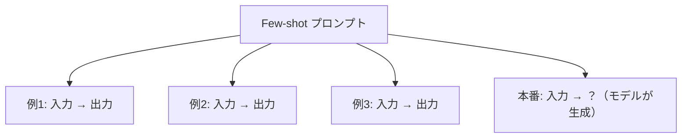
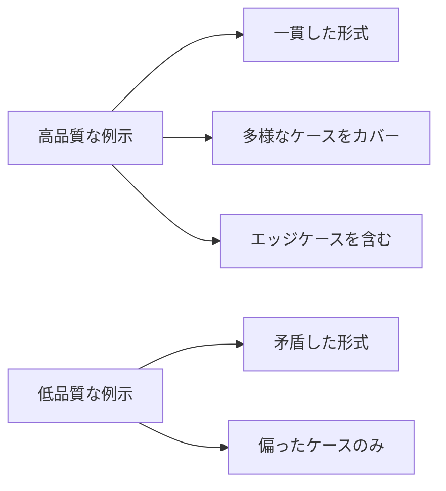

## 概要

Few-shotプロンプティングは、いくつかの入出力例をプロンプトに含めることで、モデルが期待するパターンを学習させる手法です。独自フォーマットへの対応や一貫した出力形式の確保に非常に有効です。

## 本文

### Few-shotとは



例示（shot）を見せることで、モデルは：
- 出力のパターンを学習する
- 独自フォーマットに適応する
- エッジケースの扱い方を理解する

### Few-shotが有効な場面

1. **独自フォーマットへの変換** - 社内のレポート形式など
2. **分類タスク** - カスタムラベルの付与
3. **スタイル統一** - 一貫したトーンや文体
4. **エラーメッセージの生成** - 特定パターンに沿ったメッセージ

### Few-shotプロンプトの書き方

#### 基本パターン

```
以下の例のように、バグレポートを[種類]: [説明]の形式に変換してください。

例1:
入力: ログイン画面で正しいパスワードを入れても弾かれる
出力: 認証バグ: ログイン認証の失敗（正規ユーザーが弾かれる）

例2:
入力: 検索結果が1000件以上になると表示が崩れる
出力: UIバグ: 検索結果の大量表示時にレイアウト崩れが発生

例3:
入力: APIが稀に500エラーを返す
出力: バックエンドバグ: APIが断続的に500エラーを返す

入力: プロフィール画像をアップロードすると処理が止まる
出力:
```

#### マルチターン形式（推奨）

APIを使う場合は、Human/Assistantのターンとして例示するとより自然です：

```python
messages = [
    # 例1
    {"role": "user", "content": "ログインできません"},
    {"role": "assistant", "content": "認証バグ: ログイン機能の不具合"},
    # 例2
    {"role": "user", "content": "画面が真っ白になる"},
    {"role": "assistant", "content": "UIバグ: 画面が白く表示される問題"},
    # 本番
    {"role": "user", "content": "データが消えた"},
]
```

### 例示の品質が鍵



例示を選ぶ際のチェックリスト：
- [ ] 出力形式が完全に一貫している
- [ ] 典型的なケースをカバーしている
- [ ] 境界値・特殊ケースが含まれている
- [ ] 例示の数は3〜5個が最適（多すぎるとトークン浪費）

### 例示の数と効果

| 例示数 | 効果 | トークンコスト |
|--------|------|----------------|
| 0（Zero-shot）| 汎用タスクに有効 | 最小 |
| 1（One-shot） | 基本パターンの学習 | 小 |
| 3〜5（Few-shot） | 多くのタスクで高効果 | 中 |
| 10以上 | 限界効用逓減 | 大 |

## ハンズオン

社内GitHubのIssueを自動タグ付けするFew-shotプロンプトを作成します。

### ステップ1：ラベル分類器の作成

```python
import anthropic
import json

client = anthropic.Anthropic()

EXAMPLES = [
    {
        "input": "ユーザー登録時にメールが届かない",
        "output": '{"label": "bug", "priority": "high", "component": "auth"}'
    },
    {
        "input": "ダークモードを追加してほしい",
        "output": '{"label": "feature", "priority": "low", "component": "ui"}'
    },
    {
        "input": "APIのレスポンスが5秒以上かかる",
        "output": '{"label": "performance", "priority": "high", "component": "api"}'
    },
    {
        "input": "ログアウトボタンのラベルが英語になっている",
        "output": '{"label": "bug", "priority": "low", "component": "ui"}'
    },
]

def classify_issue(issue_text: str) -> dict:
    # Few-shotプロンプトの構築
    examples_text = "\n\n".join([
        f"入力: {e['input']}\n出力: {e['output']}"
        for e in EXAMPLES
    ])

    prompt = f"""GitHubのIssueを以下の形式でラベル付けしてください。

{examples_text}

入力: {issue_text}
出力:"""

    message = client.messages.create(
        model="claude-opus-4-5",
        max_tokens=256,
        messages=[{"role": "user", "content": prompt}]
    )

    result = message.content[0].text.strip()
    return json.loads(result)
```

### ステップ2：マルチターン形式で実装

```python
def classify_issue_multiturn(issue_text: str) -> dict:
    """マルチターン形式のFew-shot"""
    messages = []

    # 例示をマルチターンとして追加
    for example in EXAMPLES:
        messages.append({"role": "user", "content": example["input"]})
        messages.append({"role": "assistant", "content": example["output"]})

    # 本番の入力を追加
    messages.append({"role": "user", "content": issue_text})

    message = client.messages.create(
        model="claude-opus-4-5",
        max_tokens=256,
        system="GitHubのIssueを {label, priority, component} のJSONでラベル付けしてください。",
        messages=messages
    )

    return json.loads(message.content[0].text.strip())
```

### 完成コード

```python
import anthropic
import json
from typing import Any

client = anthropic.Anthropic()

class FewShotClassifier:
    """汎用Few-shotテキスト分類器"""

    def __init__(
        self,
        system_prompt: str,
        examples: list[dict[str, str]],
        model: str = "claude-opus-4-5"
    ):
        self.system = system_prompt
        self.examples = examples
        self.model = model

    def classify(self, input_text: str) -> str:
        messages = []
        for ex in self.examples:
            messages.append({"role": "user", "content": ex["input"]})
            messages.append({"role": "assistant", "content": ex["output"]})
        messages.append({"role": "user", "content": input_text})

        response = client.messages.create(
            model=self.model,
            max_tokens=512,
            system=self.system,
            messages=messages
        )
        return response.content[0].text.strip()

    def batch_classify(self, inputs: list[str]) -> list[str]:
        return [self.classify(text) for text in inputs]


# 使用例
if __name__ == "__main__":
    classifier = FewShotClassifier(
        system_prompt="GitHubのIssueを JSON形式でラベル付けしてください。",
        examples=[
            {
                "input": "ログインできない",
                "output": '{"label": "bug", "priority": "high"}'
            },
            {
                "input": "ダークモードが欲しい",
                "output": '{"label": "feature", "priority": "low"}'
            },
            {
                "input": "APIが遅い",
                "output": '{"label": "performance", "priority": "medium"}'
            },
        ]
    )

    test_issues = [
        "決済時に500エラーが出る",
        "検索機能を追加したい",
        "トップページの読み込みが重い",
    ]

    results = classifier.batch_classify(test_issues)
    for issue, result in zip(test_issues, results):
        print(f"Issue: {issue}")
        print(f"ラベル: {result}\n")
```

## クイズ

<!-- QUIZ:START -->
**Q1. Few-shotプロンプティングにおいて例示が果たす役割は何ですか？**

- A) モデルの重みを更新する
- B) 期待する入出力パターンを示し、モデルの出力を誘導する
- C) モデルのメモリを増やす
- D) APIのレート制限を緩和する

**正解: B**
**解説:** Few-shotの例示はモデルの重みを変えるのではなく、コンテキスト内でパターンを示すことで、モデルが期待する形式・スタイルで出力を生成するよう誘導します。

**Q2. Few-shotで使う例示の数として最も効率的な範囲はどれですか？**

- A) 1個
- B) 3〜5個
- C) 10〜20個
- D) 50個以上

**正解: B**
**解説:** 3〜5個の例示が品質とトークンコストのバランスとして最適です。10個以上になると例示の追加効果が薄れ（限界効用逓減）、コストだけが増加します。

**Q3. マルチターン形式でFew-shotを実装する利点は何ですか？**

- A) 処理速度が向上する
- B) 例示がHuman/Assistantの自然な対話として表現され、パターン学習が効果的になる
- C) APIコストが下がる
- D) 長いコンテキストが不要になる

**正解: B**
**解説:** マルチターン形式では例示をHuman/Assistantの対話として表現するため、モデルが自然な応答パターンとして学習し、より一貫した出力を生成しやすくなります。

**Q4. Few-shotの例示選定で最も重要なことは何ですか？**

- A) できるだけ多くの例を用意する
- B) 出力形式の一貫性と多様なケースのカバー
- C) 例示はすべて同じパターンにする
- D) 例示は最新のデータから選ぶ

**正解: B**
**解説:** 例示間で出力形式が一貫していないとモデルが混乱します。また、典型例だけでなくエッジケースも含めると、実際のタスクへの対応力が上がります。
<!-- QUIZ:END -->

## まとめ

- Few-shotは例示を使ってモデルに期待するパターンを学習させる手法
- 独自フォーマット・カスタム分類・スタイル統一に特に有効
- 例示は3〜5個が品質とコストのバランスが最良
- マルチターン形式が自然で効果的

## 次のレッスン

次のレッスンでは、モデルに段階的な推論をさせる「Chain-of-Thought（CoT）」プロンプティングを学び、複雑な問題へのAI活用力を高めます。
