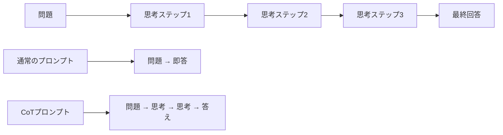
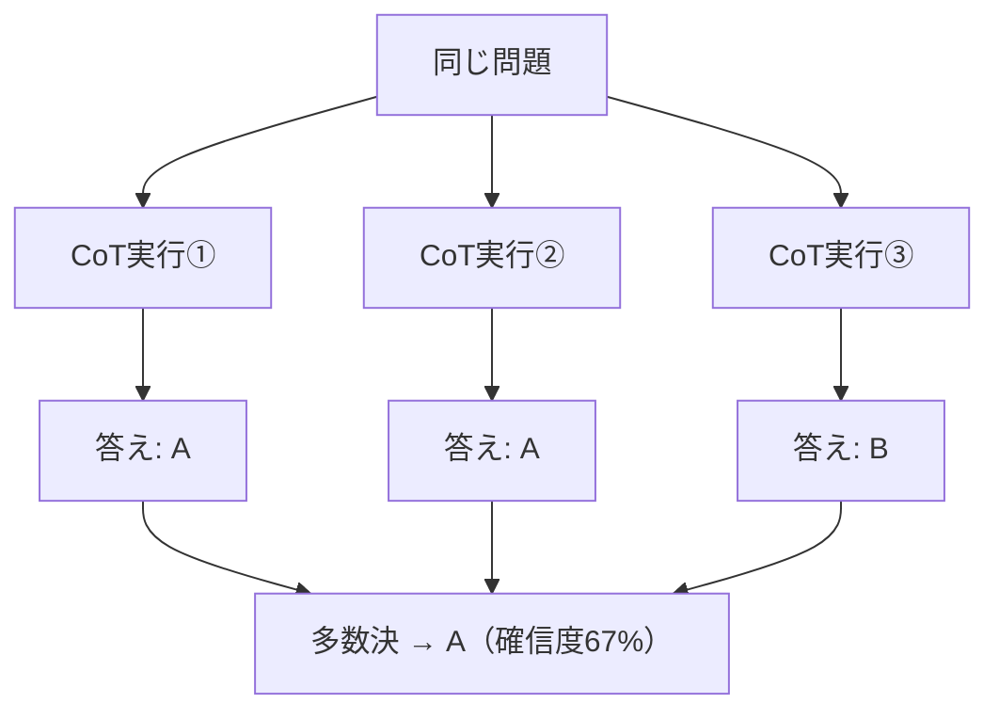

## 概要

Chain-of-Thought（CoT）は、モデルに段階的な思考プロセスを踏ませることで、複雑な推論タスクの精度を大幅に向上させる技法です。「なぜその答えになるか」をモデル自身に説明させることで、より信頼性の高い回答を引き出します。

## 本文

### Chain-of-Thoughtとは

CoTは「考えを鎖（Chain）のようにつなげて思考（Thought）する」手法です。



### なぜCoTが効くのか

LLMはトークンを逐次生成するため、**前のトークンが次のトークンの質に影響します**。思考ステップを先に生成させることで、最終回答の根拠となる計算・推論結果がコンテキストに積み上がります。

### CoTの実装方法

#### 方法1：Zero-shot CoT（最も簡単）

```
問題文の後に以下を追加するだけ：
「ステップバイステップで考えてください。」
または
「Let's think step by step.」
```

**例：**
```
あるシステムが毎分500リクエストを処理できます。
1日（24時間）に何リクエスト処理できますか？
ステップバイステップで計算してください。
```

**出力例：**
```
ステップ1：1時間あたりの処理数
  500リクエスト/分 × 60分 = 30,000リクエスト/時間

ステップ2：1日あたりの処理数
  30,000リクエスト/時間 × 24時間 = 720,000リクエスト/日

答え：1日に720,000リクエスト処理できます。
```

#### 方法2：Few-shot CoT（より制御性が高い）

```
以下の例のように、ステップを示して問題を解いてください。

問題：100人のユーザーが1日10回アクセスします。月（30日）のAPIコールは？
思考：
- 1日のAPIコール = 100人 × 10回 = 1,000回
- 月のAPIコール = 1,000回 × 30日 = 30,000回
答え：30,000回

問題：5台のサーバーで1秒100リクエスト処理できます。3,000リクエスト/秒には何台必要？
思考：
```

### CoTが特に有効なタスク

| タスク種別 | 例 |
|-----------|-----|
| 算術・計算 | コスト計算、容量見積もり |
| 論理推論 | バグの原因特定、システム設計判断 |
| 多段階処理 | データ変換パイプライン |
| コード分析 | 複雑なアルゴリズムの動作説明 |
| 意思決定 | アーキテクチャ選定の比較 |

### Self-Consistency（CoTの発展形）

複数回CoTを実行し、最も多い答えを採用する手法：



### Tree of Thought（ToT）

複数の思考経路を並列探索する発展手法：

```
問題
├── 思考パスA → 行き詰まり → 戻る
├── 思考パスB → 有望 → 深掘り → 解答
└── 思考パスC → 探索中...
```

## ハンズオン

バグの根本原因分析ツールをCoTで実装します。

### ステップ1：基本的なCoTプロンプト

```python
import anthropic

client = anthropic.Anthropic()

def analyze_bug_with_cot(error_info: dict) -> str:
    prompt = f"""以下のエラー情報を分析し、根本原因を特定してください。

## エラー情報
- エラーメッセージ: {error_info['message']}
- 発生環境: {error_info['environment']}
- 直前の操作: {error_info['last_action']}
- スタックトレース:
{error_info['stacktrace']}

## 分析手順
以下のステップで分析してください：
1. エラーメッセージから何が起きているか特定する
2. スタックトレースで問題の発生箇所を特定する
3. 直前の操作との関連を考える
4. 最も可能性の高い根本原因を推定する
5. 確認すべき事項と修正方法を提案する"""

    message = client.messages.create(
        model="claude-opus-4-5",
        max_tokens=2048,
        messages=[{"role": "user", "content": prompt}]
    )
    return message.content[0].text
```

### ステップ2：アーキテクチャ判断のCoT

```python
def architecture_decision_cot(requirements: str) -> str:
    prompt = f"""以下の要件に最適なデータベースを選定してください。

## 要件
{requirements}

## 判断プロセス
ステップバイステップで以下を検討してください：
1. データの性質（構造化/非構造化/関係性）
2. 読み取り/書き込みの頻度と比率
3. スケーリング要件
4. 一貫性 vs 可用性のトレードオフ
5. 候補データベースの比較
6. 最終推奨とその理由"""

    message = client.messages.create(
        model="claude-opus-4-5",
        max_tokens=2048,
        messages=[{"role": "user", "content": prompt}]
    )
    return message.content[0].text
```

### 完成コード（Self-Consistency付き）

```python
import anthropic
from collections import Counter
import re

client = anthropic.Anthropic()

def cot_with_self_consistency(
    problem: str,
    n_samples: int = 3,
    extract_answer_pattern: str = r"答え[：:]\s*(.+)"
) -> dict:
    """Self-Consistencyを使ったCoT推論"""

    prompt = f"""{problem}

ステップバイステップで考え、最後に「答え：[回答]」の形式で答えてください。"""

    responses = []
    answers = []

    for i in range(n_samples):
        message = client.messages.create(
            model="claude-opus-4-5",
            max_tokens=1024,
            # temperatureを上げてサンプルの多様性を確保
            temperature=0.7,
            messages=[{"role": "user", "content": prompt}]
        )
        response = message.content[0].text
        responses.append(response)

        # 答えを抽出
        match = re.search(extract_answer_pattern, response)
        if match:
            answers.append(match.group(1).strip())

    # 多数決で最終答えを決定
    if answers:
        answer_counts = Counter(answers)
        best_answer, count = answer_counts.most_common(1)[0]
        confidence = count / n_samples
    else:
        best_answer = "抽出失敗"
        confidence = 0.0

    return {
        "final_answer": best_answer,
        "confidence": confidence,
        "all_answers": answers,
        "responses": responses
    }


if __name__ == "__main__":
    problem = """
サービスが月100万PV、1PVあたり平均3回のAPIコールを行います。
APIの料金は1,000回あたり0.01ドルです。
月間のAPIコスト（ドル）はいくらですか？
    """

    result = cot_with_self_consistency(problem, n_samples=3)
    print(f"最終答え: {result['final_answer']}")
    print(f"確信度: {result['confidence']:.0%}")
    print(f"各サンプルの答え: {result['all_answers']}")
```

## クイズ

<!-- QUIZ:START -->
**Q1. Chain-of-Thoughtが「効く」主な理由は何ですか？**

- A) モデルのパラメータが増えるから
- B) 前の思考ステップが次の推論の根拠としてコンテキストに積み上がるから
- C) APIのレスポンスが速くなるから
- D) トークン数が減るから

**正解: B**
**解説:** LLMはトークンを逐次生成するため、先に生成した思考ステップが次のトークン生成の文脈（コンテキスト）になります。これにより複雑な推論の精度が向上します。

**Q2. Zero-shot CoTで最も簡単に思考ステップを引き出すフレーズはどれですか？**

- A) 「詳しく教えてください」
- B) 「ステップバイステップで考えてください」
- C) 「正確に答えてください」
- D) 「短く答えてください」

**正解: B**
**解説:** 「ステップバイステップで考えてください」や「Let's think step by step」という一言を追加するだけで、Zero-shot CoTが有効になります。

**Q3. Self-Consistencyとは何ですか？**

- A) 同じプロンプトで1回だけ実行する手法
- B) 複数回CoTを実行し多数決で最終答えを決める手法
- C) システムプロンプトとユーザープロンプトを一致させる手法
- D) 例示の内容を一貫させる手法

**正解: B**
**解説:** Self-Consistencyは同じ問題に対してCoTを複数回実行（温度パラメータを上げて多様性を確保）し、最も多く出た答えを採用することで確信度を高める手法です。
<!-- QUIZ:END -->

## まとめ

- CoTはモデルに段階的思考をさせることで複雑な推論精度を向上させる
- Zero-shot CoT：「ステップバイステップで」の一言で実現
- Few-shot CoT：思考例を示してより制御性を高める
- Self-Consistencyで複数サンプルから高確信度の答えを得られる

## 次のレッスン

次のレッスンでは、AIの振る舞いを根本的に規定する「Systemプロンプトの設計」を学び、一貫したAIアプリケーションの基盤を作る方法を習得します。
