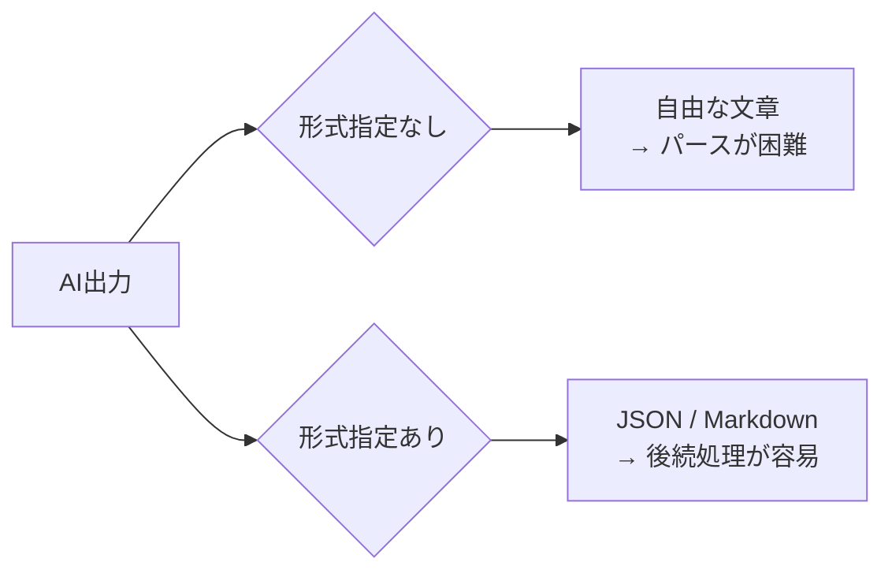

## 概要

AIの出力をプログラムで処理するためには、構造化された出力形式が不可欠です。このレッスンでは、JSON・Markdown・表形式など様々な出力形式をプロンプトで制御する方法と、パース処理の実装パターンを学びます。

## 本文

### なぜ出力形式が重要か



出力形式を制御することで：
- 後続処理の実装が簡単になる
- 出力の一貫性が保たれる
- エラー処理が設計しやすくなる

### JSON形式の出力

```python
# プロンプトでJSON出力を指定
prompt = """
以下のテキストから人物情報を抽出し、JSONで返してください。

テキスト：「田中太郎（30歳）は東京のエンジニアです。趣味は登山です。」

以下のスキーマで返してください。説明は不要です：
{
  "name": "氏名",
  "age": 年齢（数値）,
  "location": "居住地",
  "occupation": "職業",
  "hobbies": ["趣味のリスト"]
}
"""
```

### 出力パース戦略

#### パターン1：直接JSONパース

```python
import json
import anthropic

client = anthropic.Anthropic()

def extract_json(response_text: str) -> dict:
    """レスポンスからJSONを抽出してパース"""
    # マークダウンコードブロックを除去
    text = response_text.strip()
    if text.startswith("```json"):
        text = text[7:]
    if text.startswith("```"):
        text = text[3:]
    if text.endswith("```"):
        text = text[:-3]
    return json.loads(text.strip())
```

#### パターン2：プレフィックスを使った制御

AIに回答の前置きを書かせない強力なテクニック：

```python
def get_json_response(prompt: str) -> dict:
    message = client.messages.create(
        model="claude-opus-4-5",
        max_tokens=1024,
        messages=[
            {"role": "user", "content": prompt},
            # Assistantターンを先に開始させ、JSONの開始を強制
            {"role": "assistant", "content": "{"}
        ]
    )
    # "{" + レスポンスを結合
    raw = "{" + message.content[0].text
    return json.loads(raw)
```

### Markdown形式の出力

````
以下の技術トピックについて、Markdown形式で説明してください。

## 形式
```markdown
## [タイトル]

### 概要
[2〜3文の説明]

### 主な特徴
- 特徴1
- 特徴2

### コード例
```language
[コード]
```

### まとめ
[1文]
```

トピック：TypeScriptのジェネリクス
````

### XML形式の出力（構造化が明確）

```
以下のコードレビューをXML形式で返してください：

<review>
  <summary>全体的な評価（1〜2文）</summary>
  <issues>
    <issue severity="critical|warning|info">
      <location>ファイル名/行番号</location>
      <description>問題の説明</description>
      <suggestion>改善提案</suggestion>
    </issue>
  </issues>
</review>
```

### 構造化出力の比較

| 形式 | 用途 | パースのしやすさ |
|------|------|----------------|
| JSON | API連携・データ処理 | 非常に高い |
| YAML | 設定ファイル・人間が読む | 高い |
| Markdown | ドキュメント・表示用 | 中程度 |
| XML | 複雑な階層構造 | 高い |
| CSV | テーブルデータ | 高い |
| Plain text | 自由な文章 | 低い |

## ハンズオン

型安全な構造化出力パーサーを実装します。

### ステップ1：Pydanticを使った型安全パース

```python
from pydantic import BaseModel, Field
from typing import Optional
import anthropic
import json

client = anthropic.Anthropic()

class Issue(BaseModel):
    severity: str = Field(description="critical/warning/info")
    location: str
    description: str
    suggestion: str

class CodeReview(BaseModel):
    summary: str
    score: int = Field(ge=1, le=10, description="1-10の評価スコア")
    issues: list[Issue]
    approved: bool

def review_code(code: str) -> CodeReview:
    prompt = f"""以下のコードをレビューし、結果をJSONで返してください。

コード：
```python
{code}
```

以下のスキーマで返してください（説明不要）：
{{
  "summary": "全体評価（1〜2文）",
  "score": 1〜10の整数,
  "issues": [
    {{
      "severity": "critical|warning|info",
      "location": "関数名/行番号",
      "description": "問題の説明",
      "suggestion": "改善案"
    }}
  ],
  "approved": true/false
}}"""

    message = client.messages.create(
        model="claude-opus-4-5",
        max_tokens=2048,
        messages=[{"role": "user", "content": prompt}]
    )

    # パース
    text = message.content[0].text.strip()
    if "```json" in text:
        text = text.split("```json")[1].split("```")[0].strip()

    data = json.loads(text)
    return CodeReview(**data)
```

### ステップ2：CSVテーブル出力

```python
import csv
import io

def extract_table(text: str) -> list[dict]:
    """テキストからCSV形式でデータを抽出"""
    prompt = f"""以下のテキストからデータを抽出し、CSVで返してください。

テキスト：{text}

ヘッダー行を含むCSVのみ返してください。説明は不要です。"""

    message = client.messages.create(
        model="claude-opus-4-5",
        max_tokens=1024,
        messages=[{"role": "user", "content": prompt}]
    )

    csv_text = message.content[0].text.strip()
    if "```" in csv_text:
        csv_text = csv_text.split("```")[1].strip()

    reader = csv.DictReader(io.StringIO(csv_text))
    return list(reader)
```

### 完成コード

```python
import anthropic
import json
from pydantic import BaseModel, validator
from typing import Any, Type, TypeVar

T = TypeVar("T", bound=BaseModel)
client = anthropic.Anthropic()

def get_structured_output(
    prompt: str,
    schema: Type[T],
    model: str = "claude-opus-4-5"
) -> T:
    """Pydanticモデルを使った型安全な構造化出力取得"""
    schema_json = json.dumps(schema.model_json_schema(), ensure_ascii=False, indent=2)

    full_prompt = f"""{prompt}

以下のJSONスキーマに従って回答してください。JSONのみ返してください：
{schema_json}"""

    message = client.messages.create(
        model=model,
        max_tokens=2048,
        messages=[{"role": "user", "content": full_prompt}]
    )

    text = message.content[0].text.strip()

    # コードブロックの除去
    for prefix in ["```json", "```"]:
        if text.startswith(prefix):
            text = text[len(prefix):]
    if text.endswith("```"):
        text = text[:-3]

    data = json.loads(text.strip())
    return schema(**data)


# 使用例
class PersonInfo(BaseModel):
    name: str
    age: int
    occupation: str
    skills: list[str]

if __name__ == "__main__":
    result = get_structured_output(
        "田中太郎（35歳）はPythonとGoが得意なバックエンドエンジニアです。",
        PersonInfo
    )
    print(result.model_dump())
```

## クイズ

<!-- QUIZ:START -->
**Q1. AIの出力形式を指定する主な理由は何ですか？**

- A) モデルの精度を上げるため
- B) 後続のプログラム処理を容易にし、出力の一貫性を確保するため
- C) APIコストを削減するため
- D) レスポンス速度を上げるため

**正解: B**
**解説:** 出力形式（JSON・Markdownなど）を指定することで、後続のプログラム処理が容易になり、出力の一貫性も保たれます。

**Q2. AIにJSONのみを返させる最も確実な手法はどれですか？**

- A) 「JSONで返してください」とだけ書く
- B) AssistantターンをJSONの開始文字「{」で先行入力して返答を誘導する
- C) 出力を長くする
- D) SystemプロンプトなしでJSONを要求する

**正解: B**
**解説:** AssistantターンをJSONの「{」で先開始させると、モデルは前置きの説明なしにJSONの続きを生成します。これが最も確実にJSONのみを得る手法です。

**Q3. Pydanticを使う主なメリットはどれですか？**

- A) APIコストが下がる
- B) AIの精度が上がる
- C) パースしたデータが型安全になりバリデーションが自動で行われる
- D) プロンプトが短くなる

**正解: C**
**解説:** Pydanticを使うと、AIの出力をパースした結果が型安全なPythonオブジェクトになり、型エラー・値エラーを自動バリデーションで検出できます。
<!-- QUIZ:END -->

## まとめ

- 出力形式の指定でAI出力の後続処理が容易になる
- JSONはAPI連携に最適で、Pydanticで型安全パースができる
- Assistantターンへの先行入力でより確実な形式制御が可能
- 形式はJSON/Markdown/XML/CSVなどタスクに応じて選択する

## 次のレッスン

次のレッスンでは、AIの出力の多様性と創造性を制御する「Temperatureとサンプリングパラメータ」を学びます。
