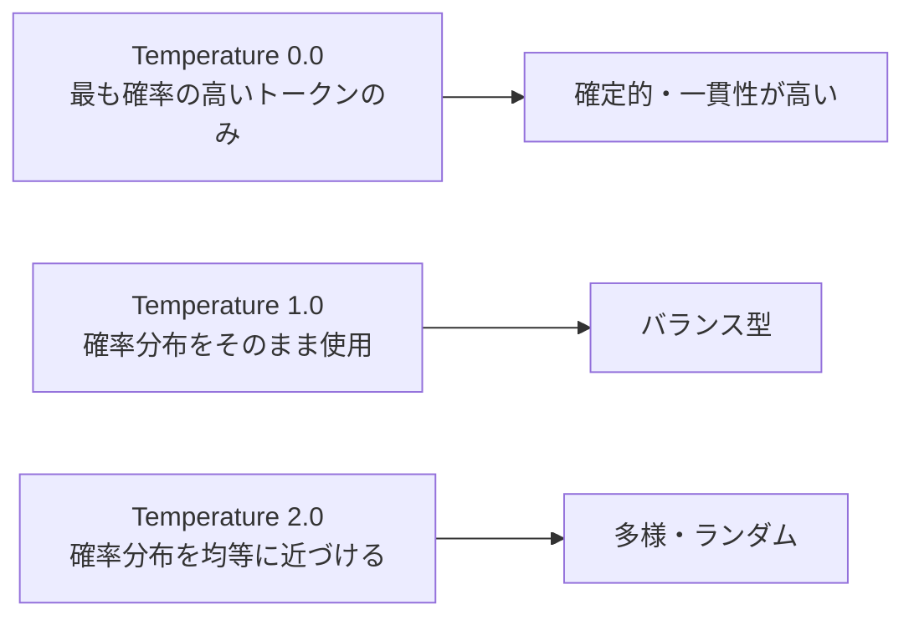

## 概要

TemperatureやTop-pなどのサンプリングパラメータは、AIの出力の多様性・創造性・一貫性をコントロールします。タスクに応じた適切なパラメータ設定が、AIアプリケーションの品質を大きく左右します。

## 本文

### Temperatureとは

LLMはトークンを選ぶとき、各トークンの「確率分布」を計算します。Temperatureはその分布の「シャープさ」を制御します。



**温度と出力の関係：**

| Temperature | 特性 | 適した用途 |
|-------------|------|-----------|
| 0.0 | 決定論的・一貫性最高 | コード生成・分類・JSON出力 |
| 0.3 | 安定・やや創造的 | 要約・翻訳・技術文書 |
| 0.7 | バランス | 一般的な質問応答 |
| 1.0 | 創造的・多様 | ブレインストーミング |
| 1.5+ | 非常に多様・予測困難 | 創作・詩 |

### 他のサンプリングパラメータ

#### Top-p（Nucleus Sampling）

累積確率がpに達するまでのトークン群から選択する方法：

```
Top-p = 0.9 の場合：
確率の高いトークンから順に選び、累積確率が90%に達した時点で打ち切り、
その範囲内でランダムに選択する
```

#### Top-k

確率上位k個のトークンから選択する方法：

```
Top-k = 50 の場合：
確率上位50トークンのみから選択
```

#### パラメータの組み合わせ

| 設定 | Temperature | Top-p | 用途 |
|------|-------------|-------|------|
| 決定的 | 0 | - | コード・JSON生成 |
| 保守的 | 0.3 | 0.9 | 技術文書 |
| 標準 | 0.7 | 0.95 | 汎用 |
| 創造的 | 1.0 | 1.0 | 創作・アイデア出し |

### max_tokens

生成する最大トークン数。コストとレイテンシに直結：

```python
# 適切なmax_tokensの設定例
CONFIGS = {
    "classification": {"max_tokens": 50},     # 分類ラベルのみ
    "summary": {"max_tokens": 512},           # 要約
    "code_review": {"max_tokens": 2048},      # コードレビュー
    "full_document": {"max_tokens": 8192},    # 長文生成
}
```

### Claudeのデフォルト値

```python
# Claudeのデフォルト
temperature = 1.0  # Claudeのデフォルトは1.0
max_tokens = ?     # 必須パラメータ（デフォルトなし）
top_p = 0.999     # デフォルト値
```

> 注意：TemperatureとTop-pを同時に設定することは非推奨（Anthropicは一方のみの変更を推奨）。

## ハンズオン

Temperatureの違いによる出力変化を実験するツールを作ります。

### ステップ1：Temperature比較実験

```python
import anthropic
from typing import Generator

client = anthropic.Anthropic()

def compare_temperatures(
    prompt: str,
    temperatures: list[float],
    n_samples: int = 3
) -> dict[float, list[str]]:
    """複数のTemperatureで出力を比較"""
    results = {}

    for temp in temperatures:
        samples = []
        for _ in range(n_samples):
            message = client.messages.create(
                model="claude-opus-4-5",
                max_tokens=256,
                temperature=temp,
                messages=[{"role": "user", "content": prompt}]
            )
            samples.append(message.content[0].text)
        results[temp] = samples

    return results

# 実験1：コード生成（低温度が適切）
code_results = compare_temperatures(
    prompt="Pythonで1から100までの素数をリストで返す関数を書いてください。コードのみ返してください。",
    temperatures=[0.0, 0.5, 1.0],
    n_samples=2
)

print("=== コード生成（一貫性が重要） ===")
for temp, samples in code_results.items():
    print(f"\nTemperature: {temp}")
    for i, s in enumerate(samples):
        print(f"Sample {i+1}:\n{s[:200]}\n")
```

### ステップ2：タスク別の最適パラメータ設定

```python
from dataclasses import dataclass

@dataclass
class ModelConfig:
    temperature: float
    max_tokens: int
    top_p: float = 0.999

# タスク別の推奨設定
TASK_CONFIGS = {
    "json_extraction": ModelConfig(temperature=0.0, max_tokens=1024),
    "code_generation": ModelConfig(temperature=0.2, max_tokens=2048),
    "summarization": ModelConfig(temperature=0.3, max_tokens=512),
    "translation": ModelConfig(temperature=0.3, max_tokens=2048),
    "qa": ModelConfig(temperature=0.7, max_tokens=1024),
    "brainstorming": ModelConfig(temperature=1.0, max_tokens=2048),
    "creative_writing": ModelConfig(temperature=1.2, max_tokens=4096),
}

def create_with_task_config(
    prompt: str,
    task: str,
    model: str = "claude-opus-4-5"
) -> str:
    config = TASK_CONFIGS.get(task, TASK_CONFIGS["qa"])

    message = client.messages.create(
        model=model,
        max_tokens=config.max_tokens,
        temperature=config.temperature,
        messages=[{"role": "user", "content": prompt}]
    )
    return message.content[0].text
```

### 完成コード

```python
import anthropic
from dataclasses import dataclass, field
from typing import Literal

client = anthropic.Anthropic()

TaskType = Literal[
    "json_extraction", "code_generation", "summarization",
    "translation", "qa", "brainstorming", "creative_writing"
]

@dataclass
class TaskConfig:
    temperature: float
    max_tokens: int
    description: str

TASK_CONFIGS: dict[TaskType, TaskConfig] = {
    "json_extraction": TaskConfig(0.0, 1024, "JSON抽出・分類（決定的）"),
    "code_generation": TaskConfig(0.2, 2048, "コード生成（安定）"),
    "summarization":   TaskConfig(0.3, 512,  "要約・翻訳（保守的）"),
    "translation":     TaskConfig(0.3, 2048, "翻訳（保守的）"),
    "qa":              TaskConfig(0.7, 1024, "Q&A（標準）"),
    "brainstorming":   TaskConfig(1.0, 2048, "アイデア出し（創造的）"),
    "creative_writing":TaskConfig(1.2, 4096, "創作（非常に創造的）"),
}

def smart_complete(prompt: str, task: TaskType = "qa") -> dict:
    config = TASK_CONFIGS[task]
    message = client.messages.create(
        model="claude-opus-4-5",
        max_tokens=config.max_tokens,
        temperature=config.temperature,
        messages=[{"role": "user", "content": prompt}]
    )
    return {
        "response": message.content[0].text,
        "task": task,
        "config": config,
        "usage": message.usage.model_dump(),
    }

if __name__ == "__main__":
    # コード生成（低温度）
    result = smart_complete(
        "Pythonで素数判定関数を書いてください",
        task="code_generation"
    )
    print(f"Task: {result['task']} (temp={result['config'].temperature})")
    print(result["response"])
```

## クイズ

<!-- QUIZ:START -->
**Q1. Temperature=0の場合、AIの出力はどうなりますか？**

- A) 出力がランダムになり毎回異なる
- B) 決定論的になり、同じプロンプトには常に同じ出力が得られる
- C) 出力が空になる
- D) エラーが発生する

**正解: B**
**解説:** Temperature=0では最も確率の高いトークンのみが選択されるため、出力が決定論的になります。コード生成やJSON抽出など一貫性が重要なタスクに適しています。

**Q2. ブレインストーミング（アイデア出し）に最も適したTemperatureはどれですか？**

- A) 0.0
- B) 0.2
- C) 0.7
- D) 1.0〜1.2

**正解: D**
**解説:** 高いTemperature（1.0以上）では出力が多様で創造的になります。アイデア出しでは毎回異なる視点のアイデアが欲しいため、高めのTemperatureが適しています。

**Q3. max_tokensパラメータを適切に設定する主な理由は何ですか？**

- A) 出力の品質が向上するから
- B) コストとレイテンシを制御するため
- C) セキュリティが向上するから
- D) プロンプトが短くなるから

**正解: B**
**解説:** max_tokensは生成するトークン数の上限で、APIコストとレスポンス速度に直接影響します。タスクに必要な長さに合わせて設定することでコスト最適化できます。

**Q4. TemperatureとTop-pを同時に設定することについて正しい説明はどれですか？**

- A) 同時設定は必須で効果が高い
- B) Anthropicは一方のみの変更を推奨しており、同時変更は非推奨
- C) 同時設定するとエラーになる
- D) 同時設定するとコストが下がる

**正解: B**
**解説:** TemperatureとTop-pは同じサンプリングに影響するパラメータです。Anthropicは両方同時に変更するのではなく、一方のみを調整することを推奨しています。
<!-- QUIZ:END -->

## まとめ

- Temperatureは出力の多様性・創造性を0〜2の範囲で制御する
- コード・JSON生成には低温度（0〜0.3）、創作・アイデア出しには高温度（1.0+）
- max_tokensでコストとレイテンシをコントロールする
- タスク別に最適なパラメータセットを定義して管理する

## 次のレッスン

次のレッスンでは、複数回のやり取りを通じて情報を積み重ねる「マルチターン会話の設計」を学び、コンテキストを保持するAIアシスタントを構築します。
