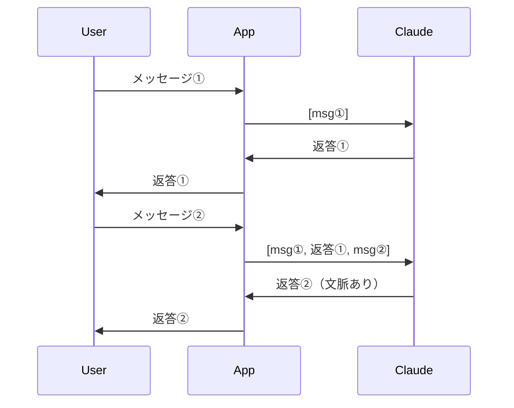
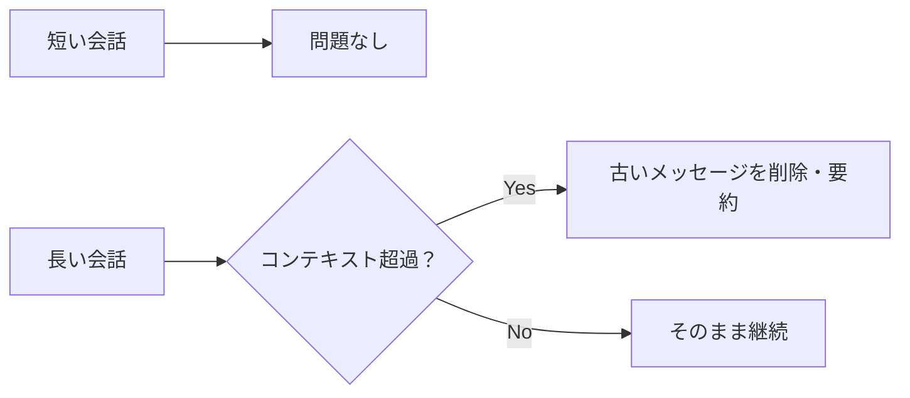

## 概要

マルチターン会話では、複数回のやり取りを通じて文脈を積み重ねながらタスクを進めます。会話履歴の管理・コンテキスト長の制御・状態管理が重要な設計課題です。このレッスンでは実務で使えるマルチターン会話システムの実装を学びます。

## 本文

### マルチターン会話の仕組み

LLMはステートレス（状態を持たない）です。「会話の継続」は、これまでの全メッセージを毎回送信することで実現します。



### 会話履歴の管理

```python
# 基本的なマルチターン実装
history = []

def chat(user_message: str) -> str:
    history.append({"role": "user", "content": user_message})

    response = client.messages.create(
        model="claude-opus-4-5",
        max_tokens=1024,
        system="あなたは優秀なアシスタントです。",
        messages=history
    )

    assistant_message = response.content[0].text
    history.append({"role": "assistant", "content": assistant_message})

    return assistant_message
```

### コンテキスト長の問題

会話が長くなるとコンテキストウィンドウを超える可能性があります：



### コンテキスト管理戦略

#### 戦略1：スライディングウィンドウ

```python
def trim_history(history: list[dict], max_turns: int = 10) -> list[dict]:
    """最新のN往復のみ保持"""
    if len(history) <= max_turns * 2:
        return history
    return history[-(max_turns * 2):]
```

#### 戦略2：要約による圧縮

```python
def summarize_history(history: list[dict], keep_last: int = 4) -> list[dict]:
    """古い会話を要約してコンパクトに保存"""
    if len(history) <= keep_last * 2:
        return history

    old_messages = history[:-(keep_last * 2)]
    recent_messages = history[-(keep_last * 2):]

    # 古いメッセージを要約
    summary_prompt = "以下の会話を3文以内で要約してください：\n" + \
        "\n".join([f"{m['role']}: {m['content']}" for m in old_messages])

    summary_response = client.messages.create(
        model="claude-opus-4-5",
        max_tokens=256,
        messages=[{"role": "user", "content": summary_prompt}]
    )

    summary = summary_response.content[0].text
    summary_message = {
        "role": "user",
        "content": f"[以前の会話の要約]: {summary}"
    }

    return [summary_message] + recent_messages
```

### 状態管理パターン

会話中に収集した情報を構造化して保持：

```python
from dataclasses import dataclass, field
from typing import Optional

@dataclass
class ConversationState:
    """会話の状態を管理"""
    user_name: Optional[str] = None
    topic: Optional[str] = None
    collected_info: dict = field(default_factory=dict)
    turn_count: int = 0
    resolved: bool = False
```

## ハンズオン

コンテキスト管理付きのチャットボットを実装します。

### ステップ1：基本チャットクラス

```python
import anthropic
from dataclasses import dataclass, field
from typing import Optional

client = anthropic.Anthropic()

@dataclass
class Message:
    role: str
    content: str

class ConversationManager:
    def __init__(
        self,
        system_prompt: str,
        max_context_turns: int = 10,
        model: str = "claude-opus-4-5"
    ):
        self.system_prompt = system_prompt
        self.max_context_turns = max_context_turns
        self.model = model
        self.history: list[Message] = []

    def add_user_message(self, content: str):
        self.history.append(Message(role="user", content=content))

    def add_assistant_message(self, content: str):
        self.history.append(Message(role="assistant", content=content))

    def get_trimmed_history(self) -> list[dict]:
        """コンテキスト長を制御した履歴を返す"""
        messages = self.history[-(self.max_context_turns * 2):]
        return [{"role": m.role, "content": m.content} for m in messages]

    def chat(self, user_input: str) -> str:
        self.add_user_message(user_input)

        response = client.messages.create(
            model=self.model,
            max_tokens=1024,
            system=self.system_prompt,
            messages=self.get_trimmed_history()
        )

        assistant_reply = response.content[0].text
        self.add_assistant_message(assistant_reply)

        return assistant_reply

    def reset(self):
        self.history = []

    @property
    def turn_count(self) -> int:
        return len([m for m in self.history if m.role == "user"])
```

### ステップ2：サポートボットの実装

```python
class SupportBot(ConversationManager):
    """カスタマーサポートBot"""

    SYSTEM = """あなたはITサポートのアシスタントです。
ユーザーの技術的な問題を段階的にトラブルシューティングします。

## 会話の進め方
1. 問題を詳しく把握する（具体的な症状・環境）
2. 最も可能性の高い原因から確認する
3. ステップバイステップで解決手順を案内する
4. 解決できない場合はエスカレーションを提案する

## スタイル
- 丁寧な敬語を使用
- 技術用語は分かりやすく説明する
- 手順は番号付きリストで示す"""

    def __init__(self):
        super().__init__(system_prompt=self.SYSTEM, max_context_turns=15)
        self.issue_resolved = False

    def mark_resolved(self):
        self.issue_resolved = True
        return "問題が解決されて良かったです。他にご不明な点があればいつでもどうぞ。"
```

### 完成コード

```python
import anthropic
from dataclasses import dataclass, field

client = anthropic.Anthropic()

@dataclass
class ConversationManager:
    system_prompt: str
    max_context_turns: int = 10
    model: str = "claude-opus-4-5"
    history: list[dict] = field(default_factory=list)

    def chat(self, user_input: str) -> str:
        self.history.append({"role": "user", "content": user_input})

        # コンテキスト制御
        trimmed = self.history[-(self.max_context_turns * 2):]

        response = client.messages.create(
            model=self.model,
            max_tokens=1024,
            system=self.system_prompt,
            messages=trimmed
        )

        reply = response.content[0].text
        self.history.append({"role": "assistant", "content": reply})
        return reply

    def reset(self):
        self.history = []

    def get_summary(self) -> str:
        """会話全体を要約"""
        if not self.history:
            return "会話がありません"

        conv_text = "\n".join(
            f"{m['role'].upper()}: {m['content']}"
            for m in self.history
        )

        response = client.messages.create(
            model=self.model,
            max_tokens=512,
            messages=[{
                "role": "user",
                "content": f"以下の会話を3行で要約してください：\n{conv_text}"
            }]
        )
        return response.content[0].text


if __name__ == "__main__":
    bot = ConversationManager(
        system_prompt="あなたはPythonの専門家です。質問に親切に答えてください。"
    )

    conversation = [
        "Pythonのリスト内包表記って何ですか？",
        "具体的なコード例を見せてください",
        "ネストされたリスト内包表記も使えますか？",
    ]

    for user_msg in conversation:
        print(f"User: {user_msg}")
        reply = bot.chat(user_msg)
        print(f"Assistant: {reply}\n")

    print("=== 会話の要約 ===")
    print(bot.get_summary())
```

## クイズ

<!-- QUIZ:START -->
**Q1. LLMがマルチターン会話を実現する方法として正しいものはどれですか？**

- A) サーバー側で会話状態を記憶する
- B) これまでの全メッセージを毎回のAPIリクエストに含めて送信する
- C) セッションIDで会話を識別する
- D) Cookieで状態を保持する

**正解: B**
**解説:** LLMはステートレスです。「会話の継続」は、これまでのUser/Assistantメッセージをすべて含めたリストを毎回送ることで実現します。

**Q2. 長い会話でのコンテキスト管理として最も一般的な手法はどれですか？**

- A) 古いメッセージを削除して最新のN往復のみ保持する
- B) すべてのメッセージを永久に保持する
- C) ユーザーに手動で削除させる
- D) APIを複数に分割して送信する

**正解: A**
**解説:** スライディングウィンドウ（最新N往復のみ保持）が最もシンプルで一般的な手法です。より高度な手法として古い会話を要約する方法もあります。

**Q3. 会話履歴の「要約による圧縮」の主なメリットはどれですか？**

- A) APIコストが大幅に増える
- B) コンテキストを節約しながら重要な情報を保持できる
- C) レスポンス速度が遅くなる
- D) セキュリティが向上する

**正解: B**
**解説:** 古いメッセージを要約することで、コンテキストウィンドウの使用量を大幅に削減しつつ重要な情報（ユーザー名・問題の背景など）を保持できます。
<!-- QUIZ:END -->

## まとめ

- マルチターン会話は全履歴を毎回送信することで実現する（LLMはステートレス）
- コンテキスト長が問題になる場合はスライディングウィンドウや要約で対応
- 状態管理クラスで会話の進捗・収集情報を構造化して保持する
- ConversationManagerパターンが実務での定番実装

## 次のレッスン

次のレッスンでは、意図通りに動かないプロンプトを改善する「プロンプトのデバッグと改善」の系統的な方法論を学びます。
