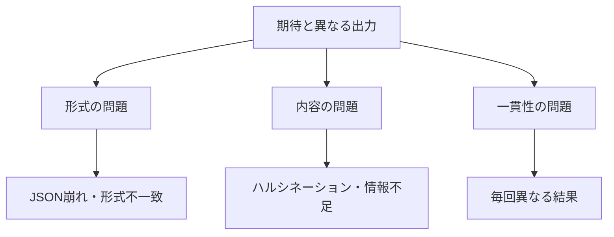

## 概要

プロンプトが期待通りに動かない場合の系統的なデバッグ手法を学びます。症状から原因を特定し、仮説を立てて改善する「プロンプトデバッグの科学」を習得します。

## 本文

### プロンプトの失敗パターン



| 症状 | よくある原因 |
|------|-------------|
| 指定した形式以外で回答 | 出力形式の指定が曖昧 |
| 長すぎる/短すぎる回答 | 長さの制約が未指定 |
| 的外れな回答 | コンテキストが不足 |
| 毎回異なる解釈 | 指示が曖昧・多義的 |
| 余計な説明が入る | 「説明不要」の指示が欠如 |
| ハルシネーション | 事実確認の制約が未指定 |

### デバッグの5ステップ

```
1. 症状を記録する（期待値 vs 実際の出力）
2. 最小再現プロンプトを作る
3. 仮説を立てる（1〜2個）
4. 一度に1つだけ変更してテスト
5. 改善を確認・文書化する
```

### デバッグテクニック

#### テクニック1：メタプロンプト（AIにプロンプトを直してもらう）

```python
def debug_with_ai(bad_prompt: str, bad_output: str, expected: str) -> str:
    meta_prompt = f"""あなたはプロンプトエンジニアリングの専門家です。
以下のプロンプトが期待通りの出力を生成できていません。

## 現在のプロンプト
{bad_prompt}

## 実際の出力
{bad_output}

## 期待する出力
{expected}

問題点を分析し、改善されたプロンプトを提案してください。"""

    message = client.messages.create(
        model="claude-opus-4-5",
        max_tokens=2048,
        messages=[{"role": "user", "content": meta_prompt}]
    )
    return message.content[0].text
```

#### テクニック2：A/Bテスト

```python
def ab_test_prompts(
    prompt_a: str,
    prompt_b: str,
    test_inputs: list[str],
    evaluator_prompt: str
) -> dict:
    """2つのプロンプトをテスト入力で比較"""
    results = {"a_wins": 0, "b_wins": 0, "ties": 0}

    for test_input in test_inputs:
        output_a = call_api(prompt_a.format(input=test_input))
        output_b = call_api(prompt_b.format(input=test_input))

        # LLM-as-Judgeで評価
        eval_prompt = evaluator_prompt.format(
            a=output_a, b=output_b, input=test_input
        )
        verdict = call_api(eval_prompt)

        if "A" in verdict:
            results["a_wins"] += 1
        elif "B" in verdict:
            results["b_wins"] += 1
        else:
            results["ties"] += 1

    return results
```

#### テクニック3：プロンプト解剖（要素別テスト）

```python
def test_prompt_elements(base_prompt: str, test_input: str) -> dict:
    """プロンプトの各要素を取り除いてインパクトを測定"""
    elements = {
        "full": base_prompt,
        "no_role": remove_role(base_prompt),
        "no_format": remove_format(base_prompt),
        "no_context": remove_context(base_prompt),
    }

    return {
        name: call_api(prompt.format(input=test_input))
        for name, prompt in elements.items()
    }
```

### よくある問題と解決策

#### 問題1：余計な前置きが入る

```
# 悪い例（余計な説明が入る）
「以下をJSONに変換してください」

# 良い例
「以下をJSONに変換してください。
JSONのみ返してください。説明・前置き・コードブロックは不要です。」
```

#### 問題2：指示を無視する

```
# 改善前
「日本語で回答してください」

# 改善後
「必ず日本語のみで回答してください。英語を含める場合は先に日本語訳を示してください。」
```

#### 問題3：ハルシネーション

```
「提供された情報のみに基づいて回答してください。
情報が不足している場合は「提供された情報では判断できません」と答えてください。
推測や一般知識で補完しないでください。」
```

## ハンズオン

プロンプト改善の自動化ツールを実装します。

### ステップ1：プロンプト評価器

```python
import anthropic
from dataclasses import dataclass

client = anthropic.Anthropic()

@dataclass
class PromptEvalResult:
    score: int  # 1-10
    issues: list[str]
    suggestions: list[str]
    improved_prompt: str

def evaluate_prompt(
    prompt: str,
    test_output: str,
    expected_criteria: list[str]
) -> PromptEvalResult:
    """プロンプトと出力を評価して改善案を返す"""
    criteria_text = "\n".join(f"- {c}" for c in expected_criteria)

    eval_prompt = f"""あなたはプロンプトエンジニアリングの専門家です。

## 評価するプロンプト
{prompt}

## このプロンプトへの実際の出力
{test_output}

## 期待する基準
{criteria_text}

以下のJSON形式で評価してください：
{{
  "score": 1〜10,
  "issues": ["問題点1", "問題点2"],
  "suggestions": ["改善案1", "改善案2"],
  "improved_prompt": "改善されたプロンプト全文"
}}"""

    message = client.messages.create(
        model="claude-opus-4-5",
        max_tokens=2048,
        messages=[{"role": "user", "content": eval_prompt}]
    )

    import json
    text = message.content[0].text.strip()
    if "```json" in text:
        text = text.split("```json")[1].split("```")[0]

    data = json.loads(text)
    return PromptEvalResult(**data)
```

### ステップ2：反復改善ループ

```python
def iterative_improvement(
    initial_prompt: str,
    test_cases: list[dict],  # {"input": str, "expected": str}
    max_iterations: int = 3
) -> str:
    """プロンプトを反復的に改善する"""
    current_prompt = initial_prompt

    for iteration in range(max_iterations):
        print(f"\n=== 反復 {iteration + 1} ===")

        # テストケースで評価
        failures = []
        for test in test_cases:
            output = call_api(current_prompt.format(input=test["input"]))
            if not is_acceptable(output, test["expected"]):
                failures.append({
                    "input": test["input"],
                    "expected": test["expected"],
                    "actual": output
                })

        if not failures:
            print("全テストケース通過！")
            break

        # 失敗ケースからプロンプトを改善
        current_prompt = improve_prompt_from_failures(
            current_prompt, failures
        )
        print(f"改善後のプロンプト: {current_prompt[:100]}...")

    return current_prompt
```

### 完成コード

```python
import anthropic
import json
from dataclasses import dataclass

client = anthropic.Anthropic()

@dataclass
class TestCase:
    input: str
    expected_contains: list[str]  # 出力に含まれるべきキーワード
    expected_not_contains: list[str] = None  # 含まれてはいけないキーワード

def run_prompt(prompt: str, user_input: str) -> str:
    msg = client.messages.create(
        model="claude-opus-4-5",
        max_tokens=1024,
        messages=[{"role": "user", "content": prompt.replace("{input}", user_input)}]
    )
    return msg.content[0].text

def evaluate_output(output: str, test: TestCase) -> tuple[bool, list[str]]:
    issues = []
    for keyword in test.expected_contains:
        if keyword.lower() not in output.lower():
            issues.append(f"'{keyword}' が含まれていない")
    if test.expected_not_contains:
        for keyword in test.expected_not_contains:
            if keyword.lower() in output.lower():
                issues.append(f"'{keyword}' が含まれてはいけない")
    return len(issues) == 0, issues

def debug_prompt(prompt: str, test_cases: list[TestCase]) -> dict:
    results = []
    for tc in test_cases:
        output = run_prompt(prompt, tc.input)
        passed, issues = evaluate_output(output, tc)
        results.append({
            "input": tc.input,
            "passed": passed,
            "issues": issues,
            "output_preview": output[:200]
        })

    pass_rate = sum(1 for r in results if r["passed"]) / len(results)
    return {"pass_rate": pass_rate, "results": results}


if __name__ == "__main__":
    prompt_v1 = "以下を日本語に翻訳してください：{input}"

    test_cases = [
        TestCase(
            input="Hello World",
            expected_contains=["こんにちは", "ハロー", "世界"],
            expected_not_contains=["Hello"]
        ),
    ]

    result = debug_prompt(prompt_v1, test_cases)
    print(f"合格率: {result['pass_rate']:.0%}")
    for r in result["results"]:
        status = "✓" if r["passed"] else "✗"
        print(f"{status} {r['input']}: {r['issues']}")
```

## クイズ

<!-- QUIZ:START -->
**Q1. プロンプトデバッグで「一度に1つだけ変更してテスト」が重要な理由は何ですか？**

- A) APIコストを削減するため
- B) どの変更が効果をもたらしたか特定するため
- C) レスポンスを速くするため
- D) セキュリティを向上させるため

**正解: B**
**解説:** 複数箇所を同時に変更すると、どの変更が効果をもたらしたか（または悪化させたか）を特定できません。科学的なデバッグでは変数を1つずつ変えて検証します。

**Q2. AIが余計な前置き説明を付ける問題への最善の対処法はどれですか？**

- A) Temperatureを下げる
- B) 「JSONのみ返してください。説明・前置きは不要です」と明示的に指示する
- C) プロンプトを短くする
- D) モデルを変更する

**正解: B**
**解説:** LLMは丁寧に説明しようとする傾向があります。「説明不要」「〇〇のみ返してください」と明示することで余計な前置きを防げます。

**Q3. メタプロンプト（AIにプロンプトを直してもらう）の主な用途は何ですか？**

- A) APIコストの削減
- B) 失敗したプロンプトと期待出力を入力として、改善案をAIに生成させる
- C) モデルの学習データを改善する
- D) セキュリティの検証

**正解: B**
**解説:** メタプロンプトでは「このプロンプトが失敗した。期待する出力はこれだ。改善されたプロンプトを提案してください」とAIに依頼することで、プロンプト改善を自動化できます。
<!-- QUIZ:END -->

## まとめ

- プロンプトのデバッグは「症状→仮説→一変数テスト→検証」の科学的アプローチで
- 余計な前置き・指示無視・ハルシネーションには特定のパターンで対処
- メタプロンプトでAI自身にプロンプト改善を手伝わせられる
- テストケースを作って自動評価すると反復改善が効率化される

## 次のレッスン

次のレッスンでは、悪いプロンプトと良いプロンプトの具体的なビフォーアフターを通じて、プロンプト品質の判断基準を習得します。
