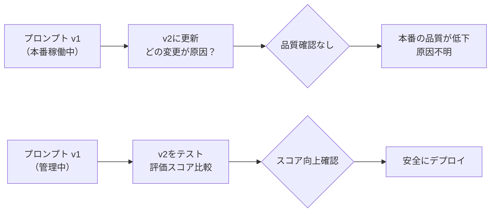
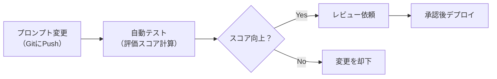

## 概要

プロンプトはコードと同様に変更・管理が必要なアーティファクトです。バージョン管理・テスト・デプロイの仕組みを整えることで、プロンプトの品質を継続的に向上させられます。このレッスンではGit・ファイルベース・データベースを使ったプロンプト管理の実践パターンを学びます。

## 本文

### なぜプロンプトのバージョン管理が必要か



管理なしの問題：
- 変更理由が不明になる
- 改悪したとき元に戻せない
- チームで最新版を共有できない
- A/Bテストができない

### ファイルベースの管理（Git）

最もシンプルで実践的な方法：

```
prompts/
  customer_support/
    v1.0.0.txt        # 初版
    v1.1.0.txt        # 改善版
    v2.0.0.txt        # 大幅改定
    current -> v2.0.0.txt  # 現在のバージョン
  code_review/
    v1.0.0.txt
```

**バージョン番号の規則（SemVer風）：**

```
v{major}.{minor}.{patch}
- major: 役割・目的の根本的な変更
- minor: 追加・改善（後方互換）
- patch: 軽微な修正・言い回しの調整
```

### データベース管理（本番向け）

```python
from datetime import datetime
from dataclasses import dataclass
from typing import Optional

@dataclass
class PromptVersion:
    id: str
    name: str           # プロンプト名（例: customer_support）
    version: str        # v1.0.0
    content: str        # プロンプト本文
    author: str
    description: str    # 変更内容の説明
    is_active: bool     # 本番フラグ
    eval_score: Optional[float]  # 評価スコア
    created_at: datetime
```

### プロンプトのCI/CDパイプライン



## ハンズオン

ファイルベースのプロンプト管理システムを実装します。

### ステップ1：プロンプトリポジトリ

```python
import json
import hashlib
from pathlib import Path
from datetime import datetime
from dataclasses import dataclass, asdict
from typing import Optional

@dataclass
class PromptRecord:
    name: str
    version: str
    content: str
    description: str
    author: str
    eval_score: Optional[float] = None
    is_active: bool = False
    created_at: str = ""

    def __post_init__(self):
        if not self.created_at:
            self.created_at = datetime.now().isoformat()

    @property
    def hash(self) -> str:
        return hashlib.md5(self.content.encode()).hexdigest()[:8]


class PromptRepository:
    """ファイルベースのプロンプト管理"""

    def __init__(self, base_dir: str = "prompts"):
        self.base = Path(base_dir)
        self.base.mkdir(exist_ok=True)

    def save(self, record: PromptRecord) -> Path:
        prompt_dir = self.base / record.name
        prompt_dir.mkdir(exist_ok=True)

        # プロンプト本文
        content_file = prompt_dir / f"{record.version}.txt"
        content_file.write_text(record.content, encoding="utf-8")

        # メタデータ
        meta_file = prompt_dir / f"{record.version}.json"
        meta = {k: v for k, v in asdict(record).items() if k != "content"}
        meta["hash"] = record.hash
        meta_file.write_text(json.dumps(meta, ensure_ascii=False, indent=2))

        # アクティブバージョンの更新
        if record.is_active:
            self._set_active(record.name, record.version)

        return content_file

    def load(self, name: str, version: str = "active") -> PromptRecord:
        prompt_dir = self.base / name
        if version == "active":
            active_file = prompt_dir / "active.txt"
            version = active_file.read_text().strip()

        content = (prompt_dir / f"{version}.txt").read_text(encoding="utf-8")
        meta = json.loads((prompt_dir / f"{version}.json").read_text())
        return PromptRecord(content=content, **{k: v for k, v in meta.items()
                                                if k in PromptRecord.__dataclass_fields__})

    def list_versions(self, name: str) -> list[str]:
        prompt_dir = self.base / name
        if not prompt_dir.exists():
            return []
        return sorted([f.stem for f in prompt_dir.glob("v*.txt")])

    def _set_active(self, name: str, version: str):
        (self.base / name / "active.txt").write_text(version)

    def rollback(self, name: str, version: str):
        """特定バージョンをアクティブに設定"""
        self._set_active(name, version)
        print(f"{name} を {version} にロールバックしました")
```

### ステップ2：評価付きデプロイフロー

```python
import anthropic

client = anthropic.Anthropic()

def evaluate_prompt(
    prompt_content: str,
    test_cases: list[dict],
    judge_criteria: str
) -> float:
    """テストケースでプロンプトを評価し0-1のスコアを返す"""
    scores = []

    for tc in test_cases:
        # プロンプトを実行
        response = client.messages.create(
            model="claude-opus-4-5",
            max_tokens=512,
            messages=[{
                "role": "user",
                "content": prompt_content.replace("{input}", tc["input"])
            }]
        )
        output = response.content[0].text

        # LLM-as-Judgeで評価
        judge_response = client.messages.create(
            model="claude-opus-4-5",
            max_tokens=100,
            messages=[{
                "role": "user",
                "content": f"""評価基準：{judge_criteria}

入力：{tc['input']}
期待：{tc['expected']}
実際：{output}

0〜10の整数で評価してください。数字のみ返してください。"""
            }]
        )

        try:
            score = int(judge_response.content[0].text.strip())
            scores.append(min(10, max(0, score)) / 10)
        except ValueError:
            scores.append(0.5)

    return sum(scores) / len(scores)


def safe_deploy(
    repo: PromptRepository,
    name: str,
    new_version: str,
    test_cases: list[dict],
    min_score: float = 0.7
) -> bool:
    """評価スコアが閾値を超えた場合のみデプロイ"""
    record = repo.load(name, new_version)
    score = evaluate_prompt(
        record.content,
        test_cases,
        judge_criteria="回答が正確で、指定された形式に従っているか"
    )

    print(f"評価スコア: {score:.2f} (閾値: {min_score})")

    if score >= min_score:
        repo._set_active(name, new_version)
        print(f"デプロイ成功: {name} -> {new_version}")
        return True
    else:
        print(f"デプロイ却下: スコアが閾値以下です")
        return False
```

### 完成コード

```python
import json
import hashlib
from pathlib import Path
from datetime import datetime
from dataclasses import dataclass, asdict
from typing import Optional
import anthropic

client = anthropic.Anthropic()

@dataclass
class PromptRecord:
    name: str
    version: str
    content: str
    description: str
    author: str = "unknown"
    eval_score: Optional[float] = None
    is_active: bool = False
    created_at: str = ""

    def __post_init__(self):
        if not self.created_at:
            self.created_at = datetime.now().isoformat()


class PromptRepository:
    def __init__(self, base_dir: str = "prompts"):
        self.base = Path(base_dir)
        self.base.mkdir(exist_ok=True)

    def save(self, record: PromptRecord) -> None:
        d = self.base / record.name
        d.mkdir(exist_ok=True)
        (d / f"{record.version}.txt").write_text(record.content, encoding="utf-8")
        meta = {k: v for k, v in asdict(record).items() if k != "content"}
        (d / f"{record.version}.json").write_text(
            json.dumps(meta, ensure_ascii=False, indent=2)
        )
        if record.is_active:
            (d / "active.txt").write_text(record.version)

    def load(self, name: str, version: str = "active") -> PromptRecord:
        d = self.base / name
        if version == "active":
            version = (d / "active.txt").read_text().strip()
        content = (d / f"{version}.txt").read_text(encoding="utf-8")
        meta = json.loads((d / f"{version}.json").read_text())
        return PromptRecord(content=content, **{
            k: v for k, v in meta.items()
            if k in PromptRecord.__dataclass_fields__ and k != "content"
        })

    def rollback(self, name: str, version: str) -> None:
        (self.base / name / "active.txt").write_text(version)
        print(f"Rolled back {name} to {version}")


if __name__ == "__main__":
    repo = PromptRepository("my_prompts")

    # バージョン1を保存・デプロイ
    v1 = PromptRecord(
        name="classifier",
        version="v1.0.0",
        content="以下のテキストをカテゴリに分類してください：{input}",
        description="初版",
        is_active=True
    )
    repo.save(v1)

    # バージョン2を保存（未デプロイ）
    v2 = PromptRecord(
        name="classifier",
        version="v2.0.0",
        content="""以下のテキストをカテゴリに分類してください。
カテゴリ：バグ/機能追加/改善/質問
JSONで返してください：{{"category": "..."}}

テキスト：{input}""",
        description="JSON出力形式に変更",
    )
    repo.save(v2)

    # アクティブバージョンを確認
    active = repo.load("classifier")
    print(f"アクティブ: {active.version}")
    print(f"内容: {active.content[:50]}...")
```

## クイズ

<!-- QUIZ:START -->
**Q1. プロンプトのバージョン管理をすべき最も重要な理由はどれですか？**

- A) APIコストを削減するため
- B) 変更履歴を追跡し、問題時に安全にロールバックできるようにするため
- C) レスポンスを速くするため
- D) セキュリティを向上させるため

**正解: B**
**解説:** バージョン管理の主な目的は変更履歴の追跡とロールバック能力です。品質が低下した場合に前のバージョンへ戻せることが重要です。

**Q2. プロンプトのSemVer的なmajorバージョンを上げるべき場合はどれですか？**

- A) 軽微な言い回しの修正
- B) 説明の追加
- C) 役割・目的の根本的な変更
- D) スペルミスの修正

**正解: C**
**解説:** majorバージョンは根本的な変更（役割・目的・出力形式の大幅変更）時に上げます。軽微な修正はpatch、後方互換の改善はminorを上げます。

**Q3. 「安全デプロイ」（safe deploy）の仕組みとして正しいものはどれですか？**

- A) 手動でコードを確認してからデプロイする
- B) 評価スコアが閾値を超えた場合のみ新バージョンをアクティブにする
- C) チームメンバー全員の承認を得る
- D) 本番環境でのみテストする

**正解: B**
**解説:** 安全デプロイでは新バージョンをテストケースで自動評価し、スコアが閾値（例：0.7以上）を超えた場合のみ本番反映します。これにより改悪デプロイを防げます。
<!-- QUIZ:END -->

## まとめ

- プロンプトはコードと同様にバージョン管理が必要
- ファイルベース（Git）が最もシンプルで実践的
- SemVer風のバージョン番号で変更の大きさを表現
- 評価スコア付きの安全デプロイで改悪を防ぐ
- PromptRepositoryパターンで管理・ロールバックを体系化

## 次のレッスン

Chapter 2では「API活用」を学びます。最初のレッスンでは、Claude APIをはじめとしたLLM APIの基礎知識を学び、HTTPリクエスト・認証・エラーの仕組みを理解します。
