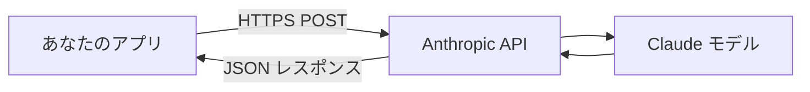

## 概要

LLM APIを活用するにはHTTPの基礎・認証・レート制限・エラーハンドリングの仕組みを理解する必要があります。このレッスンではAPIの基本概念を押さえ、Claude APIを安全・効率的に使うための土台を作ります。

## 本文

### LLM APIの全体像



### HTTPリクエストの基本

Claude APIはREST APIです。すべてのリクエストはHTTPS POSTで送られます。

```bash
curl https://api.anthropic.com/v1/messages \
  -H "x-api-key: $ANTHROPIC_API_KEY" \
  -H "anthropic-version: 2023-06-01" \
  -H "content-type: application/json" \
  -d '{
    "model": "claude-opus-4-5",
    "max_tokens": 1024,
    "messages": [{"role": "user", "content": "Hello"}]
  }'
```

### APIレスポンスの構造

```json
{
  "id": "msg_01XFDUDYJgAACzvnptvVoYEL",
  "type": "message",
  "role": "assistant",
  "content": [
    {
      "type": "text",
      "text": "Hello! How can I help you today?"
    }
  ],
  "model": "claude-opus-4-5",
  "stop_reason": "end_turn",
  "usage": {
    "input_tokens": 25,
    "output_tokens": 12
  }
}
```

### 主要フィールドの説明

| フィールド | 説明 |
|-----------|------|
| `id` | メッセージの一意ID（ログ・デバッグ用） |
| `content` | 生成されたテキスト（配列形式） |
| `stop_reason` | 生成終了理由（end_turn/max_tokens/stop_sequence） |
| `usage.input_tokens` | 入力トークン数（コスト計算用） |
| `usage.output_tokens` | 出力トークン数（コスト計算用） |

### 認証

APIキーはHTTPヘッダーで渡します：

```python
# 良い例：環境変数から読み込む
import os
api_key = os.environ.get("ANTHROPIC_API_KEY")

# 悪い例：コードに直書き（絶対禁止）
# api_key = "sk-ant-..."  # ← コミットしたら即漏洩
```

### レート制限

```
Tier 1（無料・低使用量）：
- 1分あたり: 50リクエスト
- 1日あたり: 100万トークン

Tier 2以上：制限緩和
```

レート制限エラー（429）の対処：
```python
import time

def call_with_retry(fn, max_retries=3):
    for i in range(max_retries):
        try:
            return fn()
        except anthropic.RateLimitError:
            wait = 2 ** i  # 指数バックオフ
            time.sleep(wait)
    raise Exception("最大リトライ回数超過")
```

## ハンズオン

最初のAPIコールを実装し、レスポンスを詳しく調べます。

### ステップ1：環境セットアップ

```bash
pip install anthropic python-dotenv
```

```
# .env ファイル
ANTHROPIC_API_KEY=sk-ant-xxxxxxxx
```

### ステップ2：最初のAPIコール

```python
from dotenv import load_dotenv
import anthropic
import os

load_dotenv()

client = anthropic.Anthropic(api_key=os.environ["ANTHROPIC_API_KEY"])

message = client.messages.create(
    model="claude-opus-4-5",
    max_tokens=1024,
    messages=[
        {"role": "user", "content": "Pythonの辞書型について1文で説明してください。"}
    ]
)

# レスポンスを詳しく確認
print(f"ID: {message.id}")
print(f"テキスト: {message.content[0].text}")
print(f"終了理由: {message.stop_reason}")
print(f"入力トークン: {message.usage.input_tokens}")
print(f"出力トークン: {message.usage.output_tokens}")
print(f"推定コスト: ${message.usage.input_tokens * 0.000003 + message.usage.output_tokens * 0.000015:.6f}")
```

### 完成コード

```python
import os
import anthropic
from dataclasses import dataclass

client = anthropic.Anthropic()

@dataclass
class APICallResult:
    text: str
    input_tokens: int
    output_tokens: int
    stop_reason: str
    message_id: str

    @property
    def total_cost_usd(self) -> float:
        # Claude claude-opus-4-5の料金（2024年時点）
        return self.input_tokens * 0.000003 + self.output_tokens * 0.000015

def simple_call(prompt: str, model: str = "claude-opus-4-5") -> APICallResult:
    message = client.messages.create(
        model=model,
        max_tokens=1024,
        messages=[{"role": "user", "content": prompt}]
    )
    return APICallResult(
        text=message.content[0].text,
        input_tokens=message.usage.input_tokens,
        output_tokens=message.usage.output_tokens,
        stop_reason=message.stop_reason,
        message_id=message.id,
    )

if __name__ == "__main__":
    result = simple_call("Pythonの辞書型について1文で説明してください。")
    print(f"回答: {result.text}")
    print(f"トークン: 入力{result.input_tokens} / 出力{result.output_tokens}")
    print(f"コスト: ${result.total_cost_usd:.6f}")
```

## クイズ

<!-- QUIZ:START -->
**Q1. Claude APIのリクエストはどのHTTPメソッドを使いますか？**

- A) GET
- B) PUT
- C) POST
- D) DELETE

**正解: C**
**解説:** Claude APIのMessages APIエンドポイントはHTTPS POSTを使用します。テキスト生成リクエストはすべてPOSTで送信します。

**Q2. APIキーの安全な管理方法として正しいものはどれですか？**

- A) ソースコードに直接記述する
- B) 環境変数またはシークレット管理サービスから読み込む
- C) GitHubにpublicリポジトリでコミットする
- D) ログファイルに記録する

**正解: B**
**解説:** APIキーはソースコードに直書きすると漏洩リスクがあります。環境変数（.envファイル）やAWS Secrets Manager等のシークレット管理サービスから読み込むのが正しい方法です。

**Q3. APIレスポンスの`stop_reason`が`max_tokens`の場合、何を意味しますか？**

- A) 生成が正常に完了した
- B) エラーが発生した
- C) 指定したmax_tokensに達して生成が打ち切られた
- D) ユーザーがキャンセルした

**正解: C**
**解説:** `stop_reason: "max_tokens"`は、指定したmax_tokensの上限に達して生成が途中で打ち切られたことを意味します。このとき出力が不完全な可能性があるため、より大きなmax_tokensを設定するか、対処が必要です。
<!-- QUIZ:END -->

## まとめ

- Claude APIはHTTPS POSTのREST APIで、JSONでリクエスト/レスポンスをやり取りする
- APIキーは環境変数で管理し、コードに直書きしない
- `usage`フィールドでトークン数とコストを追跡できる
- `stop_reason`で生成が正常終了したか確認する

## 次のレッスン

次のレッスンでは、Claude APIの実際のセットアップ手順（インストール・認証・最初のコール）を学び、開発環境を整えます。
