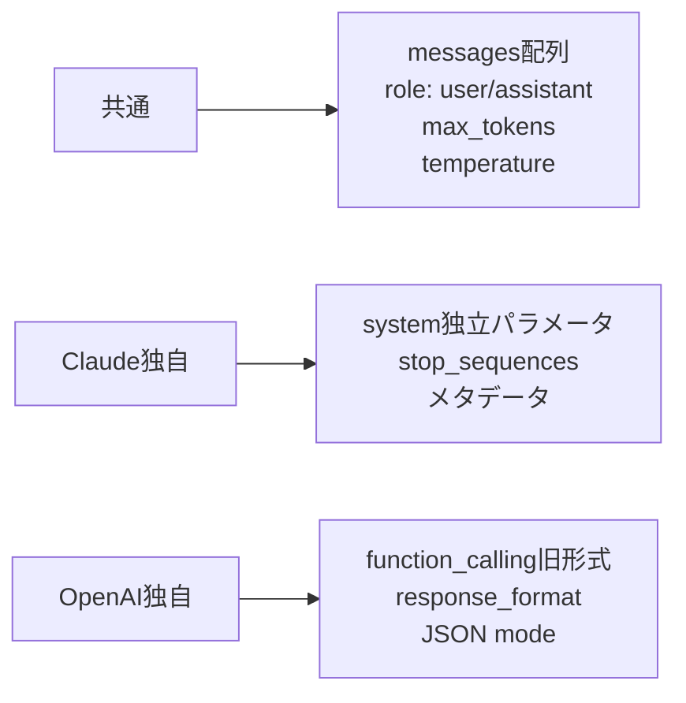

## 概要

Claude APIとOpenAI APIはどちらも広く使われていますが、インターフェースに違いがあります。両APIの共通点・相違点を理解し、プロバイダーを切り替えられる抽象化レイヤーの設計方法を学びます。

## 本文

### APIインターフェースの比較

#### リクエスト形式

| 項目 | Claude (Anthropic) | OpenAI |
|-----|-------------------|--------|
| エンドポイント | `/v1/messages` | `/v1/chat/completions` |
| Systemプロンプト | `system`パラメータ（独立） | `messages`配列の`system`ロール |
| コンテンツ | `content`配列 | `content`文字列またはコンテンツ配列 |
| max tokens | `max_tokens` | `max_tokens`（同じ） |

#### Claude形式

```python
# Claude
message = anthropic_client.messages.create(
    model="claude-opus-4-5",
    max_tokens=1024,
    system="あなたはアシスタントです",  # Systemは独立
    messages=[
        {"role": "user", "content": "こんにちは"}
    ]
)
text = message.content[0].text  # コンテンツはリスト
```

#### OpenAI形式

```python
# OpenAI
response = openai_client.chat.completions.create(
    model="gpt-4o",
    max_tokens=1024,
    messages=[
        {"role": "system", "content": "あなたはアシスタントです"},  # messagesに含む
        {"role": "user", "content": "こんにちは"}
    ]
)
text = response.choices[0].message.content  # choicesリストから取得
```

### 主な相違点



### Tool Use（Function Calling）の形式比較

**Claude:**
```python
tools = [
    {
        "name": "get_weather",
        "description": "指定都市の天気を取得",
        "input_schema": {
            "type": "object",
            "properties": {
                "city": {"type": "string", "description": "都市名"}
            },
            "required": ["city"]
        }
    }
]
```

**OpenAI:**
```python
tools = [
    {
        "type": "function",
        "function": {
            "name": "get_weather",
            "description": "指定都市の天気を取得",
            "parameters": {
                "type": "object",
                "properties": {
                    "city": {"type": "string"}
                }
            }
        }
    }
]
```

### 抽象化レイヤーの設計

```python
from abc import ABC, abstractmethod
from dataclasses import dataclass

@dataclass
class LLMResponse:
    text: str
    input_tokens: int
    output_tokens: int
    stop_reason: str

class LLMProvider(ABC):
    @abstractmethod
    def complete(
        self,
        messages: list[dict],
        system: str = "",
        max_tokens: int = 1024,
        temperature: float = 1.0,
    ) -> LLMResponse:
        pass
```

## ハンズオン

マルチプロバイダー対応のLLMクライアントを実装します。

### ステップ1：プロバイダー実装

```python
import anthropic
from openai import OpenAI
from abc import ABC, abstractmethod
from dataclasses import dataclass

@dataclass
class LLMResponse:
    text: str
    input_tokens: int
    output_tokens: int
    model: str

class BaseLLM(ABC):
    @abstractmethod
    def complete(self, messages: list[dict], system: str = "", **kwargs) -> LLMResponse:
        pass

class ClaudeLLM(BaseLLM):
    def __init__(self, model: str = "claude-opus-4-5"):
        self.client = anthropic.Anthropic()
        self.model = model

    def complete(self, messages: list[dict], system: str = "", **kwargs) -> LLMResponse:
        response = self.client.messages.create(
            model=self.model,
            max_tokens=kwargs.get("max_tokens", 1024),
            system=system,
            messages=messages,
        )
        return LLMResponse(
            text=response.content[0].text,
            input_tokens=response.usage.input_tokens,
            output_tokens=response.usage.output_tokens,
            model=self.model,
        )

class OpenAILLM(BaseLLM):
    def __init__(self, model: str = "gpt-4o"):
        self.client = OpenAI()
        self.model = model

    def complete(self, messages: list[dict], system: str = "", **kwargs) -> LLMResponse:
        all_messages = []
        if system:
            all_messages.append({"role": "system", "content": system})
        all_messages.extend(messages)

        response = self.client.chat.completions.create(
            model=self.model,
            max_tokens=kwargs.get("max_tokens", 1024),
            messages=all_messages,
        )
        return LLMResponse(
            text=response.choices[0].message.content,
            input_tokens=response.usage.prompt_tokens,
            output_tokens=response.usage.completion_tokens,
            model=self.model,
        )
```

### 完成コード

```python
import os
import anthropic
from dataclasses import dataclass
from abc import ABC, abstractmethod
from typing import Literal

@dataclass
class LLMResponse:
    text: str
    input_tokens: int
    output_tokens: int
    model: str
    provider: str

    @property
    def total_tokens(self) -> int:
        return self.input_tokens + self.output_tokens


class BaseLLM(ABC):
    provider_name: str = ""

    @abstractmethod
    def complete(
        self,
        messages: list[dict],
        system: str = "",
        max_tokens: int = 1024,
        temperature: float = 1.0,
    ) -> LLMResponse:
        pass


class ClaudeLLM(BaseLLM):
    provider_name = "anthropic"

    def __init__(self, model: str = "claude-opus-4-5"):
        self.client = anthropic.Anthropic()
        self.model = model

    def complete(self, messages, system="", max_tokens=1024, temperature=1.0) -> LLMResponse:
        msg = self.client.messages.create(
            model=self.model,
            max_tokens=max_tokens,
            temperature=temperature,
            system=system,
            messages=messages,
        )
        return LLMResponse(
            text=msg.content[0].text,
            input_tokens=msg.usage.input_tokens,
            output_tokens=msg.usage.output_tokens,
            model=self.model,
            provider=self.provider_name,
        )


def get_llm(
    provider: Literal["anthropic", "openai"] = "anthropic",
    model: str | None = None,
) -> BaseLLM:
    """プロバイダー名からLLMインスタンスを生成"""
    if provider == "anthropic":
        return ClaudeLLM(model=model or "claude-opus-4-5")
    raise ValueError(f"Unknown provider: {provider}")


if __name__ == "__main__":
    llm = get_llm("anthropic")
    result = llm.complete(
        messages=[{"role": "user", "content": "Pythonの型ヒントを一言で説明してください"}],
        system="簡潔に答えてください",
    )
    print(f"[{result.provider}/{result.model}] {result.text}")
    print(f"トークン: {result.total_tokens}")
```

## クイズ

<!-- QUIZ:START -->
**Q1. Claude APIとOpenAI APIのSystemプロンプトの扱い方の違いは何ですか？**

- A) 両方とも`messages`配列の`system`ロールとして渡す
- B) ClaudeはSystem専用の独立パラメータ、OpenAIはmessages配列のsystemロールとして渡す
- C) 両方とも独立した`system`パラメータで渡す
- D) OpenAIはSystemプロンプトをサポートしない

**正解: B**
**解説:** ClaudeのAPIでは`system`パラメータが独立して存在し、OpenAI APIではmessages配列の中に`role: "system"`として含めます。

**Q2. マルチプロバイダー対応の抽象化レイヤーを設計する主なメリットはどれですか？**

- A) APIコストが下がる
- B) プロバイダーをコードの変更なしに切り替えられ、特定プロバイダーへの依存を避けられる
- C) レスポンスが速くなる
- D) セキュリティが向上する

**正解: B**
**解説:** 抽象化レイヤーを設けることで、プロバイダーの変更（Claude→OpenAI等）時にビジネスロジックを変更せずに済みます。ベンダーロックインを防ぎ、フォールバック実装も容易になります。

**Q3. ClaudeとOpenAIでFunction Calling（Tool Use）の主な形式の違いは何ですか？**

- A) Claudeはtoolsパラメータ + input_schemaを使用、OpenAIはtools + function.parametersを使用
- B) 完全に同じ形式
- C) Claudeのみサポートする
- D) OpenAIのみサポートする

**正解: A**
**解説:** Claudeでは`input_schema`キーを使いJSONスキーマを定義します。OpenAIでは`function.parameters`キーを使います。構造は似ていますが細部が異なります。
<!-- QUIZ:END -->

## まとめ

- ClaudeとOpenAIはmessages形式が似ているが、Systemプロンプトの渡し方・コンテンツ取得方法が異なる
- 抽象化レイヤー（BaseLLM）でプロバイダーを切り替えられる設計が望ましい
- Tool Useの定義形式も微妙に異なるため、プロバイダー別の実装が必要
- LLMResponseのような共通のデータクラスでレスポンスを正規化する

## 次のレッスン

次のレッスンでは、長文生成やリアルタイム表示に不可欠な「ストリーミングレスポンス」の実装方法を学びます。
