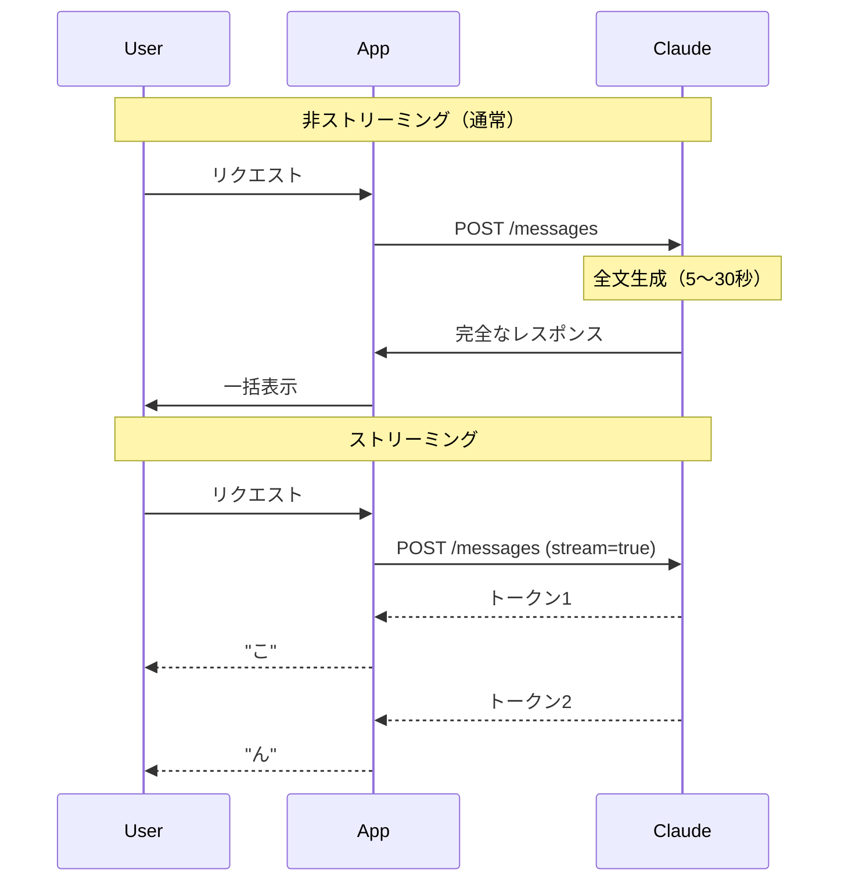

## 概要

ストリーミングはLLMの出力をトークンが生成されるたびにリアルタイムで受け取る機能です。UXの大幅改善・早期エラー検知・長文生成のタイムアウト回避に不可欠です。Python/TypeScriptでのストリーミング実装を学びます。

## 本文

### なぜストリーミングが必要か



### Server-Sent Events（SSE）

ストリーミングはHTTPのSSEで実装されています：

```
data: {"type":"content_block_delta","delta":{"type":"text_delta","text":"こ"}}
data: {"type":"content_block_delta","delta":{"type":"text_delta","text":"ん"}}
data: {"type":"message_delta","delta":{"stop_reason":"end_turn"}}
data: [DONE]
```

### Pythonでのストリーミング実装

#### 基本パターン

```python
import anthropic

client = anthropic.Anthropic()

with client.messages.stream(
    model="claude-opus-4-5",
    max_tokens=1024,
    messages=[{"role": "user", "content": "Pythonについて詳しく説明してください"}]
) as stream:
    for text in stream.text_stream:
        print(text, end="", flush=True)
print()  # 改行
```

#### イベント詳細を取得

```python
with client.messages.stream(
    model="claude-opus-4-5",
    max_tokens=1024,
    messages=[{"role": "user", "content": "説明してください"}]
) as stream:
    for event in stream:
        if event.type == "content_block_delta":
            print(event.delta.text, end="", flush=True)
        elif event.type == "message_delta":
            print(f"\n[Stop: {event.delta.stop_reason}]")
        elif event.type == "message_stop":
            final = stream.get_final_message()
            print(f"Total tokens: {final.usage.input_tokens + final.usage.output_tokens}")
```

### ストリーミングのイベント種別

| イベント | 説明 |
|---------|------|
| `message_start` | メッセージ生成開始（ID・使用量初期値） |
| `content_block_start` | コンテンツブロック開始 |
| `content_block_delta` | テキストの差分（メインの出力） |
| `content_block_stop` | コンテンツブロック終了 |
| `message_delta` | メッセージの更新（stop_reason等） |
| `message_stop` | 全生成完了 |

### TypeScriptでのストリーミング

```typescript
import Anthropic from "@anthropic-ai/sdk";

const client = new Anthropic();

async function streamChat(prompt: string): Promise<string> {
  let fullText = "";

  const stream = client.messages.stream({
    model: "claude-opus-4-5",
    max_tokens: 1024,
    messages: [{ role: "user", content: prompt }],
  });

  for await (const event of stream) {
    if (
      event.type === "content_block_delta" &&
      event.delta.type === "text_delta"
    ) {
      process.stdout.write(event.delta.text);
      fullText += event.delta.text;
    }
  }

  console.log(); // 改行
  return fullText;
}
```

## ハンズオン

Next.jsのAPIルートでストリーミングを実装します。

### ステップ1：バックエンドストリーミングAPI

```python
# FastAPIでのストリーミング実装
from fastapi import FastAPI
from fastapi.responses import StreamingResponse
import anthropic

app = FastAPI()
client = anthropic.Anthropic()

@app.post("/chat/stream")
async def chat_stream(request: dict):
    def generate():
        with client.messages.stream(
            model="claude-opus-4-5",
            max_tokens=1024,
            messages=[{"role": "user", "content": request["message"]}]
        ) as stream:
            for text in stream.text_stream:
                # SSE形式で送信
                yield f"data: {text}\n\n"
        yield "data: [DONE]\n\n"

    return StreamingResponse(
        generate(),
        media_type="text/event-stream",
        headers={"Cache-Control": "no-cache"}
    )
```

### ステップ2：フロントエンドでの受信

```typescript
// React コンポーネントでのストリーム受信
async function streamFromAPI(message: string, onChunk: (text: string) => void) {
  const response = await fetch("/chat/stream", {
    method: "POST",
    headers: { "Content-Type": "application/json" },
    body: JSON.stringify({ message }),
  });

  const reader = response.body!.getReader();
  const decoder = new TextDecoder();

  while (true) {
    const { value, done } = await reader.read();
    if (done) break;

    const chunk = decoder.decode(value);
    const lines = chunk.split("\n\n");

    for (const line of lines) {
      if (line.startsWith("data: ") && !line.includes("[DONE]")) {
        onChunk(line.slice(6)); // "data: " を除去
      }
    }
  }
}
```

### 完成コード

```python
import anthropic
from typing import Generator, Iterator

client = anthropic.Anthropic()


def stream_to_console(prompt: str, system: str = "") -> str:
    """ストリーミングでコンソールに出力し、完全なテキストを返す"""
    full_text = ""

    kwargs = {
        "model": "claude-opus-4-5",
        "max_tokens": 2048,
        "messages": [{"role": "user", "content": prompt}],
    }
    if system:
        kwargs["system"] = system

    with client.messages.stream(**kwargs) as stream:
        for text in stream.text_stream:
            print(text, end="", flush=True)
            full_text += text

    print()  # 改行
    return full_text


def stream_to_callback(
    prompt: str,
    on_token: callable,
    on_complete: callable = None,
    system: str = "",
) -> None:
    """コールバック関数でストリームを処理"""
    kwargs = {
        "model": "claude-opus-4-5",
        "max_tokens": 2048,
        "messages": [{"role": "user", "content": prompt}],
    }
    if system:
        kwargs["system"] = system

    with client.messages.stream(**kwargs) as stream:
        for text in stream.text_stream:
            on_token(text)

        if on_complete:
            final = stream.get_final_message()
            on_complete(final)


if __name__ == "__main__":
    print("=== コンソール出力 ===")
    stream_to_console("Pythonのデコレータを3段階で説明してください")

    print("\n=== コールバック ===")
    tokens = []
    stream_to_callback(
        "TypeScriptのジェネリクスを例を使って説明してください",
        on_token=lambda t: tokens.append(t),
        on_complete=lambda m: print(f"\n完了: {m.usage.output_tokens}トークン"),
    )
    print(f"受信トークン数: {len(tokens)}")
```

## クイズ

<!-- QUIZ:START -->
**Q1. ストリーミングを使う最も重要な理由はどれですか？**

- A) APIコストが下がる
- B) 生成中のテキストをリアルタイムで表示しUXを向上させる
- C) セキュリティが向上する
- D) モデルの精度が上がる

**正解: B**
**解説:** ストリーミングの主な目的はUXの向上です。10秒後に一括表示されるより、トークンが生成されるたびに表示される方が体感レイテンシが大幅に改善されます。

**Q2. ストリーミングで`content_block_delta`イベントに含まれるのは何ですか？**

- A) 完全なレスポンスのテキスト
- B) 新たに生成された差分テキスト（トークン）
- C) エラー情報
- D) トークン使用量

**正解: B**
**解説:** `content_block_delta`イベントには`delta.text`として新たに生成されたテキストの差分（通常1〜数トークン）が含まれます。これを順に連結することで完全なテキストが得られます。

**Q3. `stream.get_final_message()`で取得できる情報はどれですか？**

- A) ストリームの最初のトークン
- B) ストリーム完了後の最終的なメッセージオブジェクト（使用量・stop_reason含む）
- C) エラーメッセージ
- D) APIキー

**正解: B**
**解説:** `get_final_message()`はストリーム完了後に最終的なメッセージオブジェクトを返します。トークン使用量やstop_reasonなど、非ストリーミング時のレスポンスと同様の情報が含まれます。
<!-- QUIZ:END -->

## まとめ

- ストリーミングで生成中のテキストをリアルタイム表示できUXが大幅向上する
- `client.messages.stream()`コンテキストマネージャーで簡単に実装できる
- `stream.text_stream`で差分テキストを逐次受け取れる
- コールバックパターンでWebSocketやSSEと組み合わせられる

## 次のレッスン

次のレッスンでは、AIに外部ツール（関数）を呼び出させる「Tool Use（Function Calling）」を学び、AIを現実世界と接続します。
