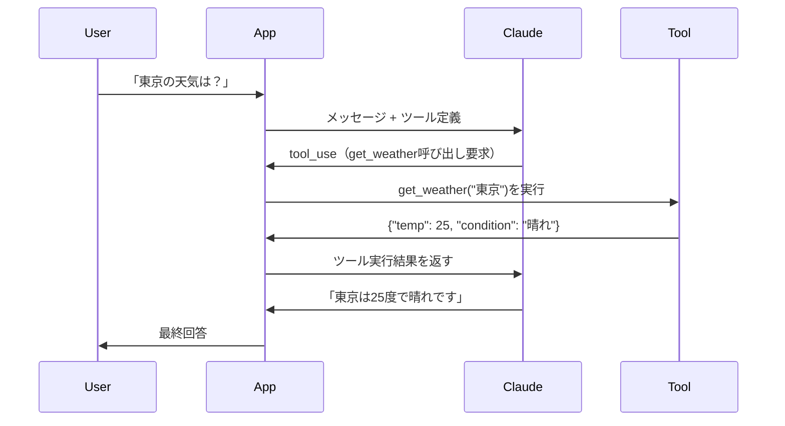

## 概要

Tool Use（Function Calling）はAIに外部ツール（関数・API・データベース）を呼び出させる機能です。天気情報取得・計算・データベース検索など、AIだけではできないことを実現します。このレッスンでTool Useの完全な実装パターンを習得します。

## 本文

### Tool Useの仕組み



### ツール定義の書き方

```python
tools = [
    {
        "name": "get_weather",
        "description": "指定された都市の現在の天気を取得します。旅行計画や服装の参考に使えます。",
        "input_schema": {
            "type": "object",
            "properties": {
                "city": {
                    "type": "string",
                    "description": "都市名（例: 東京、大阪、ニューヨーク）"
                },
                "unit": {
                    "type": "string",
                    "enum": ["celsius", "fahrenheit"],
                    "description": "温度単位"
                }
            },
            "required": ["city"]
        }
    }
]
```

**良いツール定義のポイント：**
- `description`は具体的・詳細に（AIがいつ使うかを判断するため）
- `input_schema`は正確なJSONスキーマで記述
- `required`で必須パラメータを明示

### Tool Useの実装パターン

```python
import anthropic
import json

client = anthropic.Anthropic()

def run_tool_use_loop(
    user_message: str,
    tools: list[dict],
    tool_handler: dict  # {"tool_name": callable}
) -> str:
    """Tool Useのメインループ"""
    messages = [{"role": "user", "content": user_message}]

    while True:
        response = client.messages.create(
            model="claude-opus-4-5",
            max_tokens=1024,
            tools=tools,
            messages=messages
        )

        # ツール呼び出しがなければ終了
        if response.stop_reason == "end_turn":
            return response.content[0].text

        # tool_useブロックを処理
        tool_results = []
        for block in response.content:
            if block.type == "tool_use":
                tool_fn = tool_handler.get(block.name)
                if tool_fn:
                    result = tool_fn(**block.input)
                    tool_results.append({
                        "type": "tool_result",
                        "tool_use_id": block.id,
                        "content": json.dumps(result, ensure_ascii=False)
                    })

        # アシスタントの返答とツール結果を履歴に追加
        messages.append({"role": "assistant", "content": response.content})
        messages.append({"role": "user", "content": tool_results})
```

### tool_choiceパラメータ

```python
# 自動選択（デフォルト）
tool_choice = {"type": "auto"}

# 特定ツールを強制使用
tool_choice = {"type": "tool", "name": "get_weather"}

# ツールを使わない
tool_choice = {"type": "none"}
```

## ハンズオン

計算・検索・データ取得ができるAIアシスタントを実装します。

### ステップ1：ツール関数の定義

```python
import math
import json
from datetime import datetime

# 実際のツール関数
def calculate(expression: str) -> dict:
    """数式を計算"""
    try:
        # 安全な評価（実務ではより厳密な制限が必要）
        allowed = {
            "__builtins__": {},
            "sqrt": math.sqrt,
            "sin": math.sin,
            "cos": math.cos,
            "pi": math.pi,
            "e": math.e,
        }
        result = eval(expression, allowed)
        return {"result": result, "expression": expression}
    except Exception as e:
        return {"error": str(e)}

def get_current_time(timezone: str = "Asia/Tokyo") -> dict:
    """現在時刻を取得"""
    now = datetime.now()
    return {
        "datetime": now.isoformat(),
        "date": now.strftime("%Y-%m-%d"),
        "time": now.strftime("%H:%M:%S"),
        "timezone": timezone
    }

def search_database(query: str, table: str) -> dict:
    """データベースを検索（モック）"""
    # 実際はSQLクエリ実行
    mock_data = {
        "products": [
            {"id": 1, "name": "商品A", "price": 1000},
            {"id": 2, "name": "商品B", "price": 2000},
        ]
    }
    return {"results": mock_data.get(table, []), "query": query}
```

### ステップ2：ツール定義とハンドラー

```python
TOOLS = [
    {
        "name": "calculate",
        "description": "数学の計算式を評価します。基本的な四則演算、sqrt、sin、cosが使えます。",
        "input_schema": {
            "type": "object",
            "properties": {
                "expression": {
                    "type": "string",
                    "description": "評価する数式（例: '2 * 3 + 1', 'sqrt(16)'）"
                }
            },
            "required": ["expression"]
        }
    },
    {
        "name": "get_current_time",
        "description": "現在の日時を取得します。",
        "input_schema": {
            "type": "object",
            "properties": {
                "timezone": {
                    "type": "string",
                    "description": "タイムゾーン（デフォルト: Asia/Tokyo）"
                }
            }
        }
    },
]

TOOL_HANDLERS = {
    "calculate": calculate,
    "get_current_time": get_current_time,
}
```

### 完成コード

```python
import anthropic
import json
import math
from datetime import datetime

client = anthropic.Anthropic()

# ツール関数
def calculate(expression: str) -> dict:
    try:
        safe_globals = {"__builtins__": {}, "sqrt": math.sqrt, "pi": math.pi}
        return {"result": eval(expression, safe_globals)}
    except Exception as e:
        return {"error": str(e)}

def get_current_time(**_) -> dict:
    now = datetime.now()
    return {"datetime": now.isoformat(), "date": now.strftime("%Y-%m-%d")}

TOOLS = [
    {
        "name": "calculate",
        "description": "数式を計算します（四則演算、sqrt、piが使えます）",
        "input_schema": {
            "type": "object",
            "properties": {
                "expression": {"type": "string", "description": "計算式"}
            },
            "required": ["expression"]
        }
    },
    {
        "name": "get_current_time",
        "description": "現在の日時を取得します",
        "input_schema": {"type": "object", "properties": {}}
    }
]

HANDLERS = {"calculate": calculate, "get_current_time": get_current_time}


def agent(user_message: str) -> str:
    messages = [{"role": "user", "content": user_message}]

    for _ in range(10):  # 無限ループ防止
        response = client.messages.create(
            model="claude-opus-4-5",
            max_tokens=1024,
            tools=TOOLS,
            messages=messages,
        )

        if response.stop_reason == "end_turn":
            for block in response.content:
                if hasattr(block, "text"):
                    return block.text

        # ツール呼び出し処理
        messages.append({"role": "assistant", "content": response.content})
        tool_results = []
        for block in response.content:
            if block.type == "tool_use":
                fn = HANDLERS.get(block.name)
                result = fn(**block.input) if fn else {"error": "unknown tool"}
                tool_results.append({
                    "type": "tool_result",
                    "tool_use_id": block.id,
                    "content": json.dumps(result, ensure_ascii=False),
                })

        messages.append({"role": "user", "content": tool_results})

    return "最大ループ回数に達しました"


if __name__ == "__main__":
    questions = [
        "sqrt(144)の結果は何ですか？",
        "今日の日付を教えてください",
        "円の面積を求める公式でr=5の場合の値を計算してください",
    ]
    for q in questions:
        print(f"Q: {q}")
        print(f"A: {agent(q)}\n")
```

## クイズ

<!-- QUIZ:START -->
**Q1. Tool Useで`stop_reason: "tool_use"`を受け取った時、次にすべきことは何ですか？**

- A) 会話を終了する
- B) ツールを実行し、結果をtool_resultとしてAPIに返す
- C) エラーとして処理する
- D) 同じリクエストを再送する

**正解: B**
**解説:** `stop_reason: "tool_use"`はモデルがツール呼び出しを要求したことを示します。アプリケーション側でツールを実行し、結果を`tool_result`としてAPIに返すと、モデルが最終回答を生成します。

**Q2. ツール定義の`description`を詳細に書く主な理由は何ですか？**

- A) JSONを有効にするため
- B) モデルがどのツールをいつ使うかを判断する根拠になるため
- C) セキュリティのため
- D) コストを削減するため

**正解: B**
**解説:** モデルはユーザーの意図に最適なツールを`description`を読んで判断します。説明が詳細なほど、モデルが適切なタイミングで正しいツールを選択できます。

**Q3. Tool Useのループに最大反復回数制限を設ける理由は何ですか？**

- A) APIが遅くなるため
- B) モデルが無限にツール呼び出しを繰り返す可能性（無限ループ）を防ぐため
- C) コストを削減するため
- D) セキュリティのため

**正解: B**
**解説:** 稀に、モデルがツールの結果を元にさらにツールを呼び出し続け、無限ループに陥ることがあります。最大反復回数（例: 10回）を設定して防ぐことが重要です。
<!-- QUIZ:END -->

## まとめ

- Tool UseでAIに外部関数・APIを呼び出させて現実世界と接続できる
- ツール定義のdescriptionはモデルの判断根拠になるため詳細に書く
- tool_useレスポンス→ツール実行→tool_result返却のループで実装
- 無限ループ防止の最大反復回数制限を必ず設ける

## 次のレッスン

次のレッスンでは、画像をAIに入力して分析・説明・OCRを行う「Vision API」の実装を学びます。
