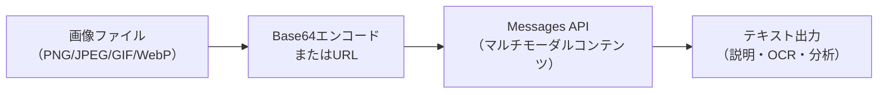

## 概要

Claude Vision APIを使うと、画像をAIに入力して分析・説明・OCR・図解の解釈が可能になります。Base64エンコードとURL参照の2つの入力方法、マルチモーダルプロンプトの設計方法を学びます。

## 本文

### Vision APIの概要



### 対応フォーマット

| フォーマット | MIME Type |
|------------|-----------|
| JPEG | image/jpeg |
| PNG | image/png |
| GIF（静止画として） | image/gif |
| WebP | image/webp |

**制限事項：**
- 1メッセージあたり最大20枚
- ファイルサイズは5MB以下（Base64の場合）

### 入力方法1：Base64エンコード

```python
import base64
import anthropic

client = anthropic.Anthropic()

def encode_image(image_path: str) -> tuple[str, str]:
    """画像をBase64エンコードしてMIMEタイプも返す"""
    import mimetypes
    mime_type, _ = mimetypes.guess_type(image_path)
    if not mime_type:
        mime_type = "image/jpeg"

    with open(image_path, "rb") as f:
        data = base64.standard_b64encode(f.read()).decode("utf-8")
    return data, mime_type

def analyze_image(image_path: str, prompt: str) -> str:
    data, mime_type = encode_image(image_path)

    message = client.messages.create(
        model="claude-opus-4-5",
        max_tokens=1024,
        messages=[
            {
                "role": "user",
                "content": [
                    {
                        "type": "image",
                        "source": {
                            "type": "base64",
                            "media_type": mime_type,
                            "data": data,
                        }
                    },
                    {"type": "text", "text": prompt}
                ]
            }
        ]
    )
    return message.content[0].text
```

### 入力方法2：URLで参照

```python
def analyze_image_url(image_url: str, prompt: str) -> str:
    message = client.messages.create(
        model="claude-opus-4-5",
        max_tokens=1024,
        messages=[
            {
                "role": "user",
                "content": [
                    {
                        "type": "image",
                        "source": {
                            "type": "url",
                            "url": image_url,
                        }
                    },
                    {"type": "text", "text": prompt}
                ]
            }
        ]
    )
    return message.content[0].text
```

### 実務的なユースケース

| ユースケース | プロンプト例 |
|-------------|-------------|
| OCR | 「画像内のすべてのテキストを抽出してください」 |
| 図解説明 | 「このアーキテクチャ図を説明してください」 |
| スクリーンショット分析 | 「このエラー画面の問題を特定してください」 |
| 商品認識 | 「この商品の特徴を箇条書きで説明してください」 |
| 複数画像比較 | 「2つの画像の違いを説明してください」 |

### 複数画像の入力

```python
def compare_images(image_paths: list[str], prompt: str) -> str:
    content = []
    for path in image_paths:
        data, mime = encode_image(path)
        content.append({
            "type": "image",
            "source": {"type": "base64", "media_type": mime, "data": data}
        })
    content.append({"type": "text", "text": prompt})

    message = client.messages.create(
        model="claude-opus-4-5",
        max_tokens=2048,
        messages=[{"role": "user", "content": content}]
    )
    return message.content[0].text
```

## ハンズオン

スクリーンショット分析ツールを実装します。

### 完成コード

```python
import base64
import mimetypes
from pathlib import Path
import anthropic
from dataclasses import dataclass

client = anthropic.Anthropic()

@dataclass
class ImageAnalysisResult:
    description: str
    extracted_text: str
    detected_issues: list[str]


def encode_image(path: str) -> tuple[str, str]:
    mime_type, _ = mimetypes.guess_type(path)
    mime_type = mime_type or "image/jpeg"
    with open(path, "rb") as f:
        return base64.standard_b64encode(f.read()).decode("utf-8"), mime_type


def build_image_content(path: str) -> dict:
    data, mime = encode_image(path)
    return {
        "type": "image",
        "source": {"type": "base64", "media_type": mime, "data": data}
    }


def analyze_screenshot(image_path: str) -> ImageAnalysisResult:
    """スクリーンショットを分析してエラーや問題を抽出"""
    content = [
        build_image_content(image_path),
        {
            "type": "text",
            "text": """このスクリーンショットを分析してください。

以下のJSON形式で返してください：
{
  "description": "画面の全体的な説明（1〜2文）",
  "extracted_text": "画面内の重要なテキスト（エラーメッセージ含む）",
  "detected_issues": ["問題点1", "問題点2"]
}

JSONのみ返してください。"""
        }
    ]

    message = client.messages.create(
        model="claude-opus-4-5",
        max_tokens=1024,
        messages=[{"role": "user", "content": content}]
    )

    import json
    text = message.content[0].text.strip()
    if "```json" in text:
        text = text.split("```json")[1].split("```")[0]
    data = json.loads(text)

    return ImageAnalysisResult(
        description=data.get("description", ""),
        extracted_text=data.get("extracted_text", ""),
        detected_issues=data.get("detected_issues", []),
    )


def ocr_image(image_path: str) -> str:
    """画像からテキストを抽出（OCR）"""
    content = [
        build_image_content(image_path),
        {"type": "text", "text": "この画像内のすべてのテキストを正確に抽出してください。改行や段落構造を保持してください。テキストのみ返してください。"}
    ]

    message = client.messages.create(
        model="claude-opus-4-5",
        max_tokens=2048,
        messages=[{"role": "user", "content": content}]
    )
    return message.content[0].text


if __name__ == "__main__":
    # テスト用：URLから画像を分析
    url = "https://upload.wikimedia.org/wikipedia/commons/thumb/4/47/PNG_transparency_demonstration_1.png/280px-PNG_transparency_demonstration_1.png"

    message = client.messages.create(
        model="claude-opus-4-5",
        max_tokens=512,
        messages=[{
            "role": "user",
            "content": [
                {"type": "image", "source": {"type": "url", "url": url}},
                {"type": "text", "text": "この画像を1文で説明してください"}
            ]
        }]
    )
    print(message.content[0].text)
```

## クイズ

<!-- QUIZ:START -->
**Q1. Claude Vision APIで画像を入力する方法として正しくないものはどれですか？**

- A) Base64エンコードで直接埋め込む
- B) URLで参照する
- C) ファイルパスをそのまま渡す
- D) どちらも正しい方法である

**正解: C**
**解説:** ファイルパスをそのままAPIに渡すことはできません。Base64エンコードして埋め込むか、公開URLで参照する必要があります。

**Q2. Vision APIで1メッセージに含められる画像の最大枚数はいくつですか？**

- A) 1枚
- B) 5枚
- C) 20枚
- D) 制限なし

**正解: C**
**解説:** Claude Vision APIでは1メッセージあたり最大20枚の画像を入力できます。

**Q3. Vision APIを使ったOCRの主なメリットは何ですか？**

- A) 従来のOCRより処理速度が速い
- B) 画像の文脈を理解した上でテキストを抽出でき、フォーマットや構造も保持できる
- C) コストが完全に無料
- D) オフラインで動作する

**正解: B**
**解説:** Vision AIは従来のOCRと異なり、画像全体の文脈（表・図・フォーム等）を理解した上でテキストを抽出します。表の構造や改行を保持した高品質なOCRが可能です。
<!-- QUIZ:END -->

## まとめ

- Vision APIでJPEG/PNG/GIF/WebPを最大20枚まで1メッセージに含められる
- Base64エンコードとURL参照の2方式がある
- OCR・図解説明・スクリーンショット分析・複数画像比較に有用
- マルチモーダルコンテンツはcontentリストに画像とテキストを混在させる

## 次のレッスン

次のレッスンでは、APIのエラーを適切に処理しリトライする「エラーハンドリングとリトライ」を学び、本番品質のAPI呼び出しを実装します。
