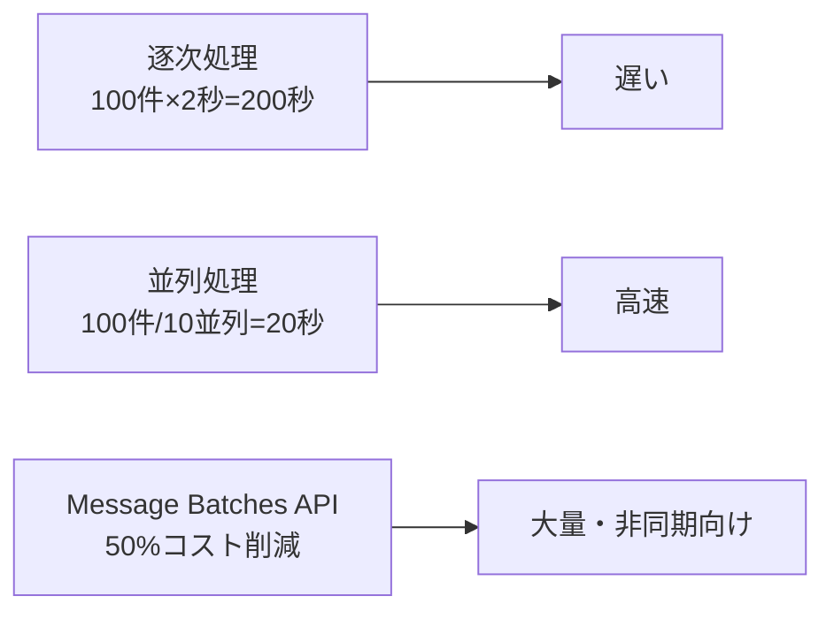

## 概要

大量のテキストを処理する際、逐次処理では時間がかかりすぎます。並列実行・バッチAPI・適切なレート制限制御で処理速度を大幅に向上させる方法を学びます。

## 本文

### 処理方式の比較



### asyncio による並列実行

```python
import asyncio
import anthropic
from typing import Callable

async def process_batch_async(
    items: list[str],
    process_fn: Callable,
    max_concurrent: int = 5
) -> list[str]:
    """セマフォで同時実行数を制限した並列処理"""
    semaphore = asyncio.Semaphore(max_concurrent)

    async def process_with_limit(item: str) -> str:
        async with semaphore:
            return await process_fn(item)

    tasks = [process_with_limit(item) for item in items]
    return await asyncio.gather(*tasks)
```

### 実践的な並列処理実装

```python
import asyncio
import anthropic
from typing import Any

# 非同期Anthropicクライアント
async_client = anthropic.AsyncAnthropic()

async def async_complete(
    prompt: str,
    model: str = "claude-haiku-3-5",
    max_tokens: int = 512
) -> str:
    message = await async_client.messages.create(
        model=model,
        max_tokens=max_tokens,
        messages=[{"role": "user", "content": prompt}]
    )
    return message.content[0].text

async def batch_translate(texts: list[str], target_lang: str = "英語") -> list[str]:
    """複数テキストを並列翻訳"""
    semaphore = asyncio.Semaphore(10)  # 最大10並列

    async def translate_one(text: str) -> str:
        async with semaphore:
            return await async_complete(
                f"{text}\n\n上記を{target_lang}に翻訳してください。翻訳のみ返してください。"
            )

    return await asyncio.gather(*[translate_one(t) for t in texts])

# 実行
texts = ["こんにちは", "ありがとう", "さようなら"]
results = asyncio.run(batch_translate(texts))
```

### Message Batches API（50%コスト削減）

大量処理には公式のBatch APIを使うと50%のコスト削減が可能：

```python
def create_batch(prompts: list[str]) -> str:
    """バッチジョブを作成してjob_idを返す"""
    requests = [
        {
            "custom_id": f"req_{i}",
            "params": {
                "model": "claude-opus-4-5",
                "max_tokens": 1024,
                "messages": [{"role": "user", "content": prompt}]
            }
        }
        for i, prompt in enumerate(prompts)
    ]

    batch = client.beta.messages.batches.create(requests=requests)
    return batch.id

def wait_for_batch(batch_id: str, poll_interval: int = 30) -> list[dict]:
    """バッチ完了を待って結果を返す"""
    import time
    while True:
        batch = client.beta.messages.batches.retrieve(batch_id)
        if batch.processing_status == "ended":
            break
        print(f"処理中... ({batch.request_counts.processing}件残り)")
        time.sleep(poll_interval)

    # 結果を取得
    results = []
    for result in client.beta.messages.batches.results(batch_id):
        if result.result.type == "succeeded":
            results.append({
                "id": result.custom_id,
                "text": result.result.message.content[0].text
            })
    return results
```

### レート制限対応の並列処理

```python
import asyncio
from dataclasses import dataclass
from collections import deque
from datetime import datetime

@dataclass
class RateLimiter:
    """トークンバケットによるレート制限"""
    requests_per_minute: int
    tokens_per_minute: int

    def __post_init__(self):
        self._request_times: deque = deque()
        self._token_count: int = 0

    async def acquire(self, tokens: int):
        """レート制限を守りながら実行許可を取得"""
        while True:
            now = datetime.now().timestamp()

            # 1分以上古いリクエストを削除
            while self._request_times and now - self._request_times[0] > 60:
                self._request_times.popleft()

            if (len(self._request_times) < self.requests_per_minute and
                    self._token_count + tokens < self.tokens_per_minute):
                self._request_times.append(now)
                self._token_count += tokens
                return

            await asyncio.sleep(0.1)
```

## ハンズオン

大規模テキスト処理パイプラインを実装します。

### 完成コード

```python
import asyncio
import anthropic
from dataclasses import dataclass, field
from typing import Callable, Any
import time

async_client = anthropic.AsyncAnthropic()

@dataclass
class BatchResult:
    index: int
    input: str
    output: str | None = None
    error: str | None = None
    duration_seconds: float = 0.0

    @property
    def success(self) -> bool:
        return self.output is not None


async def process_single(
    index: int,
    text: str,
    prompt_template: str,
    model: str,
    max_tokens: int,
    semaphore: asyncio.Semaphore,
    max_retries: int = 2,
) -> BatchResult:
    start = time.time()
    async with semaphore:
        for attempt in range(max_retries + 1):
            try:
                msg = await async_client.messages.create(
                    model=model,
                    max_tokens=max_tokens,
                    messages=[{
                        "role": "user",
                        "content": prompt_template.replace("{text}", text)
                    }]
                )
                return BatchResult(
                    index=index,
                    input=text,
                    output=msg.content[0].text,
                    duration_seconds=time.time() - start,
                )
            except anthropic.RateLimitError:
                if attempt < max_retries:
                    await asyncio.sleep(2 ** attempt)
                else:
                    return BatchResult(index=index, input=text, error="RateLimitError")
            except Exception as e:
                return BatchResult(index=index, input=text, error=str(e))


async def batch_process(
    texts: list[str],
    prompt_template: str,
    model: str = "claude-haiku-3-5",
    max_tokens: int = 512,
    max_concurrent: int = 10,
) -> list[BatchResult]:
    semaphore = asyncio.Semaphore(max_concurrent)

    tasks = [
        process_single(i, text, prompt_template, model, max_tokens, semaphore)
        for i, text in enumerate(texts)
    ]

    results = await asyncio.gather(*tasks)
    return sorted(results, key=lambda r: r.index)


def run_batch(
    texts: list[str],
    prompt_template: str,
    **kwargs
) -> list[BatchResult]:
    """同期インターフェース"""
    return asyncio.run(batch_process(texts, prompt_template, **kwargs))


if __name__ == "__main__":
    sample_texts = [
        "今日は良い天気です",
        "プロジェクトの締め切りが近づいています",
        "新しい機能の開発が完了しました",
    ]

    print("並列感情分析を実行中...")
    results = run_batch(
        texts=sample_texts,
        prompt_template="以下のテキストの感情を「ポジティブ/ネガティブ/ニュートラル」で分類してください:\n\n{text}\n\n分類のみ返してください。",
        max_concurrent=5,
    )

    success_count = sum(1 for r in results if r.success)
    print(f"\n結果: {success_count}/{len(results)}件成功")
    for r in results:
        if r.success:
            print(f"  [{r.index}] {r.input[:20]}... → {r.output}")
        else:
            print(f"  [{r.index}] エラー: {r.error}")
```

## クイズ

<!-- QUIZ:START -->
**Q1. asyncio.Semaphoreを使う主な理由は何ですか？**

- A) コードを非同期にするため
- B) 同時実行数を制限してレート制限に引っかからないようにするため
- C) エラーを防ぐため
- D) メモリを節約するため

**正解: B**
**解説:** Semaphoreは指定した数のコルーチンのみが同時に実行されるよう制限します。APIのレート制限（毎分X回等）に対応するため、同時リクエスト数を制御することが重要です。

**Q2. Message Batches APIの最大のメリットは何ですか？**

- A) リアルタイムに結果が返ってくる
- B) 非同期バッチ処理で通常の約50%のコストで大量処理できる
- C) 無制限のリクエストが可能
- D) 応答速度が速い

**正解: B**
**解説:** Message Batches APIは非同期で処理されるため即時レスポンスはありませんが、通常のMessages APIと比べて約50%コストが削減されます。急ぎではない大量処理に最適です。

**Q3. バッチ処理でリトライ実装が重要な理由は何ですか？**

- A) バッチ処理はエラーが発生しない
- B) ネットワーク一時エラーやレート制限で個別のリクエストが失敗することがあるため
- C) コストが下がる
- D) 処理速度が上がる

**正解: B**
**解説:** 大量リクエストを送ると、一部がレート制限や一時的なネットワークエラーで失敗することがあります。個別リクエストレベルでリトライすることで全体の成功率を高められます。
<!-- QUIZ:END -->

## まとめ

- asyncio + Semaphoreで並列実行数を制御しながら高速バッチ処理
- Message Batches APIで非同期大量処理を50%オフで実行
- 個別リクエストのリトライで全体成功率を向上させる
- BatchResultで成功/失敗を追跡して後処理を制御する

## 次のレッスン

次のレッスンでは、APIキー管理・プロンプトインジェクション対策・出力サニタイズなど「セキュリティベストプラクティス」を学びます。
