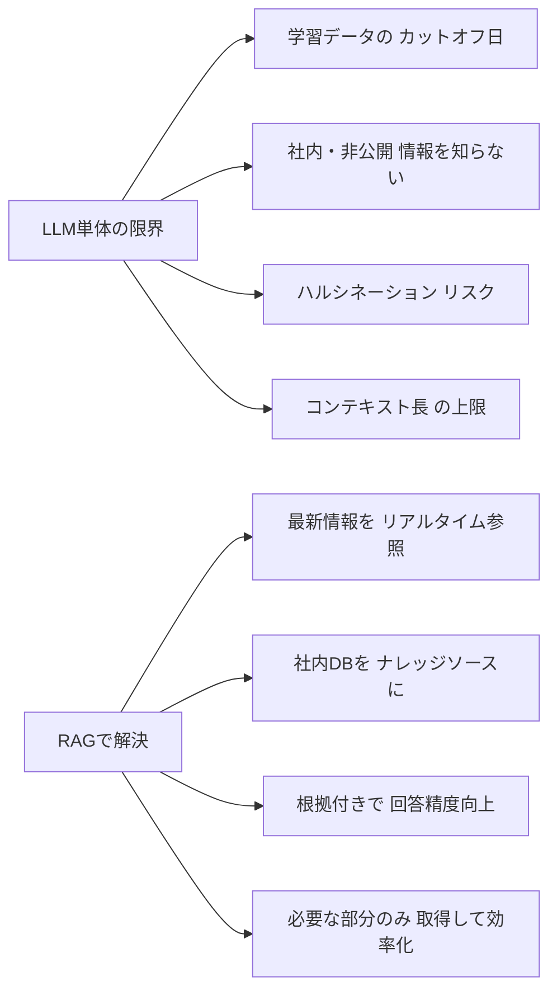
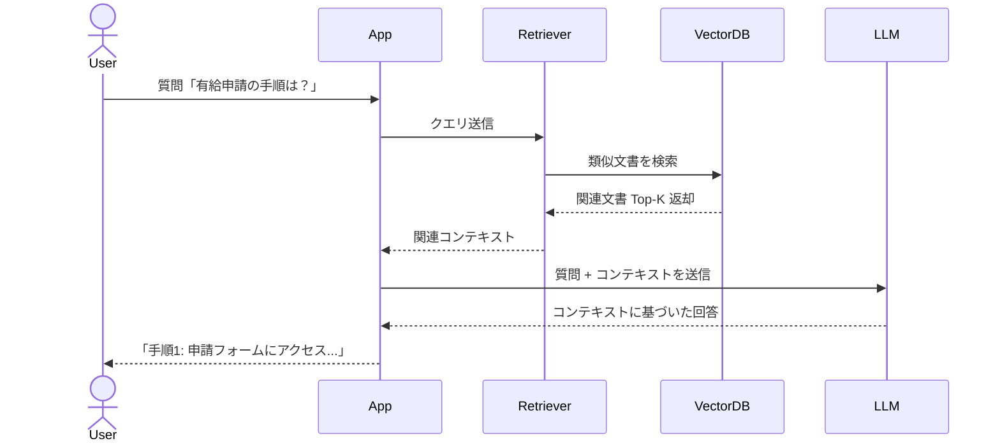

## 概要

RAG（Retrieval-Augmented Generation）は、LLMの知識の限界を外部データベースで補完する技術です。なぜRAGが必要なのか、どのような仕組みで動くのかを理解します。

## 本文

### LLMの限界とRAGの必要性

LLMには根本的な制約があります。



**RAGなし（LLM単体）:**
- 「弊社の最新の製品仕様は？」→ 知らない
- 「昨日発表されたニュースについて教えて」→ 知らない
- 「社内規定の休暇申請手順は？」→ 知らない

**RAGあり:**
- 製品仕様DBを参照 → 正確な仕様を回答
- ニュースフィードを参照 → 最新情報で回答
- 社内Wiki参照 → 正しい手順を回答

### RAGの基本アーキテクチャ



### RAGの2つのフェーズ

**フェーズ1: インデックス作成（事前処理）**

```
ドキュメント群
    ↓ チャンキング（分割）
テキストチャンク
    ↓ Embeddingモデルでベクトル化
ベクトル（浮動小数点数の配列）
    ↓ ベクトルDBに保存
インデックス完成
```

**フェーズ2: 検索と生成（推論時）**

```
ユーザーの質問
    ↓ Embeddingモデルでベクトル化
クエリベクトル
    ↓ ベクトルDBで類似検索
関連チャンク Top-K
    ↓ プロンプトに組み込む
LLMが回答生成
    ↓
根拠のある回答
```

### Naive RAG vs Advanced RAG

| 特徴 | Naive RAG | Advanced RAG |
|------|-----------|--------------|
| 検索方式 | 単純なベクトル類似検索 | ハイブリッド検索・リランキング |
| チャンキング | 固定長分割 | セマンティック分割 |
| クエリ | そのまま検索 | クエリ変換・拡張 |
| 精度 | 基本的 | 高精度 |
| 実装コスト | 低 | 高 |

### RAGが適しているケース

**RAGが向いている:**
- 社内ナレッジベースQ&A
- カスタマーサポート（FAQ・マニュアル参照）
- 最新情報を含む質問応答
- 大量ドキュメントからの情報抽出

**RAGが向いていない（ファインチューニングの方が適切）:**
- 特定のトーンや文体を学習させたい
- ドメイン特有の推論パターンを身につけさせたい
- 高速な応答が必要（検索レイテンシが問題）

## クイズ

<!-- QUIZ:START -->
**Q1. RAG（Retrieval-Augmented Generation）の「Retrieval」は何を指しますか？**

- A) LLMがテキストを生成するプロセス
- B) 外部データベースから関連情報を検索・取得するプロセス
- C) モデルをファインチューニングするプロセス
- D) テキストをベクトルに変換するプロセス

**正解: B**
**解説:** RAGの「Retrieval（検索・取得）」は、ユーザーの質問に関連する情報を外部データベース（ベクトルDBなど）から検索・取得するプロセスを指します。この取得した情報をコンテキストとしてLLMに渡すことで、正確な回答を生成します。

**Q2. RAGの主な利点は何ですか？**

- A) LLMのパラメータ数を増やせる
- B) 学習コストを削減できる
- C) LLMの知識カットオフ以降の情報や非公開情報を参照して回答できる
- D) 回答速度が向上する

**正解: C**
**解説:** RAGの最大の利点は、LLMが学習していない情報（カットオフ以降の最新情報や社内の非公開情報）を外部DBから参照して回答できる点です。また、根拠となる文書を参照することでハルシネーションも抑制できます。

**Q3. RAGのインデックス作成フェーズで行わないことはどれですか？**

- A) ドキュメントのチャンキング
- B) テキストのベクトル化（Embedding）
- C) ユーザーの質問をベクトル化
- D) ベクトルをDBに保存

**正解: C**
**解説:** ユーザーの質問をベクトル化するのは推論時（検索フェーズ）の処理です。インデックス作成フェーズでは、ドキュメントの分割・ベクトル化・DB保存を事前に行います。
<!-- QUIZ:END -->

## まとめ

- RAGはLLMの知識限界を外部DBで補完する技術
- インデックス作成（事前）と検索・生成（推論時）の2フェーズで構成される
- 社内ナレッジQ&AやカスタマーサポートなどにLLM単体より適している
- ハルシネーションを減らし、根拠ある回答を実現する

## 次のレッスン

次のレッスンでは、RAGの核心技術である「ベクトル埋め込み（Embeddings）」の仕組みと、テキストを数値ベクトルとして表現する方法を学びます。
