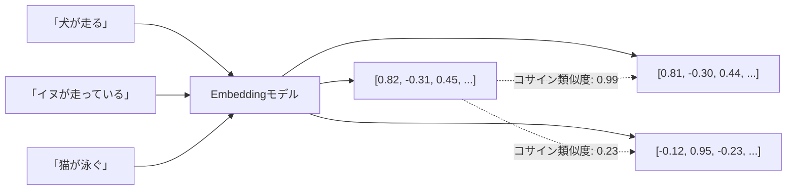

## 概要

Embeddingはテキストを高次元ベクトルに変換する技術です。意味的に近いテキストは近いベクトルに変換されるため、テキスト検索・類似度計算・クラスタリングに活用できます。

## 本文

### Embeddingとは何か



**重要な特性:** 意味的に近いテキスト → 近いベクトル（高いコサイン類似度）

### コサイン類似度

2つのベクトルの類似度を-1〜1で表します。1に近いほど類似。

```python
import numpy as np

def cosine_similarity(vec_a: list[float], vec_b: list[float]) -> float:
    """2つのベクトル間のコサイン類似度を計算"""
    a = np.array(vec_a)
    b = np.array(vec_b)
    return float(np.dot(a, b) / (np.linalg.norm(a) * np.linalg.norm(b)))

# 例
v1 = [1.0, 0.0, 0.0]
v2 = [0.9, 0.1, 0.0]
v3 = [-1.0, 0.0, 0.0]

print(cosine_similarity(v1, v2))  # 0.994（非常に近い）
print(cosine_similarity(v1, v3))  # -1.0（正反対）
```

### OpenAI Embedding API

```python
from openai import OpenAI

client = OpenAI()

def get_embedding(text: str, model: str = "text-embedding-3-small") -> list[float]:
    """テキストをEmbeddingベクトルに変換"""
    response = client.embeddings.create(
        input=text,
        model=model
    )
    return response.data[0].embedding

# モデル比較
# text-embedding-3-small: 1536次元、コスト低、速度速
# text-embedding-3-large: 3072次元、精度高、コスト高

embedding = get_embedding("東京の天気は晴れです")
print(f"次元数: {len(embedding)}")  # 1536
print(f"最初の5要素: {embedding[:5]}")
```

### Anthropic Embedding（Voyage AI）

Anthropicはモデルとして**Voyage AI**のEmbeddingを推奨しています：

```python
import voyageai

client = voyageai.Client()  # VOYAGE_API_KEY が必要

def get_voyage_embedding(text: str, input_type: str = "document") -> list[float]:
    """Voyage AIでEmbedding取得
    input_type: "document"（インデックス時）or "query"（検索時）
    """
    result = client.embed(
        [text],
        model="voyage-3",
        input_type=input_type
    )
    return result.embeddings[0]

# 検索用途に最適化（input_typeを使い分ける）
doc_embedding = get_voyage_embedding("Pythonはインタープリタ言語です", input_type="document")
query_embedding = get_voyage_embedding("Pythonとは何ですか", input_type="query")
```

### バッチEmbedding処理

```python
from openai import OpenAI
import numpy as np

client = OpenAI()

def batch_embed(texts: list[str], model: str = "text-embedding-3-small") -> list[list[float]]:
    """複数テキストを一括でEmbedding（APIコール回数を削減）"""
    # OpenAIは1リクエストで最大2048テキストまで対応
    batch_size = 100
    all_embeddings = []

    for i in range(0, len(texts), batch_size):
        batch = texts[i:i + batch_size]
        response = client.embeddings.create(input=batch, model=model)
        # インデックスでソートして順序を保証
        batch_embeddings = sorted(response.data, key=lambda x: x.index)
        all_embeddings.extend([e.embedding for e in batch_embeddings])

    return all_embeddings


def find_most_similar(query: str, documents: list[str]) -> tuple[str, float]:
    """クエリに最も類似したドキュメントを返す"""
    all_texts = [query] + documents
    embeddings = batch_embed(all_texts)

    query_emb = np.array(embeddings[0])
    doc_embs = np.array(embeddings[1:])

    # コサイン類似度を一括計算
    similarities = np.dot(doc_embs, query_emb) / (
        np.linalg.norm(doc_embs, axis=1) * np.linalg.norm(query_emb)
    )

    best_idx = int(np.argmax(similarities))
    return documents[best_idx], float(similarities[best_idx])
```

### Embeddingの用途

| 用途 | 説明 |
|------|------|
| 意味検索 | キーワードでなく意味で検索 |
| 文書クラスタリング | 類似文書をグループ化 |
| 重複検出 | 類似コンテンツを特定 |
| レコメンデーション | 類似アイテムを推薦 |
| 分類（少数ショット） | Embeddingをベースにした分類器 |

## ハンズオン

シンプルなセマンティック検索エンジンを実装します。

### 完成コード

```python
import os
import json
import numpy as np
from openai import OpenAI

client = OpenAI()

class SimpleSemanticSearch:
    """Embeddingを使ったシンプルなセマンティック検索"""

    def __init__(self, model: str = "text-embedding-3-small"):
        self.model = model
        self.documents: list[str] = []
        self.embeddings: list[list[float]] = []

    def _embed(self, texts: list[str]) -> list[list[float]]:
        response = client.embeddings.create(input=texts, model=self.model)
        return [e.embedding for e in sorted(response.data, key=lambda x: x.index)]

    def add_documents(self, documents: list[str]):
        """ドキュメントを追加してインデックスを更新"""
        new_embeddings = self._embed(documents)
        self.documents.extend(documents)
        self.embeddings.extend(new_embeddings)
        print(f"{len(documents)}件のドキュメントを追加 (合計: {len(self.documents)}件)")

    def search(self, query: str, top_k: int = 3) -> list[dict]:
        """クエリに類似したドキュメントをTop-K返す"""
        if not self.documents:
            return []

        query_emb = np.array(self._embed([query])[0])
        doc_embs = np.array(self.embeddings)

        # コサイン類似度計算
        similarities = np.dot(doc_embs, query_emb) / (
            np.linalg.norm(doc_embs, axis=1) * np.linalg.norm(query_emb)
        )

        # Top-K取得
        top_indices = np.argsort(similarities)[::-1][:top_k]
        return [
            {
                "document": self.documents[i],
                "score": float(similarities[i]),
                "rank": rank + 1,
            }
            for rank, i in enumerate(top_indices)
        ]

    def save(self, path: str):
        """インデックスをJSONで保存"""
        with open(path, "w", encoding="utf-8") as f:
            json.dump({
                "documents": self.documents,
                "embeddings": self.embeddings,
                "model": self.model,
            }, f, ensure_ascii=False)

    @classmethod
    def load(cls, path: str) -> "SimpleSemanticSearch":
        """保存済みインデックスを読み込み"""
        with open(path, encoding="utf-8") as f:
            data = json.load(f)
        instance = cls(model=data["model"])
        instance.documents = data["documents"]
        instance.embeddings = data["embeddings"]
        return instance


if __name__ == "__main__":
    # FAQドキュメントのサンプル
    faqs = [
        "パスワードを忘れた場合は、ログイン画面の「パスワードを忘れた方はこちら」をクリックしてください。",
        "料金プランはベーシック（月額980円）とプレミアム（月額2980円）の2種類です。",
        "解約はマイページ > 設定 > サービス解約から手続きができます。",
        "サポートへのお問い合わせは平日9時〜18時に対応しています。",
        "データのエクスポートは設定画面からCSV形式で行えます。",
    ]

    search = SimpleSemanticSearch()
    search.add_documents(faqs)

    # 検索テスト
    queries = ["契約をやめたい", "ログインできない", "いくらかかりますか"]
    for query in queries:
        print(f"\n質問: {query}")
        results = search.search(query, top_k=2)
        for r in results:
            print(f"  [{r['rank']}] スコア{r['score']:.3f}: {r['document'][:50]}...")
```

## クイズ

<!-- QUIZ:START -->
**Q1. コサイン類似度が0.99のとき、2つのテキストの関係はどれですか？**

- A) 意味がほぼ正反対
- B) 意味的に非常に近い
- C) まったく関係がない
- D) 文字列が完全に一致している

**正解: B**
**解説:** コサイン類似度は-1〜1の範囲で、1に近いほど意味的に類似しています。0.99はほぼ同じ意味のテキスト同士に見られる値です。-1は正反対、0は無相関を意味します。

**Q2. Voyage AIの`input_type`を"document"と"query"で使い分ける理由は何ですか？**

- A) APIコストを削減するため
- B) それぞれ検索時と索引作成時に最適化されたベクトルを生成するため
- C) 次元数が異なるため
- D) 処理速度が速くなるため

**正解: B**
**解説:** "document"は文書をインデックスするために最適化され、"query"は検索クエリに最適化されています。用途に合わせて使い分けることで検索精度が向上します（asymmetric searchとも呼ばれます）。

**Q3. バッチEmbedding処理の主なメリットは何ですか？**

- A) Embeddingの精度が向上する
- B) 1回のAPIコールで複数テキストを処理しAPIコール回数とコストを削減できる
- C) 次元数が増える
- D) 類似度計算が高速になる

**正解: B**
**解説:** バッチ処理により、100件のテキストを1回のAPIコールで処理できます。逐次処理と比べてAPIコール回数が大幅に減り、レイテンシとコストを削減できます。
<!-- QUIZ:END -->

## まとめ

- Embeddingはテキストを意味を保ったまま数値ベクトルに変換する技術
- コサイン類似度で2つのベクトルの意味的な近さを測定できる
- バッチ処理でAPIコール回数を削減して効率化する
- 検索用途ではinput_typeを"document"/"query"で使い分ける

## 次のレッスン

次のレッスンでは、Embeddingを大規模に保存・検索するための「ベクトルデータベース」を学びます。
