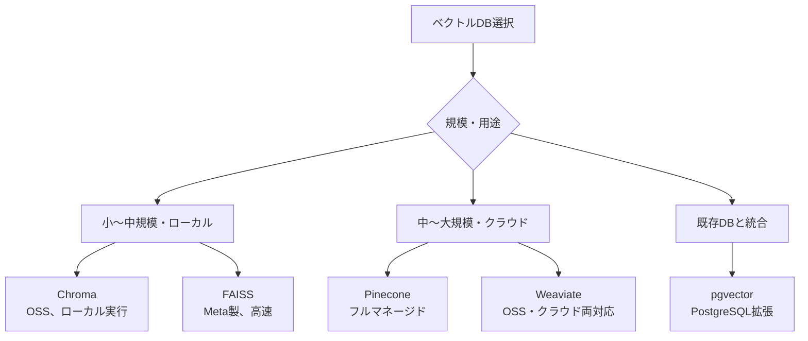

## 概要

大量のEmbeddingを高速に検索するにはベクトルデータベースが必要です。主要なベクトルDBの比較と、Chromaを使った実装方法を学びます。

## 本文

### なぜベクトルDBが必要か

NumPyを使ったナイーブな全数探索は数百件なら問題ありませんが、大量データでは破綻します：

| ドキュメント数 | 全数探索 | ANN（近似近傍探索） |
|-------------|---------|-----------------|
| 1,000件 | 即時 | 即時 |
| 100,000件 | ~1秒 | <10ms |
| 10,000,000件 | >100秒 | <50ms |

ベクトルDBはANN（Approximate Nearest Neighbors）アルゴリズムで高速検索を実現します。

### 主要ベクトルDB比較



| DB | 特徴 | 向いているケース |
|----|------|----------------|
| **Chroma** | Python製、セットアップ簡単 | プロトタイプ、小規模 |
| **FAISS** | Meta製、超高速、インメモリ | 研究、高速バッチ処理 |
| **Pinecone** | フルマネージド、スケーラブル | 本番環境 |
| **Weaviate** | GraphQL対応、フィルタ強力 | 複雑なフィルタリング |
| **pgvector** | PostgreSQL拡張 | 既存PGと統合 |

### Chroma の基本操作

```python
import chromadb
from chromadb.config import Settings

# インメモリモード（テスト用）
client = chromadb.Client()

# ローカルファイル永続化
client = chromadb.PersistentClient(path="./chroma_db")

# コレクション作成
collection = client.get_or_create_collection(
    name="my_documents",
    metadata={"hnsw:space": "cosine"}  # コサイン類似度を使用
)
```

### ドキュメントの追加と検索

```python
import chromadb
from openai import OpenAI

openai_client = OpenAI()

def get_embeddings(texts: list[str]) -> list[list[float]]:
    response = openai_client.embeddings.create(
        input=texts,
        model="text-embedding-3-small"
    )
    return [e.embedding for e in sorted(response.data, key=lambda x: x.index)]


# Chromaコレクション操作
chroma_client = chromadb.PersistentClient(path="./chroma_db")
collection = chroma_client.get_or_create_collection(
    name="knowledge_base",
    metadata={"hnsw:space": "cosine"}
)

# ドキュメント追加
def add_documents(documents: list[dict]):
    """documents: [{"id": "doc1", "text": "...", "metadata": {...}}]"""
    ids = [doc["id"] for doc in documents]
    texts = [doc["text"] for doc in documents]
    metadatas = [doc.get("metadata", {}) for doc in documents]
    embeddings = get_embeddings(texts)

    collection.add(
        ids=ids,
        documents=texts,
        embeddings=embeddings,
        metadatas=metadatas,
    )
    print(f"{len(documents)}件追加 (合計: {collection.count()}件)")


# 類似検索
def search(query: str, top_k: int = 3, filter_metadata: dict | None = None) -> list[dict]:
    """意味検索"""
    query_emb = get_embeddings([query])[0]

    results = collection.query(
        query_embeddings=[query_emb],
        n_results=top_k,
        where=filter_metadata,  # メタデータフィルタ
        include=["documents", "metadatas", "distances"],
    )

    return [
        {
            "id": results["ids"][0][i],
            "document": results["documents"][0][i],
            "metadata": results["metadatas"][0][i],
            "score": 1 - results["distances"][0][i],  # distanceを類似度に変換
        }
        for i in range(len(results["ids"][0]))
    ]
```

### メタデータフィルタリング

メタデータを使ってカテゴリ・日付などで絞り込めます：

```python
# ドキュメント追加時にメタデータを付与
docs = [
    {
        "id": "faq_001",
        "text": "パスワードリセットの方法を教えてください。",
        "metadata": {"category": "account", "language": "ja", "updated": "2024-01"}
    },
    {
        "id": "faq_002",
        "text": "料金プランの変更方法について説明します。",
        "metadata": {"category": "billing", "language": "ja", "updated": "2024-02"}
    },
]
add_documents(docs)

# カテゴリで絞り込み検索
results = search(
    query="お金の話",
    filter_metadata={"category": "billing"}
)
```

### FAISS（高速インメモリ検索）

```python
import faiss
import numpy as np
import pickle

class FAISSIndex:
    """FAISSを使った高速ベクトル検索"""

    def __init__(self, dimension: int = 1536):
        self.dimension = dimension
        # IndexFlatIPは内積（コサイン類似度に対応）
        self.index = faiss.IndexFlatIP(dimension)
        self.documents: list[str] = []

    def add(self, texts: list[str], embeddings: list[list[float]]):
        # L2正規化してコサイン類似度にする
        vecs = np.array(embeddings, dtype=np.float32)
        faiss.normalize_L2(vecs)
        self.index.add(vecs)
        self.documents.extend(texts)

    def search(self, query_emb: list[float], top_k: int = 5) -> list[tuple[str, float]]:
        vec = np.array([query_emb], dtype=np.float32)
        faiss.normalize_L2(vec)
        scores, indices = self.index.search(vec, top_k)
        return [
            (self.documents[i], float(scores[0][rank]))
            for rank, i in enumerate(indices[0])
            if i != -1
        ]

    def save(self, path: str):
        faiss.write_index(self.index, f"{path}.faiss")
        with open(f"{path}.pkl", "wb") as f:
            pickle.dump(self.documents, f)

    @classmethod
    def load(cls, path: str, dimension: int = 1536) -> "FAISSIndex":
        instance = cls(dimension)
        instance.index = faiss.read_index(f"{path}.faiss")
        with open(f"{path}.pkl", "rb") as f:
            instance.documents = pickle.load(f)
        return instance
```

## ハンズオン

Chromaを使ったナレッジベース検索システムを実装します。

### 完成コード

```python
import os
import chromadb
from openai import OpenAI

openai_client = OpenAI()
chroma_client = chromadb.PersistentClient(path="./knowledge_db")

collection = chroma_client.get_or_create_collection(
    name="company_faq",
    metadata={"hnsw:space": "cosine"}
)


def embed_texts(texts: list[str]) -> list[list[float]]:
    response = openai_client.embeddings.create(
        input=texts, model="text-embedding-3-small"
    )
    return [e.embedding for e in sorted(response.data, key=lambda x: x.index)]


def build_knowledge_base(faq_data: list[dict]):
    """FAQデータからナレッジベースを構築"""
    if collection.count() > 0:
        print(f"既存のナレッジベース ({collection.count()}件) を使用")
        return

    embeddings = embed_texts([item["question"] for item in faq_data])

    collection.add(
        ids=[f"faq_{i}" for i in range(len(faq_data))],
        documents=[item["question"] for item in faq_data],
        embeddings=embeddings,
        metadatas=[{"answer": item["answer"], "category": item["category"]}
                   for item in faq_data],
    )
    print(f"ナレッジベース構築完了: {collection.count()}件")


def answer_question(user_question: str, top_k: int = 2) -> str:
    """ユーザーの質問に対して関連FAQを検索して回答"""
    query_emb = embed_texts([user_question])[0]

    results = collection.query(
        query_embeddings=[query_emb],
        n_results=top_k,
        include=["documents", "metadatas", "distances"],
    )

    if not results["ids"][0]:
        return "関連する情報が見つかりませんでした。"

    # 最も類似したFAQの回答を返す
    best_score = 1 - results["distances"][0][0]
    best_answer = results["metadatas"][0][0]["answer"]
    best_question = results["documents"][0][0]

    if best_score < 0.6:
        return "ご質問に関連する情報が見つかりませんでした。サポートにお問い合わせください。"

    return f"【関連FAQ】{best_question}\n\n{best_answer}\n\n(類似度: {best_score:.2f})"


if __name__ == "__main__":
    faq_data = [
        {
            "question": "パスワードを忘れました",
            "answer": "ログイン画面の「パスワードを忘れた方はこちら」からリセットできます。",
            "category": "account"
        },
        {
            "question": "料金プランを変更したい",
            "answer": "マイページ > プラン変更から変更できます。即時反映されます。",
            "category": "billing"
        },
        {
            "question": "退会・解約の手順",
            "answer": "マイページ > 設定 > サービス解約から手続きできます。月末に解約されます。",
            "category": "account"
        },
    ]

    build_knowledge_base(faq_data)

    test_questions = ["ログインできない", "契約を終了したい", "費用を下げたい"]
    for q in test_questions:
        print(f"\n質問: {q}")
        print(answer_question(q))
```

## クイズ

<!-- QUIZ:START -->
**Q1. ANN（Approximate Nearest Neighbors）が必要な理由は何ですか？**

- A) より正確な検索結果を得るため
- B) 全数探索では大量データに対して検索が遅すぎるため
- C) APIコストを削減するため
- D) ベクトルの次元数を削減するため

**正解: B**
**解説:** 全数探索（Brute Force）はドキュメント数に比例して検索時間が増加します。ANNは少し精度を犠牲にする代わりに、HNSWやIVFなどのアルゴリズムで数百万件でもミリ秒以内の検索を実現します。

**Q2. Chromaのメタデータフィルタリングの用途として最も適切なのはどれですか？**

- A) Embeddingの精度を向上させる
- B) カテゴリ・言語・日付など特定の条件を持つ文書のみを対象に検索する
- C) 検索速度を向上させる
- D) ドキュメントの重複を検出する

**正解: B**
**解説:** メタデータフィルタリングを使うと、ベクトル類似検索とキーワードフィルタを組み合わせられます。例えば「billingカテゴリのみ検索」「日本語文書のみ対象」といった絞り込みが可能です。

**Q3. FAISSで`faiss.normalize_L2()`を行う理由は何ですか？**

- A) ベクトルの次元数を削減するため
- B) L2ノルムを1に正規化することで内積計算がコサイン類似度と等価になるため
- C) 検索速度を向上させるため
- D) メモリ使用量を削減するため

**正解: B**
**解説:** FAISSのIndexFlatIPは内積（Inner Product）で検索します。ベクトルをL2正規化（ノルムを1に）すると、内積がコサイン類似度と同じ結果になります。意味的類似度検索にはコサイン類似度が適しているため、この正規化が重要です。
<!-- QUIZ:END -->

## まとめ

- ベクトルDBはANNアルゴリズムで大量Embeddingを高速検索する
- Chromaはローカル永続化・メタデータフィルタが簡単でプロトタイプに最適
- FAISSは超高速だがインメモリのため大規模本番はPinecone等を検討
- メタデータフィルタとベクトル検索の組み合わせで高精度な検索が実現できる

## 次のレッスン

次のレッスンでは、Embedding・ベクトルDBの知識を組み合わせて「RAGの基本実装」を行います。
