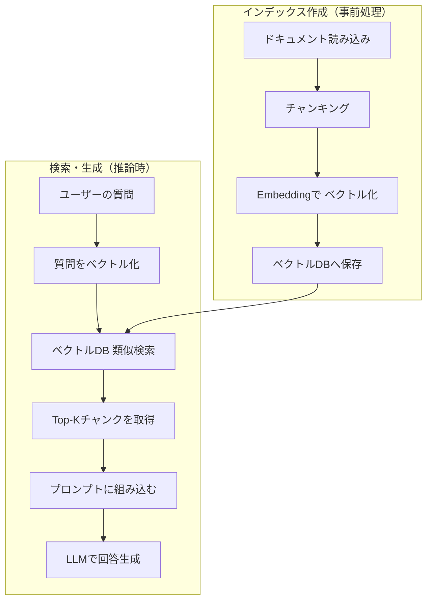

## 概要

RAGの基本実装を通じて、ドキュメント取り込み・ベクトル検索・プロンプト生成・回答生成という一連のフローを実際のコードで理解します。Pythonとopenai・chromadbライブラリを使ってシンプルなRAGシステムを構築します。

## 本文

### RAGの全体フロー



### 環境セットアップ

```bash
pip install openai chromadb python-dotenv
```

```python
# .env
OPENAI_API_KEY=sk-...
```

### ステップ1: ドキュメントのチャンキング

```python
import os
from openai import OpenAI
import chromadb
from chromadb.utils import embedding_functions

client = OpenAI()

def chunk_text(text: str, chunk_size: int = 500, overlap: int = 50) -> list[str]:
    """テキストを重複ありで分割する"""
    chunks = []
    start = 0
    while start < len(text):
        end = start + chunk_size
        chunk = text[start:end]
        chunks.append(chunk)
        start += chunk_size - overlap  # オーバーラップ分を戻す
    return chunks

# サンプルドキュメント
documents = [
    """
    有給休暇の申請手順
    1. 社内ポータルにアクセスします。
    2. 「休暇申請」メニューを選択します。
    3. 申請日・取得日数・理由を入力します。
    4. 上長に承認依頼を送信します。
    5. 承認メールを受け取ったら申請完了です。
    有給休暇は入社6か月後から10日付与されます。
    """,
    """
    経費精算の申請手順
    1. 領収書を保管してください（3か月以内）。
    2. 経費精算システムにログインします。
    3. 領収書をスキャンしてアップロードします。
    4. 金額・用途・日付を入力します。
    5. 承認後、翌月25日に口座振込されます。
    上限は1回あたり5万円です。
    """,
]
```

### ステップ2: ベクトルDBへの登録

```python
# ChromaDBクライアントの初期化
chroma_client = chromadb.Client()

# OpenAI Embeddingを使うEmbedding関数
openai_ef = embedding_functions.OpenAIEmbeddingFunction(
    api_key=os.environ["OPENAI_API_KEY"],
    model_name="text-embedding-3-small"
)

# コレクション作成
collection = chroma_client.create_collection(
    name="company_docs",
    embedding_function=openai_ef
)

# ドキュメントをチャンキングして登録
all_chunks = []
all_ids = []
all_metadatas = []

for doc_idx, doc in enumerate(documents):
    chunks = chunk_text(doc, chunk_size=200, overlap=30)
    for chunk_idx, chunk in enumerate(chunks):
        all_chunks.append(chunk)
        all_ids.append(f"doc{doc_idx}_chunk{chunk_idx}")
        all_metadatas.append({"doc_index": doc_idx, "chunk_index": chunk_idx})

collection.add(
    documents=all_chunks,
    ids=all_ids,
    metadatas=all_metadatas
)

print(f"{len(all_chunks)}個のチャンクをインデックスに追加しました")
```

### ステップ3: 検索・プロンプト生成・回答

```python
def rag_query(question: str, n_results: int = 3) -> str:
    """
    RAGを使って質問に回答する
    1. 質問をベクトル化してDBを検索
    2. 関連チャンクをプロンプトに組み込む
    3. LLMで回答を生成
    """
    # 類似検索
    results = collection.query(
        query_texts=[question],
        n_results=n_results
    )
    retrieved_chunks = results["documents"][0]

    # コンテキストを組み立てる
    context = "\n\n---\n\n".join(retrieved_chunks)

    # RAGプロンプト
    prompt = f"""以下の情報を参考にして質問に答えてください。
情報に記載がない場合は「情報が見つかりませんでした」と答えてください。

【参考情報】
{context}

【質問】
{question}

【回答】"""

    response = client.chat.completions.create(
        model="gpt-4o-mini",
        messages=[{"role": "user", "content": prompt}],
        temperature=0
    )
    return response.choices[0].message.content

# 実行
answer = rag_query("有給休暇はいつから使えますか？")
print(answer)
# → 「有給休暇は入社6か月後から10日付与されます。」
```

### プロンプトテンプレートのポイント

```python
RAG_PROMPT_TEMPLATE = """あなたは社内Q&Aアシスタントです。
以下の参考情報のみに基づいて質問に答えてください。

制約:
- 参考情報に記載のない内容は推測で答えないこと
- 回答の根拠となった箇所を明示すること
- 箇条書きで簡潔にまとめること

【参考情報】
{context}

【質問】
{question}
"""
```

情報の範囲を明示することで、ハルシネーションを大幅に減らせます。

### 取得結果の確認（デバッグ方法）

```python
def rag_query_with_debug(question: str, n_results: int = 3):
    results = collection.query(
        query_texts=[question],
        n_results=n_results,
        include=["documents", "distances", "metadatas"]
    )
    print("=== 取得したチャンク ===")
    for i, (doc, dist) in enumerate(
        zip(results["documents"][0], results["distances"][0])
    ):
        print(f"[{i+1}] 類似度スコア: {1 - dist:.3f}")
        print(f"    内容: {doc[:100]}...")
        print()
```

## ハンズオン

社内FAQ RAGシステムを段階的に構築します。

**ステップ1: 依存ライブラリをインストール**

```bash
pip install openai chromadb
```

**ステップ2: 複数ドキュメントをインデックスに登録する**

```python
import chromadb
from chromadb.utils import embedding_functions
import os

openai_ef = embedding_functions.OpenAIEmbeddingFunction(
    api_key=os.environ["OPENAI_API_KEY"],
    model_name="text-embedding-3-small"
)

client_db = chromadb.Client()
collection = client_db.create_collection("faq", embedding_function=openai_ef)

faqs = [
    "リモートワークは週3日まで認められています。申請は毎週月曜日に行ってください。",
    "健康診断は年1回、10月に実施されます。受診は業務時間内で可能です。",
    "社員証を紛失した場合は、総務部に連絡してください。再発行には3営業日かかります。",
]

collection.add(
    documents=faqs,
    ids=[f"faq_{i}" for i in range(len(faqs))]
)
print("インデックス作成完了")
```

**ステップ3: クエリを実行して回答を確認する**

```python
from openai import OpenAI

ai_client = OpenAI()

def ask_faq(question: str) -> str:
    results = collection.query(query_texts=[question], n_results=2)
    context = "\n".join(results["documents"][0])
    prompt = f"参考情報:\n{context}\n\n質問: {question}\n回答:"
    res = ai_client.chat.completions.create(
        model="gpt-4o-mini",
        messages=[{"role": "user", "content": prompt}],
        temperature=0
    )
    return res.choices[0].message.content

print(ask_faq("社員証をなくしてしまいました"))
print(ask_faq("リモートワークは何日できますか"))
```

**ステップ4: 取得チャンクを表示してデバッグする**

スコアと取得内容を確認し、検索精度を評価してみましょう。

## クイズ

<!-- QUIZ:START -->
**Q1. RAGのインデックス作成フェーズで最初に行う処理はどれですか？**

- A) ベクトルDBへの保存
- B) ドキュメントのチャンキング
- C) LLMによる要約
- D) クエリのベクトル化

**正解: B**
**解説:** インデックス作成では「ドキュメント読み込み → チャンキング → ベクトル化 → DB保存」の順で処理します。チャンキングはその後のベクトル化の前提となる重要なステップです。

**Q2. RAGプロンプトで「情報に記載がない場合は答えない」と制約を加える主な目的は何ですか？**

- A) LLMの応答速度を上げるため
- B) ハルシネーション（誤情報生成）を防ぐため
- C) トークン数を削減するため
- D) 出力形式を統一するため

**正解: B**
**解説:** LLMは学習済みの知識から推測して回答する傾向があります。「提供した情報のみに基づいて答えよ」と明示することで、根拠のない推測を防ぎハルシネーションを抑制できます。

**Q3. ChromaDBで類似検索を行う際、`n_results=3`の意味は何ですか？**

- A) 検索に使うEmbeddingの次元数
- B) インデックスに登録するドキュメント数
- C) 類似度スコアの上位3件のチャンクを返す
- D) 検索を3回繰り返す

**正解: C**
**解説:** `n_results`はクエリに対して最も類似したチャンクを何件返すかを指定するパラメータです。値を増やすと多くのコンテキストが得られますが、プロンプトが長くなりコストも上がります。

<!-- QUIZ:END -->

## まとめ

- RAG実装は「インデックス作成」と「検索・生成」の2フェーズに分かれる
- ChromaDB + OpenAI EmbeddingでシンプルなRAGをすぐに構築できる
- プロンプトで「提供情報のみ使用」と制約することがハルシネーション防止の鍵
- 類似度スコアを確認することで検索精度をデバッグできる

## 次のレッスン

次のレッスンでは、RAGの精度を大きく左右する「チャンキング戦略」について詳しく学びます。分割サイズやオーバーラップの設定が検索精度に与える影響を実験的に理解します。
