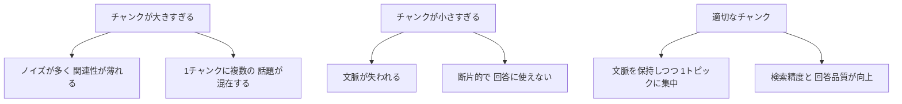

## 概要

チャンキング（ドキュメントの分割）はRAGの精度を左右する重要な設計です。固定長分割・セマンティック分割・再帰的分割など、代表的な戦略とその選び方を学びます。

## 本文

### なぜチャンキングが重要か

ベクトル検索の精度はチャンクの質に大きく依存します。



### 戦略1: 固定長分割（Character Splitter）

最もシンプルな方法です。

```python
def fixed_size_chunker(text: str, chunk_size: int = 500, overlap: int = 50) -> list[str]:
    """
    固定文字数でテキストを分割する
    overlap: 前後のチャンクと重複させる文字数
    """
    chunks = []
    start = 0
    while start < len(text):
        end = min(start + chunk_size, len(text))
        chunks.append(text[start:end])
        if end == len(text):
            break
        start += chunk_size - overlap
    return chunks

text = "これはサンプルテキストです。" * 100
chunks = fixed_size_chunker(text, chunk_size=100, overlap=20)
print(f"チャンク数: {len(chunks)}")
print(f"最初のチャンク: {chunks[0][:50]}")
```

**長所:** 実装が簡単、高速
**短所:** 文の途中で分割されることがある

### 戦略2: 再帰的テキスト分割（RecursiveCharacterTextSplitter）

LangChainの実装が有名。段落 → 文 → 単語の優先度で分割します。

```python
from langchain.text_splitter import RecursiveCharacterTextSplitter

splitter = RecursiveCharacterTextSplitter(
    chunk_size=500,
    chunk_overlap=50,
    separators=["\n\n", "\n", "。", "、", " ", ""]
)

text = """
第1章: はじめに

生成AIは近年急速に発展しています。
特にLLM（大規模言語モデル）の登場により、様々な業務での活用が進んでいます。

第2章: RAGとは

RAGはRetrieval-Augmented Generationの略で...
"""

chunks = splitter.split_text(text)
for i, chunk in enumerate(chunks):
    print(f"=== Chunk {i+1} ===\n{chunk}\n")
```

**長所:** 自然な区切り（段落・文）を優先して分割
**短所:** テキスト構造に依存するため均一なサイズにならない

### 戦略3: セマンティック分割

意味の変化点でチャンクを区切る高精度な方法です。

```python
from openai import OpenAI
import numpy as np

client = OpenAI()

def get_embedding(text: str) -> list[float]:
    response = client.embeddings.create(
        model="text-embedding-3-small",
        input=text
    )
    return response.data[0].embedding

def cosine_similarity(a: list[float], b: list[float]) -> float:
    a_arr = np.array(a)
    b_arr = np.array(b)
    return float(np.dot(a_arr, b_arr) / (np.linalg.norm(a_arr) * np.linalg.norm(b_arr)))

def semantic_chunker(sentences: list[str], threshold: float = 0.7) -> list[str]:
    """
    文間の意味的類似度が閾値を下回ったところで分割する
    """
    embeddings = [get_embedding(s) for s in sentences]
    chunks = []
    current_chunk = [sentences[0]]

    for i in range(1, len(sentences)):
        sim = cosine_similarity(embeddings[i-1], embeddings[i])
        if sim < threshold:
            # 意味が変わった → 新しいチャンクを開始
            chunks.append(" ".join(current_chunk))
            current_chunk = [sentences[i]]
        else:
            current_chunk.append(sentences[i])

    chunks.append(" ".join(current_chunk))
    return chunks
```

**長所:** 意味の境界で自然に分割される
**短所:** Embedding APIを呼ぶためコストと時間がかかる

### 戦略4: ドキュメント構造ベース分割

Markdownや HTMLなど構造化ドキュメントはヘッダーで分割します。

```python
import re

def markdown_splitter(md_text: str) -> list[dict]:
    """
    Markdownの見出しでセクションに分割する
    """
    sections = []
    current_section = {"heading": "intro", "content": ""}

    for line in md_text.split("\n"):
        heading_match = re.match(r"^(#{1,3})\s+(.+)", line)
        if heading_match:
            if current_section["content"].strip():
                sections.append(current_section)
            current_section = {
                "heading": heading_match.group(2),
                "level": len(heading_match.group(1)),
                "content": ""
            }
        else:
            current_section["content"] += line + "\n"

    if current_section["content"].strip():
        sections.append(current_section)

    return sections

md = """
# RAGとは

RAGはRetrieval-Augmented Generationの略です。

## 主なメリット

- 最新情報を参照できる
- ハルシネーションを減らせる

## デメリット

- 検索レイテンシが増加する
"""

sections = markdown_splitter(md)
for s in sections:
    print(f"見出し: {s['heading']}")
    print(f"内容: {s['content'][:80]}")
    print()
```

### チャンキング戦略の選び方

| 戦略 | 適したドキュメント | コスト | 精度 |
|------|-------------------|--------|------|
| 固定長 | 非構造化テキスト | 低 | 低〜中 |
| 再帰的 | 一般テキスト・小説 | 低 | 中 |
| セマンティック | 多様なトピック混在 | 高 | 高 |
| 構造ベース | Markdown・HTML・PDF | 低 | 高 |

### Parent-Child チャンキング

検索精度と文脈保持を両立する高度なテクニックです。

```python
"""
Parent-Child 戦略:
- 小さいチャンク（Child）でベクトル検索（精度向上）
- ヒットしたらその親チャンク（Parent）をコンテキストとして使用（文脈確保）
"""

def create_parent_child_chunks(text: str) -> dict:
    parent_size = 1000
    child_size = 200
    overlap = 20

    parents = []
    start = 0
    while start < len(text):
        parent = text[start:start + parent_size]
        parents.append(parent)
        start += parent_size

    children = []
    for parent_idx, parent in enumerate(parents):
        start = 0
        while start < len(parent):
            child = parent[start:start + child_size]
            children.append({
                "text": child,
                "parent_idx": parent_idx  # 親チャンクへの参照
            })
            start += child_size - overlap

    return {"parents": parents, "children": children}
```

## ハンズオン

LangChainの`RecursiveCharacterTextSplitter`を使って、異なるパラメータのチャンキングを比較します。

**ステップ1: LangChainをインストール**

```bash
pip install langchain langchain-text-splitters
```

**ステップ2: 同じテキストを異なるchunk_sizeで分割して比較**

```python
from langchain.text_splitter import RecursiveCharacterTextSplitter

sample_text = """
生成AIとは、テキスト・画像・音声などのコンテンツを自動的に生成できるAI技術です。
大規模言語モデル（LLM）が中心的な役割を担っています。

RAG（Retrieval-Augmented Generation）は、LLMの限界を補う重要なアーキテクチャです。
外部データベースから関連情報を検索し、その情報を参照しながら回答を生成します。

エージェントとは、LLMを核として自律的にタスクを実行するシステムです。
ツールを使いながら思考・行動・観察のサイクルを繰り返して問題を解決します。
""" * 10  # 繰り返して長いテキストにする

for chunk_size in [100, 300, 500]:
    splitter = RecursiveCharacterTextSplitter(
        chunk_size=chunk_size,
        chunk_overlap=20,
        separators=["\n\n", "\n", "。", " "]
    )
    chunks = splitter.split_text(sample_text)
    print(f"chunk_size={chunk_size}: {len(chunks)}チャンク, "
          f"平均{sum(len(c) for c in chunks)//len(chunks)}文字")
```

**ステップ3: 各チャンクの内容を確認して品質を評価する**

チャンクサイズを変えて、文の途中で切れていないかを確認してみましょう。

## クイズ

<!-- QUIZ:START -->
**Q1. RAGにおいてオーバーラップ（overlap）を設定する目的は何ですか？**

- A) チャンク数を減らしてコストを削減する
- B) チャンクの境界で文脈が失われないようにする
- C) ベクトルの次元数を増やす
- D) 検索速度を向上させる

**正解: B**
**解説:** チャンクの境界で文が途切れると前後の文脈が失われます。隣接するチャンク間で一定量を重複させる（オーバーラップ）ことで、境界部分の情報が失われないようにしています。

**Q2. Markdownドキュメントをチャンキングする際に最も推奨される方法はどれですか？**

- A) 固定長（500文字ごと）で分割する
- B) 見出し（#, ##）を区切り目として分割する
- C) スペースで分割する
- D) 文字数が均等になるよう調整して分割する

**正解: B**
**解説:** Markdownには見出しによる構造があります。その構造に従って分割することで、各チャンクが1つのトピックに集中した高品質なチャンクになります。固定長分割では見出しの途中で分割される可能性があります。

**Q3. Parent-Child チャンキングのメリットを正しく説明しているのはどれですか？**

- A) 小さい子チャンクで正確な検索を行い、親チャンクの豊富な文脈で回答を生成する
- B) 親チャンクで検索し、子チャンクをコンテキストとして使う
- C) チャンク作成のコストを削減できる
- D) Embeddingモデルが不要になる

**正解: A**
**解説:** Parent-Child戦略では小さいチャンク（Child）で精度の高いベクトル検索を行い、ヒットしたら元の大きいチャンク（Parent）をコンテキストとしてLLMに渡します。検索精度と文脈の豊富さを同時に実現できます。

<!-- QUIZ:END -->

## まとめ

- チャンキングの品質はRAG全体の精度を大きく左右する
- 固定長・再帰的・セマンティック・構造ベースの4つの主要戦略がある
- ドキュメントの種類と求める精度・コストのバランスで戦略を選ぶ
- Parent-Childチャンキングは検索精度と文脈確保を両立する高度な手法

## 次のレッスン

次のレッスンでは、チャンキングの改善に加え、リランキング・ハイブリッド検索・HyDEなど、RAGの精度をさらに高める応用テクニックを学びます。
