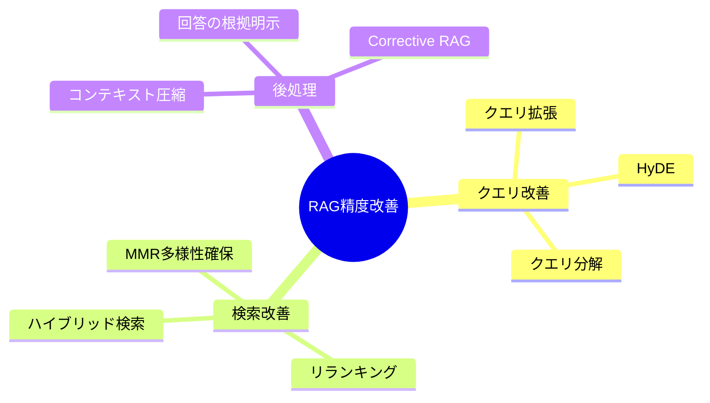

## 概要

基本的なRAGの精度をさらに高めるためのテクニックを学びます。リランキング・ハイブリッド検索・HyDE（Hypothetical Document Embeddings）など、実務で使われる改善手法を理解します。

## 本文

### RAG精度改善の全体マップ



### 手法1: クエリ拡張（Query Expansion）

ユーザーのクエリをLLMで言い換え・拡張して検索精度を上げます。

```python
from openai import OpenAI

client = OpenAI()

def expand_query(original_query: str) -> list[str]:
    """
    1つの質問を複数の言い換えに展開する
    """
    prompt = f"""以下の質問を、同じ意味の別の表現で3つ書いてください。
    出力は1行に1つの質問のみ記載してください。

    質問: {original_query}
    """
    response = client.chat.completions.create(
        model="gpt-4o-mini",
        messages=[{"role": "user", "content": prompt}],
        temperature=0.5
    )
    expanded = [original_query]
    for line in response.choices[0].message.content.strip().split("\n"):
        if line.strip():
            expanded.append(line.strip())
    return expanded

# 例
queries = expand_query("有給休暇を申請するには？")
print(queries)
# → ["有給休暇を申請するには？",
#    "年次有給休暇の申請方法を教えてください",
#    "休暇の取得手続きはどうすればよいですか",
#    "有休を取りたい場合の手順は？"]
```

### 手法2: HyDE（Hypothetical Document Embeddings）

クエリそのものではなく、「クエリへの回答文（仮説ドキュメント）」をベクトル化して検索します。

```python
def hyde_search(query: str, collection) -> list[str]:
    """
    HyDE: 仮説的な回答文を生成してからベクトル検索する
    """
    # ステップ1: 仮説ドキュメントを生成
    prompt = f"""次の質問に対する仮説的な回答を100文字程度で書いてください。
実際の情報が不明でも構いません。

質問: {query}
"""
    response = client.chat.completions.create(
        model="gpt-4o-mini",
        messages=[{"role": "user", "content": prompt}],
        temperature=0
    )
    hypothetical_doc = response.choices[0].message.content

    print(f"仮説ドキュメント: {hypothetical_doc[:80]}...")

    # ステップ2: 仮説ドキュメントでベクトル検索
    results = collection.query(
        query_texts=[hypothetical_doc],
        n_results=3
    )
    return results["documents"][0]
```

HyDEが効果的な理由: ユーザーのクエリより、回答形式のテキストの方がドキュメントのEmbeddingに近いため、より関連性の高い結果が得られます。

### 手法3: リランキング（Reranking）

初回検索で多めに取得（Top-20）し、より精度の高いモデルでTop-Kに絞り込みます。

```python
# Cross-Encoderを使ったリランキング
# pip install sentence-transformers
from sentence_transformers import CrossEncoder

reranker = CrossEncoder("cross-encoder/ms-marco-MiniLM-L-6-v2")

def rerank_results(query: str, candidates: list[str], top_k: int = 3) -> list[str]:
    """
    Cross-Encoderでリランキングする
    Bi-Encoder（ベクトル検索）より精度が高いがコストも高い
    """
    # クエリと各候補のペアをスコアリング
    pairs = [(query, doc) for doc in candidates]
    scores = reranker.predict(pairs)

    # スコア順にソートして上位を返す
    ranked = sorted(zip(scores, candidates), reverse=True)
    return [doc for _, doc in ranked[:top_k]]

# 使い方
initial_results = collection.query(query_texts=[query], n_results=20)
candidates = initial_results["documents"][0]
reranked = rerank_results(query, candidates, top_k=3)
```

### 手法4: ハイブリッド検索

ベクトル検索（セマンティック）とキーワード検索（BM25）を組み合わせます。

```python
# pip install rank-bm25
from rank_bm25 import BM25Okapi

class HybridRetriever:
    def __init__(self, documents: list[str], collection):
        self.documents = documents
        self.collection = collection
        # BM25インデックス作成
        tokenized = [doc.split() for doc in documents]
        self.bm25 = BM25Okapi(tokenized)

    def search(self, query: str, top_k: int = 5, alpha: float = 0.5) -> list[str]:
        """
        alpha: ベクトル検索とBM25のバランス（0=BM25のみ, 1=ベクトルのみ）
        """
        # ベクトル検索スコア
        vector_results = self.collection.query(
            query_texts=[query],
            n_results=len(self.documents),
            include=["documents", "distances"]
        )
        vector_scores = {
            doc: 1 - dist
            for doc, dist in zip(
                vector_results["documents"][0],
                vector_results["distances"][0]
            )
        }

        # BM25スコア
        bm25_scores = self.bm25.get_scores(query.split())

        # スコアの正規化と統合
        combined = {}
        for i, doc in enumerate(self.documents):
            v_score = vector_scores.get(doc, 0)
            b_score = bm25_scores[i] / (max(bm25_scores) + 1e-9)
            combined[doc] = alpha * v_score + (1 - alpha) * b_score

        sorted_docs = sorted(combined.items(), key=lambda x: x[1], reverse=True)
        return [doc for doc, _ in sorted_docs[:top_k]]
```

### 手法5: Corrective RAG（CRAG）

取得したドキュメントの関連性を評価し、低品質なら外部検索にフォールバックします。

```python
def evaluate_relevance(query: str, document: str) -> float:
    """
    取得ドキュメントの関連性を0〜1で評価する
    """
    prompt = f"""次の質問に対して、参考文書がどれほど関連しているか0〜10で評価してください。
数字のみ回答してください。

質問: {query}
参考文書: {document[:200]}

スコア:"""
    response = client.chat.completions.create(
        model="gpt-4o-mini",
        messages=[{"role": "user", "content": prompt}],
        temperature=0
    )
    try:
        return float(response.choices[0].message.content.strip()) / 10
    except ValueError:
        return 0.5

def corrective_rag(query: str, collection, threshold: float = 0.5) -> str:
    results = collection.query(query_texts=[query], n_results=3)
    docs = results["documents"][0]

    # 関連性評価
    relevant_docs = [
        doc for doc in docs
        if evaluate_relevance(query, doc) >= threshold
    ]

    if not relevant_docs:
        # フォールバック: 外部検索や別の手段を使う
        return "関連情報が見つかりませんでした。別の質問を試してください。"

    context = "\n\n".join(relevant_docs)
    # ... 回答生成
    return context
```

## ハンズオン

クエリ拡張とリランキングを組み合わせたAdvanced RAGを実装します。

**ステップ1: 基本RAGとAdvanced RAGの結果を比較する準備**

```python
import chromadb
from chromadb.utils import embedding_functions
from openai import OpenAI
import os

client = OpenAI()
openai_ef = embedding_functions.OpenAIEmbeddingFunction(
    api_key=os.environ["OPENAI_API_KEY"],
    model_name="text-embedding-3-small"
)

chroma = chromadb.Client()
collection = chroma.create_collection("advanced_rag", embedding_function=openai_ef)

# ドキュメント登録
docs = [
    "Pythonはオープンソースの高水準プログラミング言語です。",
    "TypeScriptはJavaScriptに型を追加した言語でMicrosoftが開発しました。",
    "Rustはメモリ安全性を重視したシステムプログラミング言語です。",
    "Goはシンプルな文法と高速なコンパイルを特徴とするGoogleの言語です。",
]
collection.add(documents=docs, ids=[f"d{i}" for i in range(len(docs))])
```

**ステップ2: クエリ拡張を実装する**

```python
def expand_and_search(query: str, n: int = 3) -> list[str]:
    # 複数クエリで検索し重複を除去
    all_results = set()
    queries = expand_query(query)
    for q in queries:
        results = collection.query(query_texts=[q], n_results=n)
        all_results.update(results["documents"][0])
    return list(all_results)
```

**ステップ3: 通常検索とクエリ拡張検索の結果を比較する**

```python
query = "型安全な言語を教えて"
normal = collection.query(query_texts=[query], n_results=2)["documents"][0]
expanded = expand_and_search(query, n=2)

print("通常検索:", normal)
print("クエリ拡張:", expanded)
```

## クイズ

<!-- QUIZ:START -->
**Q1. HyDE（Hypothetical Document Embeddings）の仕組みを正しく説明しているのはどれですか？**

- A) ユーザーのクエリをそのままベクトル化して検索する
- B) LLMで仮説的な回答文を生成し、その回答文をベクトル化して検索する
- C) ドキュメントを仮説的に要約してからインデックスに登録する
- D) 複数のクエリを組み合わせてベクトル検索する

**正解: B**
**解説:** HyDEは、まずLLMで「クエリに対する仮説的な回答文」を生成し、その回答文をベクトル化してドキュメントを検索します。回答文はクエリよりドキュメントと意味的に近いため、より関連性の高い結果が得られます。

**Q2. リランキングでCross-Encoderを使う利点は何ですか？**

- A) 検索速度がBi-Encoderより速い
- B) 全ドキュメントに対してクエリとの関連性を一度に計算できる
- C) クエリと候補ドキュメントのペアを精密に評価できるため精度が高い
- D) EmbeddingモデルよりAPIコストが安い

**正解: C**
**解説:** Cross-Encoderはクエリとドキュメントをペアとしてモデルに入力し、互いの関係を精密に評価します。Bi-Encoder（ベクトル検索）は個別にエンコードするため近似的ですが、Cross-Encoderはより正確な関連性スコアを算出できます。ただし速度は遅くなります。

**Q3. ハイブリッド検索でBM25とベクトル検索を組み合わせる主な理由は何ですか？**

- A) 実装コストを削減するため
- B) ベクトル検索が計算できない固有名詞や専門用語をBM25で補完するため
- C) Embeddingモデルが不要になるため
- D) インデックスのサイズを小さくするため

**正解: B**
**解説:** ベクトル検索はセマンティックな意味で類似したドキュメントを見つけるのが得意ですが、固有名詞・製品名・専門用語などのキーワードマッチングは苦手です。BM25（キーワード検索）と組み合わせることでそれぞれの弱点を補い合えます。

<!-- QUIZ:END -->

## まとめ

- クエリ拡張・HyDE・リランキング・ハイブリッド検索がRAG精度改善の主な手法
- HyDEは仮説回答文でベクトル検索することでクエリとドキュメントの意味ギャップを埋める
- リランキングは初回検索で多めに取得しCross-Encoderで精密に絞り込む2段階アプローチ
- 実務ではコストと精度のトレードオフを考慮して手法を選択する

## 次のレッスン

次のレッスンでは、RAGを超えて自律的にタスクを実行する「エージェント」の概念を学びます。
