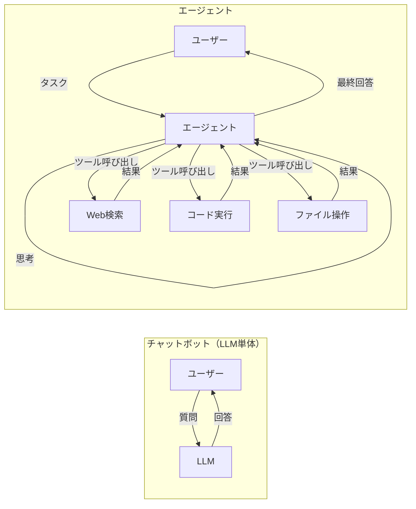
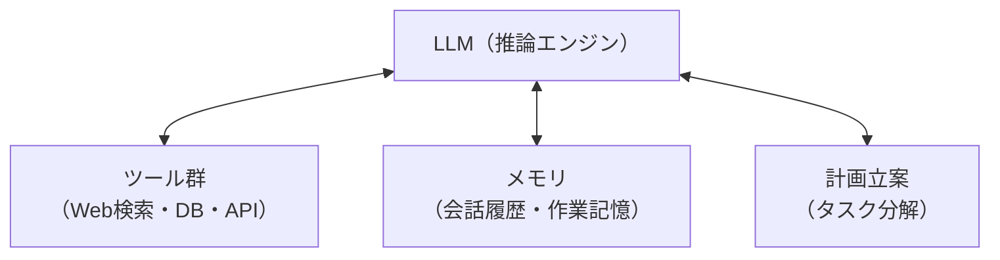
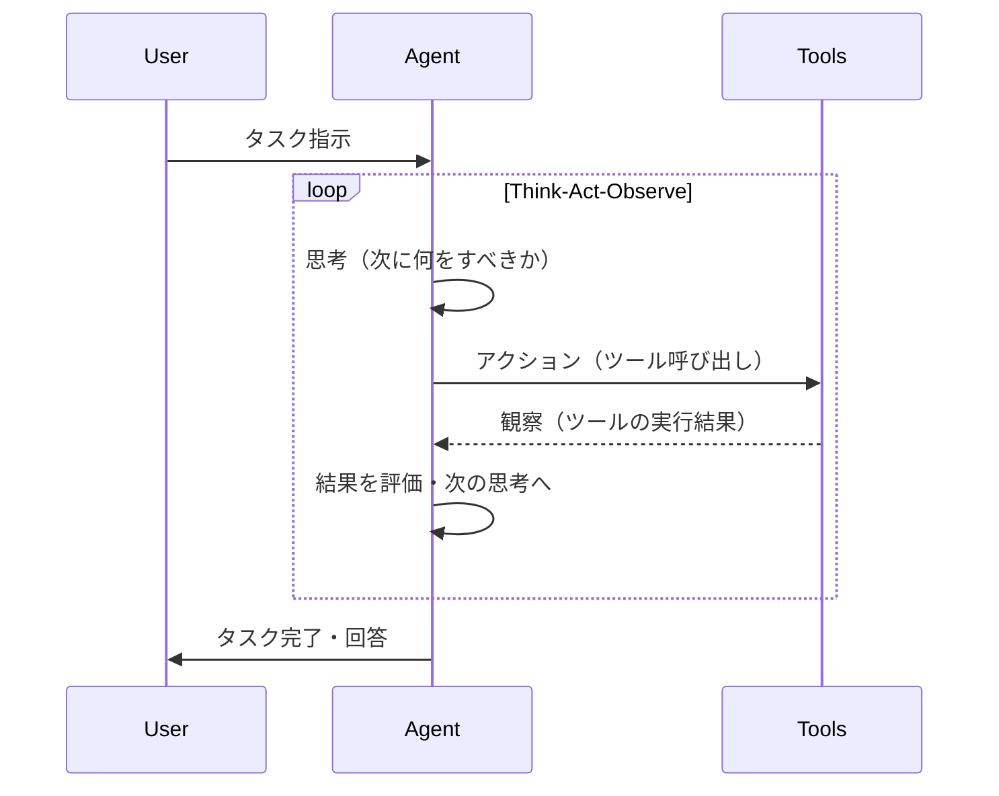

## 概要

AIエージェントとは、LLMを中核に持ち、ツールを使いながら自律的にタスクを達成するシステムです。単純なチャットボットとの違い、エージェントが必要な場面、そして基本的なアーキテクチャを理解します。

## 本文

### チャットボットとエージェントの違い



**チャットボット:** 1ターンで質問に答える。知識の範囲内でしか回答できない。

**エージェント:** 複数ステップにわたってツールを使いながら自律的にタスクを達成する。現実世界に作用できる。

### エージェントの4つの構成要素



1. **LLM（推論エンジン）:** 状況を理解し、次のアクションを決定する
2. **ツール:** 外部世界と接続するインターフェース（検索・計算・DB操作など）
3. **メモリ:** 過去の行動と観察を保持する
4. **計画立案:** 複雑なタスクをサブタスクに分解する

### エージェントが必要なシナリオ

**エージェントが効果的な場面:**

- **複数ステップが必要なタスク:** 「競合他社を調べて比較レポートを作成して」
- **外部データへのアクセス:** 「今日の為替レートを使って計算して」
- **条件分岐と判断:** 「在庫を確認してから発注数を決めて」
- **長期的な作業:** 「コードベースを解析してバグを修正して」

**エージェントが不要な場面（LLM単体で十分）:**

- 単純なQ&A
- テキスト変換・要約・翻訳
- 定型的なコンテンツ生成

### エージェントの動作サイクル



このサイクルは **ReAct（Reasoning + Acting）** パターンと呼ばれます。

### シンプルなエージェントの例

```python
from openai import OpenAI
import json

client = OpenAI()

# ツールの定義
tools = [
    {
        "type": "function",
        "function": {
            "name": "search_web",
            "description": "インターネットで情報を検索する",
            "parameters": {
                "type": "object",
                "properties": {
                    "query": {"type": "string", "description": "検索クエリ"}
                },
                "required": ["query"]
            }
        }
    },
    {
        "type": "function",
        "function": {
            "name": "calculate",
            "description": "数式を計算する",
            "parameters": {
                "type": "object",
                "properties": {
                    "expression": {"type": "string", "description": "計算式（例: 2 + 3 * 4）"}
                },
                "required": ["expression"]
            }
        }
    }
]

# ツールの実装
def execute_tool(tool_name: str, tool_args: dict) -> str:
    if tool_name == "search_web":
        # 実際はAPIを呼ぶ
        return f"「{tool_args['query']}」の検索結果: ..."
    elif tool_name == "calculate":
        try:
            result = eval(tool_args["expression"])
            return str(result)
        except Exception as e:
            return f"計算エラー: {e}"
    return "不明なツール"

# エージェントループ
def run_agent(task: str) -> str:
    messages = [{"role": "user", "content": task}]

    for _ in range(10):  # 最大10ターン
        response = client.chat.completions.create(
            model="gpt-4o",
            messages=messages,
            tools=tools,
            tool_choice="auto"
        )
        message = response.choices[0].message
        messages.append(message)

        # ツール呼び出しがなければ完了
        if not message.tool_calls:
            return message.content

        # ツールを実行して結果を返す
        for tool_call in message.tool_calls:
            result = execute_tool(
                tool_call.function.name,
                json.loads(tool_call.function.arguments)
            )
            messages.append({
                "role": "tool",
                "tool_call_id": tool_call.id,
                "content": result
            })

    return "タスクが完了しませんでした"
```

### エージェントのリスクと制御

エージェントは強力ですが、制御されない動作はリスクにもなります。

| リスク | 対策 |
|--------|------|
| 無限ループ | 最大ステップ数の制限 |
| 誤ったツール呼び出し | ツールの実行前に確認を入れる |
| 権限の超過 | 最小権限の原則でツールを設計 |
| コスト爆発 | トークン・API呼び出し数の上限設定 |

## クイズ

<!-- QUIZ:START -->
**Q1. AIエージェントがチャットボットと根本的に異なる点はどれですか？**

- A) より多くのパラメータを持つモデルを使う
- B) ツールを使いながら複数ステップで自律的にタスクを実行できる
- C) 人間の介入なしに学習し続ける
- D) インターネットに接続できる

**正解: B**
**解説:** エージェントの本質は「自律的なタスク実行」です。ツールを呼び出して外部情報を取得・操作し、その結果を観察して次のアクションを決定するサイクルを繰り返します。チャットボットは1ターンの質問応答に留まります。

**Q2. エージェントに「最大ステップ数の制限」を設ける主な理由はどれですか？**

- A) 応答を速くするため
- B) 無限ループによるコスト爆発を防ぐため
- C) モデルの精度を上げるため
- D) ツールの数を減らすため

**正解: B**
**解説:** エージェントは自律的にループするため、バグや予期しない状況で無限ループに陥る可能性があります。最大ステップ数を設定することで、意図せず大量のAPI呼び出しが発生してコストが爆発するリスクを防ぎます。

**Q3. エージェントの4つの構成要素として正しいものはどれですか？**

- A) LLM・データベース・ファインチューニング・UI
- B) LLM・ツール群・メモリ・計画立案
- C) LLM・Embedding・ベクトルDB・プロンプト
- D) LLM・API・フロントエンド・バックエンド

**正解: B**
**解説:** エージェントの基本構成要素はLLM（推論）・ツール（外部操作）・メモリ（状態保持）・計画立案（タスク分解）です。これらが連携してエージェントの自律的な動作を実現します。

<!-- QUIZ:END -->

## まとめ

- エージェントはLLM・ツール・メモリ・計画立案の4要素で構成される
- 複数ステップが必要なタスクや外部データが必要な場面でエージェントが有効
- 思考→行動→観察のサイクル（ReActパターン）で自律的に問題を解く
- 最大ステップ数・最小権限などの制御設計がエージェントの安全な運用に不可欠

## 次のレッスン

次のレッスンでは、Tool Use（Function Calling）を使ったエージェントの具体的な設計パターンを学びます。
