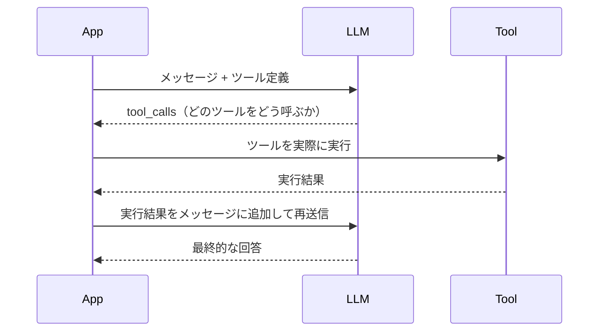

## 概要

Tool Use（Function Calling）はLLMにツールを使わせる仕組みです。ツールの定義方法・実行フロー・エラーハンドリングを学び、実用的なエージェントを設計します。

## 本文

### Tool Useの基本フロー



重要なポイント: **LLMはツールを実行しない**。LLMはツールの呼び出し指示を返すだけで、実際の実行はアプリケーション側が行います。

### ツール定義の書き方

OpenAI形式（多くのLLMが採用）でのツール定義：

```python
from openai import OpenAI
import json
import requests

client = OpenAI()

# ツール定義
tools = [
    {
        "type": "function",
        "function": {
            "name": "get_weather",
            "description": "指定した都市の現在の天気情報を取得する",
            "parameters": {
                "type": "object",
                "properties": {
                    "city": {
                        "type": "string",
                        "description": "都市名（例: Tokyo, Osaka）"
                    },
                    "unit": {
                        "type": "string",
                        "enum": ["celsius", "fahrenheit"],
                        "description": "温度の単位"
                    }
                },
                "required": ["city"],  # 必須パラメータを明示
                "additionalProperties": False
            }
        }
    },
    {
        "type": "function",
        "function": {
            "name": "send_email",
            "description": "指定したアドレスにメールを送信する",
            "parameters": {
                "type": "object",
                "properties": {
                    "to": {"type": "string", "description": "送信先メールアドレス"},
                    "subject": {"type": "string", "description": "件名"},
                    "body": {"type": "string", "description": "本文"}
                },
                "required": ["to", "subject", "body"],
                "additionalProperties": False
            }
        }
    }
]
```

### ツール実装とエージェントループ

```python
# ツールの実装（モック）
def get_weather(city: str, unit: str = "celsius") -> dict:
    # 実際はAPIを呼ぶ
    return {
        "city": city,
        "temperature": 22,
        "unit": unit,
        "condition": "晴れ",
        "humidity": 60
    }

def send_email(to: str, subject: str, body: str) -> dict:
    # 実際はSMTP等を使う
    print(f"メール送信: to={to}, subject={subject}")
    return {"status": "sent", "message_id": "msg_123"}

# ツール実行のディスパッチ
def execute_tool(tool_name: str, tool_args: dict) -> str:
    tool_map = {
        "get_weather": get_weather,
        "send_email": send_email,
    }
    if tool_name not in tool_map:
        return json.dumps({"error": f"ツール '{tool_name}' は存在しません"})

    try:
        result = tool_map[tool_name](**tool_args)
        return json.dumps(result, ensure_ascii=False)
    except Exception as e:
        return json.dumps({"error": str(e)})

# エージェントループ
def agent_loop(user_message: str, max_turns: int = 10) -> str:
    messages = [{"role": "user", "content": user_message}]

    for turn in range(max_turns):
        response = client.chat.completions.create(
            model="gpt-4o",
            messages=messages,
            tools=tools,
            tool_choice="auto"
        )
        message = response.choices[0].message
        messages.append(message.model_dump())

        # ツール呼び出しなし → 完了
        if not message.tool_calls:
            print(f"完了（{turn + 1}ターン）")
            return message.content

        # ツールを実行
        print(f"[ターン {turn + 1}] ツール呼び出し:")
        for tool_call in message.tool_calls:
            fn_name = tool_call.function.name
            fn_args = json.loads(tool_call.function.arguments)
            print(f"  - {fn_name}({fn_args})")

            result = execute_tool(fn_name, fn_args)
            messages.append({
                "role": "tool",
                "tool_call_id": tool_call.id,
                "content": result
            })

    return "最大ターン数に達しました"

# 実行例
answer = agent_loop("東京の天気を調べて、雨なら傘の準備を促すメールをtest@example.comに送って")
print(answer)
```

### tool_choice の制御

```python
# 常にツールを使う
response = client.chat.completions.create(
    model="gpt-4o",
    messages=messages,
    tools=tools,
    tool_choice="required"  # 必ずツールを使う
)

# 特定のツールを強制使用
response = client.chat.completions.create(
    model="gpt-4o",
    messages=messages,
    tools=tools,
    tool_choice={"type": "function", "function": {"name": "get_weather"}}
)

# ツールを使わない（通常のチャット）
response = client.chat.completions.create(
    model="gpt-4o",
    messages=messages,
    tools=tools,
    tool_choice="none"
)
```

### 並列ツール呼び出し

GPT-4oは複数のツールを同時に呼び出せます。

```python
# LLMが複数ツールを同時に呼び出した場合
if message.tool_calls and len(message.tool_calls) > 1:
    print(f"{len(message.tool_calls)}個のツールを並列実行")
    results = []
    for tool_call in message.tool_calls:
        result = execute_tool(
            tool_call.function.name,
            json.loads(tool_call.function.arguments)
        )
        results.append({
            "role": "tool",
            "tool_call_id": tool_call.id,
            "content": result
        })
    messages.extend(results)
```

### ツール設計のベストプラクティス

| 原則 | 説明 |
|------|------|
| 単一責任 | 1つのツールは1つのことだけ行う |
| 明確な説明 | `description`はLLMが判断できる十分な情報を含める |
| エラー処理 | エラーも構造化した形式で返し、LLMが判断できるようにする |
| 冪等性 | 同じ入力で何度呼んでも同じ結果になるよう設計する |
| 最小権限 | ツールに与える権限は必要最小限にする |

## ハンズオン

天気確認→メール送信を自動で行うエージェントを実装します。

**ステップ1: ツールを2つ定義する（天気取得・メール送信）**

上記のコードを参考にツール定義を作成してください。

**ステップ2: エージェントループを実装する**

```python
def my_agent(task: str) -> str:
    messages = [{"role": "user", "content": task}]
    for _ in range(5):
        response = client.chat.completions.create(
            model="gpt-4o-mini",
            messages=messages,
            tools=tools,
            tool_choice="auto"
        )
        msg = response.choices[0].message
        messages.append(msg.model_dump())
        if not msg.tool_calls:
            return msg.content
        for tc in msg.tool_calls:
            result = execute_tool(tc.function.name, json.loads(tc.function.arguments))
            messages.append({"role": "tool", "tool_call_id": tc.id, "content": result})
    return "完了"
```

**ステップ3: 複合タスクを与えてエージェントの動作を確認する**

```python
result = my_agent(
    "大阪の天気を調べて、その情報をまとめてteam@example.comに報告メールを送って"
)
print(result)
```

## クイズ

<!-- QUIZ:START -->
**Q1. Tool Useにおいて、LLMの役割として正しいものはどれですか？**

- A) ツールを直接実行して結果を返す
- B) どのツールをどの引数で呼ぶかの指示を返す
- C) ツール定義を自動生成する
- D) ツールの実行権限を管理する

**正解: B**
**解説:** LLMはツールを直接実行しません。LLMは「このツールをこの引数で呼んでほしい」という指示（tool_calls）を返すだけで、実際のツール実行はアプリケーション側が行います。結果を受け取ったLLMが最終的な回答を生成します。

**Q2. `tool_choice="required"`を設定した場合の動作はどれですか？**

- A) 最初に定義したツールのみを使用する
- B) LLMが必ずいずれかのツールを呼び出す
- C) ユーザーがツールを選ぶ
- D) ツールを使わずに回答する

**正解: B**
**解説:** `tool_choice="required"`は、LLMが必ずいずれかのツールを呼び出すことを強制します。通常の`"auto"`ではLLMがツールを使うかどうかを判断しますが、`"required"`では必ずツールを使います。

**Q3. ツール設計における「単一責任の原則」として正しいのはどれですか？**

- A) 1つのツールで複数の機能をまとめて提供する
- B) 1つのツールは1つの明確な目的のみを持つ
- C) ツールは1つのAPIしか呼べない
- D) 全ての処理を1つのツールで行う

**正解: B**
**解説:** ツールは単一の責任を持つよう設計します。例えば「メール送信と天気取得」を1つのツールにまとめるのではなく、別々のツールとして定義します。これにより、LLMが適切なツールを選択しやすくなり、エラーの影響範囲も限定できます。

<!-- QUIZ:END -->

## まとめ

- LLMはツールの呼び出し指示を返すだけで、実行はアプリケーション側が担う
- ツール定義の`description`の品質がエージェントの正確さに直結する
- エラーも構造化して返すことでLLMが状況を判断して対処できる
- 最大ターン数・最小権限などの制御設計がエージェントの安全運用に必須

## 次のレッスン

次のレッスンでは、エージェントの動作原理である「ReActパターン」（思考→行動→観察のループ）を詳しく学びます。
