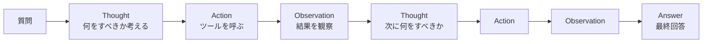

## 概要

ReAct（Reasoning + Acting）は、LLMが「思考→行動→観察」を繰り返すことで複雑な問題を解くパターンです。Chain-of-Thoughtとツール使用を組み合わせた実用的なエージェント実装方法を学びます。

## 本文

### ReActパターンとは

ReActは2022年に提案されたプロンプティング手法で、LLMに明示的に思考ステップを踏ませながらツールを使わせます。



### ReActの出力例

```
Question: 東京の人口は世界の都市の中で何位ですか？

Thought: まず東京の人口を調べ、次に世界の都市人口ランキングを検索する必要があります。

Action: search("東京 人口")
Observation: 東京都の人口は約1400万人（2024年）、東京圏（大都市圏）は約3700万人です。

Thought: 大都市圏の人口でランキングを確認します。

Action: search("世界 大都市圏 人口 ランキング")
Observation: 1位: 東京（3700万）, 2位: デリー（3200万）, 3位: 上海（2900万）...

Thought: 東京圏は世界最大の大都市圏であることが確認できました。

Answer: 東京は大都市圏の人口規模で世界第1位です（約3700万人）。
```

### ReActのプロンプト実装

```python
from openai import OpenAI

client = OpenAI()

REACT_SYSTEM_PROMPT = """あなたは問題解決エージェントです。
以下の形式で思考・行動・観察を繰り返して問題を解いてください。

Thought: [次に何をすべきか、なぜそうするかを日本語で考える]
Action: [ツール名]([引数])
Observation: [ツールの実行結果]
... (必要に応じて繰り返す)
Answer: [最終的な回答]

利用可能なツール:
- search(query: str): Web検索
- calculate(expr: str): 計算
- lookup_db(key: str): データベース検索
"""

def parse_action(text: str) -> tuple[str, str] | None:
    """
    "Action: search('query')" から ツール名と引数を抽出する
    """
    import re
    match = re.search(r"Action:\s*(\w+)\((.+?)\)", text)
    if match:
        tool_name = match.group(1)
        # 引数から引用符を除去
        args = match.group(2).strip("'\"")
        return tool_name, args
    return None

def run_react_agent(question: str, max_steps: int = 6) -> str:
    messages = [
        {"role": "system", "content": REACT_SYSTEM_PROMPT},
        {"role": "user", "content": f"Question: {question}"}
    ]

    for step in range(max_steps):
        response = client.chat.completions.create(
            model="gpt-4o",
            messages=messages,
            temperature=0,
            stop=["Observation:"]  # Observationの前で止める
        )
        output = response.choices[0].message.content
        print(f"\n--- Step {step + 1} ---\n{output}")

        # 最終回答の確認
        if "Answer:" in output:
            answer_start = output.index("Answer:") + len("Answer:")
            return output[answer_start:].strip()

        # Actionを解析してツールを実行
        action = parse_action(output)
        if action:
            tool_name, args = action
            observation = execute_tool(tool_name, args)
            # 観察結果をメッセージに追加
            messages.append({
                "role": "assistant",
                "content": output
            })
            messages.append({
                "role": "user",
                "content": f"Observation: {observation}"
            })
        else:
            break

    return "最大ステップ数に達しました"

def execute_tool(tool_name: str, args: str) -> str:
    """ツールのモック実装"""
    if tool_name == "search":
        return f"「{args}」の検索結果: [サンプルデータ]"
    elif tool_name == "calculate":
        try:
            return str(eval(args))
        except Exception:
            return "計算エラー"
    elif tool_name == "lookup_db":
        return f"DB検索結果 ({args}): [サンプルデータ]"
    return "不明なツール"
```

### Function Calling形式でのReAct

現代的な実装では、Tool Use（Function Calling）とReActを組み合わせます。

```python
tools = [
    {
        "type": "function",
        "function": {
            "name": "search",
            "description": "Web検索を実行する。事実確認・最新情報取得に使う",
            "parameters": {
                "type": "object",
                "properties": {
                    "query": {"type": "string"},
                    "reasoning": {
                        "type": "string",
                        "description": "なぜこの検索をするか（思考の記録）"
                    }
                },
                "required": ["query", "reasoning"]
            }
        }
    }
]

def react_with_function_calling(question: str) -> str:
    """
    Function CallingでReActを実装する
    reasoningフィールドで思考を記録させる
    """
    import json
    messages = [
        {
            "role": "system",
            "content": "問題を解く際は、ツールを使う前に必ずreasoning（なぜそのツールを使うか）を記述してください。"
        },
        {"role": "user", "content": question}
    ]

    for _ in range(8):
        response = client.chat.completions.create(
            model="gpt-4o",
            messages=messages,
            tools=tools,
            tool_choice="auto"
        )
        msg = response.choices[0].message
        messages.append(msg.model_dump())

        if not msg.tool_calls:
            return msg.content

        for tc in msg.tool_calls:
            args = json.loads(tc.function.arguments)
            print(f"[思考] {args.get('reasoning', '')}")
            print(f"[行動] {tc.function.name}({args.get('query', '')})")
            result = f"検索結果: {args['query']}に関するデータ..."
            print(f"[観察] {result}\n")

            messages.append({
                "role": "tool",
                "tool_call_id": tc.id,
                "content": result
            })

    return "完了"
```

### ReActの長所と限界

| 観点 | 内容 |
|------|------|
| 長所 | 思考過程が可視化されデバッグしやすい |
| 長所 | 複雑なマルチステップ問題を体系的に解ける |
| 長所 | 誤った方向に進んでいたら途中で修正できる |
| 限界 | ステップが増えるとコストとレイテンシが増大する |
| 限界 | 思考の誤りが次のステップに伝播する |
| 限界 | 並列実行が難しい |

## ハンズオン

ReActパターンで「為替計算タスク」を解くエージェントを実装します。

**タスク:** 「1ドルが145円のとき、500ドルは何円ですか？また、その金額でAppleの株（仮に200ドル）は何株買えますか？」

**ステップ1: 必要なツールを定義する**

```python
tools_for_react = [
    {
        "type": "function",
        "function": {
            "name": "calculate",
            "description": "算術計算を実行する",
            "parameters": {
                "type": "object",
                "properties": {
                    "expression": {"type": "string", "description": "計算式（例: 500 * 145）"},
                    "reasoning": {"type": "string", "description": "なぜこの計算をするか"}
                },
                "required": ["expression", "reasoning"]
            }
        }
    }
]
```

**ステップ2: エージェントを実行して思考ステップを確認する**

```python
def run_with_logging(question: str) -> str:
    import json
    messages = [{"role": "user", "content": question}]
    step = 0
    for _ in range(5):
        step += 1
        res = client.chat.completions.create(
            model="gpt-4o-mini",
            messages=messages,
            tools=tools_for_react,
            tool_choice="auto"
        )
        msg = res.choices[0].message
        messages.append(msg.model_dump())
        if not msg.tool_calls:
            return msg.content
        for tc in msg.tool_calls:
            args = json.loads(tc.function.arguments)
            print(f"Step {step}: {args.get('reasoning')}")
            result = str(eval(args["expression"]))
            print(f"  計算: {args['expression']} = {result}")
            messages.append({"role": "tool", "tool_call_id": tc.id, "content": result})
    return "完了"

print(run_with_logging(
    "1ドル145円のとき、500ドルは何円？その円でApple株（1株200ドル換算）は何株買える？"
))
```

## クイズ

<!-- QUIZ:START -->
**Q1. ReActパターンの「Reason」（思考）を明示する主な利点はどれですか？**

- A) LLMの推論速度が向上する
- B) エージェントの思考過程が可視化され、デバッグが容易になる
- C) トークン消費量が減少する
- D) ツールの実行回数を制限できる

**正解: B**
**解説:** ReActの大きな利点の一つは、思考（Reasoning）を明示的にテキストで出力させることで、エージェントが「なぜそのアクションを選んだか」を人間が確認できる点です。これによりデバッグや品質改善が容易になります。

**Q2. ReActで`stop=["Observation:"]`を設定する目的は何ですか？**

- A) LLMがObservationを勝手に生成するのを防ぐ
- B) 観察結果の文字数を制限する
- C) 観察ステップをスキップする
- D) ツールの実行を停止する

**正解: A**
**解説:** `stop=["Observation:"]`はLLMが"Observation:"という文字列を出力しようとした時点で生成を停止させる設定です。Observationはツールの実行結果（アプリ側が提供するもの）なので、LLMが自分でObservationを作ってしまうのを防ぎます。

**Q3. Function Calling形式でReActを実装する際に`reasoning`フィールドをツール引数に含める理由は何ですか？**

- A) APIが必須フィールドとして要求するため
- B) LLMが「なぜそのツールを使うか」を記録・表明させるため
- C) ツールの実行速度を向上させるため
- D) エラーメッセージを分かりやすくするため

**正解: B**
**解説:** `reasoning`フィールドをツール引数に含めることで、LLMがツールを呼び出す前に自分の意図・理由を言語化するよう促せます。これはReActの「思考」ステップをFunction Calling形式で実現する工夫であり、エージェントの透明性が向上します。

<!-- QUIZ:END -->

## まとめ

- ReActは思考（Reason）と行動（Act）を交互に繰り返すエージェントパターン
- 思考を明示することで複雑な問題を体系的に解き、デバッグも容易になる
- Function Callingの`reasoning`フィールドでReActの思考ステップを実装できる
- ステップ数・コスト増大が課題で、並列化・最適化の工夫が必要

## 次のレッスン

次のレッスンでは、複数のエージェントが協調して大きなタスクを分担する「マルチエージェントパターン」を学びます。
