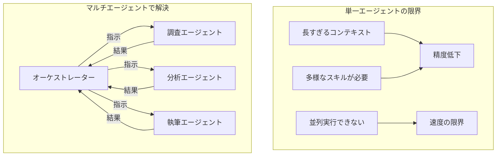
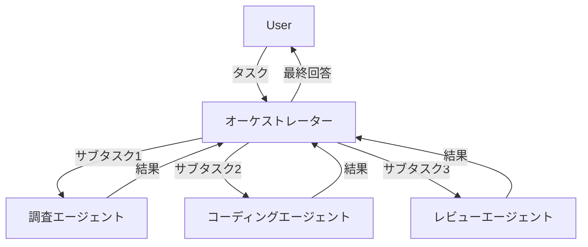

## 概要

単一エージェントでは限界のある複雑なタスクを、複数のエージェントが役割分担して解決するマルチエージェントパターンを学びます。オーケストレーター・サブエージェント・並列実行の設計手法を理解します。

## 本文

### なぜマルチエージェントが必要か



### マルチエージェントの主要パターン

**パターン1: オーケストレーター・サブエージェント**



**パターン2: パイプライン（直列）**

```
エージェントA（調査）→ エージェントB（分析）→ エージェントC（報告）
```

各エージェントが前のエージェントの出力を受け取って処理する。

**パターン3: ピアツーピア（議論・批評）**

複数エージェントが同じ問題に対して回答を出し合い、互いにレビューする。

### 基本的なマルチエージェント実装

```python
from openai import OpenAI
from typing import Callable

client = OpenAI()

class Agent:
    """汎用エージェントクラス"""

    def __init__(self, name: str, system_prompt: str, tools: list = None):
        self.name = name
        self.system_prompt = system_prompt
        self.tools = tools or []

    def run(self, message: str) -> str:
        messages = [
            {"role": "system", "content": self.system_prompt},
            {"role": "user", "content": message}
        ]
        kwargs = {"model": "gpt-4o", "messages": messages}
        if self.tools:
            kwargs["tools"] = self.tools
            kwargs["tool_choice"] = "auto"

        response = client.chat.completions.create(**kwargs)
        return response.choices[0].message.content


# 専門エージェントの定義
researcher = Agent(
    name="調査エージェント",
    system_prompt="""あなたはリサーチの専門家です。
    与えられたトピックについて詳細な情報を収集・整理してください。
    情報は箇条書きで提供してください。"""
)

analyst = Agent(
    name="分析エージェント",
    system_prompt="""あなたはデータ分析の専門家です。
    提供された情報を分析し、重要な洞察・課題・機会を特定してください。"""
)

writer = Agent(
    name="ライターエージェント",
    system_prompt="""あなたはビジネスライターです。
    提供された情報と分析を元に、分かりやすいビジネスレポートを作成してください。"""
)


class Orchestrator:
    """タスクを分解してサブエージェントに委譲するオーケストレーター"""

    def __init__(self):
        self.agents = {
            "researcher": researcher,
            "analyst": analyst,
            "writer": writer
        }

    def run_pipeline(self, topic: str) -> str:
        print(f"[オーケストレーター] トピック: {topic}")

        # ステップ1: 調査
        print("[調査エージェント] 情報収集中...")
        research = self.agents["researcher"].run(
            f"以下のトピックについて情報を収集してください: {topic}"
        )
        print(f"調査完了: {research[:100]}...\n")

        # ステップ2: 分析
        print("[分析エージェント] 分析中...")
        analysis = self.agents["analyst"].run(
            f"以下の情報を分析してください:\n{research}"
        )
        print(f"分析完了: {analysis[:100]}...\n")

        # ステップ3: レポート作成
        print("[ライターエージェント] レポート作成中...")
        report = self.agents["writer"].run(
            f"以下の情報と分析を元にレポートを作成してください:\n"
            f"情報:\n{research}\n\n分析:\n{analysis}"
        )
        return report


orchestrator = Orchestrator()
report = orchestrator.run_pipeline("生成AIのビジネス活用における2024年の動向")
print(report)
```

### 並列実行によるスピードアップ

```python
import asyncio
from openai import AsyncOpenAI

async_client = AsyncOpenAI()

async def run_agent_async(name: str, system_prompt: str, message: str) -> tuple[str, str]:
    """エージェントを非同期で実行する"""
    response = await async_client.chat.completions.create(
        model="gpt-4o-mini",
        messages=[
            {"role": "system", "content": system_prompt},
            {"role": "user", "content": message}
        ]
    )
    return name, response.choices[0].message.content

async def parallel_research(topic: str) -> dict[str, str]:
    """複数の観点から並列調査する"""
    tasks = [
        run_agent_async(
            "技術観点",
            "技術的な観点からのみ分析してください",
            f"{topic}について分析"
        ),
        run_agent_async(
            "ビジネス観点",
            "ビジネス・経営的な観点からのみ分析してください",
            f"{topic}について分析"
        ),
        run_agent_async(
            "リスク観点",
            "リスクと課題の観点からのみ分析してください",
            f"{topic}について分析"
        ),
    ]
    results = await asyncio.gather(*tasks)
    return dict(results)

# 実行
results = asyncio.run(parallel_research("社内チャットボット導入"))
for perspective, analysis in results.items():
    print(f"【{perspective}】\n{analysis[:200]}\n")
```

### エージェント間の通信設計

```python
from dataclasses import dataclass
from typing import Any

@dataclass
class AgentMessage:
    """エージェント間のメッセージ形式"""
    sender: str
    receiver: str
    content: str
    metadata: dict[str, Any] = None
    message_type: str = "task"  # task / result / error

class MessageBus:
    """エージェント間のメッセージを管理する"""

    def __init__(self):
        self.messages: list[AgentMessage] = []
        self.agents: dict[str, Agent] = {}

    def register(self, agent: Agent):
        self.agents[agent.name] = agent

    def send(self, message: AgentMessage) -> AgentMessage:
        self.messages.append(message)
        target_agent = self.agents.get(message.receiver)
        if not target_agent:
            return AgentMessage(
                sender="bus",
                receiver=message.sender,
                content="エラー: 受信エージェントが見つかりません",
                message_type="error"
            )
        result = target_agent.run(message.content)
        return AgentMessage(
            sender=message.receiver,
            receiver=message.sender,
            content=result,
            message_type="result"
        )
```

## ハンズオン

2つのエージェントが協力してコードレビューを行うシステムを実装します。

**ステップ1: コーダーとレビュアーを定義する**

```python
coder = Agent(
    name="コーダー",
    system_prompt="Pythonのコードを書く専門家です。要求に応じた実装を提供してください。"
)

reviewer = Agent(
    name="レビュアー",
    system_prompt="""Pythonコードのレビュアーです。
    以下の観点でレビューしてください:
    1. バグ・エラーの可能性
    2. 可読性・コード品質
    3. パフォーマンス
    具体的な改善提案を含めてください。"""
)
```

**ステップ2: コーダー→レビュアーのパイプラインを実装する**

```python
def code_review_pipeline(requirement: str) -> dict:
    # コーダーがコードを書く
    code = coder.run(f"以下を実装してください: {requirement}")
    print("=== 生成されたコード ===")
    print(code)

    # レビュアーがレビューする
    review = reviewer.run(f"以下のコードをレビューしてください:\n{code}")
    print("\n=== レビュー結果 ===")
    print(review)

    return {"code": code, "review": review}

result = code_review_pipeline("ファイルを読み込んで行数を数える関数")
```

**ステップ3: レビューのフィードバックをコーダーに返してコードを改善する**

レビュー結果を受け取ってコーダーが修正するループを実装してみましょう。

## クイズ

<!-- QUIZ:START -->
**Q1. マルチエージェントのオーケストレーターパターンでオーケストレーターの役割はどれですか？**

- A) 全ての処理を自分で実行する
- B) タスクを分解しサブエージェントに委譲して結果を統合する
- C) データベースへのアクセスのみを担当する
- D) ユーザーへの最終回答を生成しない

**正解: B**
**解説:** オーケストレーターは「指揮者」の役割で、大きなタスクをサブタスクに分解し、適切なサブエージェントに委譲し、各エージェントの結果を統合して最終的な出力を生成します。自分では専門的な処理は行いません。

**Q2. マルチエージェントで非同期（asyncio）を使う主なメリットはどれですか？**

- A) 単一エージェントより精度が上がる
- B) 独立した複数のエージェントを並列実行してレイテンシを削減できる
- C) エージェントの数を無制限に増やせる
- D) APIコストがかからなくなる

**正解: B**
**解説:** 複数のエージェントが独立したタスクを実行する場合（並列調査など）、asyncioを使って同時実行することで、直列実行と比べて大幅に時間を短縮できます。例えば3つのエージェントが各10秒かかる場合、並列なら約10秒、直列なら30秒かかります。

**Q3. マルチエージェントシステムで「パイプライン（直列）」パターンが適しているのはどれですか？**

- A) 全エージェントが同じ処理を並列で行う場合
- B) 前の処理の結果が次の処理の入力となる順序依存の処理
- C) エージェント同士が議論して合意形成する場合
- D) 単一のタスクを1つのエージェントで完結させる場合

**正解: B**
**解説:** パイプラインパターンは「A → B → C」と前のエージェントの出力が次のエージェントの入力になる場合に適しています。例えば「情報収集 → 分析 → 報告書作成」のように各ステップが依存関係を持つ処理です。

<!-- QUIZ:END -->

## まとめ

- マルチエージェントは単一エージェントの限界（コンテキスト長・速度・専門性）を克服する
- オーケストレーター・パイプライン・ピアツーピアの3つの主要パターンがある
- asyncioで独立タスクを並列実行することで大幅なスピードアップが可能
- エージェント間のメッセージ形式を標準化することでシステムの拡張性が上がる

## 次のレッスン

次のレッスンでは、エージェント・RAGの実装を効率化するフレームワークであるLangChainとLlamaIndexの概要と使いどころを学びます。
