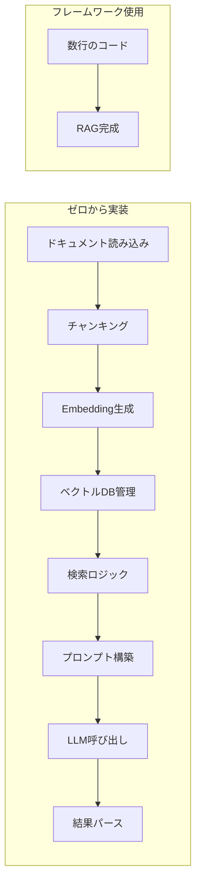

## 概要

LangChainとLlamaIndexはRAG・エージェント開発を効率化するPythonフレームワークです。それぞれの特徴・使い分け・基本的な使い方を学びます。

## 本文

### フレームワークを使う理由

RAGやエージェントをゼロから実装すると多くのボイラープレートコードが必要です。



### LangChain の概要

汎用LLMアプリケーションフレームワーク。LCEL（LangChain Expression Language）でコンポーネントをチェーンできます。

```python
# pip install langchain langchain-openai langchain-community chromadb
from langchain_openai import ChatOpenAI, OpenAIEmbeddings
from langchain.document_loaders import TextLoader
from langchain.text_splitter import RecursiveCharacterTextSplitter
from langchain.vectorstores import Chroma
from langchain.chains import RetrievalQA

# ドキュメントの読み込み
loader = TextLoader("company_docs.txt", encoding="utf-8")
docs = loader.load()

# チャンキング
splitter = RecursiveCharacterTextSplitter(chunk_size=500, chunk_overlap=50)
chunks = splitter.split_documents(docs)

# ベクトルDBへ登録
embeddings = OpenAIEmbeddings(model="text-embedding-3-small")
vectorstore = Chroma.from_documents(chunks, embeddings)

# RAGチェーンの構築
llm = ChatOpenAI(model="gpt-4o-mini", temperature=0)
qa_chain = RetrievalQA.from_chain_type(
    llm=llm,
    retriever=vectorstore.as_retriever(search_kwargs={"k": 3}),
    return_source_documents=True
)

# 実行
result = qa_chain.invoke({"query": "有給休暇の申請手順は？"})
print(result["result"])
print("参照元:", [d.metadata for d in result["source_documents"]])
```

### LCEL（LangChain Expression Language）

パイプライン記法でチェーンを構築できます。

```python
from langchain_core.prompts import ChatPromptTemplate
from langchain_core.output_parsers import StrOutputParser
from langchain_openai import ChatOpenAI

llm = ChatOpenAI(model="gpt-4o-mini")

# プロンプトテンプレート定義
prompt = ChatPromptTemplate.from_template("""
以下のコンテキストを参考にして質問に答えてください。

コンテキスト:
{context}

質問: {question}
""")

# LCELでチェーンを構築（| でつなぐ）
chain = prompt | llm | StrOutputParser()

# 実行
response = chain.invoke({
    "context": "有給休暇は入社6か月後から付与されます。",
    "question": "いつから有給が使えますか？"
})
print(response)
```

### LangChain エージェント

```python
from langchain.agents import create_tool_calling_agent, AgentExecutor
from langchain_core.tools import tool
from langchain_openai import ChatOpenAI
from langchain_core.prompts import ChatPromptTemplate

@tool
def get_weather(city: str) -> str:
    """指定した都市の天気を取得する"""
    return f"{city}の天気: 晴れ、気温22度"

@tool
def calculate(expression: str) -> str:
    """数式を計算する"""
    try:
        return str(eval(expression))
    except Exception as e:
        return f"エラー: {e}"

tools = [get_weather, calculate]
llm = ChatOpenAI(model="gpt-4o", temperature=0)

prompt = ChatPromptTemplate.from_messages([
    ("system", "あなたはアシスタントです。"),
    ("human", "{input}"),
    ("placeholder", "{agent_scratchpad}"),
])

agent = create_tool_calling_agent(llm, tools, prompt)
executor = AgentExecutor(agent=agent, tools=tools, verbose=True)

result = executor.invoke({"input": "東京の天気を調べて、気温を華氏に変換して"})
print(result["output"])
```

### LlamaIndex の概要

RAG（検索拡張生成）に特化したフレームワーク。LangChainよりRAGの機能が充実しています。

```python
# pip install llama-index llama-index-llms-openai llama-index-embeddings-openai
from llama_index.core import VectorStoreIndex, SimpleDirectoryReader, Settings
from llama_index.llms.openai import OpenAI
from llama_index.embeddings.openai import OpenAIEmbedding

# グローバル設定
Settings.llm = OpenAI(model="gpt-4o-mini", temperature=0)
Settings.embed_model = OpenAIEmbedding(model="text-embedding-3-small")

# ドキュメント読み込みとインデックス作成
documents = SimpleDirectoryReader("./docs").load_data()
index = VectorStoreIndex.from_documents(documents)

# クエリエンジン
query_engine = index.as_query_engine(similarity_top_k=3)
response = query_engine.query("有給休暇の申請手順を教えてください")
print(response)
print("\n参照ノード:")
for node in response.source_nodes:
    print(f"  スコア: {node.score:.3f} | {node.text[:80]}...")
```

### LlamaIndex の高度な機能

```python
from llama_index.core import VectorStoreIndex
from llama_index.core.node_parser import SentenceSplitter
from llama_index.core.retrievers import VectorIndexRetriever
from llama_index.core.query_engine import RetrieverQueryEngine
from llama_index.core.postprocessor import SimilarityPostprocessor

# カスタムチャンキング
parser = SentenceSplitter(chunk_size=512, chunk_overlap=50)
nodes = parser.get_nodes_from_documents(documents)
index = VectorStoreIndex(nodes)

# カスタムリトリーバー（類似度閾値付き）
retriever = VectorIndexRetriever(index=index, similarity_top_k=10)
postprocessor = SimilarityPostprocessor(similarity_cutoff=0.7)

query_engine = RetrieverQueryEngine(
    retriever=retriever,
    node_postprocessors=[postprocessor]
)
```

### LangChain vs LlamaIndex の選び方

| 観点 | LangChain | LlamaIndex |
|------|-----------|------------|
| 特化領域 | 汎用LLMアプリ・エージェント | RAG・検索特化 |
| 学習コスト | やや高い（抽象化が多い） | 低い（RAGに特化） |
| RAG機能 | 基本的 | 豊富（評価・最適化含む） |
| エージェント | 充実 | 基本的 |
| 採用実績 | 非常に多い | 多い |
| 適した用途 | 複雑なエージェント・チェーン | 本格的なRAGシステム |

**選択の目安:**
- RAG専用なら → **LlamaIndex**
- エージェント・複雑なチェーンなら → **LangChain**
- シンプルなRAGや学習目的なら → **どちらも不要**（直接実装が理解を深める）

## ハンズオン

LlamaIndexを使ってMarkdownファイルのRAGを実装します。

**ステップ1: インストール**

```bash
pip install llama-index llama-index-llms-openai llama-index-embeddings-openai
```

**ステップ2: テスト用ドキュメントを作成してインデックス化**

```python
from llama_index.core import Document, VectorStoreIndex, Settings
from llama_index.llms.openai import OpenAI
from llama_index.embeddings.openai import OpenAIEmbedding

Settings.llm = OpenAI(model="gpt-4o-mini")
Settings.embed_model = OpenAIEmbedding(model="text-embedding-3-small")

docs = [
    Document(text="有給休暇は入社6か月後から10日付与されます。申請は社内ポータルから行います。"),
    Document(text="経費精算は月末までに申請してください。上限は1回5万円です。"),
    Document(text="リモートワークは週3日まで可能です。毎週月曜に申請が必要です。"),
]

index = VectorStoreIndex.from_documents(docs)
engine = index.as_query_engine()
```

**ステップ3: クエリを実行してソースノードを確認する**

```python
questions = [
    "有給はいつからもらえますか？",
    "経費精算の締め切りはいつですか？",
    "リモートワークの申請方法を教えてください",
]

for q in questions:
    resp = engine.query(q)
    print(f"Q: {q}")
    print(f"A: {resp}\n")
```

## クイズ

<!-- QUIZ:START -->
**Q1. LangChainの`|`（パイプ）演算子（LCEL）の役割はどれですか？**

- A) Python標準のビット演算OR
- B) コンポーネントを順番につなげてパイプラインを構築する
- C) エラーをキャッチして次のコンポーネントに渡す
- D) 並列実行を指定する

**正解: B**
**解説:** LCELの`|`演算子はコンポーネントをチェーン（連結）するためのものです。`prompt | llm | parser`のように書くと、プロンプトの出力がLLMの入力に、LLMの出力がパーサーの入力になるパイプラインが形成されます。

**Q2. LlamaIndexがLangChainより優れているとされる場面はどれですか？**

- A) 複雑なマルチエージェントシステムの構築
- B) 本格的なRAGシステムの構築（豊富な検索・評価機能）
- C) UIとの統合
- D) データベースへの直接書き込み

**正解: B**
**解説:** LlamaIndexはRAG専用に設計されており、高度なリトリーバー・後処理・評価機能が充実しています。一方LangChainはエージェントや複雑なチェーン構築が得意です。RAGに特化するなら LlamaIndexの方が多機能で使いやすいです。

**Q3. フレームワーク（LangChain・LlamaIndex）を使わずに直接実装する利点はどれですか？**

- A) パフォーマンスが常に高い
- B) 仕組みを深く理解でき、デバッグや最適化がしやすい
- C) コード量が少なくなる
- D) 自動的にコストが最適化される

**正解: B**
**解説:** フレームワークは便利ですが抽象化が多く、内部で何が起きているか分かりにくくなることがあります。直接実装することで仕組みを深く理解でき、問題発生時のデバッグや要件に合わせた最適化がしやすくなります。学習段階ではまず直接実装することを推奨します。

<!-- QUIZ:END -->

## まとめ

- LangChainは汎用LLMアプリ・エージェント構築に適したフレームワーク
- LlamaIndexはRAG・検索特化で豊富な評価・最適化機能を持つ
- LCELの`|`演算子でコンポーネントをシンプルに連結できる
- 学習目的なら最初は直接実装し、仕組みを理解してからフレームワークを使うのが推奨

## 次のレッスン

次のレッスンでは、エージェントが状態を記憶し続けるための「メモリ管理」パターンを学びます。
