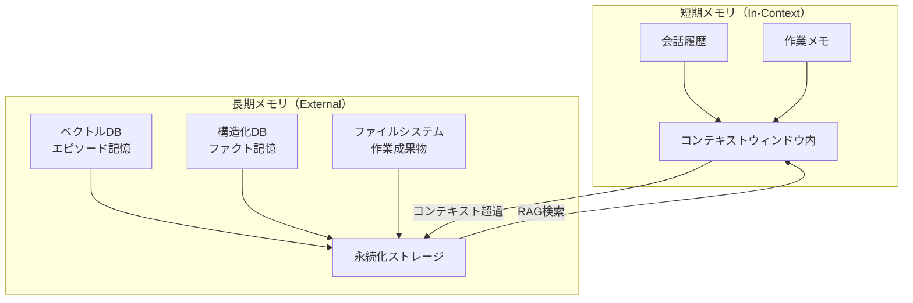

## 概要

エージェントが長期的なタスクをこなすには、情報を適切に記憶・参照する仕組みが必要です。短期メモリ・長期メモリ・エピソードメモリの設計パターンと実装方法を学びます。

## 本文

### メモリの種類と役割



### 短期メモリ: 会話履歴の管理

最もシンプルな形のメモリです。LLMのコンテキストウィンドウに履歴を詰め込みます。

```python
from openai import OpenAI
from collections import deque

client = OpenAI()

class ConversationMemory:
    """
    短期メモリ: 最近のN回の会話を保持する
    コンテキスト長を超えないよう自動でトリミングする
    """

    def __init__(self, max_messages: int = 20):
        self.messages: deque = deque(maxlen=max_messages)
        self.system_prompt = "あなたは親切なアシスタントです。"

    def add(self, role: str, content: str):
        self.messages.append({"role": role, "content": content})

    def get_messages(self) -> list[dict]:
        return [
            {"role": "system", "content": self.system_prompt},
            *list(self.messages)
        ]

    def chat(self, user_message: str) -> str:
        self.add("user", user_message)
        response = client.chat.completions.create(
            model="gpt-4o-mini",
            messages=self.get_messages()
        )
        reply = response.choices[0].message.content
        self.add("assistant", reply)
        return reply


memory = ConversationMemory(max_messages=10)
print(memory.chat("私の名前は田中です"))
print(memory.chat("今日はPythonを勉強しています"))
print(memory.chat("私の名前を覚えていますか？"))  # → 田中さん、と答えられる
```

### 要約メモリ: 長い会話の圧縮

会話が長くなったらLLMで要約して圧縮します。

```python
class SummaryMemory:
    """
    会話が長くなったら過去の部分を要約して圧縮する
    """

    def __init__(self, summary_threshold: int = 10):
        self.recent_messages: list[dict] = []
        self.summary: str = ""
        self.summary_threshold = summary_threshold

    def _summarize(self) -> str:
        """過去の会話を要約する"""
        if not self.recent_messages:
            return self.summary

        conv_text = "\n".join([
            f"{m['role']}: {m['content']}"
            for m in self.recent_messages[:-4]  # 最新4件は残す
        ])
        prompt = f"""以下の会話履歴を100文字以内で要約してください。
重要な事実・決定事項・ユーザーの好みを含めてください。

既存の要約: {self.summary}

追加の会話:
{conv_text}

新しい要約:"""
        response = client.chat.completions.create(
            model="gpt-4o-mini",
            messages=[{"role": "user", "content": prompt}],
            temperature=0
        )
        return response.choices[0].message.content

    def add(self, role: str, content: str):
        self.recent_messages.append({"role": role, "content": content})
        if len(self.recent_messages) > self.summary_threshold:
            self.summary = self._summarize()
            self.recent_messages = self.recent_messages[-4:]  # 最新4件を保持

    def get_messages(self) -> list[dict]:
        messages = [{"role": "system", "content": "あなたはアシスタントです。"}]
        if self.summary:
            messages.append({
                "role": "system",
                "content": f"これまでの会話の要約: {self.summary}"
            })
        messages.extend(self.recent_messages)
        return messages
```

### 長期メモリ: ベクトルDBによるエピソード記憶

```python
import chromadb
from chromadb.utils import embedding_functions
import json
from datetime import datetime

class EpisodicMemory:
    """
    長期メモリ: 重要な情報をベクトルDBに保存し、必要に応じて検索する
    """

    def __init__(self):
        self.db = chromadb.Client()
        openai_ef = embedding_functions.OpenAIEmbeddingFunction(
            api_key="your-api-key",
            model_name="text-embedding-3-small"
        )
        self.collection = self.db.create_collection(
            "agent_memory",
            embedding_function=openai_ef
        )
        self._counter = 0

    def store(self, content: str, metadata: dict = None):
        """重要な情報をメモリに保存する"""
        self._counter += 1
        self.collection.add(
            documents=[content],
            ids=[f"mem_{self._counter}"],
            metadatas=[{
                "timestamp": datetime.now().isoformat(),
                **(metadata or {})
            }]
        )

    def recall(self, query: str, n: int = 3) -> list[str]:
        """関連するメモリを検索して返す"""
        results = self.collection.query(
            query_texts=[query],
            n_results=min(n, self._counter) if self._counter > 0 else 1
        )
        return results["documents"][0] if results["documents"] else []


class AgentWithMemory:
    """長期・短期メモリを持つエージェント"""

    def __init__(self):
        self.short_term = ConversationMemory(max_messages=10)
        self.long_term = EpisodicMemory()

    def chat(self, user_input: str) -> str:
        # 関連する長期記憶を検索
        relevant_memories = self.long_term.recall(user_input)

        # システムプロンプトに長期記憶を組み込む
        if relevant_memories:
            memory_context = "\n".join(relevant_memories)
            self.short_term.system_prompt = (
                f"あなたはアシスタントです。\n"
                f"以下は記憶している重要な情報です:\n{memory_context}"
            )

        response = self.short_term.chat(user_input)

        # 重要な情報を長期記憶に保存（実際はLLMで判断させる）
        if any(keyword in user_input for keyword in ["覚えて", "メモ", "重要"]):
            self.long_term.store(user_input, {"type": "user_request"})

        return response
```

### メモリの種類まとめ

| 種類 | 実装方法 | 特徴 | 用途 |
|------|---------|------|------|
| 短期（バッファ） | リスト（deque） | 高速・シンプル | 直近の会話 |
| 短期（要約） | LLM要約 | コンパクト | 長い会話の圧縮 |
| 長期（エピソード） | ベクトルDB | 意味検索可能 | 過去の会話・事実 |
| 長期（ファクト） | 構造化DB | 正確・更新可能 | ユーザープロフィール |

## ハンズオン

名前と好みを記憶し続けるパーソナルアシスタントを実装します。

**ステップ1: バッファメモリを持つアシスタントを作る**

```python
from openai import OpenAI
from collections import deque

client = OpenAI()

class PersonalAssistant:
    def __init__(self):
        self.history = deque(maxlen=20)
        self.user_profile = {}  # ユーザー情報を構造化して保存

    def update_profile(self, key: str, value: str):
        self.user_profile[key] = value
        print(f"[メモリ更新] {key}: {value}")

    def get_system_prompt(self) -> str:
        profile_text = "\n".join([f"- {k}: {v}" for k, v in self.user_profile.items()])
        return (
            "あなたはパーソナルアシスタントです。\n"
            f"ユーザー情報:\n{profile_text}" if profile_text else
            "あなたはパーソナルアシスタントです。"
        )

    def chat(self, message: str) -> str:
        self.history.append({"role": "user", "content": message})
        messages = [{"role": "system", "content": self.get_system_prompt()}]
        messages.extend(list(self.history))
        res = client.chat.completions.create(
            model="gpt-4o-mini", messages=messages
        )
        reply = res.choices[0].message.content
        self.history.append({"role": "assistant", "content": reply})
        return reply
```

**ステップ2: 会話を通じてプロフィールを更新する**

```python
assistant = PersonalAssistant()
assistant.update_profile("名前", "田中太郎")
assistant.update_profile("好きなプログラミング言語", "Python")

print(assistant.chat("私の名前を教えてください"))
print(assistant.chat("私が好きな言語は何ですか？"))
```

**ステップ3: 10回以上会話してメモリが機能していることを確認する**

## クイズ

<!-- QUIZ:START -->
**Q1. エージェントの「短期メモリ」として最も一般的な実装はどれですか？**

- A) ベクトルデータベース
- B) LLMのコンテキストウィンドウ内に会話履歴を保持するリスト
- C) RDBMSのテーブル
- D) ファイルシステム

**正解: B**
**解説:** 短期メモリの最も一般的な実装は、会話履歴をメッセージリストとしてLLMのコンテキストウィンドウに渡す方法です。シンプルで高速ですが、コンテキスト長の上限があるため長い会話では工夫が必要です。

**Q2. 要約メモリ（Summary Memory）を使う主な目的は何ですか？**

- A) 回答速度を向上させる
- B) コンテキスト長の制限内に収まるよう過去の会話を圧縮する
- C) ユーザーの個人情報を暗号化する
- D) 複数のエージェント間でメモリを共有する

**正解: B**
**解説:** 会話が長くなるとコンテキストウィンドウの上限を超えてしまいます。要約メモリは過去の会話をLLMで要約・圧縮することで、重要な情報を保持しながらもトークン数を削減できます。

**Q3. ベクトルDBを使ったエピソードメモリの利点はどれですか？**

- A) データの更新が簡単にできる
- B) 意味的に類似した過去の記憶を検索して取得できる
- C) 数値計算が高速になる
- D) リアルタイムで記憶を更新できない

**正解: B**
**解説:** ベクトルDBを使ったエピソードメモリの最大の利点は「意味検索」です。「旅行の話」というクエリで「先週京都に行った」という記憶を検索できるように、キーワード一致ではなく意味的な類似度で過去の記憶を取得できます。

<!-- QUIZ:END -->

## まとめ

- エージェントのメモリは短期（コンテキスト内）と長期（外部ストレージ）に分けられる
- バッファメモリはシンプルだがコンテキスト長の制限があり、要約で圧縮する
- ベクトルDBを使ったエピソードメモリで意味検索による長期記憶を実現できる
- ユーザープロフィールなどの構造化情報は通常のDBで管理するのが適している

## 次のレッスン

次のレッスンでは、構築したRAGシステムとエージェントの品質を測定・改善するための評価手法を学びます。
