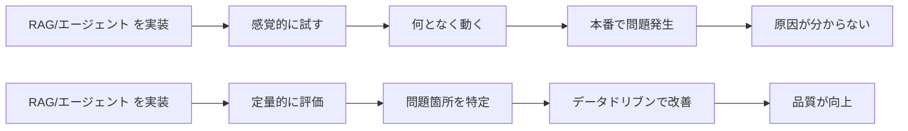
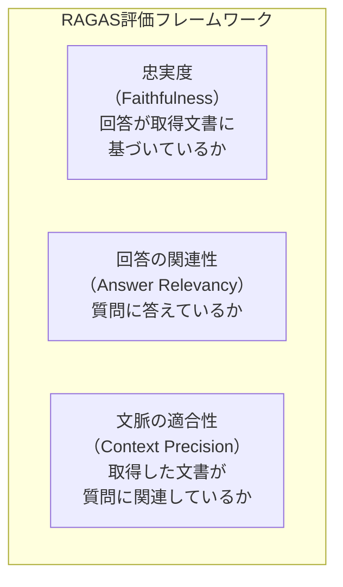

## 概要

RAGシステムとエージェントの品質を定量的に評価する方法を学びます。RAGAS・忠実度・文脈適合性などの指標と、LLM-as-a-Judgeを使った評価の実装を理解します。

## 本文

### なぜ評価が重要か



### RAG評価の3つの主要指標



### LLM-as-a-Judge による評価

LLM自身を評価者として使います。

```python
from openai import OpenAI
import json

client = OpenAI()

def evaluate_faithfulness(
    question: str,
    answer: str,
    context: str
) -> dict:
    """
    忠実度評価: 回答が取得したコンテキストに基づいているか
    1〜5のスコアで評価する
    """
    prompt = f"""以下の回答が、提供されたコンテキストのみに基づいているかを評価してください。

コンテキスト:
{context}

質問: {question}
回答: {answer}

評価基準:
5: 回答の全ての情報がコンテキストに明示的に記載されている
4: 回答の大部分がコンテキストに基づいている
3: 一部コンテキスト外の情報が含まれる
2: 多くの部分がコンテキスト外の情報
1: 回答がコンテキストと無関係、または矛盾している

以下のJSON形式で回答してください:
{{
  "score": <1-5の整数>,
  "reason": "<評価理由>"
}}"""

    response = client.chat.completions.create(
        model="gpt-4o-mini",
        messages=[{"role": "user", "content": prompt}],
        temperature=0,
        response_format={"type": "json_object"}
    )
    return json.loads(response.choices[0].message.content)


def evaluate_answer_relevancy(question: str, answer: str) -> dict:
    """回答の関連性評価: 質問に対して適切に答えているか"""
    prompt = f"""以下の質問と回答の関連性を評価してください。

質問: {question}
回答: {answer}

評価基準:
5: 質問に完全かつ直接的に答えている
4: 質問にほぼ答えているが、一部不足がある
3: 部分的に答えているが、重要な情報が欠けている
2: 質問への回答が不十分
1: 質問と無関係な回答

以下のJSON形式で回答してください:
{{
  "score": <1-5の整数>,
  "reason": "<評価理由>"
}}"""

    response = client.chat.completions.create(
        model="gpt-4o-mini",
        messages=[{"role": "user", "content": prompt}],
        temperature=0,
        response_format={"type": "json_object"}
    )
    return json.loads(response.choices[0].message.content)
```

### RAGASフレームワークの使い方

```python
# pip install ragas langchain-openai
from ragas import evaluate
from ragas.metrics import faithfulness, answer_relevancy, context_precision
from datasets import Dataset

# 評価データセット
eval_data = {
    "question": [
        "有給休暇はいつから使えますか？",
        "経費精算の上限はいくらですか？",
    ],
    "answer": [
        "有給休暇は入社6か月後から付与されます。",
        "経費精算の上限は1回あたり5万円です。",
    ],
    "contexts": [
        ["有給休暇は入社6か月後から10日付与されます。申請は社内ポータルから。"],
        ["経費精算は月末までに申請してください。上限は1回5万円です。"],
    ],
    "ground_truth": [
        "有給休暇は入社6か月後から使えます。",
        "1回あたり5万円が上限です。",
    ]
}

dataset = Dataset.from_dict(eval_data)
result = evaluate(
    dataset,
    metrics=[faithfulness, answer_relevancy, context_precision]
)
print(result)
# → {'faithfulness': 0.95, 'answer_relevancy': 0.88, 'context_precision': 0.90}
```

### エージェントの評価

エージェントはRAGより評価が複雑です。タスク完了率・ステップ効率・ツール使用の正確性を評価します。

```python
from dataclasses import dataclass
from typing import Callable

@dataclass
class AgentTestCase:
    task: str
    expected_tool_calls: list[str]  # 期待するツール呼び出しの順序
    success_condition: Callable[[str], bool]  # 最終回答の成功条件

def evaluate_agent(
    agent_fn: Callable[[str], tuple[str, list[str]]],
    test_cases: list[AgentTestCase]
) -> dict:
    """
    エージェントを複数のテストケースで評価する
    agent_fn: (task) -> (final_answer, tool_calls_made)
    """
    results = []
    for case in test_cases:
        answer, tool_calls = agent_fn(case.task)

        # タスク完了判定
        task_success = case.success_condition(answer)

        # ツール使用の効率性
        expected = set(case.expected_tool_calls)
        actual = set(tool_calls)
        tool_precision = len(expected & actual) / len(actual) if actual else 0
        tool_recall = len(expected & actual) / len(expected) if expected else 1

        results.append({
            "task": case.task,
            "success": task_success,
            "tool_precision": tool_precision,
            "tool_recall": tool_recall,
            "steps": len(tool_calls)
        })

    total = len(results)
    return {
        "task_success_rate": sum(r["success"] for r in results) / total,
        "avg_tool_precision": sum(r["tool_precision"] for r in results) / total,
        "avg_steps": sum(r["steps"] for r in results) / total,
        "details": results
    }
```

### 評価パイプラインの設計

```python
import pandas as pd
from datetime import datetime

class RAGEvaluationPipeline:
    """継続的にRAGの品質を測定するパイプライン"""

    def __init__(self, rag_fn: Callable[[str], tuple[str, str]]):
        """
        rag_fn: (question) -> (answer, context)
        """
        self.rag_fn = rag_fn
        self.results = []

    def run(self, test_set: list[dict]) -> pd.DataFrame:
        """
        test_set: [{"question": str, "ground_truth": str}, ...]
        """
        for item in test_set:
            answer, context = self.rag_fn(item["question"])

            # 評価実行
            faith = evaluate_faithfulness(item["question"], answer, context)
            relevancy = evaluate_answer_relevancy(item["question"], answer)

            self.results.append({
                "timestamp": datetime.now().isoformat(),
                "question": item["question"],
                "answer": answer,
                "ground_truth": item["ground_truth"],
                "faithfulness": faith["score"],
                "answer_relevancy": relevancy["score"],
                "faithfulness_reason": faith["reason"]
            })

        df = pd.DataFrame(self.results)
        print(f"\n=== 評価結果サマリー ===")
        print(f"平均忠実度: {df['faithfulness'].mean():.2f}/5")
        print(f"平均関連性: {df['answer_relevancy'].mean():.2f}/5")
        return df

    def find_worst_cases(self, df: pd.DataFrame, n: int = 3) -> pd.DataFrame:
        """スコアが低いケースを特定する"""
        df["avg_score"] = (df["faithfulness"] + df["answer_relevancy"]) / 2
        return df.nsmallest(n, "avg_score")[["question", "answer", "avg_score"]]
```

### 評価データセットの作り方

| 方法 | 特徴 |
|------|------|
| 手動作成 | 品質高いが時間がかかる |
| LLMで自動生成 | 大量作成可能だがバイアスあり |
| 本番ログから収集 | リアルなユーザーの質問を使える |
| ゴールデンセット | 重要な代表的ケースを厳選 |

## ハンズオン

シンプルなRAGシステムに対して評価パイプラインを実装します。

**ステップ1: 評価用テストセットを作成する**

```python
test_set = [
    {
        "question": "有給休暇の申請方法は？",
        "ground_truth": "社内ポータルから申請する"
    },
    {
        "question": "経費精算の締め切りはいつ？",
        "ground_truth": "月末まで"
    },
    {
        "question": "リモートワークは週に何日できますか？",
        "ground_truth": "週3日まで"
    }
]
```

**ステップ2: LLM-as-a-Judgeで各回答を評価する**

```python
from openai import OpenAI
import json

client = OpenAI()

# RAGの回答例（実際はRAGシステムから取得）
rag_answers = [
    ("社内ポータルにアクセスして申請フォームを入力してください。",
     "有給休暇は入社6か月後から10日付与されます。申請は社内ポータルから。"),
    ("月末までに申請が必要です。",
     "経費精算は月末までに申請してください。上限は1回5万円です。"),
    ("週に最大3日まで可能です。",
     "リモートワークは週3日まで可能です。毎週月曜に申請が必要です。"),
]

for i, (answer, context) in enumerate(rag_answers):
    result = evaluate_faithfulness(
        test_set[i]["question"], answer, context
    )
    print(f"Q: {test_set[i]['question']}")
    print(f"スコア: {result['score']}/5")
    print(f"理由: {result['reason']}\n")
```

**ステップ3: 結果を分析して改善点を特定する**

スコアが低い質問はなぜ低いか分析し、チャンキングやプロンプトの改善点を考えましょう。

## クイズ

<!-- QUIZ:START -->
**Q1. RAG評価の「忠実度（Faithfulness）」が測定するものはどれですか？**

- A) ユーザーがどれだけ満足しているか
- B) 回答がコンテキスト（取得した文書）に基づいているか
- C) 取得した文書が質問に関連しているか
- D) 回答の文章が文法的に正しいか

**正解: B**
**解説:** 忠実度は「生成された回答がコンテキスト（取得した文書）の情報のみに基づいているか」を評価します。スコアが低い場合、LLMが取得文書以外の知識で回答している（ハルシネーションのリスクあり）と判断できます。

**Q2. LLM-as-a-Judgeの主な利点はどれですか？**

- A) 評価コストがゼロになる
- B) 人手評価と同等の品質で大量の回答を自動評価できる
- C) バイアスが完全にない評価ができる
- D) リアルタイムで評価できる

**正解: B**
**解説:** LLM-as-a-Judgeは大量の回答を人手なしで評価できるため、コストを抑えながら定量的な評価を実現できます。完全に人手と同等とは言えませんが、適切なプロンプト設計で高い一致率を達成できます。バイアスは存在するため、重要なケースは人手評価を併用することが推奨されます。

**Q3. RAGの評価データセットを本番ログから収集する利点はどれですか？**

- A) 完全に正確な回答（ground truth）が自動で得られる
- B) 実際のユーザーが使う質問パターンを反映できる
- C) 評価コストが不要になる
- D) 事前に評価結果が予測できる

**正解: B**
**解説:** 本番ログから収集した質問は、実際のユーザーが使う自然な質問パターンを含んでいます。手動で作成した質問やLLMで生成した質問では想定しにくいエッジケースや方言・略語なども含まれ、より現実的な評価ができます。ただしground truthは別途用意が必要です。

<!-- QUIZ:END -->

## まとめ

- RAG評価の主要指標は「忠実度・回答関連性・文脈適合性」の3つ
- LLM-as-a-Judgeで人手評価の代替として大量の定量評価が実現できる
- RAGASフレームワークを使えば標準的な評価指標を簡単に計算できる
- 評価パイプラインを継続的に動かしてデータドリブンな改善サイクルを回す

## 次のレッスン

Chapter 4では、学んだRAG・エージェント技術をビジネスの現場でどう活用するか、具体的な事例を通じて学びます。
