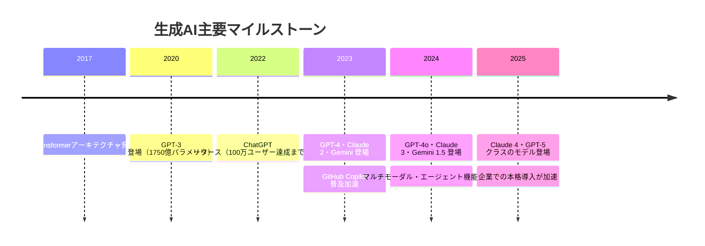
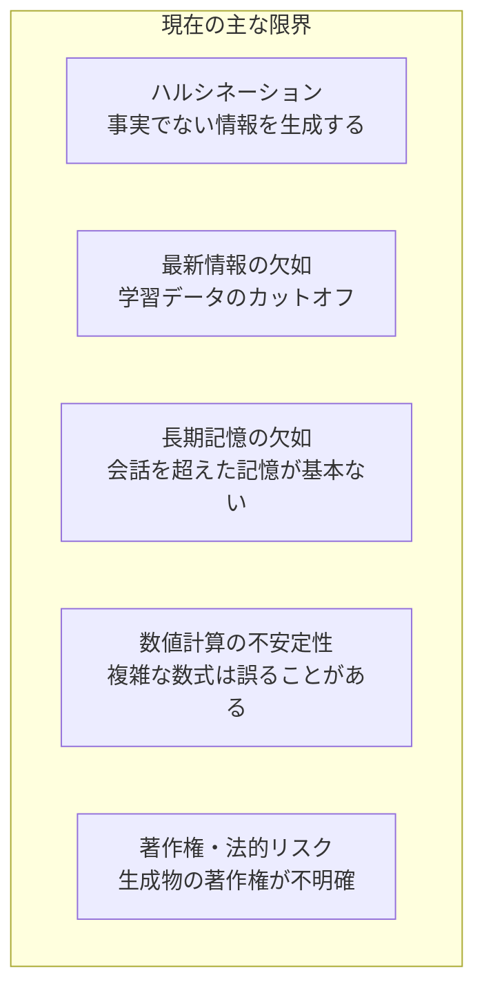

## 概要

生成AIの市場動向・主要プレイヤー・現在できること/できないことを整理します。ビジネス活用を始める前に、現在地を正確に把握することが重要です。

## 本文

### 生成AIの市場規模と成長

生成AIは2022年のChatGPT登場以来、急速に普及しています。



### 主要LLMプレイヤー

| 企業 | モデル | 特徴 |
|------|--------|------|
| Anthropic | Claude 3.5/4 | 安全性・指示追従性が高い、長いコンテキスト |
| OpenAI | GPT-4o/5 | 最も広く採用、マルチモーダル対応 |
| Google | Gemini 1.5/2 | 超長コンテキスト（100万トークン）、Google統合 |
| Meta | Llama 3 | オープンソース、自社ホスティング可能 |
| Mistral | Mistral Large | 欧州発、オープンウェイト、高効率 |

### 生成AIが今できること

**テキスト生成・変換:**
- ドキュメント作成・要約・翻訳
- コード生成・レビュー・デバッグ
- データ変換・構造化（非構造化テキスト→JSON等）

**推論・分析:**
- 複雑な質問への回答
- データパターンの発見
- リスク・機会の特定

**マルチモーダル:**
- 画像の説明・分析
- スクリーンショットからのコード生成
- 音声→テキスト変換

**コード・ツール連携:**
- Function Calling（外部APIの自動呼び出し）
- ブラウザ操作・ファイル管理
- データベースへのアクセス

### 生成AIの現在の限界



### ビジネス活用のROIが出やすい領域

**ROIが出やすい（今すぐ取り組むべき）:**
1. 繰り返しの多いドキュメント作成（議事録・メール・報告書）
2. コード補完・ドキュメント生成
3. カスタマーサポートのFAQ自動応答
4. データの構造化・分類

**ROIが出にくい（慎重な検討が必要）:**
1. 高精度が求められる医療・法律アドバイス
2. リアルタイム性が必要な金融取引
3. 感情的サポートが必要な場面

### 導入前のチェックリスト

```
□ どの業務ペインポイントを解決するか明確か？
□ データの機密性・プライバシーを確認したか？
□ 期待するROIを定義したか？
□ 失敗してもリカバリーできる業務か？
□ 担当者がAIリテラシーを持っているか？
```

## クイズ

<!-- QUIZ:START -->
**Q1. ChatGPTが100万ユーザーを達成するまでにかかった時間はどれくらいですか？**

- A) 約1年
- B) 約5日
- C) 約1か月
- D) 約3か月

**正解: B**
**解説:** ChatGPTは2022年11月のリリースからわずか5日で100万ユーザーを突破しました。Netflix（3.5年）やSpotify（5か月）と比較しても圧倒的なスピードで、生成AIへの関心の高さを示しています。

**Q2. 生成AIの「ハルシネーション」とは何ですか？**

- A) AIが回答を拒否すること
- B) AIが事実ではない情報を確信を持って生成すること
- C) AIの処理速度が遅くなること
- D) AIが同じ回答を繰り返すこと

**正解: B**
**解説:** ハルシネーションは、LLMが実際には存在しない事実・統計・引用などを自信満々に生成してしまう現象です。これは生成AIの本質的な限界の一つであり、重要な情報はRAGや外部ツールによる事実確認が必要です。

**Q3. 生成AIの導入でROIが出やすい業務として最も適切なのはどれですか？**

- A) 手術の実施
- B) 高頻度株式取引
- C) 議事録・報告書などの繰り返し多いドキュメント作成
- D) 刑事事件の法廷弁護

**正解: C**
**解説:** 繰り返しが多く、定型的なドキュメント作成業務は生成AIが最も価値を発揮しやすい領域です。一方、医療・法律・金融など高精度・高リスクの判断が求められる業務はAIの限界（ハルシネーション等）を考慮した慎重なアプローチが必要です。

<!-- QUIZ:END -->

## まとめ

- 生成AIはChatGPT登場（2022年）以来急速に普及し、企業導入が本格化している
- Claude・GPT・Gemini・Llamaなど複数の有力プレイヤーが競争・発展している
- テキスト生成・コード生成・推論などでROIが出やすいが、ハルシネーションには注意
- 導入前に解決するペインポイントとリスクを明確にすることが成功の鍵

## 次のレッスン

次のレッスンでは、エンジニアが最も身近に感じるビジネス活用事例として「コード生成・開発支援」を詳しく学びます。
