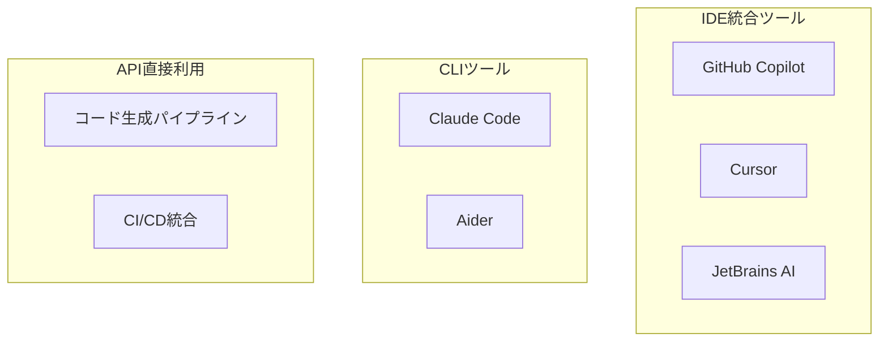

## 概要

GitHub Copilot・Claude Code・Cursor などのAI開発支援ツールの活用法と、コード生成APIを直接使った開発自動化のパターンを学びます。

## 本文

### AI開発支援ツールの全体像



### GitHub Copilotの効果的な使い方

GitHub Copilotはコンテキストから次のコードを補完します。コメントを活用して精度を上げましょう。

```python
# NG: コメントなしだとありきたりな補完になる
def process():
    pass

# OK: 具体的なコメントで精度向上
def calculate_tax(price: float, tax_rate: float = 0.1) -> float:
    """
    税込価格を計算する。
    price: 税抜価格
    tax_rate: 税率（デフォルト10%）
    戻り値: 税込価格（小数点第2位で四捨五入）
    """
    # ← ここでTabを押すと適切な実装を提案してくれる
```

### Claude Code の活用パターン

Claude Code（CLIツール）はファイル全体を読んでコンテキストを理解した上でコードを生成します。

```bash
# リポジトリ全体を理解した上でコード生成
cd my-project
claude "このリポジトリのREADMEを読んで、テスト用のモックデータを作成するスクリプトを書いて"

# 既存コードのリファクタリング
claude "src/utils.py を読んで、パフォーマンスを改善するリファクタリングを提案して"

# バグ修正
claude "エラーログ: TypeError: ... このバグの原因を特定して修正して"
```

### コード生成APIの活用例

```python
from openai import OpenAI

client = OpenAI()

def generate_unit_tests(code: str, framework: str = "pytest") -> str:
    """
    関数コードを渡すとユニットテストを自動生成する
    """
    prompt = f"""以下のPythonコードに対して、{framework}を使ったユニットテストを書いてください。

要件:
- エッジケース（空の入力・境界値・エラーケース）を含める
- テスト関数名は `test_` で始める
- docstringで各テストの意図を説明する
- 必要なモックも含める

コード:
```python
{code}
```

ユニットテスト:"""

    response = client.chat.completions.create(
        model="gpt-4o",
        messages=[{"role": "user", "content": prompt}],
        temperature=0.2
    )
    return response.choices[0].message.content

# 使用例
my_function = """
def divide(a: float, b: float) -> float:
    if b == 0:
        raise ValueError("ゼロ除算は許可されていません")
    return a / b
"""
tests = generate_unit_tests(my_function)
print(tests)
```

### コードレビュー自動化

```python
def ai_code_review(code: str, language: str = "Python") -> dict:
    """
    コードを自動レビューし、問題点と改善提案を返す
    """
    prompt = f"""以下の{language}コードをレビューしてください。

以下の観点で分析し、JSON形式で回答してください:
- bugs: バグや論理エラー
- security: セキュリティリスク
- performance: パフォーマンスの問題
- readability: 可読性・コーディング規約
- suggestions: 具体的な改善提案

コード:
```
{code}
```

JSON形式で回答:"""

    import json
    response = client.chat.completions.create(
        model="gpt-4o",
        messages=[{"role": "user", "content": prompt}],
        temperature=0,
        response_format={"type": "json_object"}
    )
    return json.loads(response.choices[0].message.content)

# サンプルコード
sample_code = """
import os
password = os.environ.get('DB_PASSWORD', 'admin123')

def get_user(user_id):
    query = f"SELECT * FROM users WHERE id = {user_id}"
    return db.execute(query)
"""
review = ai_code_review(sample_code)
print(review)
# セキュリティ: SQLインジェクションのリスク等が検出される
```

### ドキュメント自動生成

```python
def generate_docstring(function_code: str) -> str:
    """関数のdocstringを自動生成する"""
    prompt = f"""以下のPython関数に対して、Google Style Docstringを生成してください。

Args・Returns・Raises・Exampleを含めてください。

```python
{function_code}
```"""

    response = client.chat.completions.create(
        model="gpt-4o-mini",
        messages=[{"role": "user", "content": prompt}],
        temperature=0
    )
    return response.choices[0].message.content
```

### AI開発支援の効果測定

| 指標 | 測定方法 |
|------|---------|
| コーディング速度 | 1時間あたりのコミット数・コード行数 |
| バグ率 | AIが書いたコードのバグ発見率 |
| レビュー時間 | PRのレビューにかかる時間 |
| テストカバレッジ | AI生成テストのカバレッジ率 |

## ハンズオン

コードレビューボットを実装して、実際のコードに適用します。

**ステップ1: レビュー関数を実装する**

```python
from openai import OpenAI
import json

client = OpenAI()

def review_python_code(code: str) -> dict:
    response = client.chat.completions.create(
        model="gpt-4o-mini",
        messages=[{
            "role": "user",
            "content": f"""以下のPythonコードをレビューしてください。
JSON形式で返してください:
{{"issues": [{{"severity": "high/medium/low", "line": "該当コード", "description": "問題の説明", "fix": "修正案"}}],
 "overall_score": 1-10,
 "summary": "全体コメント"}}

コード:
```python
{code}
```"""
        }],
        temperature=0,
        response_format={"type": "json_object"}
    )
    return json.loads(response.choices[0].message.content)
```

**ステップ2: 問題のあるコードをレビューする**

```python
problematic_code = """
def login(username, password):
    query = f"SELECT * FROM users WHERE username='{username}' AND password='{password}'"
    result = db.execute(query)
    if result:
        return True
    return False
"""

result = review_python_code(problematic_code)
print(f"スコア: {result['overall_score']}/10")
for issue in result.get('issues', []):
    print(f"[{issue['severity']}] {issue['description']}")
    print(f"  修正案: {issue['fix']}\n")
```

**ステップ3: 改善後のコードを再レビューしてスコアを比較する**

## クイズ

<!-- QUIZ:START -->
**Q1. GitHub CopilotがコードをTab補完する際の精度を上げるために最も効果的な方法はどれですか？**

- A) より新しいバージョンを使う
- B) 具体的なコメント・docstringを書いてコンテキストを与える
- C) コードを短くする
- D) 英語でコメントを書く

**正解: B**
**解説:** Copilotは周囲のコンテキスト（コメント・関数名・型ヒント・docstring）から次のコードを推測します。「何をする関数か」「入力・出力は何か」「エッジケースは何か」を明示するコメントを書くことで、より意図に合った補完が得られます。

**Q2. AIによるコードレビューが特に有効な場面はどれですか？**

- A) ビジネスロジックの正しさの確認
- B) SQLインジェクションなどのセキュリティパターンの検出
- C) コードの業務要件との整合性チェック
- D) デプロイ先のサーバー設定確認

**正解: B**
**解説:** AIコードレビューはSQLインジェクション・XSS・ハードコードされた認証情報など、パターンとして認識できるセキュリティリスクの検出に特に有効です。一方、ビジネスロジックの正しさや業務要件との整合性はドメイン知識が必要なため、人間のレビューが不可欠です。

**Q3. `response_format={"type": "json_object"}`をOpenAI APIに指定する目的はどれですか？**

- A) 応答速度を向上させる
- B) LLMが有効なJSON形式で必ず回答するよう強制する
- C) JSONファイルを直接読み込む
- D) プロンプトをJSON形式で送る

**正解: B**
**解説:** `response_format={"type": "json_object"}`を指定すると、LLMは必ず有効なJSONを返します。これがないとLLMが「```json\n{...}\n```」のようにマークダウンコードブロックで返したり、不正なJSONを返したりする場合があります。コード生成・レビューなどで構造化出力が必要な場合に使います。

<!-- QUIZ:END -->

## まとめ

- GitHub Copilot・Claude Code・Cursorなど用途に応じたAI開発支援ツールがある
- コメント・docstringの品質がAI補完の精度に直結する
- コードレビュー・テスト生成・ドキュメント生成を自動化してエンジニアの生産性を上げられる
- AI生成コードは必ず人間がレビューし、特にビジネスロジックとセキュリティを確認する

## 次のレッスン

次のレッスンでは、議事録・仕様書・レポートなどの「ドキュメント自動化」の実装パターンを学びます。
