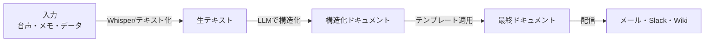

## 概要

議事録・仕様書・週次レポートなど、繰り返し作成するドキュメントをAIで自動化します。音声→テキスト変換から構造化ドキュメント生成まで、実務で使えるパイプラインを構築します。

## 本文

### ドキュメント自動化のパイプライン



### 議事録自動生成

```python
from openai import OpenAI

client = OpenAI()

def transcribe_audio(audio_file_path: str) -> str:
    """音声ファイルをテキストに変換する（Whisper）"""
    with open(audio_file_path, "rb") as audio_file:
        transcription = client.audio.transcriptions.create(
            model="whisper-1",
            file=audio_file,
            language="ja"
        )
    return transcription.text

def generate_meeting_minutes(transcript: str, meeting_info: dict) -> str:
    """
    会議の文字起こしから議事録を自動生成する
    """
    prompt = f"""以下の会議の文字起こしから、正式な議事録を作成してください。

会議情報:
- タイトル: {meeting_info.get('title', '会議')}
- 日時: {meeting_info.get('date', '未定')}
- 参加者: {', '.join(meeting_info.get('participants', []))}

文字起こし:
{transcript}

以下の形式で議事録を作成してください:

## 議事録

**日時:** [日時]
**参加者:** [参加者]

### 議題

[議題を箇条書きで]

### 決定事項

[決定した事項を箇条書きで]

### アクションアイテム

| 担当者 | タスク | 期限 |
|--------|--------|------|
| [名前] | [タスク] | [日付] |

### 次回会議

[次回の予定]
"""

    response = client.chat.completions.create(
        model="gpt-4o",
        messages=[{"role": "user", "content": prompt}],
        temperature=0.3
    )
    return response.choices[0].message.content

# 使用例
transcript = """
田中: 今日の議題は来月のリリースについてです。
鈴木: APIの実装は来週末に完了します。私が担当します。
田中: ではUIは山田さんに来月5日までにお願いできますか？
山田: 承知しました。
田中: 次回は2週間後の木曜日に進捗確認をしましょう。
"""

minutes = generate_meeting_minutes(
    transcript,
    meeting_info={
        "title": "プロダクト開発会議",
        "date": "2026-03-14 14:00",
        "participants": ["田中", "鈴木", "山田"]
    }
)
print(minutes)
```

### 週次レポート自動生成

```python
from datetime import datetime, timedelta
import json

def generate_weekly_report(activities: list[dict]) -> str:
    """
    週次活動ログからレポートを自動生成する

    activities: [
        {"date": "2026-03-10", "task": "APIの実装", "hours": 4, "status": "完了"},
        ...
    ]
    """
    activities_text = json.dumps(activities, ensure_ascii=False, indent=2)

    prompt = f"""以下の週次活動ログから、上司向けの週次レポートを作成してください。

活動ログ:
{activities_text}

以下の形式で作成してください:
- 今週の主な成果（3〜5件）
- 課題・ブロッカー
- 来週の予定
- KPI達成状況（工数合計・完了タスク数）

箇条書きで簡潔に、日本語でビジネスライクに作成してください。"""

    response = client.chat.completions.create(
        model="gpt-4o-mini",
        messages=[{"role": "user", "content": prompt}],
        temperature=0.3
    )
    return response.choices[0].message.content
```

### 技術仕様書の自動生成

```python
def generate_api_spec(code: str) -> str:
    """
    Pythonコードから API仕様書（OpenAPI形式）を自動生成する
    """
    prompt = f"""以下のPythonコード（FastAPI）からOpenAPI仕様書のYAML形式のドキュメントを生成してください。
各エンドポイントの説明・リクエスト・レスポンス・エラーコードを含めてください。

コード:
```python
{code}
```

OpenAPI YAML:"""

    response = client.chat.completions.create(
        model="gpt-4o",
        messages=[{"role": "user", "content": prompt}],
        temperature=0
    )
    return response.choices[0].message.content

# FastAPIコードの例
fastapi_code = """
@app.post("/users", response_model=UserResponse)
async def create_user(user: UserCreate, db: Session = Depends(get_db)):
    existing = db.query(User).filter(User.email == user.email).first()
    if existing:
        raise HTTPException(status_code=400, detail="Email already registered")
    new_user = User(**user.dict())
    db.add(new_user)
    db.commit()
    return new_user
"""
```

### ドキュメントテンプレートエンジン

```python
class DocumentTemplate:
    """
    テンプレートとデータからドキュメントを生成するクラス
    """

    TEMPLATES = {
        "meeting_minutes": """
# {title}

**日時:** {date}
**参加者:** {participants}

## 決定事項
{decisions}

## アクションアイテム
{action_items}
""",
        "status_report": """
# 進捗レポート: {project_name}

**レポート日:** {report_date}
**作成者:** {author}

## 今週の成果
{achievements}

## 課題
{issues}

## 来週の予定
{next_week}
"""
    }

    def generate(self, template_name: str, data: dict, enhance_with_ai: bool = True) -> str:
        """
        テンプレートにデータを埋め込み、AIで文章を改善する
        """
        if template_name not in self.TEMPLATES:
            raise ValueError(f"テンプレート '{template_name}' は存在しません")

        raw = self.TEMPLATES[template_name].format(**data)

        if enhance_with_ai:
            prompt = f"""以下のドキュメントの文章を、ビジネス文書として自然で読みやすくしてください。
内容は変えず、表現のみ改善してください。

{raw}"""
            response = client.chat.completions.create(
                model="gpt-4o-mini",
                messages=[{"role": "user", "content": prompt}],
                temperature=0.3
            )
            return response.choices[0].message.content

        return raw
```

## ハンズオン

会議メモから議事録を自動生成するシステムを実装します。

**ステップ1: 議事録生成関数を実装する**

上記の `generate_meeting_minutes` 関数をそのまま使います。

**ステップ2: サンプルの会議メモで実行する**

```python
from openai import OpenAI

client = OpenAI()

sample_transcript = """
司会の田中です。本日はプロジェクトXの進捗確認です。
鈴木さんから報告をお願いします。
鈴木: バックエンドAPIの実装が80%完了しました。残りは認証周りで来週月曜日に完了予定です。
田中: フロントエンドの山田さんはどうですか？
山田: デザインは完成しています。API連携の実装を来週から始めます。期日は3月末を予定しています。
田中: リリース日は4月1日で変わりませんね？
全員: はい、問題ありません。
田中: では次回は3月21日の月曜日10時に確認しましょう。
"""

result = generate_meeting_minutes(
    sample_transcript,
    {
        "title": "プロジェクトX 進捗確認",
        "date": "2026-03-14",
        "participants": ["田中（司会）", "鈴木", "山田"]
    }
)
print(result)
```

**ステップ3: アクションアイテムをJSONで抽出する機能を追加する**

```python
import json

def extract_action_items(transcript: str) -> list[dict]:
    response = client.chat.completions.create(
        model="gpt-4o-mini",
        messages=[{
            "role": "user",
            "content": f"""以下の会議メモからアクションアイテムを抽出してJSON配列で返してください。
[{{"assignee": "担当者", "task": "タスク内容", "deadline": "期日または未定"}}]

会議メモ:
{transcript}"""
        }],
        temperature=0,
        response_format={"type": "json_object"}
    )
    data = json.loads(response.choices[0].message.content)
    return data.get("items", data) if isinstance(data, dict) else data
```

## クイズ

<!-- QUIZ:START -->
**Q1. OpenAIのWhisper APIを使う主な目的はどれですか？**

- A) テキストを音声に変換する（TTS）
- B) 音声ファイルをテキストに変換する（STT）
- C) テキストを要約する
- D) 画像から文字を読み取る

**正解: B**
**解説:** WhisperはOpenAIの音声認識モデルで、音声ファイル（.mp3・.wav・.m4aなど）を高精度でテキストに変換します（Speech-to-Text）。多言語に対応しており、日本語の認識精度も高いです。

**Q2. ドキュメント自動化で`temperature=0.3`のように低めの値を設定する理由はどれですか？**

- A) 処理を速くするため
- B) 安定したフォーマットを維持しつつ自然な文章を生成するため
- C) コストを削減するため
- D) 多様な表現を生成するため

**正解: B**
**解説:** ドキュメント生成では、毎回同じ構造・フォーマットで安定した出力が求められます。temperature=0だと機械的すぎ、高いと構造が崩れる場合があります。0.2〜0.4の範囲は「安定性」と「自然さ」のバランスが取れており、ビジネスドキュメント生成に適しています。

**Q3. AIドキュメント自動化で「人間のレビューが必ず必要」な理由として最も重要なものはどれですか？**

- A) AIが日本語を正しく処理できないから
- B) AIが内容の正確性・意思決定の妥当性を保証できないから
- C) テンプレートを適用できないから
- D) APIコストが高いから

**正解: B**
**解説:** AIはテキストを生成しますが、ビジネス上の内容が正しいか（事実・数値・意思決定の妥当性）を保証することはできません。特に議事録・仕様書・報告書は誤った情報が後の意思決定に影響するため、AIが生成したものは必ず人間がレビューして承認する必要があります。

<!-- QUIZ:END -->

## まとめ

- 音声→文字起こし→構造化ドキュメントのパイプラインで議事録を自動化できる
- テンプレートとAIを組み合わせると一貫したフォーマットを保ちながら高品質な文章が生成できる
- API仕様書・週次レポートなど繰り返しドキュメントが自動化の最適候補
- AIが生成したドキュメントは内容の正確性確認のため必ず人間のレビューが必要

## 次のレッスン

次のレッスンでは、カスタマーサポートへの生成AI活用（チャットボット・FAQ自動応答）を学びます。
