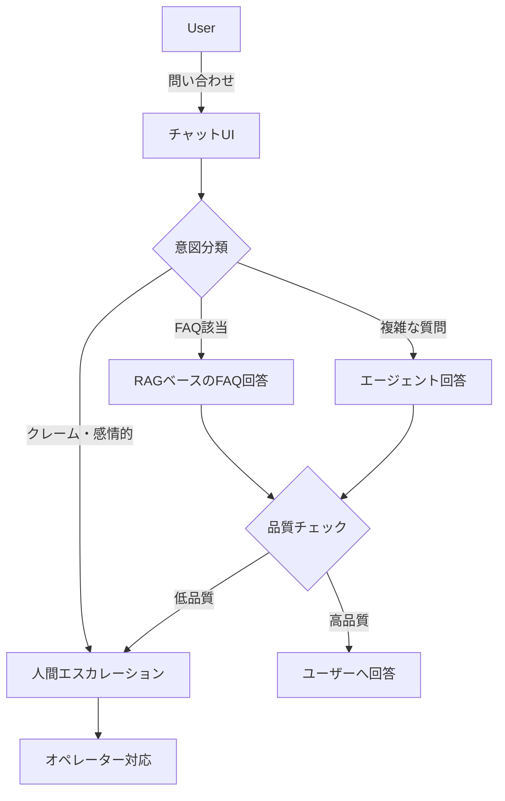

## 概要

カスタマーサポートは生成AIのROIが最も出やすい領域の一つです。チャットボット設計・FAQ自動応答・エスカレーション判定・感情分析など、実用的なサポートシステムの設計パターンを学びます。

## 本文

### カスタマーサポートAIのアーキテクチャ



### 意図分類（Intent Classification）

```python
from openai import OpenAI
import json

client = OpenAI()

INTENTS = [
    "注文確認",
    "返品・返金",
    "配送状況",
    "製品の使い方",
    "アカウント問題",
    "クレーム",
    "その他"
]

def classify_intent(user_message: str) -> dict:
    """
    ユーザーメッセージの意図を分類する
    """
    prompt = f"""以下のカスタマーサポートメッセージの意図を分類してください。

意図カテゴリ: {', '.join(INTENTS)}

メッセージ: "{user_message}"

以下のJSON形式で返してください:
{{
    "intent": "カテゴリ名",
    "confidence": 0.0〜1.0,
    "sentiment": "positive/neutral/negative",
    "requires_human": true/false,
    "reason": "分類理由"
}}"""

    response = client.chat.completions.create(
        model="gpt-4o-mini",
        messages=[{"role": "user", "content": prompt}],
        temperature=0,
        response_format={"type": "json_object"}
    )
    return json.loads(response.choices[0].message.content)

# テスト
messages = [
    "注文した商品がまだ届いていません。追跡番号を教えてください。",
    "この製品は最悪です！すぐに返金してください！！",
    "アカウントのパスワードを変更したいのですが、どうすればいいですか？",
]

for msg in messages:
    result = classify_intent(msg)
    print(f"メッセージ: {msg[:40]}...")
    print(f"  意図: {result['intent']} (確信度: {result['confidence']})")
    print(f"  感情: {result['sentiment']}")
    print(f"  人間対応必要: {result['requires_human']}\n")
```

### RAGベースのFAQチャットボット

```python
import chromadb
from chromadb.utils import embedding_functions

# FAQデータベースを構築
faqs = [
    {"q": "返品はできますか？", "a": "購入から30日以内であれば、未使用品に限り返品を承ります。返品送料はお客様負担となります。"},
    {"q": "配送にはどのくらいかかりますか？", "a": "通常配送は3〜5営業日です。速達オプション（追加料金）では翌日配送も可能です。"},
    {"q": "領収書の発行はできますか？", "a": "マイページの「注文履歴」から領収書のPDFをダウンロードできます。"},
    {"q": "支払い方法は何がありますか？", "a": "クレジットカード・PayPay・銀行振込に対応しています。"},
]

def build_faq_index(faqs: list[dict]):
    """FAQをベクトルDBに登録する"""
    openai_ef = embedding_functions.OpenAIEmbeddingFunction(
        api_key="your-key",
        model_name="text-embedding-3-small"
    )
    chroma = chromadb.Client()
    collection = chroma.create_collection("faq", embedding_function=openai_ef)

    documents = [f"Q: {faq['q']}\nA: {faq['a']}" for faq in faqs]
    ids = [f"faq_{i}" for i in range(len(faqs))]
    collection.add(documents=documents, ids=ids)
    return collection

def answer_with_faq(question: str, collection, threshold: float = 0.7) -> dict:
    """FAQを検索して回答する"""
    results = collection.query(
        query_texts=[question],
        n_results=3,
        include=["documents", "distances"]
    )
    top_score = 1 - results["distances"][0][0]

    if top_score < threshold:
        return {
            "answered": False,
            "response": None,
            "confidence": top_score
        }

    context = "\n\n".join(results["documents"][0])
    prompt = f"""あなたは丁寧なカスタマーサポート担当者です。
以下のFAQを参考にしてお客様の質問に答えてください。
FAQに回答がない場合は「担当者に確認いたします」と答えてください。

FAQ:
{context}

お客様の質問: {question}

回答:"""

    response = client.chat.completions.create(
        model="gpt-4o-mini",
        messages=[{"role": "user", "content": prompt}],
        temperature=0.3
    )
    return {
        "answered": True,
        "response": response.choices[0].message.content,
        "confidence": top_score
    }
```

### エスカレーション判定

```python
ESCALATION_SYSTEM_PROMPT = """あなたはカスタマーサポートチャットボットです。

以下の条件に該当する場合は、必ず人間のオペレーターにエスカレーションしてください:
1. お客様が強い怒り・感情的な表現をしている
2. 法的措置・SNS拡散などの脅し
3. 金額が10万円以上の案件
4. 同じ問題が3回以上繰り返されている
5. セキュリティ・個人情報に関わる問題

エスカレーションが必要な場合は [ESCALATE] とメッセージの先頭に付けてください。"""

def support_with_escalation(conversation: list[dict]) -> dict:
    """
    会話履歴を受け取り、回答またはエスカレーションを判断する
    """
    messages = [
        {"role": "system", "content": ESCALATION_SYSTEM_PROMPT},
        *conversation
    ]
    response = client.chat.completions.create(
        model="gpt-4o",
        messages=messages,
        temperature=0.3
    )
    content = response.choices[0].message.content
    needs_escalation = content.startswith("[ESCALATE]")
    clean_response = content.replace("[ESCALATE]", "").strip()

    return {
        "response": clean_response,
        "escalate": needs_escalation,
        "action": "human_handoff" if needs_escalation else "bot_response"
    }
```

### カスタマーサポートのKPI

| KPI | 目標 | 測定方法 |
|-----|------|---------|
| 自動解決率 | 70〜80% | ボット解決数 / 総問い合わせ数 |
| 顧客満足度（CSAT） | 4.0/5.0以上 | 会話後アンケート |
| 平均応答時間 | 5秒以内 | API応答時間 |
| エスカレーション率 | 20〜30% | エスカレーション数 / 総問い合わせ数 |

## ハンズオン

意図分類→FAQ回答→エスカレーション判定の3段階パイプラインを実装します。

**ステップ1: 意図分類を実装する**

上記の `classify_intent` 関数を参考に実装してください。

**ステップ2: FAQ回答システムを構築する**

```python
# FAQデータ（自分でカスタマイズ可能）
my_faqs = [
    {"q": "営業時間は？", "a": "平日9時〜18時です。土日祝は休業しています。"},
    {"q": "電話番号を教えてください", "a": "お問い合わせは03-XXXX-XXXXです。"},
]
```

**ステップ3: 全体フローを接続してテストする**

```python
def handle_customer_query(user_message: str) -> dict:
    # 1. 意図分類
    intent = classify_intent(user_message)

    # 2. 人間対応が必要か判定
    if intent["requires_human"] or intent["sentiment"] == "negative":
        return {"action": "escalate", "reason": intent["reason"]}

    # 3. FAQ検索（簡易版：キーワードマッチ）
    for faq in my_faqs:
        if any(kw in user_message for kw in faq["q"].split()):
            return {"action": "faq", "answer": faq["a"]}

    return {"action": "default", "answer": "担当者に確認いたします。"}

# テスト
test_queries = [
    "営業時間を教えてください",
    "絶対に許さない！訴えてやる！",
]
for q in test_queries:
    result = handle_customer_query(q)
    print(f"Q: {q}")
    print(f"結果: {result}\n")
```

## クイズ

<!-- QUIZ:START -->
**Q1. カスタマーサポートシステムで「エスカレーション」を自動検出すべき状況として最も重要なのはどれですか？**

- A) ユーザーが長いメッセージを送ってきたとき
- B) ユーザーが強い怒り・感情的な表現をしているとき
- C) ユーザーが2回以上質問したとき
- D) 質問が夜間に届いたとき

**正解: B**
**解説:** 感情的なユーザーへのボット対応は状況を悪化させる可能性があります。強い怒り・脅し・繰り返しの苦情などは人間のオペレーターに引き継ぐ（エスカレーション）ことが適切です。温度感のある人間対応が顧客満足度の維持に繋がります。

**Q2. FAQチャットボットでRAGを使う主な利点はどれですか？**

- A) ルールベースより実装が簡単だから
- B) 既存のFAQドキュメントをそのまま使い、意味的に関連した質問に自動回答できるから
- C) AIのトレーニングコストがかからないから
- D) 全ての質問に100%正確に答えられるから

**正解: B**
**解説:** RAGを使うと、FAQを事前にインデックス化するだけで、表現が違う質問（「返品できる？」「返金は可能？」など）にも意味的に関連したFAQを検索して自動回答できます。ルールベース（完全一致）では全ての表現バリエーションをカバーできませんが、RAGは意味で検索するため対応範囲が広がります。

**Q3. カスタマーサポートにおける「自動解決率70〜80%」の意味として正しいのはどれですか？**

- A) 全問い合わせの70〜80%がAIで完全に解決し、人間対応が不要だった割合
- B) AIの回答精度が70〜80%だった
- C) 70〜80%の顧客が満足した
- D) 70〜80%の問い合わせが返品に関するものだった

**正解: A**
**解説:** 自動解決率は「総問い合わせ数のうち、人間オペレーターへのエスカレーションなしにボットが解決した割合」です。70〜80%が業界の目安とされています。残りの20〜30%は複雑な案件や感情的な顧客への人間対応に充てることで、オペレーターが本当に必要な案件に集中できます。

<!-- QUIZ:END -->

## まとめ

- 意図分類→FAQ回答→エスカレーション判定の3段階でサポートシステムを構築できる
- RAGを使うことで既存FAQドキュメントをそのまま活用して自然な問い合わせに対応できる
- 感情的な顧客・複雑な案件は人間にエスカレーションし、ボットは効率化に集中する
- 自動解決率・CSAT・エスカレーション率でシステムのパフォーマンスを継続的に測定する

## 次のレッスン

次のレッスンでは、非構造化データの分析・レポート生成における生成AIの活用を学びます。
