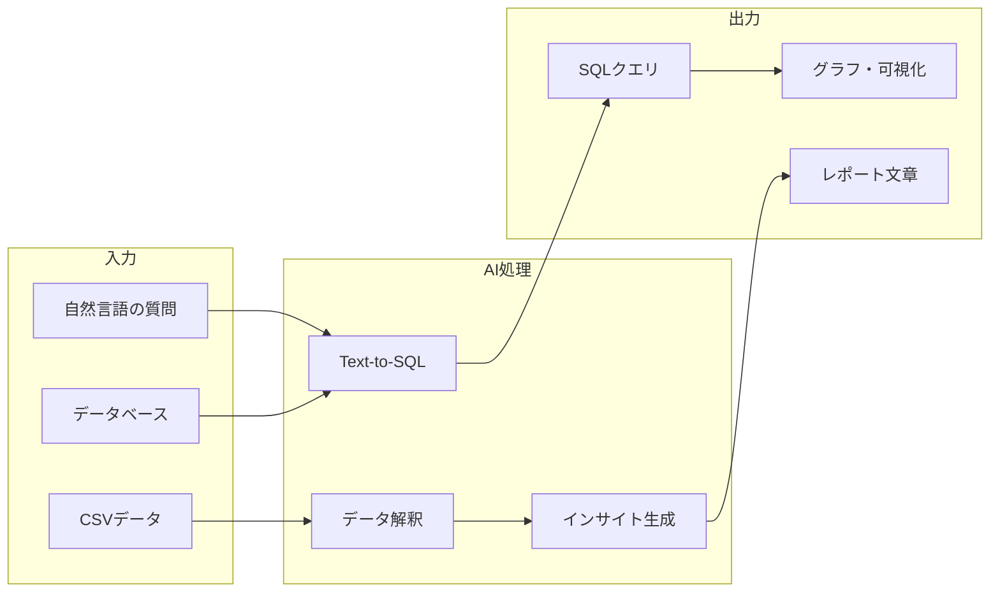

## 概要

自然言語でデータを分析・可視化するText-to-SQLや、データからビジネスインサイトを自動抽出してレポートを生成するパターンを学びます。非エンジニアでもデータを活用できる仕組みを構築します。

## 本文

### データ分析AIの活用シーン



### Text-to-SQL: 自然言語からSQLを生成

```python
from openai import OpenAI
import sqlite3

client = OpenAI()

# データベーススキーマの定義
SCHEMA = """
テーブル: sales（売上データ）
- id: INTEGER PRIMARY KEY
- date: DATE（売上日）
- product_name: VARCHAR（製品名）
- category: VARCHAR（カテゴリ）
- quantity: INTEGER（販売数量）
- price: DECIMAL（単価）
- customer_id: INTEGER（顧客ID）
- region: VARCHAR（地域）

テーブル: customers（顧客データ）
- id: INTEGER PRIMARY KEY
- name: VARCHAR（顧客名）
- email: VARCHAR
- join_date: DATE（登録日）
- tier: VARCHAR（顧客ランク: gold/silver/bronze）
"""

def generate_sql(natural_language_query: str) -> str:
    """
    自然言語のビジネスクエリからSQLを生成する
    """
    prompt = f"""以下のデータベーススキーマに対して、SQLクエリを生成してください。

スキーマ:
{SCHEMA}

質問: {natural_language_query}

要件:
- SQLite3の構文を使う
- コメントで各ステップを説明する
- SELECTクエリのみ生成する（UPDATE・DELETE・DROPは禁止）

SQLクエリのみを返してください:"""

    response = client.chat.completions.create(
        model="gpt-4o",
        messages=[{"role": "user", "content": prompt}],
        temperature=0
    )
    return response.choices[0].message.content.strip()

# 使用例
queries = [
    "今月の地域別の売上合計を降順で表示して",
    "先月と比べて売上が20%以上増加したカテゴリは？",
    "ゴールド顧客の購入頻度と平均購入金額を計算して",
]

for q in queries:
    sql = generate_sql(q)
    print(f"質問: {q}")
    print(f"SQL:\n{sql}\n")
```

### SQLの安全な実行

```python
import pandas as pd
from typing import Optional

ALLOWED_STATEMENTS = {"SELECT", "WITH"}

def execute_safe_query(sql: str, db_path: str) -> Optional[pd.DataFrame]:
    """
    生成されたSQLを安全に実行する
    SELECT以外のステートメントは拒否する
    """
    # セキュリティチェック
    sql_upper = sql.strip().upper()
    first_word = sql_upper.split()[0] if sql_upper else ""

    if first_word not in ALLOWED_STATEMENTS:
        raise ValueError(f"許可されないSQL操作です: {first_word}")

    # 危険なキーワードをチェック
    dangerous_keywords = ["DROP", "DELETE", "UPDATE", "INSERT", "CREATE", "ALTER"]
    for keyword in dangerous_keywords:
        if keyword in sql_upper:
            raise ValueError(f"危険なキーワードが検出されました: {keyword}")

    try:
        conn = sqlite3.connect(db_path)
        df = pd.read_sql_query(sql, conn)
        conn.close()
        return df
    except Exception as e:
        print(f"SQL実行エラー: {e}")
        return None
```

### データインサイトの自動生成

```python
def analyze_data_and_generate_insights(df: pd.DataFrame, context: str) -> str:
    """
    DataFrameのデータを分析してビジネスインサイトを生成する
    """
    # データの統計サマリーを作成
    stats = df.describe().to_string()
    sample = df.head(10).to_string()

    prompt = f"""以下のデータを分析して、ビジネスインサイトをレポート形式で作成してください。

コンテキスト: {context}

データサマリー:
{stats}

データサンプル（先頭10件）:
{sample}

以下の観点でレポートを作成してください:
1. 主要なトレンド・パターン
2. 注目すべき異常値や突出した点
3. ビジネス上の課題と機会
4. 具体的なアクション提案（3つ）

箇条書きを使って分かりやすく、経営者向けに作成してください。"""

    response = client.chat.completions.create(
        model="gpt-4o",
        messages=[{"role": "user", "content": prompt}],
        temperature=0.3
    )
    return response.choices[0].message.content

# 使用例
import pandas as pd
import numpy as np

# サンプルデータ生成
np.random.seed(42)
sales_data = pd.DataFrame({
    "month": ["1月", "2月", "3月", "4月", "5月"] * 4,
    "region": ["東京"] * 5 + ["大阪"] * 5 + ["名古屋"] * 5 + ["福岡"] * 5,
    "sales": np.random.randint(100, 500, 20) * 10000
})

insights = analyze_data_and_generate_insights(
    sales_data,
    "月次地域別売上データ（2026年1〜5月）"
)
print(insights)
```

### 自然言語でグラフを生成

```python
def generate_chart_code(data_description: str, chart_request: str) -> str:
    """
    データの説明とグラフの要求からmatplotlibコードを生成する
    """
    prompt = f"""以下のデータに対してmatplotlib/seabornを使ったPythonのグラフ描画コードを生成してください。

データの説明:
{data_description}

グラフの要求:
{chart_request}

要件:
- 日本語ラベル対応（matplotlib rcParams設定を含める）
- figsize=(10, 6)を使用
- グラフのタイトル・軸ラベルを日本語で設定
- plt.tight_layout()を使用
- コードのみを返す（説明文不要）"""

    response = client.chat.completions.create(
        model="gpt-4o",
        messages=[{"role": "user", "content": prompt}],
        temperature=0
    )
    return response.choices[0].message.content
```

## ハンズオン

自然言語でCSVデータを分析するシステムを実装します。

**ステップ1: サンプルCSVデータを作成する**

```python
import pandas as pd
import numpy as np

np.random.seed(0)
df = pd.DataFrame({
    "日付": pd.date_range("2026-01-01", periods=100),
    "製品": np.random.choice(["製品A", "製品B", "製品C"], 100),
    "売上": np.random.randint(10000, 100000, 100),
    "数量": np.random.randint(1, 50, 100),
})
df.to_csv("sales.csv", index=False)
print("CSVを作成しました")
print(df.head())
```

**ステップ2: CSVデータのサマリーをAIに渡してインサイトを生成する**

```python
from openai import OpenAI

client = OpenAI()

def analyze_csv(csv_path: str, question: str) -> str:
    df = pd.read_csv(csv_path)
    summary = f"""
    行数: {len(df)}
    列: {list(df.columns)}
    数値統計:\n{df.describe().to_string()}
    先頭5行:\n{df.head(5).to_string()}
    """
    response = client.chat.completions.create(
        model="gpt-4o-mini",
        messages=[{
            "role": "user",
            "content": f"以下のデータについて答えてください。\n質問: {question}\n\nデータ:\n{summary}"
        }],
        temperature=0
    )
    return response.choices[0].message.content

print(analyze_csv("sales.csv", "売上が最も高い製品はどれですか？トレンドは？"))
```

**ステップ3: 分析結果をMarkdownレポートとして出力する**

```python
def generate_report(csv_path: str) -> str:
    df = pd.read_csv(csv_path)
    stats = df.describe().to_string()
    response = client.chat.completions.create(
        model="gpt-4o-mini",
        messages=[{
            "role": "user",
            "content": f"以下のデータサマリーからMarkdown形式の経営レポートを作成してください。\n{stats}"
        }]
    )
    return response.choices[0].message.content

print(generate_report("sales.csv"))
```

## クイズ

<!-- QUIZ:START -->
**Q1. Text-to-SQLシステムで生成されたSQLを実行する前に最低限行うべきセキュリティチェックはどれですか？**

- A) SQLの長さが100文字以下であることを確認する
- B) SELECT文以外（DROP・DELETE・UPDATE等）が含まれていないことを確認する
- C) SQLが英語で書かれていることを確認する
- D) テーブル名がスキーマと一致することを確認する

**正解: B**
**解説:** AIが生成したSQLは悪意ある操作を意図せず含む可能性があります（プロンプトインジェクション等）。最低限、SELECT以外のDML/DDL（DROP・DELETE・UPDATE・INSERT・CREATE・ALTER）が含まれていないことを確認してから実行することが重要です。

**Q2. AIにデータ分析させる際に、生データ（全行）ではなくサマリー（統計量・サンプル）を渡す主な理由はどれですか？**

- A) AIが数字を理解できないから
- B) コンテキスト長の制限とコスト削減のため
- C) プライバシーポリシーの要件だから
- D) 分析精度が上がるから

**正解: B**
**解説:** 大規模なCSVデータをそのままLLMに渡すとコンテキスト長を超えて処理できなくなる場合があります。また、全データを送るとトークンコストが大幅に増加します。統計サマリー（平均・最大・最小等）と先頭数行のサンプルで十分なインサイトを得られることが多いです。

**Q3. データ分析でLLMを使う場合に「確認が必要な計算」として最も注意が必要なのはどれですか？**

- A) テキストの要約
- B) データの傾向の説明
- C) 正確な数値計算・集計（合計・平均等）
- D) グラフのタイトル生成

**正解: C**
**解説:** LLMはテキスト生成は得意ですが、正確な数値計算（特に大量データの集計）は誤りが生じる可能性があります。売上合計・成長率などの正確な数値はSQLや pandas で計算した結果をLLMに渡し、インサイトの解釈・文章化のみLLMに任せる分業が推奨されます。

<!-- QUIZ:END -->

## まとめ

- Text-to-SQLで非エンジニアも自然言語でデータを分析できる仕組みを構築できる
- AIが生成したSQLは必ずSELECT限定のセキュリティチェックを経てから実行する
- データのサマリー・統計量をLLMに渡してインサイト・レポートを自動生成できる
- 正確な集計はSQLやpandasで行い、LLMはインサイトの解釈と文章化に使うのが最適

## 次のレッスン

次のレッスンでは、RAGを活用した社内知識管理システムの設計と実装を学びます。
