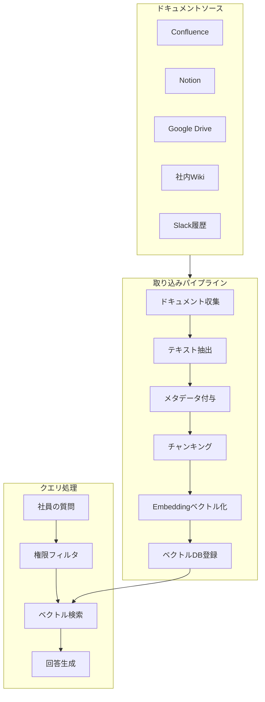

## 概要

社内ドキュメント・Confluence・Notionなどの知識ベースをRAGで検索可能にし、「社内版ChatGPT」を構築します。ドキュメント取り込み・権限管理・更新管理の実装パターンを学びます。

## 本文

### 社内知識管理システムのアーキテクチャ



### ドキュメントの取り込みパイプライン

```python
from openai import OpenAI
import chromadb
from chromadb.utils import embedding_functions
from datetime import datetime
from pathlib import Path
import hashlib
import json

client = OpenAI()

class KnowledgeBaseManager:
    """社内知識ベース管理クラス"""

    def __init__(self, db_path: str = ":memory:"):
        openai_ef = embedding_functions.OpenAIEmbeddingFunction(
            api_key="your-key",
            model_name="text-embedding-3-small"
        )
        self.chroma = chromadb.Client()
        self.collection = self.chroma.create_collection(
            "company_knowledge",
            embedding_function=openai_ef
        )
        self._doc_registry: dict = {}  # ドキュメントの変更追跡用

    def _compute_hash(self, content: str) -> str:
        """ドキュメントのハッシュ値を計算（変更検知に使用）"""
        return hashlib.md5(content.encode()).hexdigest()

    def add_document(
        self,
        content: str,
        metadata: dict,
        chunk_size: int = 500,
        overlap: int = 50
    ) -> int:
        """
        ドキュメントをチャンキングしてインデックスに追加する

        metadata には以下を含める:
        - source: ドキュメントの出所（confluence, notion, gdrive等）
        - title: タイトル
        - url: 元のURL
        - department: 部署（アクセス制御に使用）
        - updated_at: 最終更新日時
        """
        doc_id = metadata.get("url", metadata.get("title", "unknown"))
        content_hash = self._compute_hash(content)

        # 変更がなければスキップ
        if doc_id in self._doc_registry:
            if self._doc_registry[doc_id]["hash"] == content_hash:
                print(f"[スキップ] 変更なし: {metadata.get('title', doc_id)}")
                return 0

        # 既存のチャンクを削除
        if doc_id in self._doc_registry:
            old_ids = self._doc_registry[doc_id]["chunk_ids"]
            self.collection.delete(ids=old_ids)

        # チャンキング
        chunks = []
        start = 0
        while start < len(content):
            chunk = content[start:start + chunk_size]
            chunks.append(chunk)
            start += chunk_size - overlap

        # メタデータにインデックス情報を追加
        chunk_ids = []
        chunk_docs = []
        chunk_metadatas = []

        for i, chunk in enumerate(chunks):
            chunk_id = f"{hashlib.md5(doc_id.encode()).hexdigest()}_{i}"
            chunk_ids.append(chunk_id)
            chunk_docs.append(chunk)
            chunk_metadatas.append({
                **metadata,
                "chunk_index": i,
                "total_chunks": len(chunks),
                "indexed_at": datetime.now().isoformat()
            })

        self.collection.add(
            documents=chunk_docs,
            ids=chunk_ids,
            metadatas=chunk_metadatas
        )

        self._doc_registry[doc_id] = {
            "hash": content_hash,
            "chunk_ids": chunk_ids
        }
        print(f"[追加] {metadata.get('title', doc_id)}: {len(chunks)}チャンク")
        return len(chunks)

    def search(
        self,
        query: str,
        department_filter: str = None,
        n_results: int = 5
    ) -> list[dict]:
        """
        権限フィルタ付きで検索する
        """
        where = None
        if department_filter:
            where = {"department": {"$in": [department_filter, "all"]}}

        results = self.collection.query(
            query_texts=[query],
            n_results=n_results,
            where=where,
            include=["documents", "distances", "metadatas"]
        )

        return [
            {
                "content": doc,
                "score": 1 - dist,
                "metadata": meta
            }
            for doc, dist, meta in zip(
                results["documents"][0],
                results["distances"][0],
                results["metadatas"][0]
            )
        ]

    def ask(self, question: str, user_department: str = None) -> dict:
        """
        質問に答える（RAG）
        """
        search_results = self.search(
            question,
            department_filter=user_department
        )

        if not search_results:
            return {
                "answer": "関連する社内ドキュメントが見つかりませんでした。",
                "sources": []
            }

        context_parts = []
        sources = []
        for r in search_results:
            if r["score"] > 0.6:
                context_parts.append(r["content"])
                sources.append({
                    "title": r["metadata"].get("title", "不明"),
                    "url": r["metadata"].get("url", ""),
                    "score": round(r["score"], 3)
                })

        context = "\n\n---\n\n".join(context_parts)

        prompt = f"""あなたは社内ナレッジアシスタントです。
以下の社内ドキュメントの情報のみに基づいて質問に答えてください。
情報がない場合は「社内ドキュメントに該当情報がありません」と答えてください。

【社内ドキュメント】
{context}

【質問】
{question}

【回答】"""

        response = client.chat.completions.create(
            model="gpt-4o-mini",
            messages=[{"role": "user", "content": prompt}],
            temperature=0
        )

        return {
            "answer": response.choices[0].message.content,
            "sources": sources
        }
```

### 使用例

```python
# 知識ベースの初期化
kb = KnowledgeBaseManager()

# 社内ドキュメントの登録
kb.add_document(
    content="""
    ## 有給休暇規定
    有給休暇は入社6か月後から10日付与されます。
    申請は毎月15日までに翌月分を申請してください。
    申請方法: 社内ポータル > 休暇申請 > 新規申請
    """,
    metadata={
        "title": "人事規定 - 有給休暇",
        "source": "confluence",
        "url": "https://confluence.example.com/hr/leave",
        "department": "all",
        "updated_at": "2026-03-01"
    }
)

# 社員が質問する
result = kb.ask(
    "有給の申請はいつまでにすればいいですか？",
    user_department="engineering"
)
print(result["answer"])
print("\n参考ドキュメント:")
for source in result["sources"]:
    print(f"  - {source['title']} ({source['url']})")
```

### 定期更新の仕組み

```python
import schedule
import time

def sync_confluence_pages(kb: KnowledgeBaseManager):
    """Confluenceのページを定期的に同期する（モック）"""
    # 実際はConfluence APIを呼んで最新ページを取得
    print(f"[{datetime.now().isoformat()}] Confluenceとの同期開始")
    # ... API呼び出し・差分検知・更新

def setup_sync_schedule(kb: KnowledgeBaseManager):
    """定期同期スケジュールを設定する"""
    schedule.every(6).hours.do(sync_confluence_pages, kb)
    schedule.every().day.at("02:00").do(sync_confluence_pages, kb)

    while True:
        schedule.run_pending()
        time.sleep(60)
```

## ハンズオン

Markdownファイルを社内知識ベースとして取り込み、質問に答えるシステムを実装します。

**ステップ1: 複数のドキュメントをKnowledgeBaseManagerに登録する**

```python
kb = KnowledgeBaseManager()

docs = [
    {
        "content": "# 経費精算\n月末までに領収書を提出してください。上限は5万円です。",
        "metadata": {"title": "経費規定", "department": "all", "url": "/rules/expense"}
    },
    {
        "content": "# 開発環境\nNode.js 20・Python 3.11を使用してください。",
        "metadata": {"title": "開発環境ガイド", "department": "engineering", "url": "/dev/setup"}
    },
]

for doc in docs:
    kb.add_document(doc["content"], doc["metadata"])
```

**ステップ2: 質問に回答させてソースを確認する**

```python
questions = [
    "経費の上限はいくらですか？",
    "Pythonのバージョンは？",
]
for q in questions:
    result = kb.ask(q)
    print(f"Q: {q}\nA: {result['answer']}\n")
```

**ステップ3: 部署フィルタが機能することを確認する**

エンジニアリング部門のみアクセスできるドキュメントを全員がアクセスできないことを確認しましょう。

## クイズ

<!-- QUIZ:START -->
**Q1. 社内知識管理システムでドキュメントのハッシュ値を保存する目的はどれですか？**

- A) ドキュメントを暗号化するため
- B) ドキュメントが変更されたかを検知して、変更がない場合に再インデックスをスキップするため
- C) 検索速度を向上させるため
- D) ドキュメントの著者を特定するため

**正解: B**
**解説:** ドキュメントのMD5/SHA256ハッシュを保存しておくと、次の同期時にハッシュが変わっていなければ内容が変更されていないと判断してインデックス更新をスキップできます。これにより定期同期でも不要なAPI呼び出しとコストを削減できます。

**Q2. 社内知識管理システムで「部署フィルタ」を実装する主な目的はどれですか？**

- A) 検索速度を向上させるため
- B) 機密性の高い情報に権限のある部署のみがアクセスできるようにするため
- C) ドキュメントの量を減らすため
- D) 検索の精度を上げるため

**正解: B**
**解説:** 社内では部署・役職によってアクセスできる情報が異なります（人事情報・財務データ・未公開製品情報等）。部署フィルタを実装することで、ベクトル検索の結果から権限外のドキュメントを除外し、情報漏洩リスクを防ぎます。

**Q3. 社内ナレッジQAシステムの回答プロンプトで「社内ドキュメントの情報のみに基づいて答えよ」と制約する理由はどれですか？**

- A) APIコストを削減するため
- B) LLMが学習済みの知識で誤った社内情報を提供するのを防ぐため
- C) 回答速度を向上させるため
- D) 複数言語対応をするため

**正解: B**
**解説:** LLMは学習データから社内規定に似た一般的な情報を知っている場合があります。「社内ドキュメントのみ」と制約しなければ、実際の社内規定と異なるLLMの知識で回答する可能性があります。特に休暇・経費・人事規定は正確性が求められるため、取得したドキュメントのみを参照させることが重要です。

<!-- QUIZ:END -->

## まとめ

- ドキュメントソース→チャンキング→ベクトルDB→RAG回答のパイプラインで社内知識管理を実現
- ハッシュ値による変更検知で効率的な定期同期が可能
- 部署フィルタで権限管理を実装しセキュアな情報アクセスを制御できる
- 回答にソースURLを付けることでユーザーが原文を確認でき、信頼性が上がる

## 次のレッスン

次のレッスンでは、ブログ・SNS・広告文生成などのコンテンツ生成・マーケティングへのAI活用を学びます。
