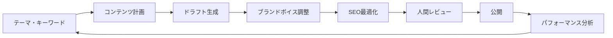

## 概要

ブログ記事・SNS投稿・広告コピーの生成ワークフローをAIで自動化します。ブランドボイスの一貫性を保ちながら大量のコンテンツを効率的に生成する方法を学びます。

## 本文

### コンテンツ生成のワークフロー



### ブランドボイスの設定

```python
from openai import OpenAI

client = OpenAI()

# ブランドボイスの定義
BRAND_VOICE = {
    "tone": "親しみやすくプロフェッショナル",
    "style": "技術的な正確さを持ちながら分かりやすく",
    "vocabulary": "専門用語は使うが必ず説明を添える",
    "avoid": ["過度な押し売り", "ネガティブな競合比較", "断定的な誇張表現"],
    "persona": "信頼できる技術パートナー"
}

BRAND_SYSTEM_PROMPT = f"""あなたは{BRAND_VOICE['persona']}として、コンテンツを生成します。

トーン: {BRAND_VOICE['tone']}
スタイル: {BRAND_VOICE['style']}
語彙: {BRAND_VOICE['vocabulary']}
避けるべきこと: {', '.join(BRAND_VOICE['avoid'])}

以上のブランドガイドラインに従ってください。"""
```

### ブログ記事の生成

```python
def generate_blog_post(
    topic: str,
    target_audience: str,
    word_count: int = 800,
    keywords: list[str] = None
) -> dict:
    """
    SEO対応のブログ記事を生成する
    """
    keywords_text = f"\nSEOキーワード: {', '.join(keywords)}" if keywords else ""

    prompt = f"""以下の条件でブログ記事を作成してください。

トピック: {topic}
ターゲット読者: {target_audience}
目標文字数: {word_count}字程度{keywords_text}

構成:
1. 読者の課題を引用するキャッチーな導入（100字）
2. 本文（H2・H3見出しを使って構造化）
3. 具体的な実例またはデータを含める
4. まとめ（箇条書き3〜5点）
5. CTA（行動喚起）

Markdown形式で作成してください。"""

    response = client.chat.completions.create(
        model="gpt-4o",
        messages=[
            {"role": "system", "content": BRAND_SYSTEM_PROMPT},
            {"role": "user", "content": prompt}
        ],
        temperature=0.7
    )
    content = response.choices[0].message.content

    # SEOメタデータも生成
    meta_prompt = f"""以下のブログ記事からSEOメタデータをJSON形式で生成してください:
{{"title": "タイトルタグ（60字以内）", "description": "メタディスクリプション（120字以内）", "slug": "URLスラッグ"}}

記事:
{content[:500]}"""

    meta_response = client.chat.completions.create(
        model="gpt-4o-mini",
        messages=[{"role": "user", "content": meta_prompt}],
        temperature=0,
        response_format={"type": "json_object"}
    )
    import json
    meta = json.loads(meta_response.choices[0].message.content)

    return {"content": content, "meta": meta}
```

### SNS投稿の一括生成

```python
def generate_social_media_posts(
    blog_content: str,
    platforms: list[str] = None
) -> dict[str, str]:
    """
    ブログ記事から各SNS用の投稿を生成する
    """
    platforms = platforms or ["twitter", "linkedin", "instagram"]

    platform_specs = {
        "twitter": "140字以内。ハッシュタグ2〜3個。絵文字可。インパクトのある一言で始める。",
        "linkedin": "300〜500字。プロフェッショナルなトーン。ビジネス上の価値を強調。",
        "instagram": "150字程度の本文＋ハッシュタグ10〜15個。視覚的・感情的な言葉を使う。"
    }

    prompt = f"""以下のブログ記事の内容から、各SNSプラットフォーム用の投稿を生成してください。

ブログ記事（要約）:
{blog_content[:800]}

各プラットフォームの仕様:
{chr(10).join([f"- {p}: {spec}" for p, spec in platform_specs.items() if p in platforms])}

JSONで返してください: {{{", ".join([f'"{p}": "投稿テキスト"' for p in platforms])}}}"""

    import json
    response = client.chat.completions.create(
        model="gpt-4o-mini",
        messages=[
            {"role": "system", "content": BRAND_SYSTEM_PROMPT},
            {"role": "user", "content": prompt}
        ],
        temperature=0.7,
        response_format={"type": "json_object"}
    )
    return json.loads(response.choices[0].message.content)
```

### 広告コピーのA/Bテスト用バリエーション生成

```python
def generate_ad_copy_variations(
    product: str,
    value_proposition: str,
    n_variations: int = 5
) -> list[dict]:
    """
    広告コピーの複数バリエーションを生成する（A/Bテスト用）
    """
    prompt = f"""製品・サービスの広告コピーを{n_variations}パターン生成してください。

製品: {product}
価値提案: {value_proposition}

各パターンで以下を変えてください:
- アプローチ（機能訴求・感情訴求・社会的証明・限定性・問題解決）
- ヘッドライン（30字以内）
- 本文（80字以内）
- CTA（15字以内）

JSON配列で返してください:
[{{"approach": "アプローチ名", "headline": "ヘッドライン", "body": "本文", "cta": "CTA"}}]"""

    import json
    response = client.chat.completions.create(
        model="gpt-4o-mini",
        messages=[{"role": "user", "content": prompt}],
        temperature=0.8,
        response_format={"type": "json_object"}
    )
    data = json.loads(response.choices[0].message.content)
    return data.get("variations", data) if isinstance(data, dict) else data
```

### コンテンツ品質チェック

```python
def check_content_quality(content: str, brand_guidelines: str) -> dict:
    """生成されたコンテンツがブランドガイドラインに沿っているか評価する"""
    import json
    prompt = f"""以下のコンテンツがブランドガイドラインに沿っているか評価してください。

ブランドガイドライン:
{brand_guidelines}

コンテンツ:
{content[:1000]}

JSON形式で評価してください:
{{"score": 1-10, "issues": ["問題点のリスト"], "improvements": ["改善提案のリスト"]}}"""

    response = client.chat.completions.create(
        model="gpt-4o-mini",
        messages=[{"role": "user", "content": prompt}],
        temperature=0,
        response_format={"type": "json_object"}
    )
    return json.loads(response.choices[0].message.content)
```

## ハンズオン

1つのトピックからブログ→SNS投稿の一貫したコンテンツを自動生成します。

**ステップ1: ブログ記事を生成する**

```python
from openai import OpenAI
client = OpenAI()

result = generate_blog_post(
    topic="中小企業のためのAI導入入門",
    target_audience="IT予算が限られた中小企業の経営者・IT担当者",
    word_count=600,
    keywords=["AI導入", "中小企業", "業務効率化"]
)
print("=== ブログ記事 ===")
print(result["content"][:500])
print("\n=== SEOメタデータ ===")
print(result["meta"])
```

**ステップ2: ブログからSNS投稿を生成する**

```python
posts = generate_social_media_posts(result["content"])
for platform, post in posts.items():
    print(f"\n=== {platform.upper()} ===")
    print(post)
```

**ステップ3: 広告コピーのバリエーションを生成してA/Bテスト計画を立てる**

```python
variations = generate_ad_copy_variations(
    product="AIタスク管理ツール",
    value_proposition="AIが毎朝あなたの今日の優先タスクを自動で整理する",
    n_variations=3
)
for i, v in enumerate(variations, 1):
    print(f"\nバリエーション{i} [{v.get('approach')}]")
    print(f"  HL: {v.get('headline')}")
    print(f"  本文: {v.get('body')}")
    print(f"  CTA: {v.get('cta')}")
```

## クイズ

<!-- QUIZ:START -->
**Q1. コンテンツ生成でtemperatureを0.7程度に設定する理由はどれですか？**

- A) コストを削減するため
- B) 多様でクリエイティブな表現を生成するため
- C) 構造化されたJSONを確実に出力するため
- D) 処理速度を向上させるため

**正解: B**
**解説:** クリエイティブなコンテンツ生成ではある程度の多様性と新鮮さが求められます。temperature=0.7程度で「一貫性」と「創造性」のバランスが取れます。一方でSEOメタデータや広告コピーの品質チェックなど正確さが重要な場合はtemperature=0に近い値を使います。

**Q2. A/Bテスト用に広告コピーのバリエーションを生成する際に重要な点はどれですか？**

- A) 全バリエーションで同じ言葉を使う
- B) 各バリエーションで異なるアプローチ（機能訴求・感情訴求等）を試す
- C) 最も長いバリエーションを使う
- D) 常にtemperature=0を使う

**正解: B**
**解説:** A/Bテストでは何が効果的かを検証するために、各バリエーションで明確に異なるアプローチを試します（機能訴求 vs 感情訴求 vs 社会的証明など）。同じアプローチのわずかな表現違いではなく、本質的に異なるメッセージングを試すことで有効な知見が得られます。

**Q3. AIが生成したマーケティングコンテンツで必ず人間がレビューすべき理由はどれですか？**

- A) AIが日本語を正しく書けないから
- B) ブランドの一貫性・法的リスク・事実の正確性を確認するため
- C) APIコストを削減するため
- D) SEOの効果を測定するため

**正解: B**
**解説:** AIが生成したコンテンツは文章的には流暢でも、①ブランドの微妙なトーンと合わない②事実として誤った情報を含む③景品表示法・著作権等の法的リスクがある可能性があります。これらはドメイン知識を持つ人間のレビューでしか確認できません。

<!-- QUIZ:END -->

## まとめ

- ブランドボイスをシステムプロンプトで定義することで一貫したトーンのコンテンツを生成できる
- ブログ記事→SNS投稿→広告コピーと一貫したメッセージを各メディアに展開できる
- A/Bテスト用に異なるアプローチのバリエーションを大量に生成することが容易になる
- AI生成コンテンツはブランド・法的・事実確認のため必ず人間のレビューが必要

## 次のレッスン

次のレッスンでは、生成AIを組織に導入する際のプロセスと変更管理のベストプラクティスを学びます。
