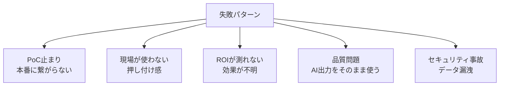
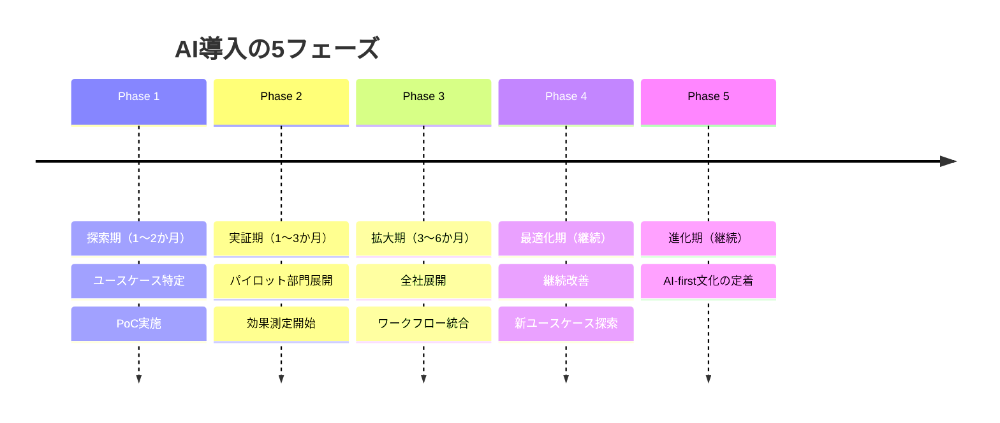

## 概要

生成AIを組織に導入する際の段階的なプロセス、現場の抵抗感の克服方法、変更管理のベストプラクティスを学びます。技術だけでなく、組織・人の側面を理解することが成功の鍵です。

## 本文

### AI導入の典型的な失敗パターン



これらの失敗を避けるには、技術と組織変更の両方のアプローチが必要です。

### 段階的導入の5フェーズ



### フェーズ1: ユースケース特定の方法

```
ユースケース評価マトリクス:

          高インパクト
              ↑
              |  [優先] 高インパクト   [戦略] 高インパクト
              |  低難度              高難度
              |
低難度 ←──────────────────────→ 高難度
              |
              |  [後回し] 低インパクト  [避ける] 低インパクト
              |  低難度              高難度
              ↓
          低インパクト
```

**優先すべきユースケースの特徴:**
- 繰り返しの多い業務（週1時間以上消費）
- 正解が比較的明確なタスク
- 失敗しても被害が限定的
- 既にデジタルデータが存在する

### 抵抗感の種類と対処法

| 抵抗の種類 | 具体的な声 | 対処法 |
|-----------|-----------|--------|
| 仕事への不安 | 「AIに仕事を奪われる」 | AIが補助ツールであることを明示、空いた時間の活用例を示す |
| 品質への不信 | 「AIの出力は信用できない」 | 人間のレビュープロセスを明確にし、最終判断は人間と強調 |
| 学習コスト | 「使い方が分からない」 | ハンズオン研修・社内チャンピオンによるサポート体制 |
| セキュリティ | 「情報漏れが心配」 | データポリシー・利用ガイドラインの整備と共有 |
| 完璧主義 | 「100%正確でないと使えない」 | 「補助ツール」として位置付け、現在の非効率と比較する |

### 変更管理のフレームワーク（ADKAR）

```
A - Awareness（認識）: なぜ変わる必要があるかを理解する
D - Desire（意欲）: 変わりたいという気持ちを持つ
K - Knowledge（知識）: どう変わればいいか知識を持つ
A - Ability（能力）: 実際に新しいやり方でできる
R - Reinforcement（定着）: 新しいやり方を続ける
```

```python
# 導入進捗管理のシンプルな例
from dataclasses import dataclass
from typing import Optional

@dataclass
class AdoptionTracker:
    """AI導入の進捗を追跡するデータクラス"""
    department: str
    total_employees: int
    trained: int = 0
    active_users: int = 0
    use_cases_live: int = 0
    hours_saved_per_week: float = 0.0
    satisfaction_score: Optional[float] = None

    @property
    def training_completion_rate(self) -> float:
        return self.trained / self.total_employees if self.total_employees else 0

    @property
    def activation_rate(self) -> float:
        return self.active_users / self.trained if self.trained else 0

    def summary(self) -> str:
        return (
            f"部署: {self.department}\n"
            f"  研修完了率: {self.training_completion_rate:.0%}\n"
            f"  アクティブ率: {self.activation_rate:.0%}\n"
            f"  稼働ユースケース: {self.use_cases_live}件\n"
            f"  週間時間削減: {self.hours_saved_per_week:.1f}時間\n"
            f"  満足度: {self.satisfaction_score}/5" if self.satisfaction_score else ""
        )

# 追跡例
departments = [
    AdoptionTracker("営業部", 20, trained=18, active_users=15,
                   use_cases_live=3, hours_saved_per_week=45.0, satisfaction_score=4.2),
    AdoptionTracker("開発部", 10, trained=10, active_users=10,
                   use_cases_live=5, hours_saved_per_week=60.0, satisfaction_score=4.6),
    AdoptionTracker("経理部", 8, trained=4, active_users=2,
                   use_cases_live=1, hours_saved_per_week=5.0, satisfaction_score=3.5),
]

for dept in departments:
    print(dept.summary())
    print()
```

### 社内チャンピオン（推進者）の育成

成功する導入には「社内チャンピオン」の存在が不可欠です。

**チャンピオンの選定基準:**
- 新技術への好奇心が高い
- 部門内での信頼・影響力がある
- 業務改善への意欲が高い
- コミュニケーション能力がある

**チャンピオンの役割:**
- 部門内のユースケース発掘
- 社員のサポート・相談窓口
- 成功事例の共有・伝播
- 問題点のフィードバック収集

### 利用ガイドラインのテンプレート

```markdown
# 生成AI利用ガイドライン

## やってよいこと（Green）
- ドラフト作成の補助
- アイデア出し
- 文章の校正・改善
- 公開情報の調査補助

## 注意が必要なこと（Yellow）
- 顧客名・社員名を含む文章の入力 → 匿名化してから使用
- 契約書・法的文書の生成 → 必ず法務レビューを受ける

## してはいけないこと（Red）
- 個人情報・機密情報の入力
- AI出力をレビューなしでそのまま外部公開
- 無断での顧客向けコミュニケーションへの使用
```

## クイズ

<!-- QUIZ:START -->
**Q1. AI導入が「PoC止まり」になる最も一般的な理由はどれですか？**

- A) AIの技術精度が低いから
- B) 現場の業務フローへの統合計画とROI測定が不十分なため
- C) 予算が足りないから
- D) 法規制があるから

**正解: B**
**解説:** PoC（概念実証）は技術的な可能性を示しますが、それを本番に繋げるには現場の業務フローへの統合・既存システムとの接続・効果測定の仕組み・変更管理が必要です。これらが不十分だと「すごいけど使えない」状態になりPoC止まりになります。

**Q2. 「AIに仕事を奪われる」という社員の不安に対する最も効果的な対処法はどれですか？**

- A) 不安を無視してツールの導入を進める
- B) AIが補助ツールであることを明示し、空いた時間のより価値ある業務への活用を示す
- C) AIを使わないことを保証する
- D) 自動化される業務の社員を解雇する

**正解: B**
**解説:** 不安を否定せず向き合い、AIが「仕事を奪う」のではなく「ルーティンを補助して人間がより高価値な業務に集中できるようにする」という位置付けを示すことが重要です。具体的に「空いた時間で何ができるか」を示すことで、変化をネガティブではなくポジティブに捉えられるようになります。

**Q3. 変更管理フレームワーク「ADKAR」の「K」が表すものはどれですか？**

- A) Key Performance Indicator（主要業績指標）
- B) Knowledge（変わるためのやり方・知識）
- C) Kanban（業務可視化）
- D) KPI（KPI設定）

**正解: B**
**解説:** ADKARのKはKnowledge（知識）です。変わりたい意欲（Desire）を持っていても、どう変わればいいか知識がなければ行動できません。AIツールの使い方・プロンプト設計・注意事項などを研修やドキュメントで提供することがこのフェーズに相当します。

<!-- QUIZ:END -->

## まとめ

- AI導入の失敗はほぼ技術ではなく、組織・変更管理の問題から生じる
- 段階的な5フェーズで進め、小さな成功体験を積み重ねることが重要
- 現場の抵抗感には種類があり、それぞれに適した対処法がある
- 社内チャンピオンの育成と利用ガイドラインの整備が定着のカギ

## 次のレッスン

次のレッスンでは、生成AIのビジネス活用におけるリスク・倫理・ガバナンスを学びます。
