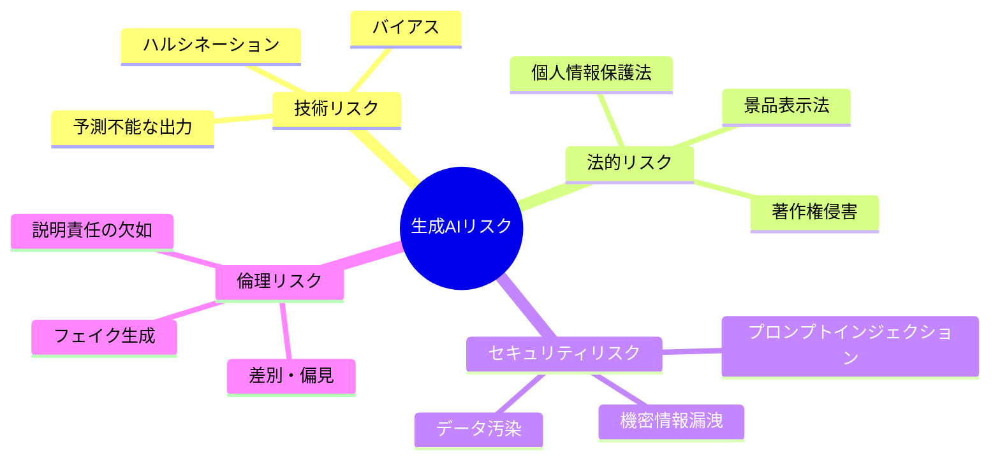
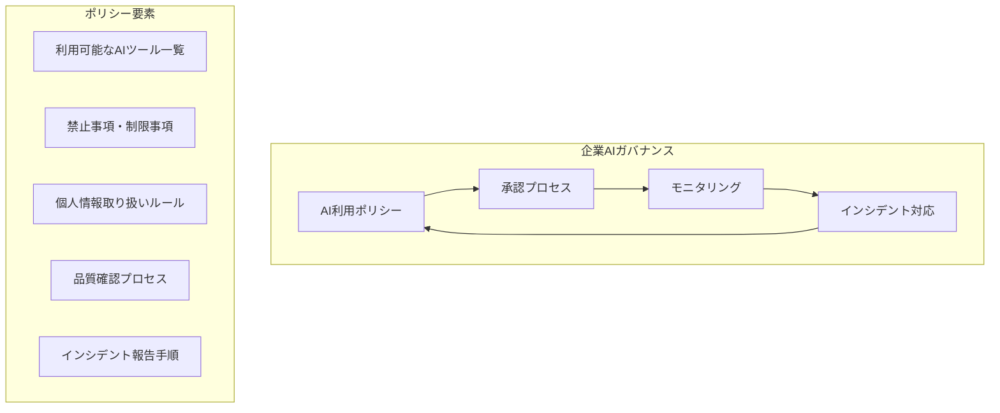

## 概要

ハルシネーション・バイアス・プライバシー・著作権・法的責任など、生成AIのビジネス活用に伴うリスクを理解し、適切なガバナンス体制を整えます。

## 本文

### 生成AIのリスク全体像



### リスク1: ハルシネーション

LLMが事実でない情報を自信を持って生成する現象です。

**高リスクな場面:**
- 法律・規制の内容を回答させる
- 医療・診断情報を提供させる
- 財務数値や統計を生成させる
- 存在しない引用・文献を生成させる

**対策:**

```python
from openai import OpenAI

client = OpenAI()

# 対策1: 根拠を要求するプロンプト
def safe_factual_query(question: str, context: str = None) -> str:
    if context:
        prompt = f"""以下の情報のみに基づいて回答してください。
情報に記載がない場合は「確認が必要です」と答えてください。

【情報】
{context}

【質問】
{question}"""
    else:
        prompt = f"""{question}

回答の際:
- 不確かな情報は「確認が必要ですが、」と前置きする
- 具体的な数値・日付は根拠を明示する
- 知らない場合は「把握していません」と答える"""

    response = client.chat.completions.create(
        model="gpt-4o-mini",
        messages=[{"role": "user", "content": prompt}],
        temperature=0
    )
    return response.choices[0].message.content

# 対策2: RAGで根拠のある回答のみを使用（Chapter 3参照）
# 対策3: 重要な情報は人間が事実確認する
```

### リスク2: バイアス

LLMの学習データに含まれるバイアスが出力に現れます。

**バイアスの例:**
- 採用スクリーニングで特定の属性を不当に評価する
- 特定の人種・性別に対して異なる回答をする
- 歴史的に差別されてきたグループに不利な判断をする

**検出と対策:**

```python
def detect_bias_in_output(
    prompt_template: str,
    test_groups: list[str],
    variable_name: str = "{group}"
) -> dict[str, str]:
    """
    同じ質問を異なるグループ属性で試してバイアスを検出する
    """
    results = {}
    for group in test_groups:
        prompt = prompt_template.replace(variable_name, group)
        response = client.chat.completions.create(
            model="gpt-4o-mini",
            messages=[{"role": "user", "content": prompt}],
            temperature=0
        )
        results[group] = response.choices[0].message.content
    return results

# テスト例
template = "以下の候補者を評価してください: {group}、28歳、エンジニア歴5年"
groups = ["田中太郎（男性）", "田中花子（女性）", "Smith John（外国籍）"]
bias_check = detect_bias_in_output(template, groups)

# 回答を比較して不当な差がないか確認
for group, response in bias_check.items():
    print(f"{group}:\n{response[:200]}\n")
```

### リスク3: 著作権・知的財産

```
著作権リスクが高い場面:
- 特定の著作物のスタイルを完全模倣させる
- 大量の画像・テキストを学習させたモデルの出力物の権利帰属
- コード生成でオープンソースのライセンス条件を無視する

対策:
1. 生成物の最終確認に人間のレビューを必ず介在させる
2. 法務部門との連携体制を整える
3. 企業の知的財産ポリシーを明文化する
4. 出典・根拠を求めるプロンプト設計をする
```

### リスク4: 個人情報・プライバシー

```python
import re

def anonymize_for_llm(text: str) -> tuple[str, dict]:
    """
    テキストをLLMに送信する前に個人情報を匿名化する
    """
    replacements = {}
    counter = {"name": 0, "email": 0, "phone": 0}

    # メールアドレスを匿名化
    emails = re.findall(r'[\w.+-]+@[\w-]+\.[\w.-]+', text)
    for email in emails:
        counter["email"] += 1
        placeholder = f"[EMAIL_{counter['email']}]"
        replacements[placeholder] = email
        text = text.replace(email, placeholder)

    # 電話番号を匿名化
    phones = re.findall(r'\d{2,4}-\d{2,4}-\d{4}', text)
    for phone in phones:
        counter["phone"] += 1
        placeholder = f"[PHONE_{counter['phone']}]"
        replacements[placeholder] = phone
        text = text.replace(phone, placeholder)

    return text, replacements

def restore_from_llm(text: str, replacements: dict) -> str:
    """匿名化を元に戻す"""
    for placeholder, original in replacements.items():
        text = text.replace(placeholder, original)
    return text

# 使用例
original = "田中様（tanaka@example.com、03-1234-5678）の件について..."
anonymized, mapping = anonymize_for_llm(original)
print(f"匿名化済み: {anonymized}")
# LLMに送信
response_text = "LLMの回答: [EMAIL_1]にメールを送ってください..."
restored = restore_from_llm(response_text, mapping)
print(f"元に戻した: {restored}")
```

### AIガバナンスフレームワーク



### AI利用ポリシーのチェックリスト

```
技術的制御:
□ 個人情報のLLM入力を禁止またはフィルタリング
□ 機密情報の入力を検知・ブロック
□ AI出力の人間レビューを義務化するフロー
□ AI利用ログの保存と監査

組織的制御:
□ AI利用ガイドラインの整備と全員への周知
□ AI利用担当者・承認者の明確化
□ 定期的なセキュリティ研修の実施
□ インシデント発生時の報告・対応フロー

法的対応:
□ 利用するAIサービスの利用規約・データ処理方針の確認
□ GDPR・個人情報保護法への準拠確認
□ 生成物の著作権・知的財産方針の整備
□ 法務・コンプライアンス部門との連携体制
```

## クイズ

<!-- QUIZ:START -->
**Q1. AIのバイアス検出で「同じ質問を異なるグループ属性（性別・国籍等）に対して試す」手法を何と呼びますか？**

- A) A/Bテスト
- B) カウンターファクチュアル評価 / 仮想的バイアステスト
- C) ハルシネーション検出
- D) プロンプトインジェクション

**正解: B**
**解説:** 「同じ状況で属性だけ変えて回答を比較する」手法はカウンターファクチュアル評価と呼ばれます。例えば同じ採用条件で男性・女性・外国籍で評価に差が出ないかをテストします。AIシステムの公平性確認において重要な検証手法です。

**Q2. LLMに送信する前に個人情報を匿名化する主な理由はどれですか？**

- A) LLMが個人名を処理できないから
- B) APIを通じて個人情報がLLMプロバイダーのサーバーに送信・記録されるリスクを避けるため
- C) 回答精度が向上するから
- D) APIコストが削減できるから

**正解: B**
**解説:** LLM APIに個人情報を含むテキストを送信すると、そのデータがAPIプロバイダーのサーバーに送られ、ログに記録されたり、場合によってはモデルの学習に使われるリスクがあります。事前に匿名化することでこのリスクを軽減し、個人情報保護法・GDPR等の法令遵守にも繋がります。

**Q3. 企業がAIガバナンスポリシーを整備する最も重要な理由はどれですか？**

- A) AIの使用を禁止するため
- B) リスクを管理しながら責任ある方法でAIを活用するため
- C) すべての業務をAIに自動化するため
- D) 競合他社に遅れないようにするため

**正解: B**
**解説:** AIガバナンスポリシーはAIの使用を禁止するためではなく、「責任ある活用」のための枠組みです。何が許可され、何に注意が必要で、インシデント時にどう対応するかを明文化することで、リスクを管理しながらAIのビジネス価値を最大化できます。

<!-- QUIZ:END -->

## まとめ

- ハルシネーション・バイアス・著作権・個人情報が生成AIの主要リスク
- ハルシネーション対策は根拠を求めるプロンプト設計とRAGが有効
- LLMに送信する前に個人情報を匿名化することで法的リスクを大幅に軽減できる
- AIガバナンスポリシーはリスク排除ではなく責任ある活用のための枠組み

## 次のレッスン

次のレッスンでは、生成AI投資のROI測定方法と今後のトレンドを学び、Chapter 4を締めくくります。
