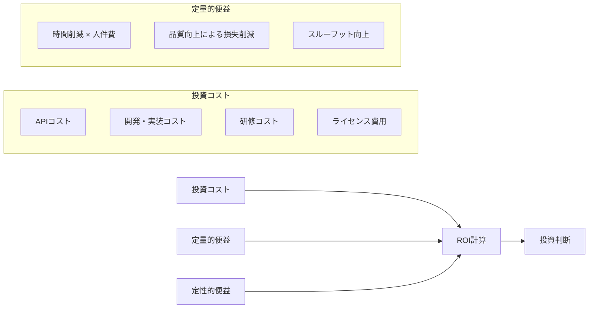
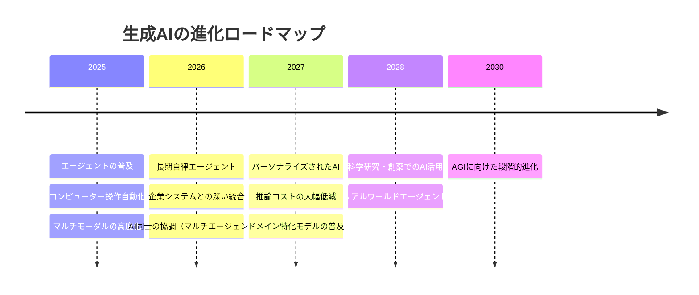

## 概要

生成AI投資の効果を定量的に測定するROIフレームワークと、2025〜2030年の生成AI技術トレンドを学びます。投資対効果の説明と将来の技術変化への備えを理解します。

## 本文

### AI投資のROI計算フレームワーク



### ROI計算の実装例

```python
from dataclasses import dataclass

@dataclass
class AIRoiCalculator:
    """AI投資のROI計算ツール"""

    # コスト（月次）
    api_cost_monthly: float  # API利用料（円）
    development_cost: float  # 初期開発コスト（円、一回）
    training_cost: float     # 研修コスト（円、一回）
    maintenance_monthly: float  # 月次保守コスト（円）

    # 効果（月次）
    hours_saved_monthly: float   # 削減時間（時間/月）
    hourly_rate: float           # 人件費単価（円/時間）
    error_reduction_value: float # エラー削減による損失回避（円/月）
    revenue_increase: float      # 収益増加分（円/月）

    project_months: int = 12  # 評価期間（月）

    @property
    def monthly_benefit(self) -> float:
        """月次便益"""
        return (
            self.hours_saved_monthly * self.hourly_rate
            + self.error_reduction_value
            + self.revenue_increase
        )

    @property
    def total_cost(self) -> float:
        """総コスト（評価期間全体）"""
        recurring = (self.api_cost_monthly + self.maintenance_monthly) * self.project_months
        one_time = self.development_cost + self.training_cost
        return recurring + one_time

    @property
    def total_benefit(self) -> float:
        """総便益（評価期間全体）"""
        return self.monthly_benefit * self.project_months

    @property
    def roi_percentage(self) -> float:
        """ROI（%）"""
        if self.total_cost == 0:
            return 0
        return (self.total_benefit - self.total_cost) / self.total_cost * 100

    @property
    def payback_months(self) -> float:
        """投資回収期間（月）"""
        one_time = self.development_cost + self.training_cost
        monthly_net = self.monthly_benefit - self.api_cost_monthly - self.maintenance_monthly
        if monthly_net <= 0:
            return float("inf")
        return one_time / monthly_net

    def report(self) -> str:
        return f"""
=== AI投資ROI分析レポート ===

【コスト分析（{self.project_months}か月）】
  API・ライセンス費: ¥{self.api_cost_monthly * self.project_months:,.0f}
  初期開発費: ¥{self.development_cost:,.0f}
  研修費: ¥{self.training_cost:,.0f}
  保守費: ¥{self.maintenance_monthly * self.project_months:,.0f}
  ──────────────────────
  総コスト: ¥{self.total_cost:,.0f}

【便益分析（{self.project_months}か月）】
  時間削減効果: ¥{self.hours_saved_monthly * self.hourly_rate * self.project_months:,.0f}
    （{self.hours_saved_monthly}時間/月 × ¥{self.hourly_rate:,.0f}/時間）
  品質向上効果: ¥{self.error_reduction_value * self.project_months:,.0f}
  収益増加効果: ¥{self.revenue_increase * self.project_months:,.0f}
  ──────────────────────
  総便益: ¥{self.total_benefit:,.0f}

【ROI指標】
  ROI: {self.roi_percentage:.1f}%
  投資回収期間: {self.payback_months:.1f}か月
  月次純利益: ¥{self.monthly_benefit - self.api_cost_monthly - self.maintenance_monthly:,.0f}
"""

# 議事録自動化のROI例
minutes_roi = AIRoiCalculator(
    api_cost_monthly=30_000,       # GPT-4o API費
    development_cost=500_000,      # 開発費
    training_cost=100_000,         # 研修費
    maintenance_monthly=20_000,    # 保守費
    hours_saved_monthly=80,        # 月80時間削減（20人 × 4時間/月）
    hourly_rate=4_000,             # 4,000円/時間
    error_reduction_value=50_000,  # 誤記・漏れによる手戻りコスト削減
    revenue_increase=0,
    project_months=12
)
print(minutes_roi.report())
```

### 定性的ROIの測定

定量化が難しい効果も記録しておきます。

```python
QUALITATIVE_METRICS = {
    "従業員満足度": {
        "測定方法": "月次パルスサーベイ（1〜5点）",
        "目標": "4.0以上",
        "現状": 3.2
    },
    "スキルアップ": {
        "測定方法": "AI活用スキル認定者数",
        "目標": "全員の80%",
        "現状": "42%"
    },
    "イノベーション": {
        "測定方法": "AI活用の新アイデア提案数/月",
        "目標": "月10件以上",
        "現状": 6
    }
}
```

### 今後のトレンド（2025〜2030年）



### エンジニアとして備えるべきこと

| トレンド | 必要なスキル |
|---------|-------------|
| エージェント自動化 | マルチエージェント設計・オーケストレーション |
| コンテキスト長の増大 | 長文対応のチャンキング・要約設計 |
| マルチモーダル | 画像・音声・動画を扱うパイプライン設計 |
| コスト低減 | モデル選択の最適化・キャッシング戦略 |
| 規制強化 | AIガバナンス・監査ログ・説明可能なAI |

## クイズ

<!-- QUIZ:START -->
**Q1. AI投資のROI計算で「定量的便益」として最も適切なものはどれですか？**

- A) 「社員のモチベーションが上がった」という感想
- B) 「月80時間の業務削減 × 時給4,000円 = 月32万円のコスト削減」
- C) 「業界でAI活用が進んでいるという安心感」
- D) 「将来的にAI人材が採用しやすくなる」

**正解: B**
**解説:** 定量的便益とは金額・時間・件数などで数値化できる効果です。「時間削減 × 人件費単価」「エラー減少による損失回避額」「売上増加額」などが典型例です。経営層への説明責任を果たすために定量化が重要です。

**Q2. 投資回収期間（Payback Period）の計算式として正しいのはどれですか？**

- A) 総コスト ÷ 月次純利益（月）
- B) 月次便益 × プロジェクト期間
- C) （総便益 - 総コスト）÷ 総コスト × 100
- D) APIコスト ÷ 月次削減時間

**正解: A**
**解説:** 投資回収期間 = 初期投資（開発費 + 研修費など一回限りのコスト）÷ 月次純利益（月次便益 - 月次コスト）で計算します。例えば初期投資60万円・月次純利益10万円なら6か月で回収できます。

**Q3. 2025〜2030年の生成AI主要トレンドとして最も可能性が高いのはどれですか？**

- A) テキスト生成のみへの回帰
- B) AIの使用が禁止される
- C) 長期自律エージェントの普及と企業システムとの深い統合
- D) クラウドAIサービスがすべて無料になる

**正解: C**
**解説:** 2025〜2030年の有力なトレンドとして、単発の応答を超えて複数日にわたって自律的にタスクを実行する「長期自律エージェント」の実用化、そして既存の企業システム（CRM・ERP・社内データ）とAIが深く統合されたワークフローの普及が予測されています。

<!-- QUIZ:END -->

## まとめ

- AI投資のROIは「時間削減・品質向上・収益増加」の3軸で定量的に測定する
- 投資回収期間と月次純利益を計算することで経営層への説明責任を果たせる
- 定性的ROI（満足度・スキルアップ）も記録しておくことで総合的な評価が可能
- 2025〜2030年はエージェントの普及・システム統合・コスト低減が主要トレンド

## 次のレッスン

Chapter 5では、モデル自体をカスタマイズする「ファインチューニング」を学びます。
