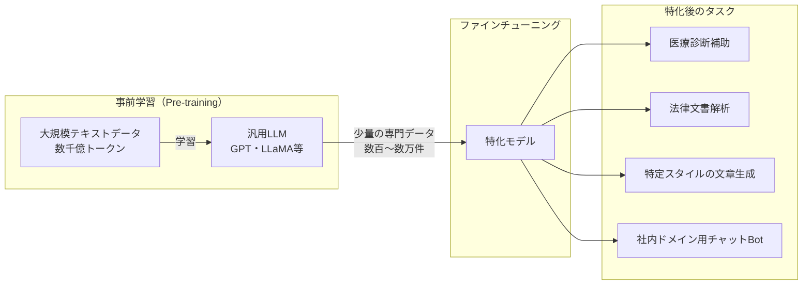
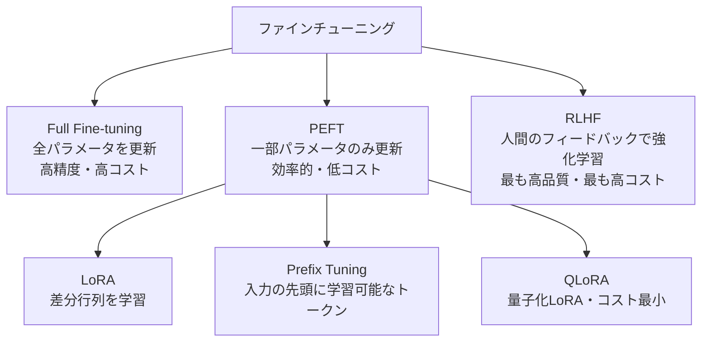

## 概要

ファインチューニングとは、事前学習済みモデルに追加学習をさせて特定のタスク・ドメインに特化させる技術です。なぜ必要なのか、どのような場面で有効なのかを理解します。

## 本文

### 事前学習とファインチューニングの関係



事前学習は数週間〜数か月・数百億円規模のコストがかかりますが、ファインチューニングは数時間〜数日・数万〜数百万円でできます。

### ファインチューニングが必要な場面

**ファインチューニングが効果的な状況:**

```
✅ 特定のトーン・文体・ペルソナを一貫させたい
   例: 「弊社の口調で書いて」を毎回プロンプトに書かずに済む

✅ ドメイン特有の推論パターンを学習させたい
   例: 医療診断のステップ・法律の解釈方法

✅ プロンプトで指示しにくい暗黙の知識を学習させたい
   例: 業界慣習・社内用語の正しい使い方

✅ 推論コストを下げたい
   例: 大きなモデル＋長いプロンプトより、小さなFTモデルの方が安い

✅ 応答フォーマットを確実に固定したい
   例: 必ずJSON形式で特定の構造で返す
```

**ファインチューニングが不要な状況（プロンプトで十分）:**

```
❌ 新しい知識を覚えさせたい → RAGを使う
❌ 最新情報に対応させたい → RAGを使う
❌ データが100件未満 → Few-shotプロンプトで十分
❌ タスクが変わる可能性がある → 柔軟なプロンプト設計の方が良い
```

### ファインチューニングの種類



### ファインチューニングのデータ形式（OpenAI形式）

```json
[
  {
    "messages": [
      {"role": "system", "content": "あなたは医療記録の要約専門家です"},
      {"role": "user", "content": "患者: 45歳男性。主訴: 胸痛。..."},
      {"role": "assistant", "content": "【要約】年齢: 45歳男性。主訴: 胸痛（..."}
    ]
  },
  {
    "messages": [
      {"role": "system", "content": "あなたは医療記録の要約専門家です"},
      {"role": "user", "content": "患者: 32歳女性。主訴: 頭痛。..."},
      {"role": "assistant", "content": "【要約】年齢: 32歳女性。主訴: 頭痛（..."}
    ]
  }
]
```

各レコードが「入力→望ましい出力」のペアです。

### ファインチューニングのコスト感（OpenAI GPT-4o mini）

| 項目 | コスト目安 |
|------|-----------|
| 学習データ | 50〜500件でも効果あり |
| 学習コスト | $0.003/1Kトークン（2024年時点） |
| 推論コスト | ベースモデルより高い場合あり |
| 開発時間 | データ準備が全体の70% |

## クイズ

<!-- QUIZ:START -->
**Q1. ファインチューニングがRAGより適しているユースケースはどれですか？**

- A) 最新ニュースに基づいた回答
- B) 社内の機密ドキュメントを参照した回答
- C) 特定の文体・ペルソナを一貫して維持すること
- D) リアルタイムデータを使った計算

**正解: C**
**解説:** 特定のトーン・文体・ペルソナの一貫した維持はファインチューニングが得意です。プロンプトで毎回指示するより、ファインチューニングで「染み込ませる」方が確実です。一方、最新情報や外部データへのアクセスはRAGが適しています。

**Q2. ファインチューニングに必要な最低限のデータ件数の目安として正しいのはどれですか？**

- A) 10件以上
- B) 50〜100件以上（OpenAI GPT-4o miniの場合）
- C) 1万件以上
- D) 100万件以上

**正解: B**
**解説:** OpenAIのファインチューニングでは理論上10件でも可能ですが、意味のある効果を得るには50〜100件以上が推奨されます。ただしデータの質が件数より重要で、高品質な50件の方が低品質な1,000件より優れた結果を出すこともあります。

**Q3. Full Fine-tuningよりPEFT（LoRA等）が注目されている主な理由はどれですか？**

- A) PEFTの方が常に精度が高いから
- B) 全パラメータを更新する必要がなく、計算リソースとコストを大幅に削減できるから
- C) PEFTはクラウドAPIなしで実行できるから
- D) PEFTはデータ準備が不要だから

**正解: B**
**解説:** Full Fine-tuningは数十億〜数千億のパラメータを全て更新するため、大量のGPUメモリとコストが必要です。PEFTは追加する小さな差分パラメータのみを学習することで、同等の効果を大幅に少ないリソースで実現します。例えばLoRAは0.1〜1%のパラメータ追加で高い効果を出せます。

<!-- QUIZ:END -->

## まとめ

- ファインチューニングは事前学習済みモデルに追加学習して特化させる技術
- 文体・ペルソナ固定・ドメイン特化推論・コスト最適化に有効
- 新しい知識・最新情報の追加はRAGが適しており、ファインチューニングは不向き
- Full Fine-tuning・PEFT・RLHFのコストと精度のトレードオフを理解して選択する

## 次のレッスン

次のレッスンでは、ファインチューニングとプロンプトエンジニアリングをどう使い分けるかの判断基準を詳しく学びます。
