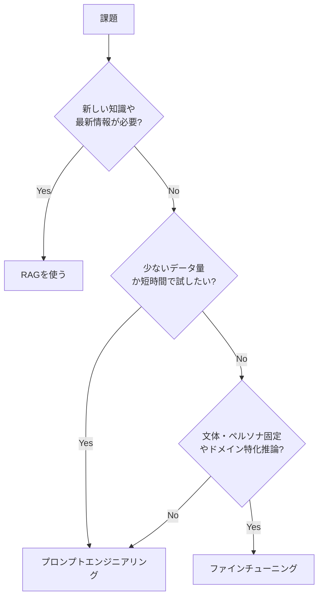

## 概要

ファインチューニングとプロンプトエンジニアリング（RAGを含む）は補完的な技術です。どのような判断基準でどちらを選ぶべきかを体系的に理解します。

## 本文

### 3つのアプローチの比較



### 詳細な比較表

| 観点 | プロンプトエンジニアリング | RAG | ファインチューニング |
|------|--------------------------|-----|-------------------|
| 実装コスト | 低 | 中 | 高 |
| 必要データ | 不要 | ドキュメント | 教師データ |
| 最新情報対応 | 制限あり | 対応 | 対応不可 |
| 推論速度 | 長いプロンプトで遅い | 検索レイテンシあり | 速い |
| 推論コスト | プロンプト長に依存 | 検索＋LLM | LLM呼び出しのみ |
| 文体・ペルソナ固定 | 毎回指示が必要 | 毎回指示が必要 | 確実に固定できる |
| 知識の更新 | 即時 | 即時 | 再学習が必要 |
| デバッグ | しやすい | 中程度 | 難しい |

### 判断フローチャート

```
Step 1: まずプロンプトで試す
        → 満足する結果が出たら終了

Step 2: Few-shotで改善を試みる
        → 5〜10件の例を加える
        → 満足する結果が出たら終了

Step 3: RAGで外部データを追加する
        → ナレッジ不足が問題なら効果的
        → 満足する結果が出たら終了

Step 4: ファインチューニングを検討する
        → データが100件以上集められる
        → 同じパターンが大量に発生する
        → コスト削減・速度向上が必要
        → プロンプトで固定できない挙動がある
```

### ケーススタディ: カスタマーサポートBot

**状況:** Eコマース企業のサポートBot。注文・返品・配送の質問に答える。

```python
# アプローチ1: プロンプトエンジニアリング
SUPPORT_PROMPT = """あなたはXYZ株式会社のカスタマーサポートです。
以下のルールで対応してください:
- 敬語を使い丁寧に対応する
- 返品は30日以内、未使用品に限る
- 送料は5,000円以上で無料
- 判断できない場合は「担当者に確認します」と答える
"""

# → プロ: 今すぐ使える、変更が容易
# → コン: 毎回長いプロンプトが必要、複雑なルールは漏れる


# アプローチ2: RAG + プロンプト
# FAQやポリシードキュメントをRAGで参照させる
# → プロ: 最新ポリシーに自動対応
# → コン: 検索レイテンシ、設定が必要


# アプローチ3: ファインチューニング（大量のQ&Aペアで学習）
# → プロ: 高速、一貫したトーン、短いプロンプトでOK
# → コン: データ収集・学習コスト、ポリシー変更時に再学習が必要
```

**推奨の段階的アプローチ:**

1. プロンプトエンジニアリングで始めてデータを収集
2. 収集したQ&Aペアで品質評価をする
3. 1000件以上の高品質ペアが集まったらファインチューニングを検討
4. RAGと組み合わせてポリシー更新に対応

### ファインチューニングの「準備ができているか」チェックリスト

```
□ タスクが明確に定義されている
□ 高品質な教師データが100件以上ある（理想は500件以上）
□ プロンプトエンジニアリングで限界を確認した
□ データ収集・準備のコストを確保している
□ 継続的なモデル評価の仕組みを持っている
□ モデルの再学習サイクルを設計している
```

### コスト試算の比較

```python
def compare_approaches(
    monthly_requests: int,
    avg_prompt_tokens: int,
    avg_completion_tokens: int
):
    """
    月次リクエスト数に基づいてアプローチ別コストを試算する
    （価格は参考値、実際は最新の公式料金を確認）
    """
    # GPT-4o mini（プロンプトエンジニアリング）
    input_price = 0.00015 / 1000   # $0.15/1M tokens
    output_price = 0.0006 / 1000   # $0.60/1M tokens
    pe_cost = (avg_prompt_tokens * input_price + avg_completion_tokens * output_price) * monthly_requests

    # GPT-4o mini Fine-tuned
    ft_input_price = 0.0003 / 1000  # FTは割高
    ft_output_price = 0.0012 / 1000
    ft_prompt_tokens = avg_prompt_tokens * 0.3  # FTは短いプロンプトで済む
    ft_cost = (ft_prompt_tokens * ft_input_price + avg_completion_tokens * ft_output_price) * monthly_requests

    print(f"月次リクエスト: {monthly_requests:,}件")
    print(f"プロンプトエンジニアリング: ${pe_cost:.2f}/月")
    print(f"ファインチューニング: ${ft_cost:.2f}/月（推論）+ 学習コスト")
    print(f"削減率: {(pe_cost - ft_cost) / pe_cost * 100:.0f}%")

compare_approaches(
    monthly_requests=100_000,
    avg_prompt_tokens=500,
    avg_completion_tokens=100
)
```

## クイズ

<!-- QUIZ:START -->
**Q1. 「新製品の発売日・仕様などの最新情報に基づいて顧客の質問に答えたい」場合、最適なアプローチはどれですか？**

- A) ファインチューニング
- B) RAG（最新ドキュメントをベクトルDBに登録して参照）
- C) より大きなLLMを使う
- D) プロンプトに全製品情報を記載する

**正解: B**
**解説:** 新製品情報のような変化する情報はファインチューニングで「学習」させるより、RAGで「参照」させる方が適切です。ファインチューニングでは情報が変わるたびに再学習が必要ですが、RAGではドキュメントを更新するだけで即座に対応できます。

**Q2. カスタマーサポートBotにファインチューニングを導入する適切なタイミングはどれですか？**

- A) 最初からファインチューニングで始める
- B) プロンプトエンジニアリングで運用しながら高品質Q&Aデータを500件以上収集してから
- C) ユーザーから1件でも不満が出たらすぐにファインチューニングする
- D) RAGを使わずにファインチューニングだけで対応する

**正解: B**
**解説:** ファインチューニングは事前に高品質な教師データが必要です。最初からデータを用意するのは困難なので、まずプロンプトエンジニアリングで運用しながら実際の会話データを収集・品質評価し、十分なデータが集まってからファインチューニングを検討するのがベストプラクティスです。

**Q3. ファインチューニング済みモデルが通常のプロンプトエンジニアリングより有利な点として正しいのはどれですか？**

- A) 最新情報を自動的に学習する
- B) 短いプロンプトで一貫したタスク実行ができ、推論が高速になる
- C) データが不要で始められる
- D) 人間のレビューが不要になる

**正解: B**
**解説:** ファインチューニングでモデルに特定の挙動を「染み込ませる」と、毎回長い指示プロンプトを書かなくても望ましい出力が得られます。また、システムプロンプトが短くなるため1リクエストあたりのトークン数が減り、推論速度向上とコスト削減が期待できます。

<!-- QUIZ:END -->

## まとめ

- プロンプトエンジニアリング → RAG → ファインチューニングの順で試す
- 最新情報・知識追加はRAG、文体固定・ドメイン推論はファインチューニングが適切
- 高品質データが100件以上集まるまでファインチューニングは待った方が良い
- ファインチューニングはコスト削減・速度向上・プロンプト短縮の効果があるが再学習コストに注意

## 次のレッスン

次のレッスンでは、ファインチューニングの品質を左右する「学習データの準備」方法を詳しく学びます。
