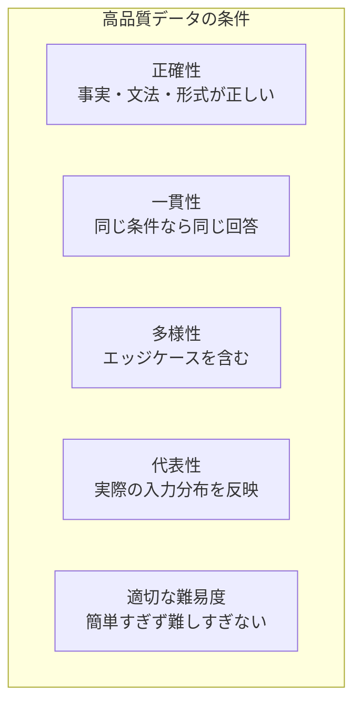

## 概要

ファインチューニングの品質は「データの質 × 量」で決まります。高品質な学習データの設計・収集・アノテーション・検証の方法を学びます。「Garbage in, garbage out」を防ぎます。

## 本文

### 学習データの品質基準



### データ形式（Chat形式）

OpenAI Fine-tuning APIのJSONL形式です。

```python
import json

# 1行1レコードのJSONL形式
training_examples = [
    {
        "messages": [
            {
                "role": "system",
                "content": "あなたはプログラミング教育アシスタントです。分かりやすく丁寧に説明します。"
            },
            {
                "role": "user",
                "content": "Pythonのリスト内包表記を教えてください"
            },
            {
                "role": "assistant",
                "content": "リスト内包表記は、ループを1行で書けるPythonの便利な構文です。\n\n**基本形:**\n```python\n[式 for 変数 in イテラブル]\n```\n\n**例:**\n```python\n# 従来のfor文\nsquares = []\nfor x in range(5):\n    squares.append(x ** 2)\n\n# リスト内包表記（同等）\nsquares = [x ** 2 for x in range(5)]\n# → [0, 1, 4, 9, 16]\n```"
            }
        ]
    },
    {
        "messages": [
            {
                "role": "system",
                "content": "あなたはプログラミング教育アシスタントです。分かりやすく丁寧に説明します。"
            },
            {
                "role": "user",
                "content": "Pythonの辞書（dict）の使い方を教えてください"
            },
            {
                "role": "assistant",
                "content": "辞書（dict）はキーと値のペアを格納するデータ構造です。\n\n**作成方法:**\n```python\nperson = {\"name\": \"田中\", \"age\": 30}\n```\n\n**よく使う操作:**\n```python\n# 値の取得\nprint(person[\"name\"])  # → 田中\n\n# 追加・更新\nperson[\"email\"] = \"tanaka@example.com\"\n\n# キーの存在確認\nif \"name\" in person:\n    print(\"nameキーがあります\")\n```"
            }
        ]
    }
]

# JSONLファイルとして保存
def save_jsonl(data: list[dict], path: str):
    with open(path, "w", encoding="utf-8") as f:
        for item in data:
            f.write(json.dumps(item, ensure_ascii=False) + "\n")

save_jsonl(training_examples, "training_data.jsonl")
```

### データ収集の方法

```python
from openai import OpenAI

client = OpenAI()

def generate_training_data_with_llm(
    task_description: str,
    examples_count: int = 50
) -> list[dict]:
    """
    LLMを使って学習データを自動生成する（合成データ）
    注意: 品質は必ず人間がレビューすること
    """
    seed_examples = [
        ("Pythonのリストを逆順にするには？", "list.reverse()またはlist[::-1]を使います..."),
        ("Pythonの例外処理を書いてください", "try-except構文を使います..."),
    ]

    generated = []
    for i in range(examples_count):
        prompt = f"""以下のタスクに関する学習データを1件生成してください。

タスク: {task_description}

既存の例（多様性を持たせてください）:
{chr(10).join([f'Q: {q}\nA: {a[:50]}...' for q, a in seed_examples])}

JSON形式で出力してください:
{{"user_message": "新しい質問", "assistant_response": "詳細な回答"}}"""

        response = client.chat.completions.create(
            model="gpt-4o-mini",
            messages=[{"role": "user", "content": prompt}],
            temperature=0.8,
            response_format={"type": "json_object"}
        )
        data = json.loads(response.choices[0].message.content)
        generated.append(data)

    return generated
```

### データ検証と品質チェック

```python
from typing import Optional

def validate_training_data(data: list[dict]) -> dict:
    """
    学習データの品質を検証する
    """
    issues = []
    stats = {
        "total": len(data),
        "valid": 0,
        "invalid": 0
    }

    for i, item in enumerate(data):
        item_issues = []

        # 形式チェック
        if "messages" not in item:
            item_issues.append("messagesフィールドがない")
            stats["invalid"] += 1
            continue

        messages = item["messages"]

        # メッセージ数チェック
        if len(messages) < 2:
            item_issues.append("メッセージが2件未満")

        # ロールチェック
        roles = [m.get("role") for m in messages]
        if "assistant" not in roles:
            item_issues.append("assistantメッセージがない")

        # 内容の長さチェック
        for msg in messages:
            content = msg.get("content", "")
            if len(content) < 10:
                item_issues.append(f"内容が短すぎる（role: {msg.get('role')}）")
            if len(content) > 4000:
                item_issues.append(f"内容が長すぎる（role: {msg.get('role')}）")

        if item_issues:
            issues.append({"index": i, "issues": item_issues})
            stats["invalid"] += 1
        else:
            stats["valid"] += 1

    return {
        "stats": stats,
        "issues": issues[:10],  # 最初の10件の問題を表示
        "pass_rate": stats["valid"] / stats["total"] if stats["total"] > 0 else 0
    }

# データの分割（学習 / 検証）
def split_data(data: list[dict], val_ratio: float = 0.1) -> tuple:
    import random
    random.shuffle(data)
    split_idx = int(len(data) * (1 - val_ratio))
    return data[:split_idx], data[split_idx:]

train_data, val_data = split_data(training_examples, val_ratio=0.1)
print(f"学習: {len(train_data)}件, 検証: {len(val_data)}件")
```

### トークン数の確認

```python
import tiktoken

def count_tokens_in_dataset(data: list[dict], model: str = "gpt-4o-mini") -> dict:
    """データセット全体のトークン数を計算する"""
    try:
        enc = tiktoken.encoding_for_model(model)
    except KeyError:
        enc = tiktoken.get_encoding("cl100k_base")

    total_tokens = 0
    max_tokens = 0
    min_tokens = float("inf")

    for item in data:
        item_tokens = 0
        for msg in item.get("messages", []):
            tokens = len(enc.encode(msg.get("content", "")))
            item_tokens += tokens
        total_tokens += item_tokens
        max_tokens = max(max_tokens, item_tokens)
        min_tokens = min(min_tokens, item_tokens)

    avg = total_tokens / len(data) if data else 0
    return {
        "total_tokens": total_tokens,
        "avg_tokens_per_example": round(avg),
        "max_tokens": max_tokens,
        "min_tokens": min_tokens,
        "estimated_cost_usd": total_tokens / 1000 * 0.003  # GPT-4o mini学習料金
    }

stats = count_tokens_in_dataset(training_examples)
print(f"総トークン数: {stats['total_tokens']:,}")
print(f"推定学習コスト: ${stats['estimated_cost_usd']:.4f}")
```

### データ品質の改善ガイドライン

| 問題 | 対策 |
|------|------|
| 回答が短すぎる | 詳細な説明・例を含む模範回答を作成する |
| 回答のスタイルが統一されていない | スタイルガイドを作成してレビュアーと共有 |
| 同じような例が多い | 多様性スコアを計算して重複を除去する |
| 不正確な情報が含まれる | ドメイン専門家によるレビューを必須にする |

## ハンズオン

社内ドキュメントから学習データを作成します。

**ステップ1: 会話形式の学習データを手動で3件作成する**

```python
my_training_data = [
    {
        "messages": [
            {"role": "system", "content": "あなたは親切な社内アシスタントです。"},
            {"role": "user", "content": "休暇申請の締め切りはいつですか？"},
            {"role": "assistant", "content": "休暇申請の締め切りは取得希望月の前月末日です。例えば4月に休暇を取りたい場合は3月31日までに申請してください。申請は社内ポータルの「休暇申請」メニューから行えます。"}
        ]
    },
    # さらに2件追加してください
]
```

**ステップ2: 検証関数でデータ品質をチェックする**

```python
result = validate_training_data(my_training_data)
print(f"合格率: {result['pass_rate']:.0%}")
for issue in result['issues']:
    print(f"データ{issue['index']}: {issue['issues']}")
```

**ステップ3: JSONLファイルに保存してトークン数を確認する**

```python
save_jsonl(my_training_data, "my_training.jsonl")
stats = count_tokens_in_dataset(my_training_data)
print(f"平均トークン数: {stats['avg_tokens_per_example']}")
```

## クイズ

<!-- QUIZ:START -->
**Q1. ファインチューニングの学習データとして「一貫性」が重要な理由はどれですか？**

- A) データ量を減らせるから
- B) 同じ条件で異なる回答があるとモデルが混乱し品質が下がるから
- C) トークン数を最小化できるから
- D) OpenAI APIの要件だから

**正解: B**
**解説:** 学習データに「同じ質問に対して異なる形式・内容の回答」が混在すると、モデルがどちらの回答が正解かを学習できません。例えば「箇条書きで答える例」と「段落で答える例」が混在すると、モデルの出力も安定しなくなります。

**Q2. 学習データの「多様性」が重要な理由はどれですか？**

- A) データ量を多く見せるため
- B) 実際の入力バリエーション（エッジケース・異なる表現）をカバーするため
- C) 学習速度を上げるため
- D) コストを削減するため

**正解: B**
**解説:** データが似たような例ばかりだと、モデルはその狭いパターンにしか対応できなくなります（過学習）。実際のユーザーは様々な表現・意図・エッジケースで質問するため、多様なパターンを含む学習データが汎化性能の高いモデルにつながります。

**Q3. LLMを使って学習データを自動生成する場合に必ず行うべきことはどれですか？**

- A) 生成データをそのまま使用する
- B) 人間による品質レビューを経て不正確・一貫性のないデータを除去する
- C) 同じプロンプトで何度も生成して数を増やす
- D) temperatureを0にして生成する

**正解: B**
**解説:** LLMが生成した合成データは、事実の誤り・一貫性のなさ・意図しないバイアスを含む可能性があります。「LLMでLLMを学習させる」場合、品質の悪いデータが学習に入るとモデル品質が劣化します（モデルコラプス）。必ずドメイン知識のある人間がレビューして除去することが重要です。

<!-- QUIZ:END -->

## まとめ

- 学習データの品質基準は「正確性・一貫性・多様性・代表性・適切な難易度」
- JSONL形式で各レコードがsystem/user/assistantのメッセージペアとなる
- バリデーション関数でデータ品質を自動チェックしてから学習に使う
- LLMで合成データを生成した場合は必ず人間のレビューを経てから使用する

## 次のレッスン

次のレッスンでは、OpenAI APIを使ってGPT-4o miniのファインチューニングを実際に実行します。
