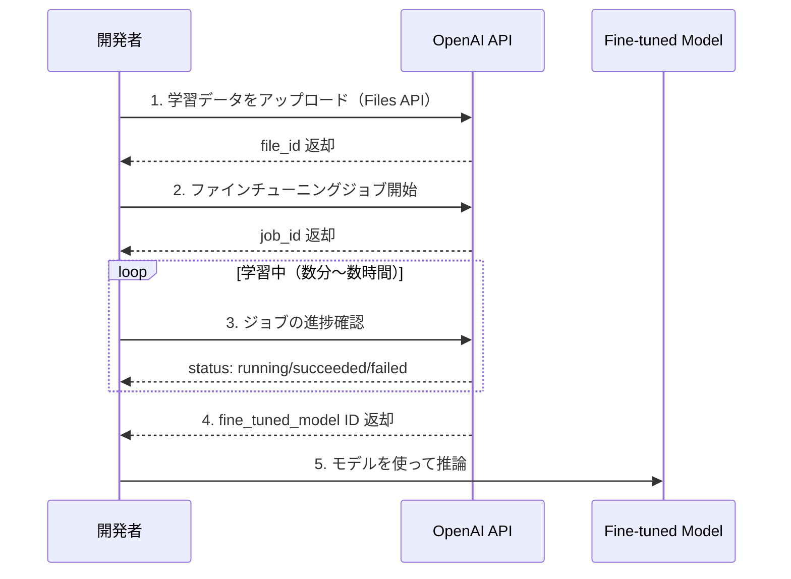

## 概要

OpenAI Fine-tuning APIを使ってGPT-4o miniをファインチューニングする手順を実践します。データアップロード・ジョブ開始・進捗確認・モデル評価まで一連のフローを学びます。

## 本文

### OpenAI ファインチューニングのフロー



### ステップ1: 学習データの準備とアップロード

```python
from openai import OpenAI
import json

client = OpenAI()

# 学習データを作成（最低10件、推奨50件以上）
training_data = [
    {
        "messages": [
            {"role": "system", "content": "あなたは日本語プログラミング教師です。"},
            {"role": "user", "content": "Pythonのfor文を教えてください"},
            {"role": "assistant", "content": "for文はリストや範囲を繰り返し処理する構文です。\n\n```python\nfor i in range(5):\n    print(i)  # 0, 1, 2, 3, 4\n```\n\nリストの各要素を処理する場合:\n```python\nfruits = ['apple', 'banana', 'cherry']\nfor fruit in fruits:\n    print(fruit)\n```"}
        ]
    },
    # ... 多数のデータ
]

# JSONLファイルに保存
with open("training.jsonl", "w", encoding="utf-8") as f:
    for item in training_data:
        f.write(json.dumps(item, ensure_ascii=False) + "\n")

# OpenAI Files APIにアップロード
with open("training.jsonl", "rb") as f:
    upload_response = client.files.create(
        file=f,
        purpose="fine-tune"
    )

file_id = upload_response.id
print(f"ファイルアップロード完了: {file_id}")
print(f"ファイルサイズ: {upload_response.bytes} bytes")
print(f"ステータス: {upload_response.status}")
```

### ステップ2: ファインチューニングジョブの開始

```python
# ファインチューニングジョブの開始
job = client.fine_tuning.jobs.create(
    training_file=file_id,
    model="gpt-4o-mini-2024-07-18",  # ベースモデル
    hyperparameters={
        "n_epochs": 3,          # エポック数（デフォルト: auto）
        "batch_size": "auto",   # バッチサイズ
        "learning_rate_multiplier": 1.8  # 学習率（デフォルト: auto）
    },
    suffix="my-programming-tutor"  # モデル名のサフィックス
)

job_id = job.id
print(f"ジョブ開始: {job_id}")
print(f"ステータス: {job.status}")
print(f"モデル: {job.model}")
```

### ステップ3: 進捗の確認

```python
import time

def wait_for_finetuning(job_id: str, poll_interval: int = 60) -> str:
    """
    ファインチューニングの完了を待つ
    Returns: fine-tuned model ID
    """
    print(f"ジョブ {job_id} の完了を待機中...")

    while True:
        job = client.fine_tuning.jobs.retrieve(job_id)
        status = job.status

        print(f"[{time.strftime('%H:%M:%S')}] Status: {status}")

        if status == "succeeded":
            print(f"完了！モデルID: {job.fine_tuned_model}")
            return job.fine_tuned_model

        elif status in ["failed", "cancelled"]:
            raise Exception(f"ジョブが失敗しました: {status}")

        # イベントログを表示
        events = client.fine_tuning.jobs.list_events(job_id, limit=5)
        for event in events.data:
            print(f"  Event: {event.message}")

        time.sleep(poll_interval)

# 本番では非同期で実行することを推奨
# fine_tuned_model = wait_for_finetuning(job_id)
```

### ステップ4: ファインチューニング済みモデルの使用

```python
# fine_tuned_model = "ft:gpt-4o-mini-2024-07-18:my-company::xxxxxx"

def use_finetuned_model(model_id: str, question: str) -> str:
    """
    ファインチューニング済みモデルを使って推論する
    """
    response = client.chat.completions.create(
        model=model_id,
        messages=[
            {"role": "system", "content": "あなたは日本語プログラミング教師です。"},
            {"role": "user", "content": question}
        ],
        temperature=0.3
    )
    return response.choices[0].message.content

# テスト
answer = use_finetuned_model(
    "ft:gpt-4o-mini-2024-07-18:my-company::xxxxxx",
    "Pythonのジェネレータとは何ですか？"
)
print(answer)
```

### ステップ5: ベースモデルとの比較評価

```python
import json

def compare_models(
    base_model: str,
    finetuned_model: str,
    test_questions: list[str],
    system_prompt: str
) -> None:
    """
    ベースモデルとFTモデルの回答を比較する
    """
    for question in test_questions:
        base_answer = client.chat.completions.create(
            model=base_model,
            messages=[
                {"role": "system", "content": system_prompt},
                {"role": "user", "content": question}
            ],
            temperature=0
        ).choices[0].message.content

        ft_answer = client.chat.completions.create(
            model=finetuned_model,
            messages=[
                {"role": "system", "content": system_prompt},
                {"role": "user", "content": question}
            ],
            temperature=0
        ).choices[0].message.content

        print(f"\n{'='*50}")
        print(f"Q: {question}")
        print(f"\n--- ベースモデル ({base_model}) ---")
        print(base_answer[:300])
        print(f"\n--- FTモデル ---")
        print(ft_answer[:300])

# 使用例
test_questions = [
    "Pythonのデコレーターを説明してください",
    "非同期処理とは何ですか？",
]
```

### ハイパーパラメータの調整

| パラメータ | デフォルト | 説明 |
|-----------|-----------|------|
| `n_epochs` | auto（1〜4） | 学習エポック数。データが少ない場合は増やす |
| `batch_size` | auto（1〜256） | バッチサイズ。大きいと安定するが遅い |
| `learning_rate_multiplier` | 1.8 | 学習率の倍率。高いと収束が速いが不安定 |

```python
# データ量に応じた推奨設定
def get_hyperparameters(data_size: int) -> dict:
    if data_size < 100:
        return {"n_epochs": 5, "learning_rate_multiplier": 2.0}
    elif data_size < 500:
        return {"n_epochs": 3, "learning_rate_multiplier": 1.8}
    else:
        return {"n_epochs": 2, "learning_rate_multiplier": 1.5}
```

## ハンズオン

実際にOpenAI Fine-tuning APIでジョブを作成します（コストが発生します）。

**ステップ1: 最低10件の学習データを作成してJSONLファイルを保存する**

上記の形式に従って自分のユースケースのデータを10件作成してください。

**ステップ2: Files APIにアップロードしてfile_idを取得する**

```python
from openai import OpenAI
client = OpenAI()

with open("training.jsonl", "rb") as f:
    response = client.files.create(file=f, purpose="fine-tune")
print(f"file_id: {response.id}")
```

**ステップ3: ファインチューニングジョブを開始する**

```python
job = client.fine_tuning.jobs.create(
    training_file="file-xxxxxxxxx",  # ステップ2のfile_id
    model="gpt-4o-mini-2024-07-18",
)
print(f"job_id: {job.id}")
print(f"status: {job.status}")
```

**ステップ4: ジョブの状態を確認する**

```python
job = client.fine_tuning.jobs.retrieve("ftjob-xxxxxxxxx")
print(job.status)
```

## クイズ

<!-- QUIZ:START -->
**Q1. OpenAI Fine-tuning APIでファイルをアップロードする際に指定する`purpose`の値はどれですか？**

- A) `"training"`
- B) `"fine-tune"`
- C) `"dataset"`
- D) `"model"`

**正解: B**
**解説:** OpenAI Files APIでファインチューニング用のデータをアップロードする際は、`purpose="fine-tune"`を指定します。これにより、アップロードされたファイルがファインチューニング用として識別されます。

**Q2. ファインチューニングのハイパーパラメータ`n_epochs`を大きくした場合の影響として正しいのはどれですか？**

- A) 学習データの量が増える
- B) 同じデータセットを何周も学習するため精度が上がるが過学習のリスクも増える
- C) モデルの推論速度が上がる
- D) APIコストが下がる

**正解: B**
**解説:** `n_epochs`は学習データを何周するかを指定します。データが少ない場合はエポック数を増やすことで効果が出やすいですが、増やしすぎると訓練データへの過学習（overfitting）が発生し、新しい入力への汎化性能が低下します。

**Q3. ファインチューニング済みモデルとベースモデルを比較評価する際に重要なことはどれですか？**

- A) FTモデルが必ず良い結果を出すことを確認する
- B) 同じテスト質問・同じシステムプロンプトで比較し、どちらが目的に合致するか客観的に評価する
- C) FTモデルは常にベースモデルより安い
- D) テスト質問はFTのトレーニングデータと同じものを使う

**正解: B**
**解説:** 公平な比較のために、同じ質問・同じシステムプロンプト・同じtemperature設定で両モデルをテストします。テスト質問はトレーニングデータに含まれていないもの（ホールドアウトセット）を使うことが重要です。FTモデルが必ずしも全てのケースでベースモデルを上回るわけではないため、客観的な評価が必要です。

<!-- QUIZ:END -->

## まとめ

- OpenAI Fine-tuning APIはデータアップロード→ジョブ開始→完了待ち→推論の4ステップで実行
- JONLファイルにsystem/user/assistantのメッセージペアを記録してアップロードする
- n_epochs・learning_rate_multiplierを適切に設定して過学習を防ぐ
- 必ずベースモデルとFTモデルをホールドアウトデータで比較評価する

## 次のレッスン

次のレッスンでは、少ないGPUリソースでもファインチューニングできる「PEFT・LoRA」技術を学びます。
