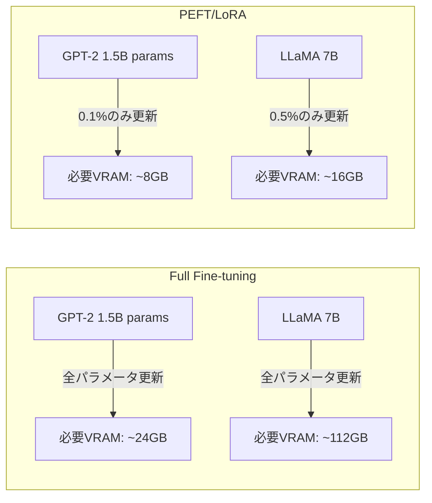
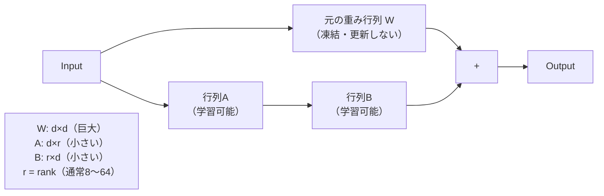

## 概要

PEFT（Parameter-Efficient Fine-Tuning）とLoRA（Low-Rank Adaptation）は、大規模モデルを少ないGPUメモリとコストで効率的にファインチューニングする手法です。仕組みと実装方法を学びます。

## 本文

### なぜPEFTが必要か



### LoRAの仕組み

LoRAは既存の重み行列を凍結し、小さな差分行列（A × B）を学習します。



**数式:** `W' = W + ΔW = W + A × B`

`r`（ランク）が小さいほど学習パラメータが少ない。一般的に`r=8`〜`r=64`。

### PEFT/LoRAのインストールと基本使用

```python
# pip install peft transformers accelerate datasets bitsandbytes
from transformers import AutoModelForCausalLM, AutoTokenizer
from peft import LoraConfig, get_peft_model, TaskType

# ベースモデルの読み込み
model_name = "rinna/japanese-gpt2-medium"  # 日本語GPT-2モデル
tokenizer = AutoTokenizer.from_pretrained(model_name)
model = AutoModelForCausalLM.from_pretrained(
    model_name,
    torch_dtype="auto",
    device_map="auto"
)

# LoRAの設定
lora_config = LoraConfig(
    task_type=TaskType.CAUSAL_LM,  # テキスト生成タスク
    r=8,                            # ランク（小さいほど効率的）
    lora_alpha=32,                  # スケーリング係数（通常 r の2〜4倍）
    lora_dropout=0.1,               # ドロップアウト率
    target_modules=["c_attn", "c_proj"],  # LoRAを適用する層
    bias="none"
)

# LoRAを適用
peft_model = get_peft_model(model, lora_config)

# 学習可能なパラメータ数の確認
peft_model.print_trainable_parameters()
# → trainable params: 786,432 || all params: 361,000,000 || trainable%: 0.22%
```

### QLoRA: 量子化とLoRAの組み合わせ

QLoRAは4bit量子化とLoRAを組み合わせて、さらにメモリを削減します。

```python
# pip install bitsandbytes
from transformers import BitsAndBytesConfig
import torch

# 4bit量子化設定
bnb_config = BitsAndBytesConfig(
    load_in_4bit=True,                        # 4bit量子化を有効化
    bnb_4bit_quant_type="nf4",               # NF4量子化形式
    bnb_4bit_compute_dtype=torch.bfloat16,    # 計算時のデータ型
    bnb_4bit_use_double_quant=True           # ダブル量子化（さらにメモリ削減）
)

# 量子化されたモデルを読み込む
model_4bit = AutoModelForCausalLM.from_pretrained(
    "meta-llama/Llama-2-7b-hf",
    quantization_config=bnb_config,
    device_map="auto"
)

# LoRAを適用
from peft import prepare_model_for_kbit_training

model_4bit = prepare_model_for_kbit_training(model_4bit)
qlora_config = LoraConfig(
    r=16,
    lora_alpha=32,
    target_modules=["q_proj", "v_proj"],
    lora_dropout=0.05,
    bias="none",
    task_type=TaskType.CAUSAL_LM
)
qlora_model = get_peft_model(model_4bit, qlora_config)
print("QLoRA設定完了")
```

### LoRAモデルの学習（SFTTrainer使用）

```python
from datasets import Dataset
from transformers import TrainingArguments
from trl import SFTTrainer

# 学習データの準備
train_dataset = Dataset.from_list([
    {"text": "<|system|>プログラミング教師です。<|user|>for文を教えて<|assistant|>for文は..."},
    # ... 多数のデータ
])

# 学習設定
training_args = TrainingArguments(
    output_dir="./lora-output",
    num_train_epochs=3,
    per_device_train_batch_size=4,
    gradient_accumulation_steps=2,    # バッチを分割してメモリを節約
    warmup_steps=50,
    learning_rate=2e-4,
    fp16=True,                        # 混合精度学習
    logging_steps=10,
    save_steps=100,
    evaluation_strategy="steps",
    eval_steps=100,
    load_best_model_at_end=True
)

# SFTTrainerで学習
trainer = SFTTrainer(
    model=peft_model,
    args=training_args,
    train_dataset=train_dataset,
    dataset_text_field="text",
    max_seq_length=512
)
trainer.train()
```

### LoRAモデルの保存とマージ

```python
# LoRAアダプターのみを保存（軽量）
peft_model.save_pretrained("./lora-adapter")
tokenizer.save_pretrained("./lora-adapter")

# 後でマージして通常のモデルとして使用
from peft import PeftModel

base_model = AutoModelForCausalLM.from_pretrained(model_name)
merged_model = PeftModel.from_pretrained(base_model, "./lora-adapter")
merged_model = merged_model.merge_and_unload()  # LoRAをベースモデルにマージ

# 通常のモデルとして保存
merged_model.save_pretrained("./merged-model")
```

### PEFTの種類比較

| 手法 | 仕組み | メモリ削減 | 精度 |
|------|--------|-----------|------|
| LoRA | 低ランク差分行列 | 中程度 | 高 |
| QLoRA | 4bit量子化 + LoRA | 非常に高い | 中〜高 |
| Prefix Tuning | 入力に学習可能トークン追加 | 高い | 中 |
| Prompt Tuning | ソフトプロンプト最適化 | 最高 | 低〜中 |

## ハンズオン

peft ライブラリを使って LoRA モデルを作成します（GPUなしでも概念確認可能）。

**ステップ1: peftをインストールして小さなモデルにLoRAを適用する**

```bash
pip install peft transformers torch
```

```python
from transformers import AutoModelForCausalLM, AutoTokenizer
from peft import LoraConfig, get_peft_model, TaskType

# 小さなモデルでテスト（GPUなし環境でも可）
model = AutoModelForCausalLM.from_pretrained("gpt2")  # 117Mパラメータ
tokenizer = AutoTokenizer.from_pretrained("gpt2")

lora_config = LoraConfig(
    task_type=TaskType.CAUSAL_LM,
    r=4,
    lora_alpha=16,
    target_modules=["c_attn"],
    lora_dropout=0.05
)
peft_model = get_peft_model(model, lora_config)
peft_model.print_trainable_parameters()
```

**ステップ2: 学習可能なパラメータ数を確認する**

LoRAによって全体の何%のパラメータのみを学習するかを確認してください。

**ステップ3: r値を変えてパラメータ数の変化を観察する**

```python
for r in [4, 8, 16, 32]:
    config = LoraConfig(task_type=TaskType.CAUSAL_LM, r=r, lora_alpha=r*2, target_modules=["c_attn"])
    peft_m = get_peft_model(AutoModelForCausalLM.from_pretrained("gpt2"), config)
    total = sum(p.numel() for p in peft_m.parameters())
    trainable = sum(p.numel() for p in peft_m.parameters() if p.requires_grad)
    print(f"r={r}: 学習可能パラメータ {trainable:,} / {total:,} ({trainable/total*100:.2f}%)")
```

## クイズ

<!-- QUIZ:START -->
**Q1. LoRAで使われる「ランク（r）」とは何ですか？**

- A) モデルの層の数
- B) 差分重み行列の次元を圧縮するパラメータ（小さいほど学習パラメータが少ない）
- C) 学習エポックの数
- D) バッチサイズ

**正解: B**
**解説:** LoRAはW = W + A × Bという形で、元の重み行列を凍結してA（d×r）とB（r×d）という小さな行列を学習します。rがランクで、小さいほどA・Bの行列サイズが小さく（学習パラメータが少なく）なります。r=4〜64が一般的で、値が小さいほど効率的でメモリ消費が少ないです。

**Q2. QLoRAがLoRAより有利な点はどれですか？**

- A) 精度が常に高い
- B) 4bit量子化によりさらにGPUメモリ使用量を削減できる
- C) データが不要になる
- D) 学習速度が2倍になる

**正解: B**
**解説:** QLoRAはQLoRA（量子化Low-Rank Adaptation）の略で、LoRAに加えてベースモデルを4bit（または8bit）に量子化することでGPUメモリ使用量をさらに大幅に削減します。LLaMA 7B級のモデルを1枚のコンシューマーGPU（24GB VRAM）でファインチューニングできるようになります。

**Q3. LoRAアダプターを`merge_and_unload()`する目的はどれですか？**

- A) モデルを削除する
- B) LoRAの差分行列をベースモデルにマージして、推論時に余分なモジュールなしで動作させる
- C) データをクリアする
- D) 精度を向上させる

**正解: B**
**解説:** `merge_and_unload()`は学習済みLoRAアダプター（A×B）を元の重み行列Wにマージして `W' = W + A×B` を計算し、LoRAモジュールを取り除きます。これにより推論時の処理をPEFTライブラリなしで行えるようになり、デプロイが容易になります。

<!-- QUIZ:END -->

## まとめ

- LoRAは全パラメータの0.1〜1%のみを学習してFull Fine-tuningに近い性能を実現する
- QLoRAは4bit量子化とLoRAの組み合わせで、さらに少ないGPUメモリでFTを可能にする
- `r`（ランク）が小さいほど効率的だが、複雑なタスクでは大きめの値が必要な場合がある
- LoRAアダプターをマージすることで推論時のオーバーヘッドなく使用できる

## 次のレッスン

次のレッスンでは、オープンソースモデルのファインチューニングに使われるHugging Face Transformersの基礎を学びます。
