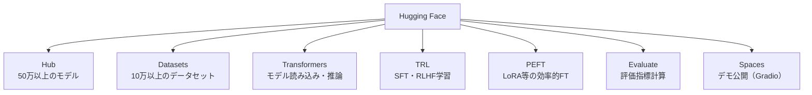

## 概要

Hugging Face Transformersはオープンソースモデルのファインチューニング・推論に使われる最も広く採用されているライブラリです。モデルハブ・Pipeline API・Trainer APIの基本を学びます。

## 本文

### Hugging Faceエコシステム



### モデルの読み込みと推論（Pipeline API）

```python
from transformers import pipeline

# テキスト生成パイプライン
generator = pipeline(
    "text-generation",
    model="rinna/japanese-gpt2-medium",
    device=-1  # CPU使用
)

result = generator(
    "機械学習とは",
    max_new_tokens=100,
    temperature=0.7,
    do_sample=True,
    pad_token_id=generator.tokenizer.eos_token_id
)
print(result[0]["generated_text"])


# 感情分析パイプライン
classifier = pipeline(
    "text-classification",
    model="lxyuan/distilbert-base-multilingual-cased-sentiments-student"
)
result = classifier("このレストランの料理はとても美味しかった！")
print(result)  # → [{'label': 'positive', 'score': 0.96}]


# 翻訳パイプライン
translator = pipeline("translation_ja_to_en", model="Helsinki-NLP/opus-mt-ja-en")
result = translator("こんにちは、世界！")
print(result[0]["translation_text"])  # → Hello, world!
```

### トークナイザーとモデルの直接使用

```python
from transformers import AutoModelForCausalLM, AutoTokenizer
import torch

model_name = "rinna/japanese-gpt2-medium"
tokenizer = AutoTokenizer.from_pretrained(model_name)
model = AutoModelForCausalLM.from_pretrained(model_name)

def generate_text(prompt: str, max_new_tokens: int = 100) -> str:
    # テキストをトークン化
    inputs = tokenizer(prompt, return_tensors="pt")
    input_ids = inputs["input_ids"]

    # テキスト生成
    with torch.no_grad():
        outputs = model.generate(
            input_ids,
            max_new_tokens=max_new_tokens,
            do_sample=True,
            temperature=0.7,
            top_p=0.9,
            repetition_penalty=1.3,
            pad_token_id=tokenizer.eos_token_id
        )

    # 生成されたトークンをデコード
    generated = tokenizer.decode(
        outputs[0][len(input_ids[0]):],
        skip_special_tokens=True
    )
    return generated

print(generate_text("人工知能の未来について、"))
```

### Trainer APIを使ったファインチューニング

```python
from transformers import (
    AutoModelForSequenceClassification,
    AutoTokenizer,
    TrainingArguments,
    Trainer
)
from datasets import Dataset
import numpy as np
import evaluate

# テキスト分類のファインチューニング例
# タスク: ユーザーレビューのポジティブ/ネガティブ分類

model_name = "cl-tohoku/bert-base-japanese-v3"
tokenizer = AutoTokenizer.from_pretrained(model_name)
model = AutoModelForSequenceClassification.from_pretrained(model_name, num_labels=2)

# 学習データの準備
train_data = {
    "text": [
        "この製品は素晴らしい！とても気に入りました。",
        "品質が悪く、すぐに壊れました。失望です。",
        "使いやすくて大満足です。",
        "期待していたのに、全く良くありませんでした。",
        # ... 多数のデータ
    ],
    "label": [1, 0, 1, 0]  # 1=ポジティブ, 0=ネガティブ
}
dataset = Dataset.from_dict(train_data)

def tokenize_function(examples):
    return tokenizer(
        examples["text"],
        padding="max_length",
        truncation=True,
        max_length=128
    )

tokenized_dataset = dataset.map(tokenize_function, batched=True)
train_dataset, eval_dataset = tokenized_dataset.train_test_split(test_size=0.1).values()

# 評価指標の定義
accuracy = evaluate.load("accuracy")

def compute_metrics(eval_pred):
    logits, labels = eval_pred
    predictions = np.argmax(logits, axis=-1)
    return accuracy.compute(predictions=predictions, references=labels)

# 学習設定
training_args = TrainingArguments(
    output_dir="./bert-sentiment",
    num_train_epochs=3,
    per_device_train_batch_size=16,
    per_device_eval_batch_size=16,
    evaluation_strategy="epoch",
    save_strategy="epoch",
    load_best_model_at_end=True,
    learning_rate=2e-5,
    weight_decay=0.01,
    logging_dir="./logs"
)

# Trainerの作成と学習開始
trainer = Trainer(
    model=model,
    args=training_args,
    train_dataset=train_dataset,
    eval_dataset=eval_dataset,
    compute_metrics=compute_metrics
)

trainer.train()

# モデルの保存
trainer.save_model("./bert-sentiment-final")
tokenizer.save_pretrained("./bert-sentiment-final")
```

### Hugging Face Hubへのモデルのアップロード

```python
from huggingface_hub import HfApi

api = HfApi()

# Hub にモデルをアップロード
api.upload_folder(
    folder_path="./bert-sentiment-final",
    repo_id="your-username/bert-japanese-sentiment",
    repo_type="model"
)
print("モデルをHugging Face Hubにアップロードしました")

# アップロード後、公開URLでアクセス可能
# https://huggingface.co/your-username/bert-japanese-sentiment
```

### よく使われる日本語モデル

| モデル | タスク | パラメータ |
|--------|--------|-----------|
| rinna/japanese-gpt2-medium | テキスト生成 | 336M |
| cl-tohoku/bert-base-japanese-v3 | 分類・NER | 110M |
| cyberagent/open-calm-7b | テキスト生成 | 7B |
| Rakuten/RakutenAI-7B | テキスト生成 | 7B |
| elyza/Llama-3-ELYZA-JP-8B | テキスト生成 | 8B |

## ハンズオン

Transformersのpipelineを使って日本語テキスト分類を試します。

**ステップ1: Transformersをインストールしてpipelineを動かす**

```bash
pip install transformers torch sentencepiece
```

```python
from transformers import pipeline

# 感情分析
clf = pipeline(
    "text-classification",
    model="lxyuan/distilbert-base-multilingual-cased-sentiments-student"
)

texts = [
    "このサービスはとても便利です！",
    "対応が遅くて困りました。",
    "普通でした。特に感想はありません。",
]
results = clf(texts)
for text, result in zip(texts, results):
    print(f"{text[:20]}... → {result['label']} ({result['score']:.2f})")
```

**ステップ2: AutoTokenizerを使ってトークン化を確認する**

```python
from transformers import AutoTokenizer

tokenizer = AutoTokenizer.from_pretrained("cl-tohoku/bert-base-japanese-v3")
text = "自然言語処理は面白い分野です。"
tokens = tokenizer(text, return_tensors="pt")
print(f"入力IDs: {tokens['input_ids']}")
print(f"トークン数: {len(tokens['input_ids'][0])}")
print(f"トークン: {tokenizer.convert_ids_to_tokens(tokens['input_ids'][0])}")
```

**ステップ3: テキスト生成パイプラインを試す**

```python
generator = pipeline("text-generation", model="rinna/japanese-gpt2-medium")
prompt = "AIが発達した未来では、"
result = generator(prompt, max_new_tokens=50, temperature=0.8, do_sample=True,
                   pad_token_id=generator.tokenizer.eos_token_id)
print(result[0]["generated_text"])
```

## クイズ

<!-- QUIZ:START -->
**Q1. Hugging Face Transformersの`pipeline()`の主な利点はどれですか？**

- A) モデルを自動的にファインチューニングする
- B) トークナイズ・推論・デコードを1行で実行できる高レベルAPI
- C) GPUなしで大規模モデルを動かせる
- D) 自動的に最新モデルを選択する

**正解: B**
**解説:** `pipeline()`はトークナイズ・モデル推論・後処理（デコード・確率変換）を1行の呼び出しで実行できる便利なAPIです。複数行のコードを書かずにテキスト生成・分類・翻訳などが実現できます。一方、低レベルな制御が必要な場合はAutoTokenizer・AutoModelを直接使います。

**Q2. `TrainingArguments`で`evaluation_strategy="epoch"`を設定する意味はどれですか？**

- A) 1エポックごとに学習を停止する
- B) 1エポック終了ごとに検証データで評価を実行する
- C) 評価データで1エポック追加学習する
- D) 評価データをエポックごとに変更する

**正解: B**
**解説:** `evaluation_strategy="epoch"`は、1エポック（全学習データを1周）の学習が完了するたびに検証データでモデルの性能を評価します。これにより学習の進捗を確認し、過学習が始まったタイミングで最良のモデルを保存（`load_best_model_at_end=True`）できます。

**Q3. Hugging Face Hubにモデルをアップロードする主なメリットはどれですか？**

- A) 学習速度が向上する
- B) モデルをクラウドで共有・バージョン管理・他のユーザーと再利用できる
- C) ファインチューニングが不要になる
- D) 推論コストが無料になる

**正解: B**
**解説:** Hugging Face Hubはモデル・データセット・デモを共有できるプラットフォームです。アップロードすることで、チームメンバーとモデルを共有、バージョン管理、モデルカードによるドキュメント化、他のユーザーへの公開（オプション）が可能になります。

<!-- QUIZ:END -->

## まとめ

- Hugging FaceはTransformers・Datasets・PEFT・TRLなどのエコシステムを提供する
- `pipeline()`で高レベルに、AutoTokenizer/AutoModelで低レベルに推論できる
- Trainer APIで学習・評価・保存まで一貫して管理できる
- 学習済みモデルはHugging Face Hubで共有・バージョン管理できる

## 次のレッスン

次のレッスンでは、人間のフィードバックによる強化学習「RLHF」の概念を学びます。ChatGPTがどのように人間の好みに沿った回答をするようになったかを理解します。
