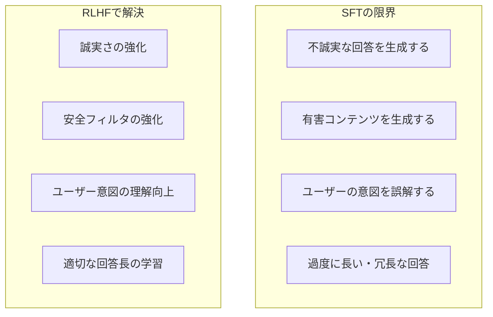
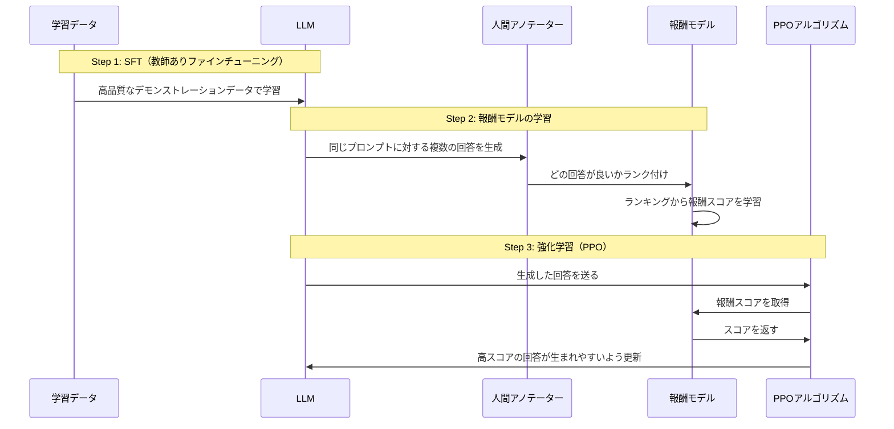

## 概要

RLHF（Reinforcement Learning from Human Feedback）は、人間のフィードバックを使ってLLMを人間の好みに沿うよう学習させる技術です。ChatGPT・Claude・GeminiなどのAIシステムがどのように「人間らしい」応答を返せるようになったかを理解します。

## 本文

### RLHF以前の問題

ファインチューニング（SFT）だけでは解決できない問題があります。



### RLHFの3ステップ



### Step 1: SFT（Supervised Fine-Tuning）

高品質なデモンストレーションデータで基本的な指示追従能力を学習します。

```python
from transformers import AutoModelForCausalLM, AutoTokenizer
from trl import SFTTrainer, SFTConfig
from datasets import Dataset

# 高品質なデモデータ
sft_data = [
    {
        "text": (
            "<|system|>あなたは役立つアシスタントです。</s>"
            "<|user|>Pythonでリストを逆順にする方法は？</s>"
            "<|assistant|>Pythonでリストを逆順にする主な方法は3つあります:\n\n"
            "1. `list.reverse()` - インプレースで逆順（元のリストを変更）\n"
            "2. `list[::-1]` - スライスで新しいリストを作成\n"
            "3. `list(reversed(list))` - イテレータを使用\n\n"
            "例:\n```python\nmy_list = [1, 2, 3, 4, 5]\nmy_list.reverse()\nprint(my_list)  # [5, 4, 3, 2, 1]\n```"
        )
    }
    # ... 多数のデモデータ
]

dataset = Dataset.from_list(sft_data)
```

### Step 2: 報酬モデルの学習

```python
from trl import RewardTrainer, RewardConfig

# 人間のランキングデータ
# 同じプロンプトに対して、人間が「chosen（好ましい）」と「rejected（好ましくない）」を選ぶ
reward_data = [
    {
        "prompt": "Pythonのリスト内包表記とは？",
        "chosen": "リスト内包表記は、ループを簡潔に書ける構文です。例: `[x*2 for x in range(5)]` → `[0, 2, 4, 6, 8]`",
        "rejected": "リストの内包についての表記です。"  # 不十分な回答
    },
    {
        "prompt": "機械学習とは何ですか？",
        "chosen": "機械学習はAIの一分野で、データからパターンを学習し予測や分類を行う技術です。具体例として...",
        "rejected": "コンピュータが学習することです。"  # 不十分な回答
    }
]

# 報酬モデルはchosen > rejectedとなるようスコアを学習する
```

### Step 3: PPO（Proximal Policy Optimization）

```python
from trl import PPOTrainer, PPOConfig
from transformers import AutoModelForSequenceClassification

# PPOの概念（実際の実装はかなり複雑）
"""
PPOのループ:
1. LLMがプロンプトに対して回答を生成
2. 報酬モデルが回答にスコアを付ける
3. PPOアルゴリズムが「良いスコアの回答を生成しやすく」LLMを更新
4. KLダイバージェンスペナルティで元のモデルから離れすぎないよう制御
"""

# 主要なハイパーパラメータ
ppo_config = PPOConfig(
    model_name="sft-model",
    learning_rate=1.41e-5,
    batch_size=128,
    mini_batch_size=8,
    gradient_accumulation_steps=4,
    ppo_epochs=4,
    kl_penalty="kl",       # KL発散ペナルティ（元モデルから離れすぎない）
    init_kl_coef=0.2,       # KL係数
    adap_kl_ctrl=True,      # 適応的KL制御
)
```

### RLHFの課題と改善技術

| 課題 | 説明 | 改善技術 |
|------|------|---------|
| アノテーションコスト | 人間のランキングデータ収集が高コスト | RLAIF（AI Feedback） |
| 報酬ハッキング | LLMが報酬モデルを欺く回答を生成 | 適切なKLペナルティ |
| スケーラビリティ | PPOが計算集約的 | DPO（Direct Preference Optimization） |
| モデルアライメント | 人間の価値観の多様性 | Constitutional AI |

### DPO（Direct Preference Optimization）

RLHFの強化学習部分を不要にし、直接ペア比較データから学習する手法です。

```python
from trl import DPOTrainer, DPOConfig

# DPOはPPOの代替として注目されている
dpo_config = DPOConfig(
    beta=0.1,               # KL正則化係数
    learning_rate=1e-5,
    per_device_train_batch_size=4,
    num_train_epochs=3
)

# chosen/rejectedのペアだけあればOK（報酬モデルが不要）
dpo_dataset = Dataset.from_list(reward_data)  # 上記のchosen/rejectedデータを使用

# DPOTrainer（簡略化）
trainer = DPOTrainer(
    model=sft_model,
    ref_model=ref_model,      # 参照モデル（SFTモデルのコピー）
    args=dpo_config,
    train_dataset=dpo_dataset
)
```

### Constitutional AI（クロードの場合）

AnthropicはRLHFの代わりにConstitutional AI（CAI）を使っています。

```
Constitutional AIの2フェーズ:
Phase 1: SL-CAI（Supervised Learning）
  - AIが自分の回答を原則（Constitution）に基づいて批評・修正する

Phase 2: RL-CAI（Reinforcement Learning）
  - 原則に基づいてAIがAIの回答をランク付けして報酬信号を生成
  - 人間のフィードバックを最小化できる
```

## クイズ

<!-- QUIZ:START -->
**Q1. RLHFの「報酬モデル（Reward Model）」は何を学習しますか？**

- A) テキスト生成の方法
- B) 人間がどの回答を好むかのスコアリング関数
- C) 数学の計算方法
- D) プログラミングコードの実行方法

**正解: B**
**解説:** 報酬モデルは、人間が「より良い」と判断した回答に高いスコアを与え、「より悪い」と判断した回答に低いスコアを与えるよう学習します。chosenとrejectedのペアを使って学習され、その後PPOの強化学習フェーズでLLMの学習を導く信号として使われます。

**Q2. DPO（Direct Preference Optimization）がRLHFより注目されている主な理由はどれですか？**

- A) DPOは人間のフィードバックが不要だから
- B) 報酬モデルとPPOの強化学習が不要で、シンプルな損失関数で直接学習できるから
- C) DPOはどんなモデルでも使えるから
- D) DPOはファインチューニングが不要だから

**正解: B**
**解説:** RLHFは「SFT → 報酬モデル学習 → PPO強化学習」の3ステップが必要でそれぞれ複雑です。DPOはchosenとrejectedのペアデータから直接LLMを最適化する損失関数を使い、報酬モデルとPPOのステップを省略できます。実装がシンプルになり、学習も安定します。

**Q3. PPOにKLダイバージェンスペナルティを加える目的はどれですか？**

- A) 学習速度を向上させる
- B) LLMが報酬モデルを欺くような「報酬ハッキング」を防ぐため元のモデルから離れすぎないよう制御する
- C) メモリ使用量を削減する
- D) 人間のフィードバックを不要にする

**正解: B**
**解説:** PPOでRLを行うとき、LLMが報酬スコアを最大化するために「報酬モデルが高得点を付けるが人間には実際には好まれない」回答（報酬ハッキング）を生成するようになる問題が起きます。KLペナルティはSFTモデルとの差（KLダイバージェンス）が大きくなると罰則を与えることで、元の自然な言語能力を保ちながら調整します。

<!-- QUIZ:END -->

## まとめ

- RLHFはSFT→報酬モデル学習→PPO強化学習の3フェーズでLLMをアライメントする
- 人間のchosenとrejectedランキングデータが報酬モデルの学習の核心
- DPOは報酬モデルとPPOを不要にするシンプルな代替手法として普及中
- Constitutional AIはAI自身の批評でフィードバックを生成しアノテーションコストを削減する

## 次のレッスン

次のレッスンでは、ファインチューニングしたモデルの品質を測定する評価指標とデプロイ前に確認すべきことを学びます。
