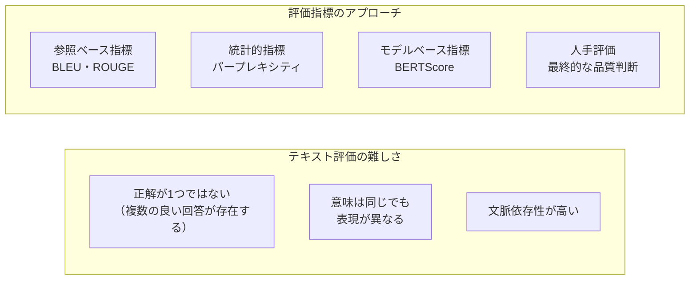

## 概要

ファインチューニング済みモデルの品質を測定するBLEU・ROUGE・パープレキシティなどの指標を理解し、過学習を検知・防止する方法を学びます。

## 本文

### 評価の難しさ



### BLEU（Bilingual Evaluation Understudy）

機械翻訳で広く使われる指標。N-gramの一致率を計算します。

```python
from nltk.translate.bleu_score import sentence_bleu, corpus_bleu, SmoothingFunction

def calculate_bleu(reference: str, hypothesis: str) -> float:
    """
    BLEUスコアを計算する
    reference: 正解文
    hypothesis: 生成された文
    戻り値: 0〜1のスコア（1が完全一致）
    """
    ref_tokens = list(reference)  # 日本語は文字単位でトークン化
    hyp_tokens = list(hypothesis)

    # スムージングで0スコアを避ける
    smoothie = SmoothingFunction().method1
    score = sentence_bleu(
        [ref_tokens],
        hyp_tokens,
        weights=(0.25, 0.25, 0.25, 0.25),  # 1〜4-gramの重み
        smoothing_function=smoothie
    )
    return score

# テスト
reference = "私は今日公園に行きました。"
hypothesis = "私は今日公園に行った。"

score = calculate_bleu(reference, hypothesis)
print(f"BLEUスコア: {score:.4f}")
```

### ROUGE（Recall-Oriented Understudy for Gisting Evaluation）

要約タスクで使われる指標。再現率ベース。

```python
# pip install rouge-score
from rouge_score import rouge_scorer

def calculate_rouge(reference: str, hypothesis: str) -> dict:
    """ROUGE-1・ROUGE-2・ROUGE-Lを計算する"""
    scorer = rouge_scorer.RougeScorer(
        ["rouge1", "rouge2", "rougeL"],
        use_stemmer=False
    )
    scores = scorer.score(reference, hypothesis)
    return {
        "rouge1": scores["rouge1"].fmeasure,
        "rouge2": scores["rouge2"].fmeasure,
        "rougeL": scores["rougeL"].fmeasure
    }

# テスト
reference = "機械学習は人工知能の一分野で、データからパターンを学習する技術です。"
hypothesis = "機械学習はAIの分野で、データを使ってパターンを見つける方法です。"

scores = calculate_rouge(reference, hypothesis)
print(f"ROUGE-1: {scores['rouge1']:.4f}")
print(f"ROUGE-2: {scores['rouge2']:.4f}")
print(f"ROUGE-L: {scores['rougeL']:.4f}")
```

### パープレキシティ（Perplexity）

モデルが次のトークンをどれだけ「驚かずに」予測できるかの指標。**低いほど良い**。

```python
import torch
from transformers import AutoModelForCausalLM, AutoTokenizer
import math

def calculate_perplexity(text: str, model_name: str = "gpt2") -> float:
    """
    テキストのパープレキシティを計算する
    低いほどモデルがそのテキストを「自然」と判断している
    """
    tokenizer = AutoTokenizer.from_pretrained(model_name)
    model = AutoModelForCausalLM.from_pretrained(model_name)
    model.eval()

    tokens = tokenizer(text, return_tensors="pt")
    input_ids = tokens.input_ids

    with torch.no_grad():
        outputs = model(input_ids, labels=input_ids)
        loss = outputs.loss
        perplexity = math.exp(loss.item())

    return perplexity

# ファインチューニング前後のパープレキシティを比較
base_ppl = calculate_perplexity("プログラミングの基礎を学ぶことは重要です。")
print(f"パープレキシティ: {base_ppl:.2f}")
# 低いほどモデルがこのテキストを「流暢」と判断
```

### BERTScore（意味ベースの評価）

```python
# pip install bert-score
from bert_score import score as bert_score

def calculate_bert_score(references: list[str], hypotheses: list[str]) -> dict:
    """
    BERTを使って意味的類似度を評価する
    N-gramマッチングより意味を重視
    """
    P, R, F1 = bert_score(
        hypotheses,
        references,
        lang="ja",
        verbose=False
    )
    return {
        "precision": P.mean().item(),
        "recall": R.mean().item(),
        "f1": F1.mean().item()
    }
```

### 過学習の検知と防止

```python
import matplotlib.pyplot as plt

class TrainingMonitor:
    """学習の過学習を検知するモニター"""

    def __init__(self):
        self.train_losses = []
        self.val_losses = []

    def add(self, train_loss: float, val_loss: float):
        self.train_losses.append(train_loss)
        self.val_losses.append(val_loss)

    def is_overfitting(self, patience: int = 3) -> bool:
        """
        検証ロスがpatience回連続で上昇していたら過学習と判定
        """
        if len(self.val_losses) < patience + 1:
            return False
        recent = self.val_losses[-(patience + 1):]
        return all(recent[i] < recent[i + 1] for i in range(patience))

    def plot(self):
        plt.figure(figsize=(10, 5))
        plt.plot(self.train_losses, label="Train Loss")
        plt.plot(self.val_losses, label="Validation Loss")
        plt.xlabel("Epoch")
        plt.ylabel("Loss")
        plt.title("Learning Curve")
        plt.legend()
        plt.show()

# 過学習の例
monitor = TrainingMonitor()
# 典型的な過学習パターン
for epoch in range(10):
    train_loss = 2.0 * (0.7 ** epoch)
    val_loss = 2.0 * (0.7 ** epoch) if epoch < 5 else 2.0 * (0.7 ** 5) + (epoch - 5) * 0.1
    monitor.add(train_loss, val_loss)

print(f"過学習検知: {monitor.is_overfitting()}")
```

**過学習防止の主な手法:**

```python
# 1. Early Stopping
training_args = TrainingArguments(
    load_best_model_at_end=True,  # 最良モデルを保存
    evaluation_strategy="epoch",
    save_strategy="epoch",
    metric_for_best_model="eval_loss"
)

# 2. Weight Decay（正則化）
training_args = TrainingArguments(
    weight_decay=0.01,   # L2正則化
)

# 3. ドロップアウト（LoRA設定に含める）
lora_config = LoraConfig(lora_dropout=0.1)

# 4. データ拡張（日本語テキストの場合）
def augment_text(text: str) -> list[str]:
    augmented = [text]
    # 同義語置換・語順変換など
    return augmented
```

## ハンズオン

BLEUとROUGEを使ってファインチューニング前後の品質を評価します。

**ステップ1: BLEUとROUGEを計算する**

```bash
pip install nltk rouge-score
python -c "import nltk; nltk.download('punkt')"
```

```python
from nltk.translate.bleu_score import sentence_bleu, SmoothingFunction
from rouge_score import rouge_scorer

# テスト用の参照・生成文を用意
references = [
    "Pythonのfor文はリストや範囲を繰り返し処理する構文です。",
    "ディクショナリはキーと値のペアを格納するデータ構造です。",
]
hypotheses = [
    "Pythonのfor文はリストや範囲を繰り返し処理するために使います。",
    "辞書型はキーと値を対にして格納するデータ型です。",
]

scorer = rouge_scorer.RougeScorer(["rouge1", "rougeL"], use_stemmer=False)

for ref, hyp in zip(references, hypotheses):
    rouge = scorer.score(ref, hyp)
    bleu = sentence_bleu(
        [list(ref)], list(hyp),
        smoothing_function=SmoothingFunction().method1
    )
    print(f"BLEU: {bleu:.4f}")
    print(f"ROUGE-1: {rouge['rouge1'].fmeasure:.4f}")
    print(f"ROUGE-L: {rouge['rougeL'].fmeasure:.4f}\n")
```

**ステップ2: 意味的に同じで表現が異なる文でスコアを比較する**

異なる表現でも意味が同じ場合にBLEUが低くなることを確認しましょう。

## クイズ

<!-- QUIZ:START -->
**Q1. パープレキシティ（Perplexity）の解釈として正しいのはどれですか？**

- A) 高いほど良いモデル
- B) 低いほどモデルがそのテキストを自然に予測できている
- C) 1.0が最悪のスコア
- D) 常に100以下になる

**正解: B**
**解説:** パープレキシティは「1トークンを予測する際にモデルが何通りの選択肢の間で迷っているか」を表します。低いほどモデルがより確信を持って次のトークンを予測できており、そのテキストがモデルにとって「自然」と判断されます。ファインチューニング後にパープレキシティが下がれば、モデルがそのドメインのテキストを学習できたと判断できます。

**Q2. BLEU・ROUGEスコアの限界として最も重要なのはどれですか？**

- A) 計算に時間がかかる
- B) 意味的に同じでも表現が異なると低いスコアになる
- C) 英語にしか対応していない
- D) GPUが必要

**正解: B**
**解説:** BLEU・ROUGEはN-gramの表面的な一致を測定するため、「私は公園に行った」と「私は公園に行きました」のように意味は同じでも語尾が異なると低いスコアになります。この問題を解決するためにBERTScoreのような意味ベースの指標や、最終的には人手評価が重要です。

**Q3. 過学習（Overfitting）を検知するために使われる最も基本的な方法はどれですか？**

- A) 学習データのスコアだけを監視する
- B) 学習損失と検証損失の両方を監視し、検証損失が上昇し始めたら検知する
- C) エポック数を増やし続ける
- D) バッチサイズを大きくする

**正解: B**
**解説:** 過学習は「学習データには高精度だが未見のデータには汎化できない」状態です。学習曲線で訓練損失は下がり続けているのに検証損失が上昇し始めたとき、過学習が発生しています。この時点でEarly Stoppingが発動し、検証損失が最低だったモデルを保存します。

<!-- QUIZ:END -->

## まとめ

- BLEU・ROUGEはN-gramマッチ、BERTScoreは意味ベース、パープレキシティは流暢さを測定する
- どの指標も一長一短があり、複数指標を組み合わせて総合的に評価するのがベスト
- 過学習は学習損失と検証損失の乖離で検知し、Early Stopping・Weight Decayで防止する
- 最終的な品質判断には人手評価が不可欠

## 次のレッスン

次のレッスンでは、ファインチューニング済みモデルを本番環境にデプロイする方法を学びます。
