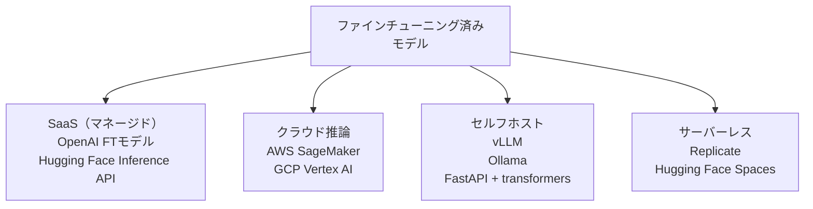

## 概要

ファインチューニング済みモデルを本番環境に公開する方法を学びます。Hugging Face Inference API・Replicate・vLLM・FastAPIなど、ユースケースに応じたデプロイオプションを比較します。

## 本文

### デプロイオプションの比較



| オプション | コスト | レイテンシ | スケール | 管理工数 |
|-----------|--------|-----------|---------|---------|
| マネージドAPI | 高 | 低 | 自動 | 低 |
| クラウドML | 中〜高 | 低 | 高 | 中 |
| セルフホスト | 低 | 低（GPU次第） | 手動 | 高 |
| サーバーレス | 中 | コールドスタートあり | 自動 | 低 |

### FastAPI + Transformers でのデプロイ

```python
# app.py
from fastapi import FastAPI, HTTPException
from pydantic import BaseModel
from transformers import AutoModelForCausalLM, AutoTokenizer
import torch
import uvicorn

app = FastAPI(title="Fine-tuned LLM API")

# モデルのロード（起動時に一度だけ）
MODEL_PATH = "./finetuned-model"
tokenizer = AutoTokenizer.from_pretrained(MODEL_PATH)
model = AutoModelForCausalLM.from_pretrained(
    MODEL_PATH,
    torch_dtype=torch.float16 if torch.cuda.is_available() else torch.float32,
    device_map="auto"
)
model.eval()

class GenerateRequest(BaseModel):
    prompt: str
    max_new_tokens: int = 200
    temperature: float = 0.7
    system_prompt: str = "あなたは役立つアシスタントです。"

class GenerateResponse(BaseModel):
    text: str
    prompt_tokens: int
    completion_tokens: int

@app.post("/generate", response_model=GenerateResponse)
async def generate(request: GenerateRequest):
    try:
        full_prompt = (
            f"<|system|>{request.system_prompt}</s>"
            f"<|user|>{request.prompt}</s>"
            "<|assistant|>"
        )
        inputs = tokenizer(full_prompt, return_tensors="pt").to(model.device)
        prompt_token_count = len(inputs["input_ids"][0])

        with torch.no_grad():
            outputs = model.generate(
                **inputs,
                max_new_tokens=request.max_new_tokens,
                temperature=request.temperature,
                do_sample=True,
                pad_token_id=tokenizer.eos_token_id
            )

        generated_ids = outputs[0][prompt_token_count:]
        generated_text = tokenizer.decode(generated_ids, skip_special_tokens=True)

        return GenerateResponse(
            text=generated_text,
            prompt_tokens=prompt_token_count,
            completion_tokens=len(generated_ids)
        )
    except Exception as e:
        raise HTTPException(status_code=500, detail=str(e))

@app.get("/health")
async def health():
    return {"status": "ok", "model": MODEL_PATH}

if __name__ == "__main__":
    uvicorn.run(app, host="0.0.0.0", port=8000)
```

### vLLM で高スループットを実現

vLLMはPagedAttentionでメモリ効率化し、高速な推論を実現します。

```python
# pip install vllm
from vllm import LLM, SamplingParams
from vllm.entrypoints.openai.api_server import create_server

# vLLMサーバーを起動（CLIから）
# vllm serve ./finetuned-model --dtype bfloat16 --port 8000

# Pythonからvllmを直接使う
llm = LLM(model="./finetuned-model", dtype="bfloat16")

sampling_params = SamplingParams(
    temperature=0.7,
    max_tokens=200,
    top_p=0.95
)

prompts = [
    "<|user|>Pythonのリストを教えて<|assistant|>",
    "<|user|>例外処理を教えて<|assistant|>",
]

outputs = llm.generate(prompts, sampling_params)
for output in outputs:
    print(output.outputs[0].text)
```

### Hugging Face Inference API (Serverless)

```python
import requests
import os

API_URL = "https://api-inference.huggingface.co/models/your-username/your-finetuned-model"
headers = {"Authorization": f"Bearer {os.environ['HF_TOKEN']}"}

def query(payload: dict) -> dict:
    response = requests.post(API_URL, headers=headers, json=payload)
    return response.json()

# テスト
result = query({
    "inputs": "機械学習とは",
    "parameters": {
        "max_new_tokens": 100,
        "temperature": 0.7,
        "return_full_text": False
    }
})
print(result[0]["generated_text"])
```

### モデル量子化でデプロイコスト削減

```python
# GGUF形式に変換（llama.cppで使用）
# pip install llama-cpp-python

from llama_cpp import Llama

llm = Llama(
    model_path="./finetuned-model.gguf",  # 量子化されたモデル
    n_ctx=2048,       # コンテキスト長
    n_threads=8,      # CPUスレッド数
    n_gpu_layers=0    # GPU使用しない場合は0
)

output = llm(
    "### 質問\nPythonのfor文とは\n\n### 回答\n",
    max_tokens=200,
    stop=["### 質問"],
    echo=False
)
print(output["choices"][0]["text"])
```

### デプロイチェックリスト

```
□ モデルの動作検証（ホールドアウトデータでの評価）
□ レスポンス速度の確認（P50/P95/P99レイテンシ）
□ コストの試算（推論コスト × 月次リクエスト数）
□ エラーハンドリングとフォールバック設計
□ 入力のバリデーション（長すぎるプロンプト等）
□ 出力の安全性フィルタ（有害コンテンツ検出）
□ ログと監視の設定
□ スケーリング戦略（オートスケール設定）
```

## ハンズオン

FastAPIを使ってシンプルなテキスト生成APIを実装します（GPT-2を使用）。

**ステップ1: 依存ライブラリをインストールする**

```bash
pip install fastapi uvicorn transformers torch
```

**ステップ2: FastAPI アプリを実装する**

```python
# simple_api.py
from fastapi import FastAPI
from pydantic import BaseModel
from transformers import pipeline

app = FastAPI()

# 軽量モデルで動作確認（GPT-2）
generator = pipeline("text-generation", model="gpt2", max_new_tokens=50)

class Request(BaseModel):
    prompt: str
    max_tokens: int = 50

@app.post("/generate")
def generate(req: Request):
    result = generator(req.prompt, max_new_tokens=req.max_tokens, do_sample=True,
                       temperature=0.8, pad_token_id=generator.tokenizer.eos_token_id)
    return {"text": result[0]["generated_text"]}

@app.get("/health")
def health():
    return {"status": "ok"}
```

**ステップ3: サーバーを起動してAPIをテストする**

```bash
# サーバー起動
uvicorn simple_api:app --reload --port 8000
```

```python
import requests

# APIをテスト
response = requests.post("http://localhost:8000/generate", json={"prompt": "Hello, "})
print(response.json())
```

## クイズ

<!-- QUIZ:START -->
**Q1. vLLMが通常のHugging Face transformersより推論速度が速い主な理由はどれですか？**

- A) より大きなGPUを自動的に使用するから
- B) PagedAttentionによりKVキャッシュのメモリ管理を効率化し、高スループットを実現するから
- C) 量子化が自動的に適用されるから
- D) LoRAを使わないから

**正解: B**
**解説:** vLLMはPagedAttentionという手法でKVキャッシュ（Attention計算の中間結果）のメモリを仮想メモリのページング方式で管理します。これにより従来の静的割り当てと比べてGPUメモリの無駄が減り、バッチ処理の効率が上がって高スループットを実現します。

**Q2. FastAPIでLLMモデルを`@app.post`ハンドラの外（起動時）にロードする理由はどれですか？**

- A) セキュリティのため
- B) リクエストのたびにモデルをロードするとレイテンシが非常に大きくなるため
- C) FastAPIの仕様上、ハンドラ内ではロードできないから
- D) メモリを節約するため

**正解: B**
**解説:** LLMのロードはモデルサイズに応じて数秒〜数分かかります。リクエストのたびにロードすると応答時間が許容できないほど長くなります。アプリケーション起動時（グローバルスコープ）に一度だけロードしておき、ハンドラでは推論のみ行うことで高速な応答が実現できます。

**Q3. デプロイ前に「入力のバリデーション」が重要な理由はどれですか？**

- A) LLMが日本語を理解できないから
- B) 非常に長いプロンプトがコンテキスト長を超えてエラーになったり、コストが爆発するのを防ぐため
- C) モデルの精度を上げるため
- D) APIキーを保護するため

**正解: B**
**解説:** 悪意あるユーザーや誤ったリクエストが非常に長いテキスト（数万トークン）を送信した場合、コンテキスト長超過エラーが発生したり、トークンコストが急増する可能性があります。入力の最大長・文字種・形式をAPIレイヤーで検証することで、これらのリスクを防ぎます。

<!-- QUIZ:END -->

## まとめ

- デプロイオプションはマネージドAPI・クラウドML・セルフホスト・サーバーレスから選択する
- FastAPI + Transformersでシンプルな推論APIを素早く構築できる
- vLLMはPagedAttentionで高スループットを実現し、本番向けの推論サーバーに適している
- デプロイ前にレイテンシ・コスト・セキュリティ・エラーハンドリングを確認する

## 次のレッスン

次のレッスンでは、ファインチューニングのコストとトレードオフを総合的に評価する方法を学びます。
