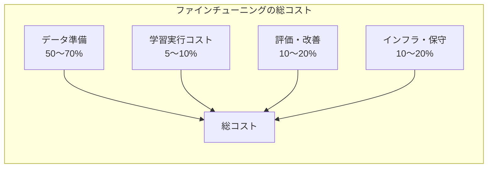

## 概要

ファインチューニングの費用対効果を定量的に評価する方法を学びます。学習コスト・推論コスト・開発工数・リスクを含めた総合的なトレードオフ分析を行います。

## 本文

### ファインチューニングの総コスト



### コスト構造の詳細

```python
from dataclasses import dataclass

@dataclass
class FinetuningCostEstimate:
    """ファインチューニングのコスト試算"""

    # データ準備
    data_examples: int = 1000       # 学習データ件数
    hours_per_example: float = 0.2  # 1件あたりのアノテーション時間（時間）
    annotator_hourly_rate: int = 3000  # アノテーター時給（円）

    # 学習コスト（OpenAI GPT-4o mini の場合）
    avg_tokens_per_example: int = 500  # 平均トークン数
    training_cost_per_1k_tokens: float = 0.003  # $0.003/1K tokens

    # 推論コスト
    monthly_requests: int = 100_000  # 月次リクエスト数
    avg_input_tokens: int = 100      # 平均入力トークン（FT後は短縮）
    avg_output_tokens: int = 100     # 平均出力トークン
    # GPT-4o mini FT: input $0.0003/1K, output $0.0012/1K
    inference_input_cost: float = 0.0003 / 1000
    inference_output_cost: float = 0.0012 / 1000
    usd_to_jpy: float = 150.0

    # 開発・評価工数
    engineer_days: int = 10          # 開発に必要な日数
    engineer_daily_rate: int = 50000 # エンジニアの日当（円）

    @property
    def data_annotation_cost(self) -> int:
        """データアノテーションコスト"""
        return int(self.data_examples * self.hours_per_example * self.annotator_hourly_rate)

    @property
    def training_cost_jpy(self) -> int:
        """学習実行コスト（円）"""
        usd = (self.data_examples * self.avg_tokens_per_example / 1000) * self.training_cost_per_1k_tokens
        return int(usd * self.usd_to_jpy)

    @property
    def monthly_inference_cost_jpy(self) -> int:
        """月次推論コスト（円）"""
        usd = self.monthly_requests * (
            self.avg_input_tokens * self.inference_input_cost
            + self.avg_output_tokens * self.inference_output_cost
        )
        return int(usd * self.usd_to_jpy)

    @property
    def development_cost(self) -> int:
        """開発・評価工数コスト"""
        return self.engineer_days * self.engineer_daily_rate

    @property
    def total_initial_cost(self) -> int:
        """初期投資合計"""
        return self.data_annotation_cost + self.training_cost_jpy + self.development_cost

    def report(self, months: int = 12) -> str:
        return f"""
=== ファインチューニングコスト試算 ===

【初期投資（一回限り）】
  データアノテーション: ¥{self.data_annotation_cost:,}
  学習実行コスト: ¥{self.training_cost_jpy:,}
  開発・評価工数: ¥{self.development_cost:,}
  ──────────────────
  初期投資合計: ¥{self.total_initial_cost:,}

【月次推論コスト】
  月次リクエスト: {self.monthly_requests:,}件
  月次推論コスト: ¥{self.monthly_inference_cost_jpy:,}
  年間推論コスト: ¥{self.monthly_inference_cost_jpy * 12:,}

【{months}か月の総コスト】
  総コスト: ¥{self.total_initial_cost + self.monthly_inference_cost_jpy * months:,}
"""

# 例: カスタマーサポートBot
estimate = FinetuningCostEstimate(
    data_examples=500,
    monthly_requests=50_000
)
print(estimate.report())
```

### プロンプトエンジニアリングとの比較

```python
@dataclass
class PromptEngineeringCost:
    """プロンプトエンジニアリングのコスト試算"""

    monthly_requests: int = 50_000
    avg_system_prompt_tokens: int = 500  # 長いシステムプロンプト
    avg_input_tokens: int = 200
    avg_output_tokens: int = 100
    # GPT-4o mini: input $0.000150/1K, output $0.000600/1K
    input_cost: float = 0.000150 / 1000
    output_cost: float = 0.000600 / 1000
    usd_to_jpy: float = 150.0

    @property
    def monthly_cost_jpy(self) -> int:
        total_input = self.avg_system_prompt_tokens + self.avg_input_tokens
        usd = self.monthly_requests * (
            total_input * self.input_cost
            + self.avg_output_tokens * self.output_cost
        )
        return int(usd * self.usd_to_jpy)

# 比較
pe_cost = PromptEngineeringCost(monthly_requests=50_000)
ft_cost = FinetuningCostEstimate(monthly_requests=50_000)

print(f"プロンプトエンジニアリング月次コスト: ¥{pe_cost.monthly_cost_jpy:,}")
print(f"ファインチューニング月次推論コスト: ¥{ft_cost.monthly_inference_cost_jpy:,}")
print(f"月次削減額: ¥{pe_cost.monthly_cost_jpy - ft_cost.monthly_inference_cost_jpy:,}")

# 初期投資回収月数
savings_per_month = pe_cost.monthly_cost_jpy - ft_cost.monthly_inference_cost_jpy
if savings_per_month > 0:
    payback = ft_cost.total_initial_cost / savings_per_month
    print(f"投資回収: {payback:.1f}か月")
```

### トレードオフ分析マトリクス

| 要素 | プロンプトエンジニアリング | ファインチューニング |
|------|--------------------------|-------------------|
| 初期コスト | 低（開発工数のみ） | 高（データ + 学習 + 開発） |
| 月次コスト | 高（長いプロンプト） | 低（短いプロンプト） |
| 更新コスト | 低（プロンプトを書き換えるだけ） | 高（データ再収集 + 再学習） |
| 品質の一貫性 | 中（プロンプトに依存） | 高（学習で定着） |
| リスク | 低 | 中（過学習・品質低下） |
| スケール効果 | リクエスト増で損益分岐点を超える | 初期投資回収後は有利 |

### 意思決定のガイドライン

```
ファインチューニングを選ぶべき条件:
✅ 月次リクエスト数が多く（10万件〜）推論コスト削減が重要
✅ 一貫したトーン・形式が品質に直結する
✅ 高品質データを500件以上収集できる
✅ 知識の変化が少ない（再学習が年1〜2回で済む）
✅ 長期的に同じタスクを継続する

プロンプトエンジニアリングにとどまる条件:
❌ リクエスト数が少ない（月1万件未満）
❌ 要件・ルールが頻繁に変わる
❌ 高品質データを集める時間・リソースがない
❌ タスクの期間が短い
```

## クイズ

<!-- QUIZ:START -->
**Q1. ファインチューニングの総コストで最も大きな割合を占めるのはどれですか？**

- A) クラウドの学習実行コスト
- B) データ準備・アノテーションコスト
- C) API利用料
- D) サーバーの電気代

**正解: B**
**解説:** ファインチューニングの総コストの50〜70%はデータ準備（収集・クリーニング・アノテーション）が占めます。学習実行自体（GPUコスト）は全体の5〜10%程度です。「データの品質が命」と言われる所以は、このコスト構造にも表れています。

**Q2. ファインチューニング vs プロンプトエンジニアリングの「損益分岐点」はどこで決まりますか？**

- A) モデルの精度が高くなった時点
- B) 月次の推論コスト削減額が初期投資（データ+学習+開発）を回収するまでの期間
- C) APIが廃止されたとき
- D) データ件数が1000件を超えたとき

**正解: B**
**解説:** ファインチューニングには初期投資（データ準備・学習・開発）がかかりますが、プロンプトエンジニアリングより月次推論コストが下がる場合があります。「削減額 × 月数 = 初期投資」を満たす月数が投資回収期間です。リクエスト数が多いほど、回収が早くなります。

**Q3. 「要件が頻繁に変わる」場合にファインチューニングより プロンプトエンジニアリングが有利な理由はどれですか？**

- A) プロンプトの方が精度が高いから
- B) プロンプトを書き換えるだけで即座に変更できるが、FTは再学習が必要でコストが高いから
- C) FTモデルは変更できないから
- D) プロンプトの方が安いから

**正解: B**
**解説:** ファインチューニングしたモデルはルールや要件が変わった場合、新しいデータを用意して再学習する必要があります。一方プロンプトエンジニアリングはシステムプロンプトを書き換えるだけで即座に変更できます。頻繁に変わるルールや短期のプロジェクトではFTのコストが回収できないリスクがあります。

<!-- QUIZ:END -->

## まとめ

- ファインチューニングコストの50〜70%はデータ準備で、学習実行は5〜10%に過ぎない
- 月次リクエスト数が多いほど推論コスト削減効果が高く、投資回収が早くなる
- 更新コスト・リスク・初期コストの3要素でプロンプトエンジニアリングとの比較判断をする
- 「高品質データ + 大量リクエスト + 安定した要件」がFTが有利な条件

## 次のレッスン

次のレッスン（最終回）では、実際のファインチューニング成功・失敗事例からの学びをケーススタディとして振り返ります。
