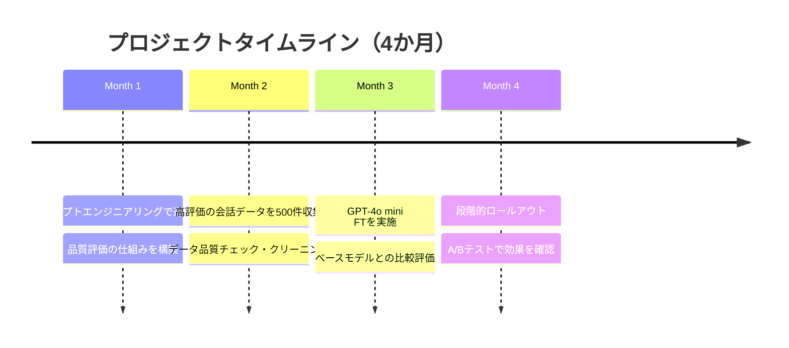

## 概要

実際のファインチューニング成功・失敗事例を通じて、本番環境での落とし穴と成功パターンを学びます。Chapter 5の学びを統合して、次のファインチューニングプロジェクトに活かします。

## 本文

### ケーススタディ1: カスタマーサポートBot（成功例）

**背景:**
Eコマース企業が問い合わせ対応の効率化のためにGPT-4o miniをファインチューニング。

**アプローチ:**



**学習データの特徴:**

```python
# 成功のポイント: 実際の会話から高品質データを選別
training_data_criteria = {
    "CSAT_score": "5点満点中4点以上の会話のみ",
    "resolution": "会話内で問題が解決した事例",
    "diversity": "注文確認・返品・配送・製品Q&Aがバランスよく含まれる",
    "length": "3〜8ターンの適切な長さ",
    "quantity": "各カテゴリ100件以上"
}
```

**結果:**

| 指標 | ファインチューニング前 | 後 |
|------|---------------------|-----|
| 自動解決率 | 65% | 78% |
| 平均応答時間 | 2.1秒 | 0.8秒（プロンプト短縮）|
| CSAT平均 | 3.8 | 4.3 |
| 月次推論コスト | ¥180,000 | ¥95,000 |

**成功要因:**
1. 本番運用しながらデータを収集（自然なデータ分布）
2. 品質フィルタで低品質データを除外
3. A/Bテストで客観的に効果を測定
4. 定期的な再評価・再学習サイクル

### ケーススタディ2: 医療記録要約（失敗例）

**背景:**
病院システム向けに電子カルテの要約モデルを構築しようとした。

**失敗したアプローチ:**

```python
# 失敗: 少ないデータと不十分な評価
failed_approach = {
    "data_size": 50,  # 少なすぎる
    "data_quality": "医師ではなく事務員がアノテーション",
    "evaluation": "BLEU/ROUGEのみ（医療精度の評価なし）",
    "domain_expert": "学習データに医師のレビューなし"
}
```

**何が起きたか:**

```
問題1: 重要な医療情報が要約から欠落した
  → 「入院期間3日」が「入院」に短縮（日数が消えた）

問題2: 特定の診断パターンにのみ適合した
  → 学習データにない症状の要約精度が著しく低下

問題3: 微細な言い回しの変化が医療的意味を変えた
  → 「疑い」が「確診」に変わるケースが発生
```

**改善策:**

```python
# 正しいアプローチ
correct_approach = {
    "data_size": 2000,  # 十分な件数
    "data_quality": "専門医がアノテーション・ダブルチェック",
    "evaluation": {
        "automatic": ["ROUGE", "BERTScore"],
        "medical": "医師による人手評価（情報欠落率・正確性）",
        "safety": "重要情報の保持率（特に数値・診断名）"
    },
    "testing": "実際の臨床医による品質テスト"
}
```

### ケーススタディ3: コード補完（成功例）

**背景:**
社内DSL（ドメイン固有言語）の補完モデルを構築。GitHub Copilotは汎用的すぎて社内コードのパターンに対応できなかった。

```python
# 社内DSLのサンプル（フィクション）
dsl_example = """
pipeline ProcessOrder:
    input: order_id: OrderId
    steps:
        validate_order(order_id) -> validated
        check_inventory(validated) -> available
        create_shipment(available) -> shipment
    output: shipment
"""

# この構文のパターンをLLMに学習させた
# 学習データ: 社内リポジトリの全DSLコード（5000件）
```

**結果:**
- 社内DSLの補完精度: Copilot（18%） → FTモデル（87%）
- 社内開発者の採用率: 35%

**成功のポイント:**
- 既存のコードベースがそのまま学習データになる
- 「正解」が明確（コンパイルが通るコード）
- 評価が自動化できる（コンパイルテスト）

### 失敗パターンのまとめ

```python
FAILURE_PATTERNS = [
    {
        "pattern": "データ不足",
        "symptom": "学習損失は下がるが検証精度が上がらない",
        "solution": "データ収集を優先。LLMで合成データを生成+人間レビュー"
    },
    {
        "pattern": "過学習",
        "symptom": "学習精度は高いが本番精度が低い",
        "solution": "Weight Decay・Early Stopping・データ拡張"
    },
    {
        "pattern": "データ汚染",
        "symptom": "特定のパターンにしか対応できない",
        "solution": "データ多様性の確保・バランスチェック"
    },
    {
        "pattern": "評価指標の誤り",
        "symptom": "指標は良いが実際のユーザー満足度が低い",
        "solution": "人手評価・実際のユーザーフィードバックを取得"
    },
    {
        "pattern": "カタストロフィック忘却",
        "symptom": "特定タスクが改善したが他のタスクが劣化",
        "solution": "多様なタスクのデータを含める・混合学習"
    }
]
```

### ファインチューニングプロジェクトのチェックリスト

```
フェーズ1: 事前評価
□ プロンプトエンジニアリングで十分か確認した
□ 必要なデータ件数と品質要件を定義した
□ 評価指標（定量 + 人手）を決めた
□ ベースラインを測定した

フェーズ2: データ準備
□ 実際の使用例から収集した（合成は補助的に使用）
□ ドメイン専門家がレビューした
□ 多様性・バランスを確認した
□ 学習/検証/テストに分割した

フェーズ3: 学習
□ ハイパーパラメータをチューニングした
□ 学習曲線を監視して過学習を検知した
□ 複数の学習設定で比較した

フェーズ4: 評価
□ ホールドアウトデータで評価した
□ ベースモデルと比較した
□ 人手評価を実施した
□ エッジケースをテストした

フェーズ5: デプロイ・運用
□ 段階的ロールアウト（カナリアリリース）
□ A/Bテストで効果を測定
□ 継続的な品質監視
□ 再学習サイクルを計画
```

## クイズ

<!-- QUIZ:START -->
**Q1. 医療記録要約のケーススタディで最も重大な失敗は何でしたか？**

- A) 学習コストが高かった
- B) 重要な医療情報が要約から欠落したり、言い回しが変わって医療的意味が変わった
- C) 処理速度が遅かった
- D) APIコストが高かった

**正解: B**
**解説:** 医療・法律・金融など高精度が求められるドメインでは、情報の欠落や微妙な言い回しの変化が深刻な問題を引き起こします。「入院3日」→「入院」や「疑い」→「確診」のような変化は医療判断に大きく影響します。専門ドメインのFTでは専門家によるデータアノテーションと評価が必須です。

**Q2. 社内DSLのコード補完がファインチューニングの成功例になった最大の理由はどれですか？**

- A) データ量が多かった
- B) 既存コードベースが自然な学習データになり、評価が自動化できる（コンパイルテスト）から
- C) GPUが十分にあったから
- D) 外部のモデルを使えないから

**正解: B**
**解説:** 社内DSLのケースは「正解が明確」「既存コードが豊富なデータになる」「コンパイルで自動評価できる」という理想的な条件が揃っていました。ファインチューニングが成功しやすいのは「正解が明確で評価が自動化でき、既存データが豊富なタスク」です。

**Q3. 「カタストロフィック忘却」とはどのような現象ですか？**

- A) 学習データが全て失われる
- B) 特定タスクのFTで精度が上がった反面、元のモデルの他の能力が劣化する
- C) モデルがクラッシュする
- D) データセットが汚染される

**正解: B**
**解説:** カタストロフィック忘却とは、特定タスクのファインチューニングにより、元のモデルが持っていた他のタスクの能力が失われる現象です。例えば「医療要約専用にFTしたら一般的な質問応答の品質が大幅に落ちた」ケースが該当します。対策として、元の汎用データも学習データに一定割合含める混合学習が有効です。

<!-- QUIZ:END -->

## まとめ

- 本番運用しながら高品質データを収集するアプローチがFTの成功率を上げる
- 高精度が求められるドメイン（医療・法律）は専門家によるアノテーションと評価が必須
- 評価指標は「正解が明確・自動化可能」なタスクでFTのROIが最大化される
- カタストロフィック忘却を防ぐために汎用データを学習に含め、多様性を確保する

## 次のレッスン

Chapter 6では、生成AIのセキュリティ・プロンプトインジェクション・ジェイルブレイクなどのセキュリティリスクと対策を学びます。
